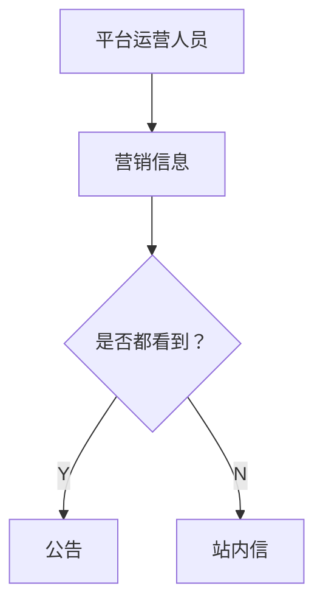
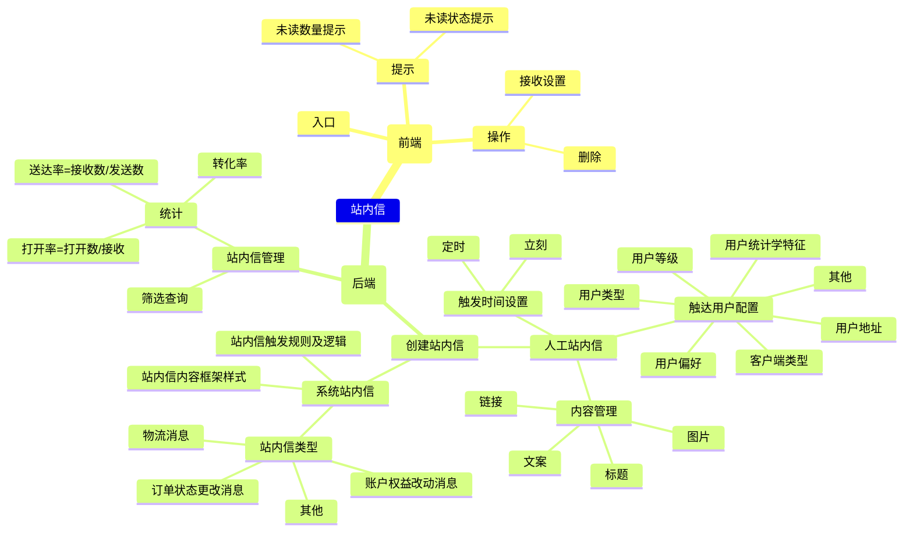

# 站内信设计

正对 `IP代理、爬虫` 系统的站内信设计。

## 消息通知的几种形式

**一、系统 PUSH，极高的曝光率&极低的打开率**

IM 消息提醒、评论互动、运营通常采用这一方式。IM 消息提醒如微信、QQ、钉钉的聊天消息，对及时性的要求极高。互动评论常见于社交类应用，比如微博。

**二、应用内弹窗，重要的版本更新提示通常采用这种方式**

京东的版本更新提示，饿了么每天首次打开时的红包，Uber 的活动推广……都会采用应用内弹窗。应用内弹窗的曝光率极高，但破坏性也极强，因为它打断了用户的正常使用流程，并且必须按关闭/确认才能关掉弹窗（更优雅的交互方式是点击屏幕空白处）。

**三、站内信通知，取决产品本身的架构，通常由官方账号发出**

站内信通知，是更为普遍的一种活动运营方式。

而 app 的日常运营，也是靠该账号推送内容，比如网易云音乐的小秘书、知乎的知乎团队/知乎 Live 团队。

**四、小红点+浅灰色文字，通常标记在入口处**

在功能入口上加小红点，在列表式的功能入口上加小红点/右侧浅灰色文字，是更常见的一种方式，比如微信默认朋友后有更新时会在发现栏上出现红点提示，以及微信读书的版本更新会在相应的入口处都添加小红点。

**五、手机短信通知、邮件订阅**

## 站内信的基本功能

1. `点到点的消息传送`。用户给用户发送站内信，管理员给用户发送站内信。
2. `点到面的消息传送`。管理员给用户（指定满足某一条件的用户群）群发消息。

### 能实现的功能

- **平台公告通知**：应用场景较广，便捷性较强，当平台存在公告类内容，可及时进行全量或定量推送，让平台内的用户知悉。
- **平台营销类活动**：主要适用于电商类平台，可根据用户属性不定期进行推送营销类活动通知，提高活动传播度和收益。
- **平台助手相关通知**：如交易、物流、收发货等通知，一方面用户能及时知晓商品的第一动向，另外也能在一定程度上较少平台的短信成本。
- **用户资产信息通知**：如积分变动、优惠券到期前通知，凸显用户资产信息重要性的同时，又唤醒沉默用户进行消费优惠券，从而促进订单转化。
- **用户间互动**：如私信、问答、评论、点赞、回复，提高平台内用户活跃度，从而形成用户之间主动互动的良性循环。
- **订阅通知**：主要针对用户自主定制的内容类通知，减少用户错过自己感兴趣的内容。

## 站内信功能

- 平台定点推送`营销广告`、`新品发布`、`促销等消息`，促进用户活跃、订单转化；
- 平台相关规则、政策类`公告通知`，确保用户能及时全面了解公告内容；
- 围绕用户相关的交易、资产类相关通知，一方面是及时告知用户交易相关内容，提高用户体验和节约短信成本；另外一方面唤醒沉默用户刺激消费；

## 站内信怎么设计

### 1. 站内信

关于用户的资产信息，商品物流等动态更新通知。

如`交易`、`物流`、`收发货`等通知，一方面用户能及时知晓商品的第一动向，另外也能在一定程度上较少平台的短信成本;

如`积分变动`、`优惠券到期前通知`，凸显用户资产信息重要性的同时，又唤醒沉默用户进行消费优惠券，从而促进订单转化。

- 一般用户只有阅读和删除权限；
- 发送是由系统设置的触发条件或者运营人员在用户营销时手动发送；
- 只能用户自己看到；
- 在WEB端在个人中心一般为“站内信”形式；移动端个人中心页面的消息图标并附带未读的条数；
- 站内信内容不多，点击标题下拉收缩展开。

### 2. 公告

应用场景较广，便捷性较强，当平台存在公告类内容，可及时进行全量或定量推送，让平台内的用户知悉。

- 一般放在网站首页顶部区域，
- 游客模式下也可看；
- 只有网站管理员才可编辑删除；
- 内容较多，点击跳转新页面。

### 3. 设计思路

我们希望用户收到个性化的营销信息，唤醒沉默用户，而有的信息我们希望有游客也可以看到，便于未注册用户的注册`转化`。

- **管理员**：
  - *创建站内信*
    - 需支持配置消息发送的客户端（PC、APP、M移动端）、
    - 消息的主体内容（标题、图片、文案、链接等等）、
    - 定义发送的对象，
    - 最后设置触发的时间（如果为自动触发类型的消息，则不需要设置触发的时间）。
  - *站内信管理*： 站内信在创建之后，管理员可对站内信进行：
    - 查询筛选
    - 还需要通过`发送率`、`打开率`和`转化率`等数据直观反映效果。
- **用户**:
  - *查看站内信*: 
    - 战内信发送给用户之后，需要给用户提供一个方面查看的入口和界面，使用户在登录网站之后快速查收消息。
  - *删除站内信*
    - 当站内信消息过多的时候，需要支持用户删除或者清空消息。
  - *设置是否接收站内信*
    - 站内信的推送在一定程度上会打扰到用户，如果用户不想接收某些类型或者全部消息，用户可自行选择接收的内容。

## 功能设计

### 前端

- **站内信入口**：是放在首页的右侧还是首页底部标签导航，亦或是个人中心右侧；另外应用应该放置几个站内信入口，这些都需要根据各自产品的特点以及站内信对企业的重要程度来进行考虑。
- **消息呈现形式**：是显示小红点还是具体数字呢？小红点适合在信息量大，或者重要程度不高的提醒中使用；数字则是为了更准确提示，并且和用户相关性更高。
- **App push方式**：push的目的最基本的是消息告知，最主要的是促进用户活跃等。push时机大多数移动端App都选择在早上十点和晚上八点左右进行推送，其实最好结合自己产品特性和push后的数据进行选择适用于自己产品的push时机。最后关于push文案和push人群，文案可参考AIDMA法则，即：Attention（引起注意），Interest （引起兴趣），Desire（唤起欲望），Memory（留下记忆），Action（购买行动） 。push人群可以是全量用户，也可以是定量用户（用户标签、事件触发）。
- **获取设备通知授权**：除了在首次下载App时获取设备通知授权之外，如果首次用户拒绝授权，那么要考虑在什么场景下以何种频次再去向用户进行获取授权？另外如何引导未开通消息通知授权的用户去开通，比较常见是是进行积分诱导，不过效果待评估。

#### 消息接收提醒

站内信是一种用户需打开网站并登录才能查看的消息，因此消息提示需要简洁醒目，入口简单易找。

有未读新消息时在消息入口处用醒目图标或者未读消息数量进行提示。

在进行数量提示时需要控制提示的最大限度，由于电商网站不似社交平台，站内信消息提示不宜数量过多，在未读消息超过10条时显示9+即可，太多的未读消息容易对用户造成消息过载的压力。

#### 消息接收列表

用户的站内信接收之后会聚合在一个列表，用户进入消息页面进行信息查看。需要将信息的类型及状态进行处理。

`信息类型`：向用户发送站内信会基于不同的目的，可能是系统提示消息，例如交易订单状态通知，物流提示通知，会员权益类变动通知等等；可能会是营销通知；也有可能是网站公告类消息，所以我们在列表中需要区分不同的类型，以便用户分类查看。

`消息状态`：已读状态和未读状态的消息要有所区分，目前比较常见的处理方式是未读状态亮色显示或者红色圆点提示，已读状态置灰或者无其他提示。

`消息排序`：PC端常见排序为倒序，即最新消息展示在最上面，可向下翻看历史消息记录，移动端常见为顺序排列，即最新消息展示在最下方，向上滑动页面也翻看历史消息记录。

#### 消息设置

推送的站内信并不一定是用户希望看到的，可以视实际情况考虑加上选择性设置消息提醒功能或者消息删除功能。

### 后端

#### 消息类型

从内部来看，消息可分为`人工站内信`和`系统站内信`，人工站内信即人为设定触发条件给用户发送站内信，系统站内信即在满足一定的规则和条件下，系统自动即时给用户发送站内信。

不定时营销推送、功能调整公告通知适合使用人工触发的站内信；订单交易消息、物流消息、账户权益变动等需实时反馈的消息等适合使用系统自动推送的站内信。基于两种类型的站内信不同的触发方式，最好对两种站内信分别进行管理。

#### 消息创建

人工站内信和系统站内信的创建会有所区别，有不同的创建方式，在这里分开进行说明。

`系统站内信`：系统站内信一般情况下无须区分客户端，只要达到触发条件就发送消息，创建的基础是`区分类别`（订单状态更改消息、物流消息、账户权益变动消息等等）；
明确各个细分类别站内信的`触发的规则和逻辑`；确定各细分类别`站内信的格式及内容`（系统站内信的内容往往是变动的，需根据每个用户的行为、状态和操作的状态进行匹配发送）；
最后将确定好的规则交由技术人员写入程序。

`人工站内信`：人工站内信会预先设置一些可选择和配置的条件，然后由内部运营人员自定义选择条件创建站内信，然后设置触发的时间。目前人工站内信可做的选择
和配置条件举以下几个例子进行说明：

- 客户端类型：PC、M移动端、APP（Android &IOS）；
- 用户统计学特征：性别、年龄等；
- 用户位置信息：国家、邮政编码、IP地址等；
- 用户等级：铜牌用户、银牌用户、金牌用户、钻石用户等；
- 用户状态：新用户、老用户、活跃用户、沉睡用户等；
- 用户的购买偏好：电子产品、彩妆、服装、户外用品等。

`CMS（内容管理系统），目的是配置消息推送模板`

- App push模板：push标题、push小标题、push图片；
- 消息显示模板：消息标题、消息小标题、消息banner图片、消息文本、消息链接等，根据消息类型不同按需进行配置。

`CRM（客户关系管理系统），目的是推送配置和推送效果查询`

- `推送方式`：全量推送or定量推送，定量推送根据哪类用户标签进行推送。除了用户标签这种个性化推送之外，还存在半自动话推送，即触发式推送，常见的是优惠券到期push，此类半自动话推送除了要定义推送模板，还需要考虑推送规则，如到期前第几天推送，多张优惠券同时到期如何推送等等。
- `推送配置`：选择推送人群（用户标签）、选择推送平台（App、H5、短信等）、选择消息模板、选择推送时间（支持定时）……
推送效果查询：某一条push的效果监测，基本数据主要是push到达率、push打开率，更深入的应该去关注push后的转化率，以及push后App卸载率等重要指标数据和异常指标数据。

`消息中心系统，目的是查询消息、查询整体消息数据、推送相关设置，消息到达率和打开率`

- `查询筛选功能`：目的是回查消息推送情况，如推送时间、收件人、消息模板、消息标题、是否到达、是否打开、是否删除等基础信息；
- `整体效果分析`：整体消息到达率，目的是监测消息推送稳定性；查询整体消息打开时间段，目的是定制属于自己产品的推送时机。
- `推送设置`：哪些时间段不进行任何消息push，如晚上休息时间，尽量不要进行任何消息的推送来打扰用户，避免造成用户反感而卸载App；另外就是去重过滤，避免同一用户一天内收到N条push消息，所以需要按照push类型进行设置优先级和push频次。

### 站内信管理

站内信功能的目的在于提升网站的运营能力，需要有数据支撑和反馈才能知道当前功能是否有效以及存在的问题，因此需要支持快速查询查看数据。

#### 数据筛查

支持运营人员通过筛选条件，快速找到发送的站内信，并可对站内信内容进行查看；

#### 数据列表

数据列表应展示当前站内信的发送情况、接收情况，包括送达率（接收数/发送数）、打开率（打开数/接收数）、转化率等数据指标。

### 总体架构

## 最后

站内信是一个网站运营辅助工具，在具体设计时不仅要考虑到用户操作体验，也需要考虑功能的拓展维护。站内信在运营时应本着克制的原理，不要对用户进行信息的狂轰乱炸，并且尽量给用户推送必要的和优质的内容。

