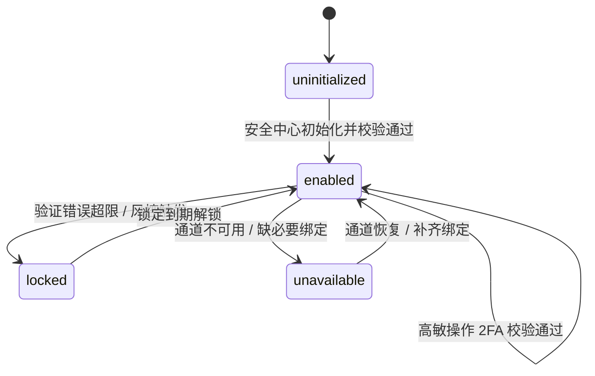

# 2FA

> V2 变更：① 本 PRD 内部模块改用 `S01–S04` 编号，避免与外部代理商后台模块 `M02 / M05` 撞码；② 修正 2FA 状态机与枚举不一致；③ §10 字段表升级为 8 列标准界面元素清单表并逐页挂接原型；④ 新增用户故事/FR 编号与可追溯表、成功指标章；⑤ 补页面级四态；⑥ 文末附交付前自检结论。

## 1. 文档信息

| 项目 | 内容 |
|---|---|
| 文档名称 | 支付密码接入两步验证 PRD |
| 所属目录 | `/2FA-V2` |
| 当前版本 | v2.0 |
| 日期 | 2026-06-16 |
| 粒度 | 交付级 |
| 内部模块编号 | `S01–S04`（见 §8） |
| 外部关联模块 | 代理商后台 `M02 / M05`（充值 / 提现等现有业务页，非本 PRD 模块，仅做适配） |
| 关联能力 | 支付密码、账号设置 / 安全中心、代理商提现、代理商给下级用户充值、安全服务策略编排 |

## 2. 背景与问题陈述

现有支付密码已作为 `账号设置 / 安全中心` 的资金安全能力，用于提现、给下级用户充值等高敏资金操作，原支付密码 P0 不含两步验证。随着资金操作安全要求提升，需在不破坏支付密码独立性的前提下，将相关资金与安全场景接入两步验证。

本需求将 2FA 定义为独立账号安全能力：初始化、状态展示、锁定提示和找回入口统一位于 `账号设置 / 安全中心`；支付密码设置 / 重置、提现、充值只消费安全服务返回的策略、2FA 类型、状态和校验结果。中国大陆账号用手机短信，海外账号用 TOTP；环境按账号所属环境固定判断，不按访问 IP 切换。

> 【待确认：现状数据——高敏资金操作量级、近 N 月相关盗用/客诉数、海外/大陆账号占比，用于支撑优先级与成功指标基线。】

## 3. 目标

1. 安全中心提供两步验证初始化、状态展示、锁定 / 不可用提示和找回入口。
2. 支付密码设置 / 重置接入安全服务策略，去掉固定邮箱验证码，用合并表单完成登录密码 + 可选 2FA + 新支付密码校验。
3. 提现申请 P0 全量要求 `支付密码 + 两步验证`。
4. 给下级用户充值默认要求支付密码，由安全服务按风险决定是否叠加 2FA。
5. 安全服务统一编排策略，业务页不写死短信 / TOTP / 风险规则。
6. 最终提交时重新评估策略，并同请求校验业务条件、支付密码、2FA 和幂等。
7. 明确审计 / 埋点 / 敏感信息边界，防止敏感信息泄露。

（量化口径见 §6 成功指标。）

## 4. 范围与非目标

### 4.1 In Scope

- 2FA 独立账号安全能力边界；安全中心两步验证安全项。
- 大陆手机短信 2FA、海外 TOTP 2FA 初始化；状态：未初始化 / 已启用 / 已锁定 / 不可用。
- 支付密码设置 / 重置合并表单；去掉固定邮箱验证码。
- 提现全量接入 `支付密码 + 两步验证`；充值按风险触发 2FA；资金确认页支付密码与 2FA 同屏输入。
- 两段式策略评估（预查、提交时重评）；提交时风险升高补 2FA；未初始化 / 锁定 / 不可用强阻断。
- 支付密码失败计数与 2FA 失败计数独立；审计 / 埋点 / 敏感信息边界与灰度开关。

### 4.2 Out of Scope

| 非目标 | 说明 |
|---|---|
| 在支付密码模块内实现 2FA 初始化 | 2FA 是独立账号安全能力，由安全中心承载 |
| 在业务页写死短信 / TOTP 规则 | 业务页只消费安全服务策略 |
| 关闭 2FA / 换绑手机号 / 换绑 TOTP | 完整账号安全管理高敏动作，P0 不纳入 |
| 恢复码生成、展示、下载、吊销、重新生成 | 独立敏感凭证体系，本轮不做 |
| 完整 2FA 丢失找回流程 | P0 只提供找回 / 客服入口 |
| 账号环境迁移 | 大陆 / 海外按账号固定，迁移另起需求 |
| 后台安全策略配置页面 | 本轮定义策略能力与消费方式，不建运营配置后台 |
| 接口字段最终命名与库表结构 | PRD 定义能力 / 枚举 / 约束，研发按现有规范命名 |

## 5. 角色与权限

| 角色 | 能力 | 说明 |
|---|---|---|
| 大陆账号用户 | 初始化手机短信 2FA、用短信码完成高敏操作 | 前提：账号已有可用绑定手机号 |
| 海外账号用户 | 初始化 TOTP、用动态码完成高敏操作 | P0 不生成恢复码 |
| 代理商用户 | 提现、给下级充值、设置 / 重置支付密码 | 高敏步骤按安全服务策略展示验证或阻断 |
| 安全服务 | 策略评估、短信挑战、TOTP 校验、状态与锁定管理、审计 | 2FA 策略的唯一来源 |
| 资金服务 | 提现 / 充值业务校验与资金动作执行 | 最终提交时调安全服务重评并校验 |
| 账号安全服务 | 手机号绑定 / 修改、2FA 找回入口 | 本 PRD 只定义跳转动作 |

> 外部模块说明：代理商后台 `M02 / M05` 为现有充值 / 提现等业务页，本需求只对其做"接入策略预查 + 合并确认表单"的适配，不改其内部编号。

## 6. 成功指标

> 区分领先（上线后短期可观测）与滞后（需较长周期）。无基线处标 `【待确认】`，不编造。

| 类型 | 指标 | 目标值 | 当前值 | 衡量周期 | 数据来源 |
|---|---|---|---|---|---|
| 领先 | 提现高敏操作 2FA 覆盖率（灰度范围内） | 100% | 0 | 上线后 14 天 | 安全审计 / 埋点 |
| 领先 | 大陆短信发送成功率 | ≥ 98% | 【待确认】 | 上线后 14 天 | 短信服务 |
| 领先 | 海外 TOTP 校验成功率 | ≥ 95% | 【待确认】 | 上线后 14 天 | 安全服务 |
| 领先 | 策略查询失败率 | ≤ 0.5% | 【待确认】 | 上线后 14 天 | 安全服务 |
| 滞后 | 高敏资金操作相关盗用 / 安全工单 | 下降 `【待确认】%` | 【待确认】 | 上线后 90 天 | 风控 / 客服 |
| 滞后 | 因 2FA 阻断导致的资金流程放弃率 | ≤ `【待确认】%` | - | 上线后 30 天 | 埋点漏斗 |

## 7. 全局业务规则

1. 2FA 是独立账号安全能力，不属于支付密码模块内部能力。
2. 大陆账号用短信 2FA，海外账号用 TOTP 2FA。
3. 账号环境按账号所属环境固定判断，不按访问 IP 切换；异常访问地区只作风险因子，不改 2FA 类型。
4. 安全服务是 2FA 触发策略、类型、状态、阻断动作的唯一来源；前端与业务服务不得自行计算是否需要 2FA。
5. 进入高敏步骤前可预查策略（仅用于展示）；最终提交必须重新评估策略（后端裁决）。
6. 提交时策略升级为需要 2FA 时，不执行资金或安全动作，返回补充 2FA 状态。
7. 策略查询失败时，高敏操作禁用提交，不允许降级绕过支付密码或 2FA。
8. 命中 2FA 但状态为未初始化 / 锁定 / 不可用时，P0 强阻断。
9. 2FA 初始化完成后停留安全中心，不自动回跳原流程。
10. 支付密码设置 / 重置固定要求当前登录密码，不再固定要求邮箱验证码。
11. 提现 P0 全量要求 `支付密码 + 两步验证`；给下级充值默认要求支付密码，2FA 按风险触发。
12. 资金页支付密码与 2FA 同屏输入，不拆成多个预校验步骤；最终提交同请求校验业务条件、支付密码、2FA 和幂等。
13. 支付密码失败计数与 2FA 失败计数独立；任一锁定只阻断需要该因子的操作。
14. 关闭弹窗 / 返回修改 / 离开页面时清空支付密码与 2FA 输入，不写本地存储。
15. 日志 / 埋点 / 审计不得记录支付密码、登录密码、短信码、TOTP 动态码、TOTP secret、二维码内容、手动密钥、恢复码或支付密码哈希。
16. 灰度开关只允许关闭 2FA 触发策略，不允许绕过支付密码。

## 8. 用户故事与功能需求（含追溯）

### 8.1 用户故事

- **US-01**：作为大陆账号用户，我想启用手机短信两步验证，以便高敏资金操作更安全。
- **US-02**：作为海外账号用户，我想用验证器（TOTP）两步验证，以便无短信也能保护资金操作。
- **US-03**：作为代理商，我想设置 / 重置支付密码时按安全策略校验（不再被固定邮箱码卡住），以便兼顾顺畅与安全。
- **US-04**：作为代理商，我想提现时用支付密码 + 两步验证，以便资金操作受双重保护。
- **US-05**：作为代理商，我想给下级充值时按风险触发 2FA，以便低风险顺畅、高风险安全。
- **US-06**：作为安全团队，我想由安全服务统一编排策略，以便业务页不写死规则、可灰度可审计。

### 8.2 功能需求清单（US → FR → 界面）

> "对应界面"指向本文档 §10「页面与字段说明」的小节（如 §10.1 = 安全中心两步验证安全项）；非界面型 FR 指向对应章节（§11 流程 / §15 灰度）。这是 `US → FR → 界面` 追溯链的落点，研发可据此从需求直接跳到对应界面规格。

| FR | 描述 | 所属 US | 模块 | 优先级 | 对应界面（§10 小节） |
|---|---|---|---|---|---|
| FR-01 | 安全中心两步验证安全项与状态展示（4 态） | US-01,02 | S01 | P0 | §10.1 |
| FR-02 | 大陆账号手机短信 2FA 初始化 | US-01 | S01 | P0 | §10.2 |
| FR-03 | 海外账号 TOTP 2FA 初始化 | US-02 | S01 | P0 | §10.3 |
| FR-04 | 支付密码设置 / 重置策略预查 | US-03 | S02 | P0 | §10.4 |
| FR-05 | 支付密码设置 / 重置合并表单（去邮箱码） | US-03 | S02 | P0 | §10.4 |
| FR-06 | 支付密码规则（6 位 PIN、一致性、计数归属） | US-03 | S02 | P0 | §10.4 |
| FR-07 | 提现全量 `支付密码 + 2FA` | US-04 | S03 | P0 | §10.5 |
| FR-08 | 给下级充值按风险触发 2FA | US-05 | S03 | P0 | §10.5 |
| FR-09 | 资金确认合并表单（同屏输入） | US-04,05 | S03 | P0 | §10.5 |
| FR-10 | 提交时风险升高补 2FA | US-04,05 | S03 | P0 | §10.5 |
| FR-11 | 安全策略服务职责（唯一策略来源） | US-06 | S04 | P0 | §11 流程 |
| FR-12 | 两段式策略评估（预查 + 提交重评） | US-06 | S04 | P0 | §11 流程 |
| FR-13 | 灰度与回滚（只关 2FA 触发，不绕支付密码） | US-06 | S04 | P0 | §15 |

## 9. 功能需求详述

### 9.1 S01 安全中心两步验证初始化与状态（FR-01~03）

**安全项状态（FR-01）**

| 状态 | 展示内容 | 操作 |
|---|---|---|
| 未初始化 | 两步验证未启用、当前账号将使用的验证方式 | 启用两步验证 |
| 已启用 | 已启用、验证方式、最近启用时间 | 查看找回方式 |
| 已锁定 | 锁定原因、预计可重试时间 | 查看找回方式 / 联系客服 |
| 不可用 | 通道不可用或缺少必要绑定 | 去绑定手机号 / 稍后重试 / 联系客服 |

**大陆短信初始化（FR-02）**

- 适用环境：`mainland`。
- 前置条件：账号已有可用绑定手机号；安全服务返回 2FA 类型为 `sms`。
- 流程：
  1. 用户在安全中心点击"启用两步验证"。
  2. 页面展示"启用手机短信验证"、脱敏手机号、短信验证码输入框。
  3. 用户点击"发送验证码"（不自动发送）。
  4. 安全服务发送短信码并返回倒计时 / 限流 / 通道状态。
  5. 用户输入 6 位短信码并点击"确认启用"。
  6. 安全服务校验通过后启用，安全中心展示"已启用 · 手机短信"。
- 规则：
  - 6 位数字。
  - 有效期默认 10 分钟、重发倒计时默认 60 秒（均以安全服务配置为准）。
  - 手机号脱敏展示，如 `+86 138****5678`。
  - 验证码错误 / 过期 / 限流时停留当前表单并提示。
- 异常：无可用绑定手机号时不在 2FA 流程内绑定，展示阻断并引导到独立的绑定 / 更新手机号流程。

**海外 TOTP 初始化（FR-03）**

- 适用环境：`overseas`。
- 前置条件：安全服务返回 2FA 类型为 `totp`。
- 流程：
  1. Step 1：展示二维码与手动密钥；用户用验证器 App 扫码或手动输入密钥。
  2. Step 2：用户输入 6 位动态码，安全服务校验。
  3. Step 3：校验通过后启用，展示成功态，安全中心展示"已启用 · 验证器动态码"。
- 规则：
  - 6 位数字；服务端允许前后 1 个时间窗口漂移。
  - 动态码错误 / 过期时停留 Step 2 并提示检查设备时间。
  - 展示"无法使用验证器？"入口指向找回 / 客服。
  - P0 不生成 / 展示 / 下载 / 管理恢复码。
- 安全约束：二维码、手动密钥、TOTP secret、动态码不得进入日志、埋点、截图或普通审计字段。

### 9.2 S02 支付密码设置 / 重置接入 2FA（FR-04~06）

**策略预查（FR-04）**

- 场景：`set_payment_password` / `reset_payment_password`。
- 作用：预查结果决定合并表单展示 2FA 输入还是阻断态。

**合并表单（FR-05）**

- 三种形态（随策略）：
  1. 未命中 2FA：当前登录密码 → 新支付密码 → 确认新支付密码 → 确认。
  2. 命中大陆短信：当前登录密码 → 短信验证码 + 发送 → 新/确认支付密码 → 确认。
  3. 命中海外 TOTP：当前登录密码 → 动态验证码 + 无法使用验证器入口 → 新/确认支付密码 → 确认。
- 规则：
  - 当前登录密码固定必填；邮箱验证码不再作固定因子。
  - 2FA 是否展示由安全服务策略决定。
  - 点击确认，后端同一次校验 登录密码 + 2FA + 支付密码规则 + 幂等。
  - 任一安全因子失败不保存新支付密码，停留并清空表单安全输入。
  - 成功刷新支付密码状态、不自动跳回资金操作。

**支付密码规则（FR-06）**

- 6 位数字 PIN；新支付密码 == 确认新支付密码；不允许空值。
- 支付密码哈希 / 失败计数 / 锁定由支付密码服务管理；其中 2FA 失败计数由安全服务管理。

### 9.3 S03 资金业务页支付密码 + 2FA 消费（FR-07~10）

**提现（FR-07）**

- 适用：提现申请，P0 全量 `支付密码 + 2FA`。
- 流程：
  1. 用户填写提现信息，点击提交 / 下一步，以 `withdraw` 预查策略。
  2. `enabled` → 展示资金摘要 + 支付密码 + 短信/TOTP；`uninitialized/locked/unavailable` → 展示阻断态。
  3. 用户输入后提交，资金服务后端重评策略并校验。
  4. 安全校验通过后再校验 账单 / 窗口 / 金额 / 幂等。
  5. 全部通过才创建提现申请并冻结金额。
- 阻断规则：未初始化 / 锁定 / 不可用时不创建、不冻结、不存草稿；策略查询异常禁用提交并提示重试。

**给下级充值（FR-08）**

- 适用：默认要支付密码，2FA 由安全服务按风险触发。
- 风险因子：单笔超阈值、短时多次、新设备 / 可信设备缺失、异常地区、账号风险命中、近期支付密码 / 2FA 失败多。
- 流程：
  1. 填写充值金额与下级用户信息，以 `agent_user_recharge` 预查。
  2. `requires2FA=false` → 仅支付密码确认；`true` 且可挑战 → 支付密码 + 2FA 合并确认；不可挑战 → 阻断。
  3. 最终提交重评策略并校验 代理身份 / 用户归属 / 余额 / 风控 / 支付密码 / 2FA / 幂等。
  4. 全部通过才执行代理钱包扣减 + 用户钱包增加。

**资金确认合并表单（FR-09）**

- 结构：资金操作摘要 → 支付密码 → 2FA（命中时）→ 返回修改 / 确认提交。
- 规则：
  - 支付密码与 2FA 同屏，不拆成预校验三步。
  - 返回 / 关闭 / 离开清空安全输入。
  - 安全因子失败保留摘要、清空安全输入。
  - 业务失败保留摘要并展示业务原因。

**提交时风险升高（FR-10）**

- 触发：预查 `requires2FA=false`，但提交重评返回 `true`。
- 处理：后端不执行资金 / 安全动作 → 前端同表单追加 2FA 输入、清空支付密码 → 用户重输支付密码 + 2FA 再提交 → 再次提交后端仍重评。

### 9.4 S04 安全策略服务、审计与灰度（FR-11~13）

**安全服务职责（FR-11）**

- 判断账号环境、2FA 类型、是否需支付密码、是否需 2FA。
- 返回 2FA 状态、阻断原因、恢复动作。
- 发起大陆短信挑战；校验短信验证码 / TOTP 动态码。
- 管理 2FA 失败计数、锁定与解锁；写入安全审计。

**两段式策略评估（FR-12）**

| 阶段 | 触发时机 | 目的 | 结果 |
|---|---|---|---|
| 预查策略 | 进入高敏步骤前 | 决定页面展示输入 / 阻断 / 重试 | 只用于展示 |
| 提交时重评 | 用户点最终提交后 | 决定是否允许执行业务动作 | 后端最终裁决 |

**灰度与回滚（FR-13）**

- 灰度可按账号环境 / 用户分组 / 业务场景开启。
- 提现全量 2FA 的灰度节奏由安全与资金团队共管。
- 灰度开关只允许关闭 2FA 触发策略，不允许绕过支付密码。
- 所有策略关闭、阈值调整、异常回滚必须写入审计。

## 10. 页面与字段说明（界面元素清单表）

> 标准 8 列；原型见 §18 附件清单（A-01/A-02/A-03，对应 `payment-password-2fa-wireframe.html` 与桌面/移动截图），各页编号与原型元素一一对应。

### 10.1 安全中心两步验证安全项（原型见附件 A-01）

| 序号 | 名称 | 类型 | 必填项 | 默认值 | 数据来源 | 前置条件 | 业务规则 |
|---|---|---|---|---|---|---|---|
| 1 | 两步验证状态 | Tag/Text | 是 | - | 安全服务 `twoFactorStatus` | - | 四态文案：未初始化 / 已启用 / 已锁定 / 不可用 |
| 2 | 验证方式 | Text | 否 | 空 | 安全服务 `twoFactorType` | - | 短信 / 验证器；未启用展示"将使用的方式" |
| 3 | 最近启用时间 | Text | 否 | - | 安全服务 | 状态==已启用 | 仅已启用展示 |
| 4 | 锁定原因 + 剩余可重试 | Text | 否 | - | 安全服务 `blockReason` | 状态==已锁定 | 展示原因 + 预计可重试时间 |
| 5 | 恢复动作按钮 | Button | 否 | - | 安全服务 `recoveryAction` | 视状态 | 按 `recoveryAction` 渲染：启用 / 去绑定手机号 / 查看找回 / 联系客服 / 稍后重试 |

页面级状态：空态（接口无返回时不展示安全项、不报错打扰）；加载态（状态拉取中占位）；错误态（拉取失败展示"稍后重试"，不暴露细节）；成功态（启用成功后刷新为"已启用 · 方式"）。

### 10.2 大陆短信初始化表单（原型见附件 A-01）

| 序号 | 名称 | 类型 | 必填项 | 默认值 | 数据来源 | 前置条件 | 业务规则 |
|---|---|---|---|---|---|---|---|
| 1 | 脱敏手机号 | Text | 是 | - | 安全服务（绑定手机号） | env==mainland | 仅展示脱敏，如 `+86 138****5678` |
| 2 | 短信验证码 | Input | 是 | 空 | 用户输入 | - | 6 位数字；错误/过期/限流停留当前表单并提示 |
| 3 | 发送验证码 | Button | - | enabled | - | - | 点击发送，进入默认 60s 倒计时；不自动发送；限流时禁用并提示 |
| 4 | 确认启用 | Button | - | disabled | - | - | 验证码非空→enabled；校验通过启用并展示"已启用 · 手机短信" |

页面级状态：空态（无可用手机号→整表替换为阻断+去绑定引导）；加载态（发送中/校验中按钮 loading）；错误态（验证码错/过期/限流文案）；成功态（启用成功跳安全中心已启用态）。

### 10.3 海外 TOTP 初始化表单（原型见附件 A-01）

| 序号 | 名称 | 类型 | 必填项 | 默认值 | 数据来源 | 前置条件 | 业务规则 |
|---|---|---|---|---|---|---|---|
| 1 | 二维码 | Image | 是 | - | 安全服务生成 | env==overseas | 仅初始化展示；不入日志/埋点/截图 |
| 2 | 手动密钥 | Text | 是 | - | 安全服务生成 | - | 同二维码；供无法扫码时手输 |
| 3 | 动态验证码 | Input | 是 | 空 | 用户输入 | - | 6 位数字；错误/过期停留 Step2 并提示检查设备时间 |
| 4 | 无法使用验证器入口 | Link | 是 | - | 常量 | - | 指向独立找回 / 客服入口 |
| 5 | 确认启用 | Button | - | disabled | - | - | 动态码非空→enabled；校验通过启用 |

页面级状态：空态（不适用）；加载态（校验中 loading）；错误态（动态码错/过期/锁定）；成功态（Step3 成功 + 安全中心"已启用 · 验证器动态码"）。

### 10.4 支付密码设置 / 重置合并表单（原型见附件 A-02）

| 序号 | 名称 | 类型 | 必填项 | 默认值 | 数据来源 | 前置条件 | 业务规则 |
|---|---|---|---|---|---|---|---|
| 1 | 当前登录密码 | Password | 是 | 空 | 用户输入 | - | 固定必填 |
| 2 | 短信验证码 | Input | 条件必填 | 空 | 用户输入 | env==mainland 且 `requires2FA` | 命中 2FA 才展示；6 位数字 |
| 3 | 动态验证码 | Input | 条件必填 | 空 | 用户输入 | env==overseas 且 `requires2FA` | 命中 2FA 才展示；6 位数字 + 无法使用验证器入口 |
| 4 | 新支付密码 | Password | 是 | 空 | 用户输入 | - | 6 位数字 PIN |
| 5 | 确认新支付密码 | Password | 是 | 空 | 用户输入 | - | 必须 == 新支付密码 |
| 6 | 确认设置 / 确认重置 | Button | - | disabled | - | - | 必填齐→enabled；提交后端同请求校验登录密码+2FA+支付密码规则+幂等；任一失败不保存并清空安全输入；策略升级→返回补 2FA |

页面级状态：空态（不适用）；加载态（提交中 loading 防重复）；错误态（任一因子失败→停留、清空安全输入、提示对应原因）；成功态（刷新支付密码状态、展示成功、不自动跳回资金操作）。

### 10.5 资金确认合并表单（原型见附件 A-03）

| 序号 | 名称 | 类型 | 必填项 | 默认值 | 数据来源 | 前置条件 | 业务规则 |
|---|---|---|---|---|---|---|---|
| 1 | 资金操作摘要 | 展示区 | 是 | - | 业务接口 | - | 展示金额 / 币种 / 对象 / 费用等 |
| 2 | 支付密码 | Password | 是 | 空 | 用户输入 | 需支付密码场景 | 6 位 PIN |
| 3 | 短信验证码 | Input | 条件必填 | 空 | 用户输入 | 大陆且命中 2FA | 6 位数字 |
| 4 | 动态验证码 | Input | 条件必填 | 空 | 用户输入 | 海外且命中 2FA | 6 位数字 |
| 5 | 返回修改 | Button | - | enabled | - | - | 返回并清空安全输入，保留业务摘要 |
| 6 | 确认提交 | Button | - | disabled | - | - | 必填齐→enabled；同请求校验业务+支付密码+2FA+幂等；风险升高→不执行、追加 2FA、清空支付密码后重提 |

页面级状态：空态（不适用）；加载态（提交中 loading 防重复）；错误态（安全因子失败→保留摘要清空安全输入；业务失败→保留摘要展示业务原因；阻断态→未初始化/锁定/不可用引导）；成功态（执行资金动作并跳结果）。

## 11. 流程与状态机

### 11.1 安全策略评估主流程

```text
进入高敏步骤 -> 收集场景与风险上下文 -> 预查策略
-> 据策略展示 支付密码 / 2FA 输入 或 阻断
-> 用户最终提交 -> 后端重新评估策略
-> 同请求校验 业务条件 + 支付密码 + 2FA + 幂等
-> 执行动作 或 返回失败原因
```

### 11.2 2FA 状态机

> 持久状态只有 4 个（与 §13 枚举一字一致）；"初始化中 / 校验中"是转换过程，作为转换标注，不作为持久态。



**状态说明（== §13.4 枚举）**

| 状态 | 含义 | 进入条件 | 主要去向 |
|---|---|---|---|
| `uninitialized` | 未初始化两步验证 | 账号尚未启用 2FA | 安全中心初始化成功→enabled |
| `enabled` | 已启用且可正常验证 | 初始化成功 / 锁定解除 / 通道恢复 | 错误超限→locked；通道异常→unavailable |
| `locked` | 因错误次数或风控暂时锁定 | enabled 下验证错误超限 / 风控 | 到期解锁→enabled |
| `unavailable` | 通道不可用或缺少必要绑定 | enabled 下通道异常 / 缺绑定 | 恢复 / 补绑定→enabled |

> 完整 Mermaid 图集见 `2FA/2026-06-16-payment-password-2fa-mermaid.md`（含策略评估、短信/TOTP 初始化、支付密码设置·重置、提现、充值、策略变化）。

## 12. 数据与接口能力

本 PRD 定义能力与字段语义，不锁定最终接口路径与库表结构。

### 12.1 策略预查

- 输入：`scene`；`riskContext`（金额、币种、设备、地区、频次、账号风险）；`bizType`。
- 输出：`policyId | policyToken`、`scene`、`env`、`requiresPaymentPassword`、`requires2FA`、`twoFactorType`、`twoFactorStatus`、`blockReason`、`recoveryAction`。

### 12.2 短信挑战

- 按 `policyId | policyToken` 发起短信验证码。
- 返回：发送成功 / 倒计时 / 限流 / 通道异常。
- 不返回明文验证码。
- 支持有效期、重发倒计时、发送限流、错误次数控制。

### 12.3 TOTP 初始化与校验

- 为海外账号生成二维码 + 手动密钥。
- 校验 6 位动态码；允许前后 1 个时间窗口漂移。
- 管理错误次数、锁定、解锁。
- secret / 二维码 / 手动密钥 / 动态码不入日志、埋点、截图、审计。

### 12.4 最终提交校验

- 后端重新评估策略。
- 校验项：业务条件、幂等、支付密码、2FA、账号 / 角色 / 资金归属 / 风控状态。

## 13. 枚举释义

**13.1 场景**：`withdraw`=提现申请；`agent_user_recharge`=代理商给下级充值；`set_payment_password`=设置支付密码；`reset_payment_password`=重置支付密码。
**13.2 环境**：`mainland`=大陆；`overseas`=海外。
**13.3 2FA 类型**：`sms`=手机短信；`totp`=验证器动态码。
**13.4 2FA 状态**：`uninitialized`=未初始化；`enabled`=已启用且可正常验证；`locked`=因错误或风控暂时锁定；`unavailable`=通道不可用或缺必要绑定。
**13.5 恢复动作**：`init_2fa`=去初始化；`bind_phone`=去绑定/更新手机号；`wait_unlock`=等待解锁；`contact_support`=联系客服；`retry_later`=稍后重试。

## 14. 数据埋点

| 事件 | 触发时机 | 关键字段 |
|---|---|---|
| `two_factor_security_item_view` | 查看安全中心两步验证项 | `env`、`twoFactorType`、`twoFactorStatus` |
| `two_factor_init_start` | 点击启用两步验证 | `env`、`twoFactorType` |
| `two_factor_sms_send_click` | 大陆点击发送验证码 | `env`、`policyId`、发送结果 |
| `two_factor_init_submit` | 提交短信码 / TOTP 动态码 | `env`、`twoFactorType`、结果、错误类型 |
| `payment_password_form_policy_result` | 支付密码设置/重置预查完成 | `scene`、`requires2FA`、`twoFactorStatus` |
| `fund_confirm_policy_result` | 提现/充值预查完成 | `scene`、`requiresPaymentPassword`、`requires2FA`、`twoFactorStatus` |
| `fund_submit_security_result` | 资金最终提交安全校验完成 | `scene`、校验结果、失败类型 |
| `security_policy_escalated` | 提交时由不需要升级为需要 2FA | `scene`、`env`、`twoFactorType` |
| `security_block_view` | 展示未初始化/锁定/不可用阻断 | `scene`、`twoFactorStatus`、`recoveryAction` |

**漏斗**：进入高敏步骤 → 预查策略 → 完成 2FA/支付密码 → 最终提交成功（用于"放弃率"滞后指标）。
**埋点禁采**：支付密码、登录密码、短信码、TOTP 动态码、TOTP secret、二维码内容、手动密钥、恢复码、支付密码哈希。

## 15. 安全审计

**必须写审计的事件**

- 2FA 初始化：开始 / 成功 / 失败。
- 短信发送：成功 / 失败 / 限流。
- TOTP 校验：成功 / 失败 / 锁定。
- 支付密码设置·重置安全校验：成功 / 失败。
- 提现 / 充值最终提交安全校验：成功 / 失败。
- 策略查询失败。
- 提交时策略升级。
- 未初始化 / 锁定 / 不可用阻断。
- 灰度开关变更 / 策略关闭 / 阈值调整 / 异常回滚。

**审计字段建议**：用户 ID、账号环境、场景、策略标识、设备标识、IP 区域、业务单号、结果、失败原因、时间。

**审计禁含**：同 §14 埋点禁采字段。

## 16. 验收标准（挂回 FR）

- **FR-01**：四态展示正确；锁定/不可用展示原因与恢复动作。
- **FR-02**：大陆可启用短信 2FA；无可用手机号时阻断并引导绑定。
- **FR-03**：海外 TOTP 初始化含二维码、手动密钥、6 位校验、完成态；敏感信息不外泄。
- **FR-04/05/06**：
  - 设置 / 重置不再固定要邮箱码；当前登录密码固定必填。
  - 命中 2FA 按环境展示短信 / TOTP；未命中只展示登录密码 + 新/确认支付密码。
  - 任一安全因子失败不保存并清空安全输入；策略升级返回补 2FA。
  - 新支付密码 == 确认；6 位 PIN。
- **FR-07**：
  - 提现 P0 全量展示支付密码 + 2FA。
  - 未初始化 / 锁定 / 不可用不创建申请、不冻结。
  - 最终提交重评；全部通过才创建并冻结。
- **FR-08/09/10**：
  - 充值默认要支付密码、按风险返回是否需 2FA；命中时同屏输入。
  - 提交风险升高不执行并要求补 2FA。
  - 全部通过才执行钱包扣减 / 增加。
- **FR-11/12/13 与安全数据**：
  - 策略查询失败时禁用提交。
  - 支付密码与 2FA 失败计数独立。
  - 敏感字段不进日志 / 埋点 / 审计 / 截图。
  - 灰度关 2FA 触发不影响支付密码要求。

## 17. 可追溯表（自检用）

| US | FR | 模块 | 界面 | 验收 |
|---|---|---|---|---|
| US-01,02 | FR-01,02,03 | S01 | 10.1/10.2/10.3 | §16 FR-01~03 |
| US-03 | FR-04,05,06 | S02 | 10.4 | §16 FR-04~06 |
| US-04 | FR-07,09,10 | S03 | 10.5 | §16 FR-07/09/10 |
| US-05 | FR-08,09,10 | S03 | 10.5 | §16 FR-08~10 |
| US-06 | FR-11,12,13 | S04 | §11/§15 | §16 FR-11~13 |

## 18. 上线计划

1. 联调安全服务策略预查 / 短信挑战 / TOTP 初始化 / 最终提交校验能力。
2. 安全中心上线两步验证安全项与初始化流程。
3. 支付密码设置 / 重置切换合并表单并移除固定邮箱码。
4. 资金页接入策略预查与合并确认表单（适配外部 `M02 / M05`）。
5. 提现按灰度开启全量 `支付密码 + 两步验证`。
6. 充值开启按风险触发 2FA。
7. 上线埋点、审计、告警。
8. 灰度观察策略查询失败率 / 短信失败率 / TOTP 失败率 / 阻断率 / 资金提交成功率。
9. 达标后全量发布。回滚：灰度开关关闭 2FA 触发策略（不影响支付密码）。

## 19. 开放问题

| 编号 | 问题 | 领域 | 建议默认 / 备注 | 影响 |
|---|---|---|---|---|
| Q-01 | 安全中心两步验证项排序 | 产品/设计 | 与支付密码相邻 | 页面层级 |
| Q-02 | 手机号绑定/修改入口 URL | 账号安全/前端 | 由账号安全模块提供 | 大陆无手机号阻断 |
| Q-03 | 2FA 丢失找回入口 URL | 账号安全/客服 | 只定义入口 | 海外 TOTP 丢失 |
| Q-04 | 风险/金额/频次阈值 | 安全/风控 | 由安全服务配置 | 充值按风险触发 |
| Q-05 | 安全服务接口最终字段命名 | 安全/研发 | 只定义能力与枚举 | 联调实现 |
| Q-06 | 审计事件等级/留存/查询后台 | 安全/数据平台 | 只定义事件类型 | 审计实现 |
| Q-07 | 灰度开关权限与审批 | 安全/运维 | 关闭必须审计 | 上线/回滚 |
| Q-08 | 外部模块 `M02 / M05` 精确对应（哪个是充值/提现）及适配负责人 | 产品/代理商后台 | 【待确认】 | 资金页适配 |
| Q-09 | 成功指标基线数据（§6 多项当前值） | 数据 | 【待确认】 | 指标可衡量 |

## 20. 依赖与风险

| 依赖方 | 依赖内容 | 风险 | 应对 |
|---|---|---|---|
| 账号设置 / 安全中心 | 两步验证安全项、支付密码入口、手机号绑定入口 | 信息架构影响入口落地 | PRD 明确页面结构与入口动作 |
| 安全服务 | 策略评估、短信挑战、TOTP 校验、状态/锁定/审计 | 策略不统一→业务页重复实现 | 明确为唯一策略来源 |
| 短信服务 | 大陆短信发送/限流/错误返回 | 通道异常影响大陆高敏操作 | 高敏默认禁用，提示重试/客服 |
| TOTP 能力 | secret/二维码/动态码/时间窗口 | 密钥泄露或误采集风险高 | 明确不入日志/埋点 |
| 资金服务 | 提现/充值最终提交同请求校验 | 预查与提交分离的竞态 | 提交时重评策略 |
| 外部模块 M02 / M05（代理商后台） | 充值/提现页文案与确认表单适配 | 旧文案"二次校验"易混淆 | 统一用"支付密码""两步验证"；适配口径见 Q-08 |
| 数据平台 | 埋点与审计 | 敏感信息泄露 | 明确禁采字段与审计边界 |

## 21. 附录

**21.1 关联产物**

| 产物 | 文件 |
|---|---|
| Brainstorm 设计 | `2FA/2026-06-15-payment-password-2fa-strategy-design.md` |
| Grill 决策 | `2FA/2026-06-16-payment-password-2fa-grill-decisions.md` |
| 线框说明 | `2FA/2026-06-16-payment-password-2fa-wireframe.md` |
| HTML 低保真线框 | `2FA/payment-password-2fa-wireframe.html` |
| 桌面 / 移动截图 | `2FA/payment-password-2fa-wireframe-desktop.png` / `-mobile.png` |
| Mermaid 图集 | `2FA/2026-06-16-payment-password-2fa-mermaid.md` |
| V1 交付前自检结论 | `2FA-V2/交付前自检结论.md` |

**21.2 附件清单**

| 编号 | 附件 | 类型 | 出处 | 关联界面 |
|---|---|---|---|---|
| A-01 | 安全中心 + 短信/TOTP 初始化原型 | 原型(HTML+截图) | `2FA/payment-password-2fa-wireframe.html` | 10.1/10.2/10.3 |
| A-02 | 支付密码设置/重置合并表单原型 | 原型 | 同上 | 10.4 |
| A-03 | 资金确认合并表单原型 | 原型 | 同上 | 10.5 |

> 编号说明：A-0x 原型上的元素角标需与 §10 各表"序号"列一一对应；若现有 HTML 原型未标角标，按 `wireframe-prototyping` 规范补同序号角标。

---

## 22. 交付前自检结论（V2，自检通过）

| 维度 | 结论 | 说明 |
|---|---|---|
| 编号一致性 | ✅ | 内部模块改 `S01–S04`；`M02/M05` 明确为外部模块（§1/§5/§20），精确对应入 Q-08；引用的 FR/US/枚举均已定义 |
| 状态机一致 | ✅ | §11.2 状态机=状态说明=§13.4 枚举，四态一字一致；"初始化中/校验中"降为转换标注 |
| 字段表规格 | ✅ | §10 全部为 8 列标准表，逐页挂接原型 A-01~03，序号与原型元素对应 |
| 可追溯链 | ✅ | §8.2 US→FR→界面 + §17 追溯表；§16 验收挂回 FR |
| 成功指标 | ✅ | §6 领先/滞后 + 目标值 + 数据来源；缺基线标 `【待确认】`(Q-09) |
| 页面四态 | ✅ | §10 每页写了空/加载/错误/成功 |
| 冲突排查 | ✅ | 编号不串场、引用均已定义、状态名三处一致 |
| 结构化（全文级） | ✅ | §9 功能、§12 接口能力、§15 审计、§16 验收 等全部由分号长段落改为列表/小块；全文扫过无"多条要点串成一段"残留（§13 枚举、页面四态行为有意压缩的紧凑写法） |
| 残留项 | ✅ | 删除 V1"阶段=prd-generator"字段；§2 数据缺口标 `【待确认】` |

**门槛判定：可交付（评审级）。** 余下 `【待确认】` 项（Q-08 外部模块精确对应、Q-09 指标基线）不阻塞 P0 进入研发评审，已收口进 §19 开放问题。
