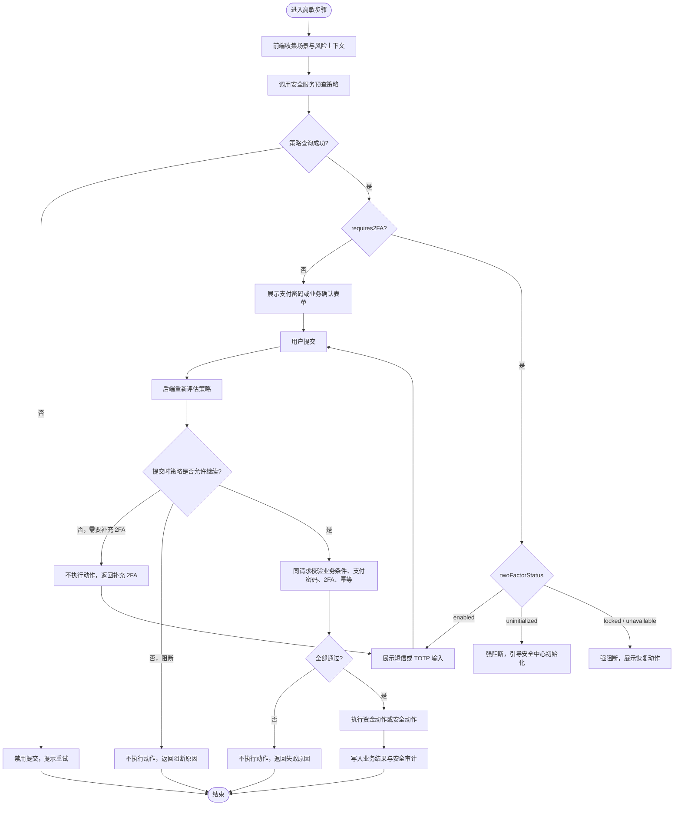
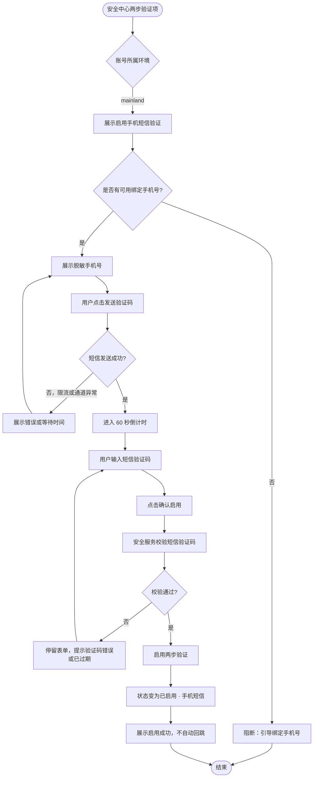
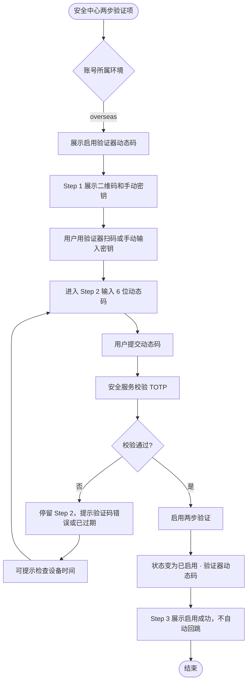
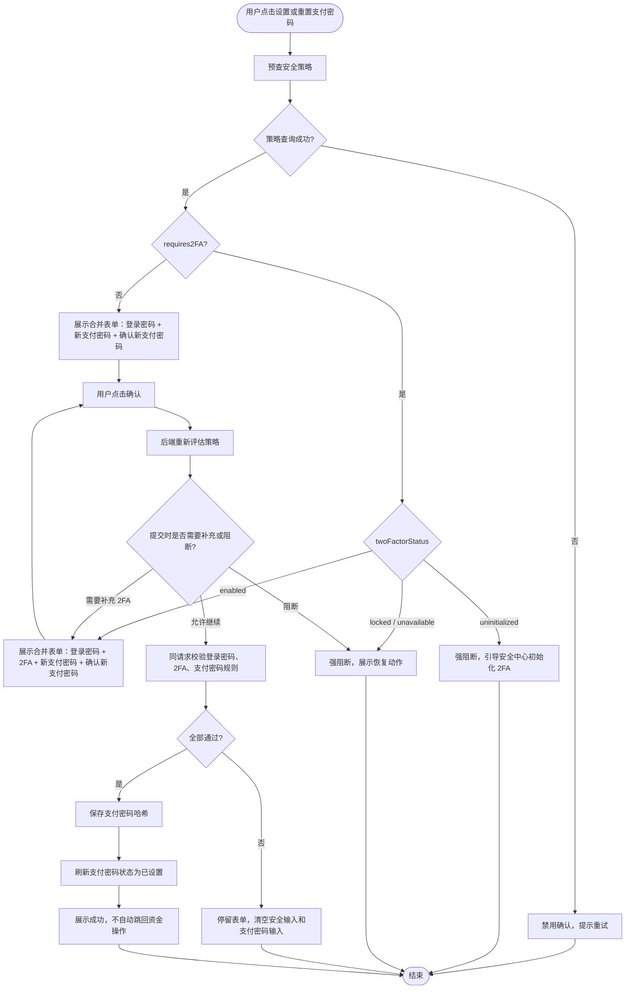
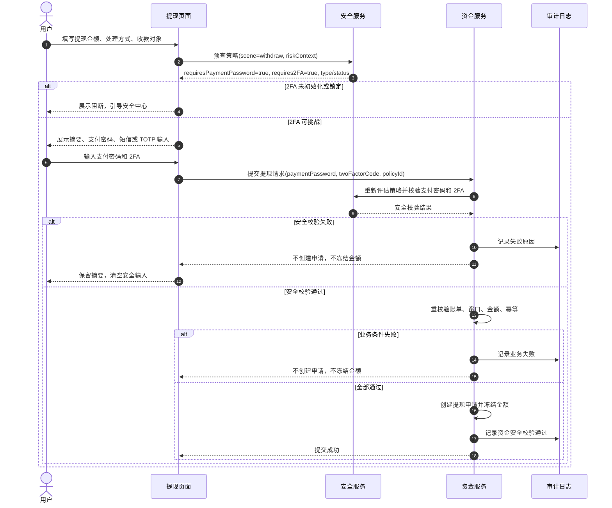
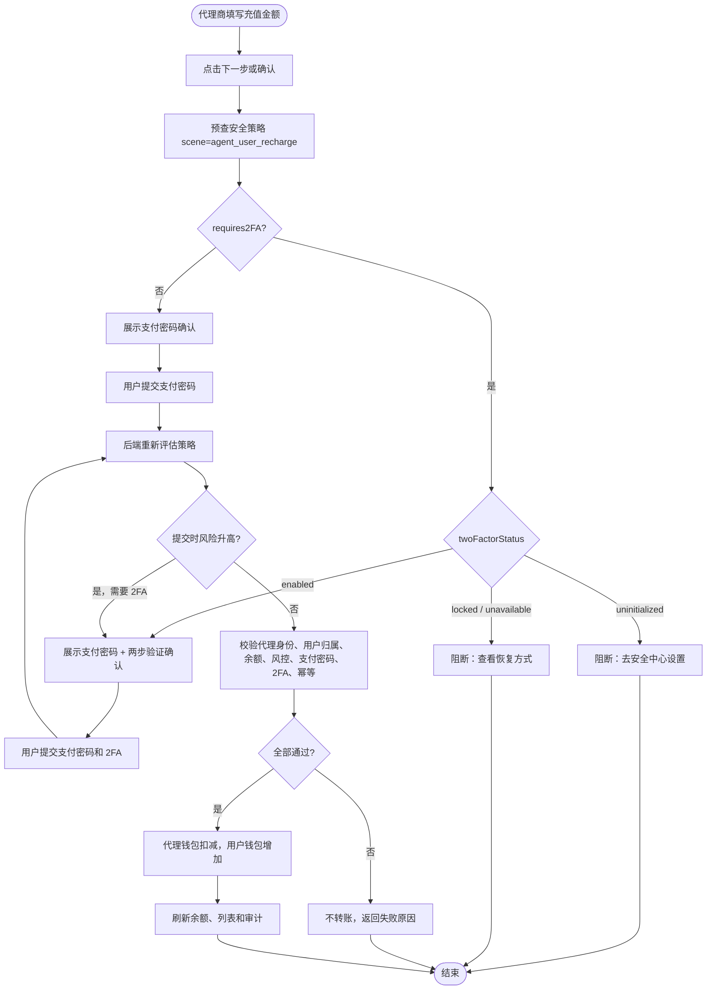
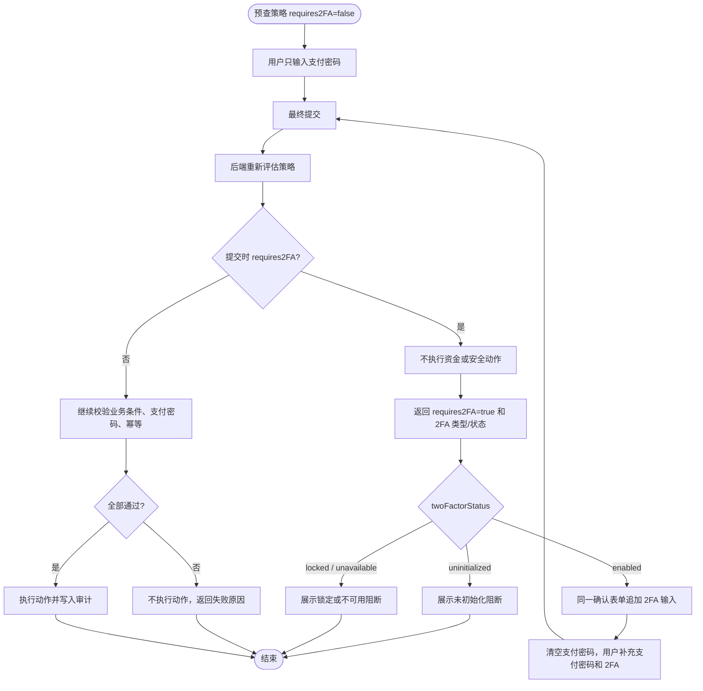
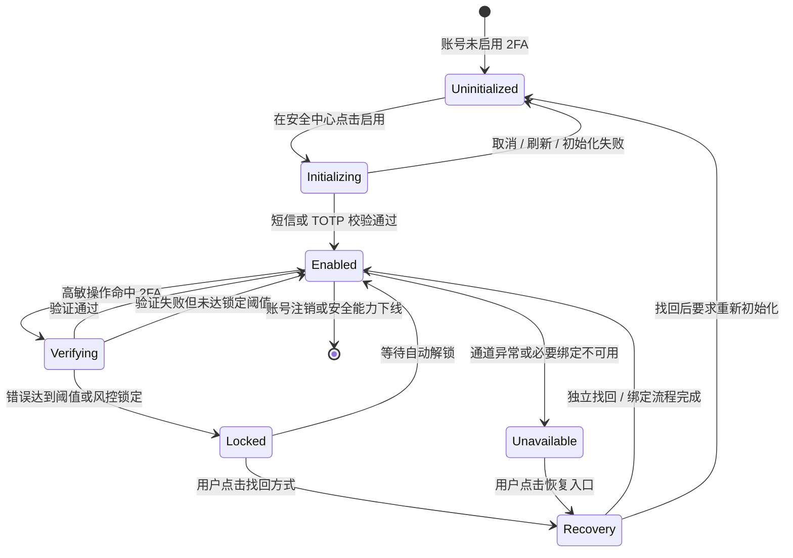
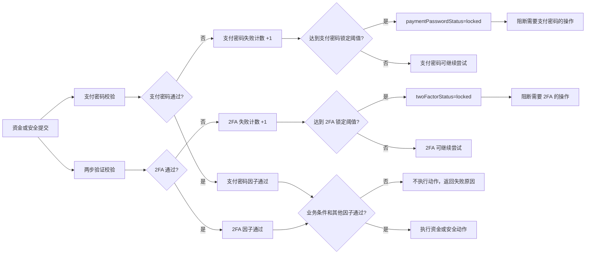

# Mermaid

## 背景

本文件承接：

- `2FA/2026-06-15-payment-password-2fa-strategy-design.md`
- `2FA/2026-06-16-payment-password-2fa-grill-decisions.md`
- `2FA/2026-06-16-payment-password-2fa-wireframe.md`

当前阶段：`mermaid-diagrams`。

图集目标是把支付密码接入两步验证的策略评估、初始化、提交校验、阻断和状态流转用流程图 / 时序图 / 状态机表达清楚，为后续 `prd-orchestrator` 和 PRD 生成提供结构输入。

## 1. 安全服务两段式策略评估流程

## 2. 大陆手机短信 2FA 初始化流程

## 3. 海外 TOTP 初始化流程

## 4. 支付密码设置 / 重置合并表单流程

## 5. 提现支付密码 + 2FA 提交流程

## 6. 充值按风险触发 2FA 提交流程

## 7. 策略变化风险升高补充 2FA 流程

## 8. 2FA 状态机

## 9. 支付密码与 2FA 独立失败计数 / 锁定关系图

