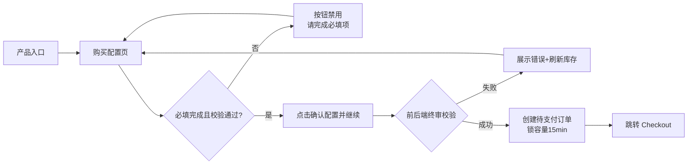
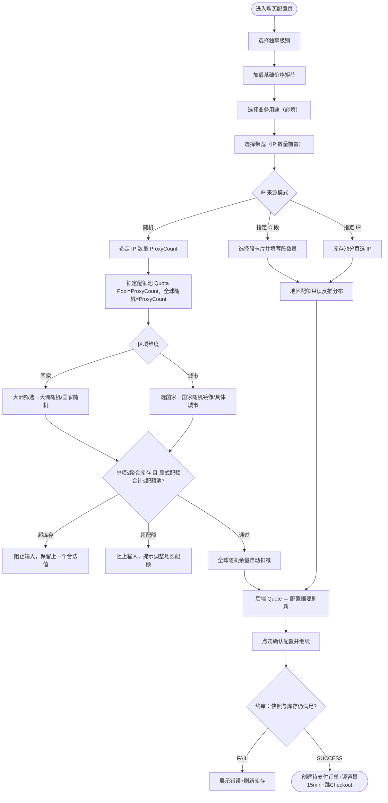

# 购买配置

## 文档信息

| 字段 | 内容 |
|------|------|
| 文档标题 | 静态代理购买配置页需求文档（交付级） |
| 文档编号 | PRD-2026-SP-01 |
| 产品版本 | v2.2 |
| 作者 | 产品经理 |
| 创建日期 | 2026-06-02 |
| 最后更新 | 2026-06-04 |
| 状态 | 待评审 |
| 关联需求 | `静态代理-购买-选择规格`、`静态代理-购买-提交订单` |
| 关联原型 | `IP代理/prototypes/static-residential-purchase-prototype.html` |
| 整合来源 | 《购买配置页优化方案》《购买链路 PRD v2 流程重排》《随机模式地区配额设计》 |

## 修订历史

| 版本 | 日期 | 作者 | 变更说明 |
|------|------|------|----------|
| v2.1 | 2026-06-02 | 产品经理 | 整合既有三份散稿为交付级 PRD。 |
| v2.2 | 2026-06-04 | 产品经理 | 收敛为核心购买链路；补齐随机模式配额分摊模型；移除本期不交付的外围能力详述。 |

---

## 一、问题陈述

当前静态住宅代理购买配置页需要解决三类问题：

1. **配置顺序需要更贴近采购决策**：用户应先确定基础资源约束与业务用途，再选择来源、数量和地区配额，最后确认金额并进入支付。
2. **随机模式地区配额需要重新建模**：库存真实最小粒度是城市，不存在独立国家池或城市池；国家和大洲可用量都应由城市库存聚合而来。
3. **支付前动作需要明确**：用户点击 `确认配置并继续` 后创建待支付订单、冻结配置快照和容量锁定，再跳转 Checkout。

> 影响量化数据【待确认：配置完成率、平均配置时长、支付前回退率当前基线值】。上线前需埋点取数，见第十二章。

## 二、目标

| 编号 | 目标描述 | 衡量指标 | 目标值 | 当前值 | 衡量时间 |
|------|----------|----------|--------|--------|----------|
| G-01 | 让配置顺序贴合「先约束、后来源与数量、再分配」 | 配置完成率 | 【待确认】 | 【待确认】 | 上线后 14 天 |
| G-02 | 让配置摘要仅展示当前核心购买对象与后端可信报价 | 价格相关客服咨询占比 | 下降 | 【待确认】 | 上线后 30 天 |
| G-03 | 保障零超卖 | 超卖订单数 | 0 | 【待确认】 | 持续 |
| G-04 | 明确 `确认配置并继续 → 待支付订单 → Checkout` 闭环 | 待支付订单创建成功率 | ≥ 99% | 【待确认】 | 上线后 14 天 |
| G-05 | 降低支付前回退 | 支付前回退率 | 下降 | 【待确认】 | 上线后 30 天 |

## 三、非目标

| 非目标 | 排除原因 |
|--------|----------|
| 多规格购物车 | 本期只做单规格待支付订单，避免订单结构放大 |
| 自动换 IP、额外增值项、独立年付开关、优惠券 | 不属于当前核心配置链路，后续独立立项 |
| 支付网关、3DS、卡组织校验 | 由 Checkout / 钱包 PRD 与后端支付能力承载 |
| 支付后资源交付、续费、退款、发票 | 由「我的 IP」「订单」相关 PRD 承载 |
| 城市库存运营后台建设 | 本期仅依赖库存服务提供城市 Available 与聚合可用量 |
| 指定 IP / 按段采购的城市级采购细化 | 本文仅定义其只读反推分布，细化粒度后续单独讨论 |
| 智能推荐国家/数量组合 | 后续增强 |

---

## 四、用户故事

```
用户角色：静态代理采购用户（跨境运营 / 风控敏感型 / 独立开发者 / 企业采购）、产品/研发/测试

【P0 - 必须】
- US-01：作为采购用户，我想先选独享级别与 IP 质量，再做后续配置，以便先锁定资源档次。
  - 验收：进入页面时基础属性区在最前；未选关键基础属性前，下游模块按依赖禁用或保持默认。
- US-02：作为风控敏感用户，我想尽早选择业务用途，以便确认是否满足目标平台要求并满足合规留痕。
  - 验收：未选业务用途时不能继续；业务用途为必填。
- US-03：作为采购用户，我想在确定用途后再选 IP 数量与带宽，以避免规模与用途冲突。
  - 验收：未选带宽时，IP 数量区域不可编辑。
- US-04：作为采购用户，我想在三种 IP 来源模式中选其一，以匹配我的可控性需求。
  - 验收：随机 / 指定 IP 段（C 段）/ 指定 IP 三选一互斥；选择任一会清理不兼容草稿。
- US-05：作为指定 IP 用户，我想从库存池分页选择具体 IP，以精确控制资产。
  - 验收：库存池每页 20 条；至少选 1 个 IP 才可继续；IP 数量由已选条数反推；筛选、排序、翻页不丢已选项。
- US-06：作为随机模式用户，我想把 IP 总数分摊到全球随机、大洲随机、国家随机或具体城市，以匹配不同精度场景。
  - 验收：默认全球随机；支持国家/城市区域维度；非全球随机配额合计不能超过 IP 总数。
- US-07：作为随机模式用户，我想看到大洲、国家和城市的实时可用量并被强校验，以避免超卖。
  - 验收：大洲和国家可用量由城市库存聚合；输入超限时阻止输入并保留上一个合法值。
- US-08：作为采购用户，我想在右侧配置摘要看到可信的 Quote 和当前应付，以便确认预算。
  - 验收：左侧任一核心字段变更，配置摘要对应字段与当前应付同步刷新；金额以后台 Quote 为准。
- US-09：作为采购用户，我想在配置完成后点击 `确认配置并继续` 创建待支付订单并进入 Checkout，以便支付。
  - 验收：成功后生成订单号、冻结配置快照、锁定容量 15 分钟、跳转 Checkout。
- US-10：作为非随机模式用户，我希望地区配额区只展示来源反推结果，以避免误以为还能二次分配。
  - 验收：指定 IP / 按段采购模式下地区配额不可输入，仅展示只读反推分布，展示粒度以后续对应模式设计为准。

【P1 - 重要】
- US-11：作为采购用户，我想在国家很多时搜索国家名/代码并分页浏览，且翻页不丢已输入数量。
  - 验收：搜索、筛选、翻页、切换区域维度不清空全局显式配额集合。
- US-12：作为城市维度用户，我想先从热门国家进入城市列表，也能展开更多国家并按大洲筛选。
  - 验收：热门国家来自运营配置并过滤无城市库存国家；更多国家面板支持大洲筛选。
- US-13：作为采购用户，我想切换业务用途时保留兼容配置、只重置不兼容项，以减少重复输入。
  - 验收：业务字段变更触发资源匹配与价格重算，但尽量保留兼容配额输入。

【P2 - 期望】
- US-14：作为采购用户，我想看到「最受欢迎」数量/质量档位标识，以快速选推荐方案。
  - 验收：IP 数量默认档位与 IP 质量默认值（标准）带推荐标识。
- US-15：作为有长尾国家需求的用户，我想看到「其他国家联系客服定制」提示。
  - 验收：地区模块展示客服定制服务提示。
```

---

## 五、非功能性需求

| 类型 | 需求描述 | 衡量标准 |
|------|----------|----------|
| 性能 | 字段变更按依赖最小重算，切换分页/搜索不触发全量重算 | 单次交互重绘 < 200ms（前端可感知） |
| 数据一致性 | 城市库存与底层节点池分钟级心跳同步，禁用静态死数据 | 库存延迟 ≤ 1 分钟 |
| 安全性 | 业务用途必采集并留痕；高端质量仅从合格网段抽取 | 合规留痕 100% |
| 可用性 | 双栏响应式（主配置流 + 悬浮配置摘要） | 主流端到端可完成下单 |
| 防超卖 | 提交前前后端双重终审校验库存 | 终审失败必拦截 |

---

## 六、功能需求（FR）

### 6.1 产品结构 / 功能模块

| 功能模块 | 功能点 | 优先级 | 所属用户故事 | 备注 |
|----------|--------|--------|--------------|------|
| 代理基础属性 | 独享级别 / IP 质量 / UDP / 带宽 / 连接数 | P0 | US-01,03,14 | 全页计费与库存校验源头 |
| 业务用途 | 业务用途必选 | P0 | US-02,13 | 合规留痕 |
| IP 来源与数量 | 随机 / 指定 C 段 / 指定 IP 三选一；IP 数量 | P0 | US-03,04,05 | 互斥模式，来源不同数量来源不同 |
| 地区配额 | 全球随机兜底、国家/城市区域维度、大洲随机、国家随机、具体城市、搜索分页 | P0 | US-06,07,10,11,12,15 | 随机模式可编辑；非随机只读反推 |
| 配置摘要 + 确认配置并继续 | 单规格摘要、Quote、当前应付、创建待支付订单 | P0 | US-08,09 | 后端 Quote 与订单快照为准 |

> 功能结构（约束优先顺序）：
> 1. 代理基础属性 → 2. 业务用途 → 3. IP 来源与数量 → 4. 地区配额 / 来源分布 → 5. 配置摘要 + 确认配置并继续

### 6.2 功能需求清单（US → FR 追溯）

| 需求ID | 需求描述 | 所属用户故事 | 优先级 | 验收标准（条件-操作-结果） | 对应界面 |
|--------|----------|--------------|--------|----------------------------|----------|
| FR-01 | 基础属性单选并驱动全页价格矩阵初始化 | US-01 | P0 | 选定独享级别时，加载对应基础价格矩阵并初始化磁贴单价 | 7.1 |
| FR-02 | IP 质量默认「标准」并带推荐标识 | US-14 | P2 | 进入页面时 IP 质量默认选中「标准」，卡片显示推荐标识 | 7.1 |
| FR-03 | 业务用途必填校验 | US-02 | P0 | 未选业务用途时，主按钮保持 `请完成必填项` 禁用 | 7.2 |
| FR-04 | 带宽是 IP 数量前置条件 | US-03 | P0 | 未选带宽时，IP 数量区域不可编辑 | 7.1,7.3 |
| FR-05 | 连接数默认 100，支持自定义 1-1000，阶梯加价 | US-03 | P0 | 输入越界时阻止输入并提示；变更联动 Quote | 7.1 |
| FR-06 | IP 来源三模式互斥 | US-04 | P0 | 选择任一模式，自动取消其余两种并清理不兼容草稿 | 7.3 |
| FR-07 | 指定 IP 模式从库存池分页选择，IP 数量反推 | US-05 | P0 | 每页 20 条；选 ≥1 个才可继续；数量=已选条数 | 7.3 |
| FR-08 | 指定 C 段模式按段卡片输入购买数量 | US-04,10 | P0 | C 段模式下地区配额只读为反推结果 | 7.3,7.4 |
| FR-09 | 随机模式地区配额四类结构 | US-06 | P0 | 支持 `global_random / continent_random / country_random / city` 四类配额 | 7.4 |
| FR-10 | 城市库存聚合校验 | US-07 | P0 | 大洲随机、国家随机、具体城市输入超过可用量时拦截并保留上一个合法值 | 7.4 |
| FR-11 | 配额池总量阻断 | US-06 | P0 | 非全球随机配额合计不能超过 IP 总数；超过时拦截并提示调整地区配额 | 7.4 |
| FR-12 | 全球随机余量自动扣减 | US-06 | P0 | 全球随机初始=IP 总数；填写任意显式配额后自动扣减；未分配余量归全球随机 | 7.4 |
| FR-13 | 国家/城市搜索分页且保留已输入 | US-11,12 | P1 | 大洲筛选、国家搜索、城市搜索、分页、切换国家不清空已填写配额 | 7.4 |
| FR-14 | 配置摘要实时映射 Quote | US-08 | P0 | 左侧任一字段变更，配置摘要字段与当前应付同步 | 7.5 |
| FR-15 | 确认配置并继续创建待支付订单并跳转 | US-09 | P0 | 终审通过后生成订单号+冻结快照+锁容量 15min+跳 Checkout | 7.5 |
| FR-16 | 终审失败拦截 | US-09 | P0 | 终审超卖/库存变动时展示错误、刷新库存、不创建订单 | 7.5 |
| FR-17 | 切换业务用途保留兼容项 | US-13 | P1 | 业务字段变更触发资源匹配重算但尽量保留配额输入 | 7.2 |

---

## 七、界面功能详细说明

### 7.0 页面总览与全局流转

**页面清单**

| 编号 | 页面名称 | 类型 | 入口 | 主要去向 |
|------|----------|------|------|----------|
| P1 | 静态代理购买配置页 | C 端 | 产品列表 / 营销入口 | Checkout（确认配置并继续后） |
| P1-1 | 指定 IP 库存池选择区（页内区块） | C 端区块 | 选「指定 IP」模式 | 同页已选 IP 摘要 |

**全局页面流转图**



**业务校验与级联重绘流程**



### 7.1 代理基础属性区

| 项目 | 内容 |
|------|------|
| 功能描述 | 定义商品技术与商业规格，是全页计费与库存校验源头 |
| 用户场景 | 用户进入购买页首先确定资源档次 |
| 优先级 | P0 |
| 所属用户故事 / FR | US-01,03,14 / FR-01,02,04,05 |

| 序号 | 名称 | 类型 | 必填项 | 默认值 | 数据来源 | 业务规则 |
|------|------|------|--------|--------|----------|----------|
| 1 | 独享级别 | Radio 卡片 | 是 | 共享 | 枚举：共享/独享/尊享 | 单选；切换触发全链路重算 |
| 2 | IP 质量 | Radio 卡片 | 是 | 标准 | 枚举：基础/标准/高端 | 默认选「标准」并显示推荐标识；切换触发资源匹配与价格重算 |
| 3 | UDP | Switch/Radio | 是 | 关闭 | 枚举：关闭/开启 | 单独收费项；变更联动 Quote |
| 4 | 带宽 | Radio 磁贴 | 是 | 空 | 枚举：250GB/1000GB/5000GB/Unlimited | 未选时 IP 数量区不可编辑并提示「请先选择带宽」 |
| 5 | 连接数 | Radio + Custom Input | 是 | 100 | 枚举档位 + 自定义 | 支持 1-1000；越界阻止输入并提示 |

### 7.2 业务用途区

| 项目 | 内容 |
|------|------|
| 功能描述 | 采集用户购买代理的业务场景，用于资源匹配与合规留痕 |
| 用户场景 | 风控敏感用户在前置步骤明确用途 |
| 优先级 | P0 |
| 所属用户故事 / FR | US-02,13 / FR-03,17 |

| 序号 | 名称 | 类型 | 必填项 | 默认值 | 数据来源 | 业务规则 |
|------|------|------|--------|--------|----------|----------|
| 1 | 业务用途 | Select | 是 | 空 | 业务用途枚举 | 未选不可继续；切换用途触发资源匹配与价格重算，并尽量保留兼容配置 |

### 7.3 IP 来源与数量区

| 项目 | 内容 |
|------|------|
| 功能描述 | 三选一互斥的 IP 来源模式与 IP 数量确定 |
| 用户场景 | 用户按可控性需求选择随机/指定 C 段/指定 IP |
| 优先级 | P0 |
| 所属用户故事 / FR | US-03,04,05,10 / FR-04,05,06,07,08 |

| 序号 | 名称 | 类型 | 必填项 | 默认值 | 数据来源 | 业务规则 |
|------|------|------|--------|--------|----------|----------|
| 1 | IP 来源模式 | Radio | 是 | 随机 | 枚举：随机/指定 C 段/指定 IP | 三选一互斥；切换来源模式时清理不兼容草稿 |
| 2 | IP 数量档位 | Radio 磁贴 + Custom | 是 | 100（推荐） | 枚举档位 + 自定义 | 随机模式下选定即 ProxyCount；指定 IP 模式隐藏；自定义为空/非正整数时拦截 |
| 3 | 指定 C 段段卡片 | Card + InputNumber | 按模式 | 空 | 段库存接口 | 选中段后填写购买数量；数量 > 0 才计入总量；地区配额只读反推 |
| 4 | 数量区不可用遮罩 | State | - | 显示（带宽未选时） | - | 未选带宽时整区灰显，提示「请先选择带宽」 |

#### 7.3.1 指定 IP · 库存池选择区

| 序号 | 名称 | 类型 | 必填项 | 默认值 | 数据来源 | 业务规则 |
|------|------|------|--------|--------|----------|----------|
| 1 | 国家筛选 | Select | 否 | ALL | 国家枚举 + ALL | 单选；与 IP 搜索可联合使用 |
| 2 | IP 模糊搜索 | Input | 否 | 空 | 用户输入 | 模糊匹配 IP；结果按每页 20 条返回 |
| 3 | 单价排序 | Sort 控件 | 否 | 无 | 列表字段 | 支持单价升序/降序 |
| 4 | 库存池列表 | Table/List | - | 分页第 1 页 | 库存池接口 | 每页固定 20 条；勾选/取消立即同步已选 IP 与数量；筛选/翻页/排序不清空已选项 |
| 5 | 已选 IP 摘要区 | Tag 区 | - | 空 | 用户已选集合 | 单行展示；超出后通过展开面板查看；至少选 1 个才可继续 |
| 6 | 展开面板 | 页内展开面板 | - | 收起 | 已选 IP 集合 | 按国家分组；支持删除单个 IP / 清空某国分组；同步摘要区、数量、列表选中态、配置摘要 |

### 7.4 地区配额区

**界面基本信息**

| 项目 | 内容 |
|------|------|
| 功能描述 | 随机来源模式下，将 IP 总数分摊到全球随机、大洲随机、国家随机和具体城市；非随机模式下展示只读反推分布 |
| 用户场景 | 用户在随机模式下按地区精度分配数量 |
| 优先级 | P0 |
| 前置条件 | 已选 IP 数量（随机模式）；来源模式决定可编辑性 |
| 所属用户故事 / FR | US-06,07,10,11,12,15 / FR-08,09,10,11,12,13 |

**库存与配额模型**

- 库存真实最小粒度为城市，例如 `Japan/Tokyo 10`、`Japan/Osaka 20`；`Japan` 可用量由城市聚合为 30。
- 前端和后端不建立独立国家池或独立城市级随机池；国家和大洲的随机范围都由城市库存聚合计算。
- 每条 IP 在最终交付时都归属到具体城市；待支付订单阶段锁定容量和配置快照，不锁定具体 IP。
- 订单快照保存结构化配额枚举：`global_random | continent_random | country_random | city`。

**界面元素清单表**

| 序号 | 名称 | 类型 | 必填项 | 默认值 | 数据来源 | 前置条件 | 业务规则 |
|------|------|------|--------|--------|----------|----------|----------|
| 1 | 全球随机兜底项 | Display | 否 | IP 总数 | 配额池余量计算 | 随机模式 | 只读自动值；初始=IP 总数；填写任意显式配额后自动扣减 |
| 2 | 区域维度切换 | Segmented Control | 否 | 国家 | 枚举：国家/城市 | 随机模式 | 切换只影响浏览与输入区域，不清空已填写配额 |
| 3 | 大洲筛选 | Tabs | 否 | 全部 | 枚举：全部/Asia/North America/Europe/Africa/South America/Oceania | 区域维度=国家 | `全部` 仅用于跨大洲浏览/搜索，不作为提交范围；选中具体大洲时显示大洲随机项 |
| 4 | 国家搜索 | Input | 否 | 空 | 用户输入 | 区域维度=国家 | 支持国家名/代码；搜索只影响浏览列表，不清空已填写配额 |
| 5 | 大洲随机卡片 | InputNumber Card | 否 | 0 | 用户输入；可用量来自城市库存聚合 | 区域维度=国家 且选中具体大洲 | 从当前大洲可用城市库存中随机；排除已显式配置的同洲国家及其城市；超限阻止输入 |
| 6 | 国家随机卡片 | InputNumber Card | 否 | 0 | 用户输入；可用量来自城市库存聚合 | 区域维度=国家 | 从该国家可用城市库存中随机；排除该国家下已显式配置城市；翻页/搜索后数量保留 |
| 7 | 热门国家入口 | Button Group | 否 | 热门国家列表 | 运营配置 + 库存服务 | 区域维度=城市 | 展示高频国家，且过滤无城市库存国家 |
| 8 | 更多国家面板 | Panel | 否 | 收起 | 国家枚举 + 城市库存 | 区域维度=城市 | 面板内通过大洲筛选国家；选择国家后关闭面板并展示该国家城市列表 |
| 9 | 城市搜索 | Input | 否 | 空 | 用户输入 | 区域维度=城市 且已选国家 | 支持城市名搜索；搜索只影响当前国家城市列表 |
| 10 | 国家随机镜像卡片 | InputNumber Card | 否 | 0 | 同国家随机配额 | 区域维度=城市 且已选国家 | 城市列表第一项显示 `{国家} 随机`，与国家维度同一国家随机项双向绑定，不新增独立配额类型 |
| 11 | 具体城市卡片 | InputNumber Card | 否 | 0 | 用户输入；城市 Available | 区域维度=城市 且已选国家 | 使用 `countryCode + cityCode/cityId` 标识；输入不能超过该城市 Available；配置摘要展示 `Country / City` |
| 12 | 已选状态栏 | Tag 区 | - | 空 | 已填写配额聚合 | 存在非 0 显式配额 | 展示所有显式配额；当前筛选不可见的已选项也必须展示；支持删除单项和 `Reset All` |
| 13 | 配额只读视图 | Display | - | 反推结果 | 指定 C 段/指定 IP 反推 | 来源==指定 C 段/指定 IP | 非随机模式下地区配额只读，展示反推分布；粒度以后续对应模式设计为准 |
| 14 | 客服定制提示 | Text/Link | - | 常量 | 常量 | - | 展示「其他国家请联系客户支持定制」 |

**交互流程补充**

- 默认：进入随机模式 → 区域维度默认 `国家` → 大洲筛选默认 `全部` → 全球随机=IP 总数。
- `全部` 只展示国家随机卡片并支持搜索，不出现 `全部随机`，也不提交 `ALL`。
- 选中具体大洲后，第一项为 `{大洲} 随机`，例如 `Asia 随机 5`；其余项为该洲内的国家随机项，例如 `Japan 随机 3`。
- 切换到 `城市` 维度后，先选择国家；城市列表第一项为 `{国家} 随机`，例如 `Japan 随机 3`，与国家维度同一国家项同步；其余项为具体城市，例如 `Japan / Tokyo 2`。
- 删除大洲随机、国家随机或具体城市后，对应数量回到上层随机余量；删除具体城市后，该城市重新进入所属国家随机可用池。
- 搜索、筛选、翻页、切换大洲、切换国家、切换区域维度都不清空全局显式配额集合。
- 从 `随机` 切换到 `指定 IP` 或 `指定 C 段` 时，如已有显式配额，需要二次确认；确认后清空随机显式配额。切回随机时重新初始化为全球随机，不恢复隐藏草稿。

**计算与校验规则**

- `全球随机余量 = IP 总数 - 大洲随机数量 - 国家随机数量 - 具体城市数量`。
- `全球随机` 可用范围排除已显式配置的大洲、国家以及具体城市所属国家；本期采用互斥覆盖模型，不做重叠命中。
- `大洲随机` 可用量 = 当前大洲下城市库存聚合 - 已显式配置的同洲国家随机覆盖量 - 已显式配置的同洲具体城市所属国家覆盖量。
- `国家随机` 可用量 = 当前国家下城市库存聚合 - 该国家下已显式配置的具体城市数量。
- `具体城市` 可用量 = 该城市 Available。
- 单项输入超过可用量时，阻止输入并保留上一个合法值；不自动裁剪。
- 非全球随机配额合计超过 IP 总数时，阻止输入并提示「地区配额不能超过 IP 数量」。
- IP 总数增加时，保留显式配额，增量进入全球随机；IP 总数减少且小于显式配额合计时，阻止保存新的 IP 总数。
- 前端发送完整配额结构给后端 Quote；前端不根据地区层级自行计算价格。

**错误展示**

- 卡片级：在超限输入卡片附近直接展示错误。
- 模块级：地区配额区顶部汇总当前阻断原因。
- CTA 级：主按钮保持禁用或点击后滚动到第一处错误。

### 7.5 配置摘要 + 确认配置并继续

**界面基本信息**

| 项目 | 内容 |
|------|------|
| 功能描述 | 右侧常驻悬浮，实时呈现配置明细、当前应付，并提供提交入口 |
| 用户场景 | 用户在创建订单前确认规格与价格 |
| 优先级 | P0 |
| 所属用户故事 / FR | US-08,09 / FR-14,15,16 |

**界面元素清单表**

| 序号 | 名称 | 类型 | 必填项 | 默认值 | 数据来源 | 业务规则 |
|------|------|------|--------|--------|----------|----------|
| 1 | 配置摘要 | Display | - | 当前配置 | 左侧各模块状态 + Quote | 只读摘要；展示来源模式、来源分布/地区配额、IP 数量、带宽、连接数、购买时长 |
| 2 | 当前应付 | Display | - | 实时 Quote | 后端 Quote 结果 | 展示当前待支付金额；前端仅展示，不作为最终计费来源 |
| 3 | 购买时长 | Radio/Select | 是 | 【待确认默认值】 | 枚举：7/15/30/60/90 天 / 1 年 | 作为普通购买时长参与 Quote；不包含独立年付开关 |
| 4 | 主按钮 | Button | - | disabled（请完成必填项） | 校验状态 | 必填未完成显示 `请完成必填项`；校验通过显示 `确认配置并继续` |

**交互流程补充**

- 主流程：配置完成 → 按钮变 `确认配置并继续` → 点击 → 终审通过 → 创建待支付订单 → 跳 Checkout。
- 终审成功：创建待支付订单，生成订单号，冻结配置快照和金额快照，锁定容量 15 分钟。
- 待支付订单阶段锁定容量与快照，不锁定具体 IP；支付后交付阶段再把每条 IP 落到具体城市。
- 终审失败：展示错误、刷新库存、停留本页，不创建订单。
- 多次点击创建新待支付订单，不覆盖旧订单；loading 期间禁用防重复提交。

**订单快照字段要求**

- 保存结构化配额，不只保存展示名。
- 配额项字段：`type`、`quantity`、`continentCode`、`countryCode`、`cityCode/cityId`、`displayName`。
- `type` 枚举：`global_random | continent_random | country_random | city`。
- 具体城市必须保存 `countryCode + cityCode/cityId`，避免同名城市歧义。

---

## 八、数据需求

- 核心实体：
  - `购买配置草稿`：基础属性、业务用途、来源模式、数量、带宽、连接数、地区配额、购买时长。
  - `Quote`：后端返回的实时报价结果、币种、价格明细、有效期。
  - `待支付订单快照`：点击 `确认配置并继续` 时冻结的配置、金额、容量锁定信息。
- 关键约束：
  - `IP 数量`：随机模式由档位/自定义输入决定；指定 IP 模式由已选条数反推；指定 C 段由段数量汇总。
  - `Quota Pool == 显式配额合计 + 全球随机余量`。
  - 大洲随机、国家随机、具体城市均需满足城市库存聚合后的 Available。
  - 待支付订单快照保存同一份结构化地区配额。
- 数据流转：用户输入 → 配置状态归一 → 后端 Quote → 配置摘要渲染 → 终审校验 → 待支付订单快照。

---

## 九、接口需求

> 本期不设计接口 API 细节，仅列出能力依赖。

| 接口 | 用途 | 请求/响应关键字段 | 错误码 |
|------|------|-------------------|--------|
| 价格矩阵 | 按独享级别加载基础价 | 独享级别、质量、带宽、连接数 → 价格矩阵 | 【待确认】 |
| 城市库存查询 | 返回城市 Available，并支持前端/后端聚合国家和大洲可用量 | `countryCode`、`cityCode/cityId`、Available、continentCode | 【待确认】 |
| 指定 IP 库存池 | 指定 IP 模式分页选择 | 国家、IP 搜索、排序、分页(20) → IP 列表 | 【待确认】 |
| 段库存查询 | 指定 C 段模式选择段并填写数量 | 段标识、国家、单价、Available | 【待确认】 |
| Quote 报价 | 配置 → 当前应付 | 全量配置、结构化地区配额 → 当前应付、币种、明细 | 【待确认】 |
| 创建待支付订单 | 确认配置并继续提交 | 配置快照、Quote id/版本 → 订单号、金额、锁定时间 | 超卖/库存不足/报价过期 |

---

## 十、上线计划

| 里程碑 | 计划日期 | 交付物 | 状态 |
|--------|----------|--------|------|
| PRD 评审 | 【待确认】 | 本 PRD | 待评审 |
| 设计交付 | 【待确认】 | 高保真 | - |
| 开发完成 | 【待确认】 | 配置页 v2 | - |
| 灰度发布 | 【待确认】 | 灰度对比指标 | - |

- 回滚方案：保留 v1 顺序与逻辑，灰度开关切回。
- 上线验收：见第十一章指标 + 第六章 FR 验收标准。

## 十一、成功指标

| 指标类型 | 指标名称 | 目标值 | 当前值 | 衡量周期 | 数据来源 |
|----------|----------|--------|--------|----------|----------|
| 领先指标 | 配置完成率 | 提升 | 【待确认】 | 上线后 14 天 | 埋点 |
| 领先指标 | 平均配置时长 | 下降 | 【待确认】 | 上线后 14 天 | 埋点 |
| 领先指标 | 确认配置并继续转化率 | 提升 | 【待确认】 | 上线后 14 天 | 埋点 |
| 滞后指标 | 支付前回退率 | 下降 | 【待确认】 | 上线后 30 天 | 埋点 |
| 护栏指标 | 「配置顺序不理解」客服咨询占比 | 下降 | 【待确认】 | 上线后 30 天 | 客服工单 |
| 护栏指标 | 超卖订单数 | 0 | 【待确认】 | 持续 | 订单/库存日志 |

## 十二、数据埋点

> 北极星：确认配置并继续转化率（配置完成并成功创建待支付订单）。

| 事件名 | 触发时机 | 事件属性（维度） | 对应指标/漏斗环节 |
|--------|----------|------------------|-------------------|
| 进入配置页 | 页面加载 | 来源渠道、独享级别默认 | 漏斗起点 |
| 选择基础属性 | 选独享级别/质量/带宽/连接数 | 字段名、取值 | 配置进度 |
| 选择业务用途 | 选定用途 | 用途值 | 合规留痕 |
| 切换来源模式 | 选随机/C段/指定IP | 模式、是否触发清空确认 | 模式偏好 |
| 调整地区配额 | 填写或删除地区配额项 | 区域维度、配额类型、大洲、国家、城市、数量、全球随机余量 | 地区偏好与配置复杂度 |
| 校验失败 | 库存/配额/必填拦截 | 失败类型、字段、区域维度、地区范围、配额类型 | 流失定位 |
| 点击确认配置并继续 | 点击提交 | 配置摘要、当前应付、Quote id | 转化 |
| 确认配置结果 | 创建订单返回 | 成功/失败、失败原因 | 转化/流失 |

**关键转化漏斗**

> 进入配置页 → 完成基础属性 → 选业务用途 → 完成来源与数量 → 完成地区配额/来源分布 → 点击确认配置并继续 → 成功创建待支付订单。

---

## 十三、开放问题

| 编号 | 问题 | 领域 | 负责人 | 期望答复 | 状态 |
|------|------|------|--------|----------|------|
| Q-01 | 配置完成率/配置时长/支付前回退率当前基线值 | 数据 | 【待确认】 | 评审前 | 待回复 |
| Q-02 | 购买时长默认档位取值 | 产品 | 【待确认】 | 评审前 | 待回复 |
| Q-03 | 连接数阶梯加价具体阶梯与价格 | 计费 | 【待确认】 | 开发前 | 待回复 |
| Q-04 | 指定 IP 库存池排序是否含其他维度（质量/国家） | 产品 | 【待确认】 | 开发前 | 待回复 |
| Q-05 | 城市编码使用 `cityCode` 还是库存服务内部 `cityId` | 库存/后端 | 【待确认】 | 开发前 | 待回复 |

## 十四、依赖与风险

**依赖项**

| 依赖方 | 依赖内容 | 预计交付 | 当前状态 | 风险等级 |
|--------|----------|----------|----------|----------|
| 库存服务 | 城市 Available、国家/大洲聚合可用量、库存池分页、容量锁定 15min | 开发排期前 | 待接入 | 高 |
| 计费引擎 | 基础价格矩阵、购买时长、带宽、连接数、地区配额结构化 Quote | 【待确认】 | 待确认 | 高 |
| 订单服务 | 创建待支付订单、冻结快照、容量锁定、过期释放 | 【待确认】 | 待确认 | 中 |
| 后台 | 库存大盘、欺诈分网段调度 | 【待确认】 | 待确认 | 中 |

**风险识别**

| 风险描述 | 影响 | 概率 | 风险等级 | 应对措施 |
|----------|------|------|----------|----------|
| 用户误以为配置摘要是多规格购物车 | 预期偏差 | 中 | 中 | 文案明确「当前配置/当前订单」 |
| 用户误以为大洲随机会包含已单独配置国家，或国家随机会包含已单独配置城市 | 地区预期偏差 | 中 | 中 | PRD 明确互斥覆盖与排除规则；配置摘要分类型展示 |
| 城市库存聚合延迟导致前端超卖 | 资金/交付 | 中 | 高 | 提交前后端终审 + 容量锁定 |
| 多变量重算性能差 | 体验下降 | 中 | 中 | 最小重算策略，Quote 请求防抖与版本校验 |
| 多次确认产生多个待支付订单 | 订单冗余 | 中 | 低 | loading 禁用；旧订单不覆盖；订单过期释放 |

---

## 十五、附录

**术语表**

| 术语 | 说明 |
|------|------|
| 独享级别 | 共享/独享/尊享（shared/private/dedicated）资源档位 |
| Quota Pool | IP 总数实例化的动态额度池，所有地区配额最终不能超过该总量 |
| 全球随机 | 未显式分配的兜底随机余量，从未被其他显式配额覆盖的全球城市库存中随机选择 |
| 大洲随机 | 在指定大洲内随机，随机范围由该大洲下城市库存聚合并排除已显式覆盖范围 |
| 国家随机 | 在指定国家内随机，随机范围由该国家下城市库存聚合并排除已显式配置城市 |
| 具体城市 | 固定到 `countryCode + cityCode/cityId` 的城市配额 |
| 区域维度 | 地区配额输入维度，包含国家和城市 |
| 指定 IP / 指定 C 段 / 随机 | 三种互斥 IP 来源模式 |
| 配置摘要 | 右侧悬浮当前配置确认区 |
| Quote | 当前配置下的后端可信报价，非最终计费来源 |

**附件清单表**

| 编号 | 附件名称 | 类型 | 用途 | 链接 / 位置 | 关联界面或字段 | 版本 |
|------|----------|------|------|-------------|----------------|------|
| A-01 | 购买配置原型 | 原型 | 字段与布局参考 | `IP代理/prototypes/static-residential-purchase-prototype.html` | 7.1-7.5 | - |
| A-02 | 随机模式地区配额设计 | 设计文档 | 随机模式下地区配额分摊模型参考 | `docs/superpowers/specs/2026-06-04-static-proxy-random-location-allocation-design.md` | 7.4 | 2026-06-04 |

---

**文档结束**

- [我的IP原型-订单](/SamPD/prototypes/static-residential-post-continue-flow.html)
- [我的IP原型-购买](/SamPD/prototypes/static-residential-purchase-prototype.html)
- [我的IP原型-我的IP](/SamPD/prototypes/static-residential-my-ips-prototype.html)
