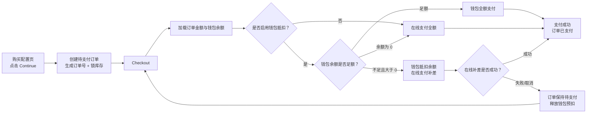
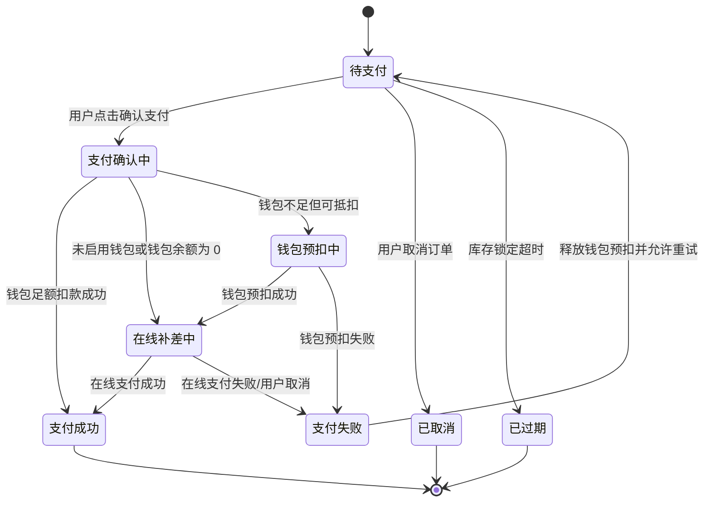

# PRD：组合支付

> 状态：`ready-for-agent`  
> 语言：中文  
> 范围：Checkout 钱包支付增量需求、组合支付状态流转、低保真、字段说明  
> 关联文档：`IP代理/PRD-静态代理购买闭环-提交订单-Checkout-订单.md`  
> 关联原型：`IP代理/prototypes/static-residential-post-continue-flow.html`

## 1. 执行摘要

本需求是在静态代理购买闭环的 Checkout 页面中增加“钱包支付”能力。用户点击 `Continue` 后，系统已创建待支付订单、生成订单号、冻结订单金额与规格快照，Checkout 页面只处理支付。

钱包作为平台账户余额，支持充值，也支持在 Checkout 支付静态代理订单。若钱包余额足够，用户可直接使用钱包全额支付。若钱包余额不足但大于 0，系统支持“钱包余额 + 在线支付补差”的组合支付：钱包余额先抵扣可用金额，剩余差价由信用卡、PayPal 或其他在线支付渠道补齐。若钱包余额为 0，则按在线支付全额支付。

Checkout 右侧 Summary 保持只读，仅展示订单号、产品名称、待支付价格。钱包支付信息放在左侧 Payment Method 区域，其中钱包模块采用极简样式，只展示 Check 组件、钱包余额和一条动态提示；抵扣金额与补差金额通过提示、在线支付金额 badge 和确认支付按钮表达，不再铺开成多项金额明细。

## 2. 背景与问题

当前 Checkout 原型已经具备基础支付页结构：

- 点击 `Continue` 后生成待支付订单。
- Checkout Summary 只读展示订单号、产品名称和待支付价格。
- 左侧 Payment Method 包含支付方式选择和支付表单。
- 支付成功后订单状态从待支付变为已支付。

新增钱包后，需要明确以下产品规则：

- 钱包余额是否可以直接用于订单支付。
- 钱包余额不足时是否只能换在线支付，还是允许钱包先抵扣。
- 组合支付中，钱包扣款与在线支付补差的先后关系。
- 在线补差失败时，钱包抵扣如何释放或回退。
- 订单详情、退款、对账如何展示支付拆分。

## 3. 目标与非目标

### 3.1 目标

- 在 Checkout 页面支持钱包支付。
- 支持钱包余额不足时使用在线支付补齐差价。
- 支持用户关闭钱包抵扣，改用在线支付全额付款。
- 明确组合支付的状态流转、失败回退和展示规则。
- 在订单详情中展示支付拆分：钱包支付金额、在线支付金额、合计金额。
- 保持 Checkout Summary 只读且极简，不回流套餐规格。

### 3.2 非目标

- 不设计接口 API。
- 不设计完整钱包充值页。
- 不设计钱包充值优惠、赠金、授信额度。
- 不设计真实支付网关、3DS、银行卡校验。
- 不设计发票、税费、企业审批流。
- 不设计完整退款系统，仅定义本需求需要的退款拆分口径。

## 4. 产品决策

| 决策项 | 结论 | 说明 |
|---|---|---|
| 钱包定位 | 支付抵扣资产 | 钱包可单独支付，也可和在线支付组合。 |
| 默认抵扣策略 | 有可用余额时默认开启钱包抵扣 | 降低用户支付金额和钱包沉淀余额。 |
| 是否允许关闭抵扣 | 允许 | 用户可关闭钱包抵扣，整单走在线支付。 |
| 钱包足额 | 钱包全额支付 | 在线支付金额为 0。 |
| 钱包不足 | 钱包抵扣全部可用余额，在线支付补差 | 例如订单 $10，钱包 $3，则在线补差 $7。 |
| 钱包余额为 0 | 在线支付全额支付 | 钱包模块展示余额不足，不参与抵扣。 |
| Checkout Summary | 保持只读极简 | 只展示订单号、产品名称、待支付价格。 |
| 钱包模块 UI | 极简 Check 组件 | 只展示是否使用钱包余额、钱包余额、动态提示；不展示六宫格金额明细。 |
| 支付拆分展示 | 在 Payment Method 的提示/按钮和订单详情展示 | 不放入 Checkout Summary。 |
| 在线补差失败 | 订单保持待支付，钱包预扣释放 | 避免用户余额被占用。 |
| 退款口径 | 按原支付来源退回 | 钱包部分退回钱包，在线部分原路退回。 |

## 5. 总体流程



## 6. 组合支付状态流转



## 7. 支付金额计算规则

设：

- `orderAmount`：订单待支付金额。
- `walletBalance`：钱包可用余额。
- `useWallet`：用户是否开启钱包抵扣。
- `walletPayAmount`：本次钱包抵扣金额。
- `onlinePayAmount`：本次在线支付金额。

计算规则：

| 场景 | 计算方式 | 示例 |
|---|---|---|
| 不启用钱包 | `walletPayAmount = 0`，`onlinePayAmount = orderAmount` | 订单 $10，在线支付 $10 |
| 钱包足额 | `walletPayAmount = orderAmount`，`onlinePayAmount = 0` | 订单 $10，钱包 $20，钱包支付 $10 |
| 钱包不足 | `walletPayAmount = walletBalance`，`onlinePayAmount = orderAmount - walletBalance` | 订单 $10，钱包 $3，在线补差 $7 |
| 钱包为 0 | `walletPayAmount = 0`，`onlinePayAmount = orderAmount` | 订单 $10，钱包 $0，在线支付 $10 |

规则补充：

- `walletPayAmount` 不得超过订单金额。
- `walletPayAmount` 不得超过钱包可用余额。
- `onlinePayAmount` 为 0 时，不展示在线支付必填表单。
- `onlinePayAmount` 大于 0 时，必须选择在线支付渠道并完成对应支付表单。
- 用户关闭钱包抵扣后，钱包余额不参与支付拆分。

## 8. 低保真线框

### 8.1 钱包足额：极简钱包模块

```text
┌──────────────────────────────────────────────────────────────────────────────┐
│ Checkout                                                                     │
│ Checkout 页面只处理支付；套餐配置已固定，不可修改。                          │
├────────────────────────────────────────────────────────────┬─────────────────┤
│ Payment Method                                             │ Summary         │
│                                                            │                 │
│ ┌────────────────────────────────────────────────────────┐ │ 订单号           │
│ │ [✓] 使用钱包余额                         钱包余额 $20 │ │ SP-20260602-001 │
│ │     余额充足，将使用钱包支付 $10。                    │ │                 │
│ └────────────────────────────────────────────────────────┘ │ 产品名称         │
│                                                            │ Static Proxy    │
│                                                            │                 │
│                                                            │ 待支付价格       │
│                                                            │ $10.00          │
│                                                            │ 库存锁定15分钟   │
│ [使用钱包支付 $10.00] [取消订单并释放库存]                  │                 │
└────────────────────────────────────────────────────────────┴─────────────────┘
```

### 8.2 钱包不足：极简钱包模块 + 在线补差

```text
┌──────────────────────────────────────────────────────────────────────────────┐
│ Checkout                                                                     │
├────────────────────────────────────────────────────────────┬─────────────────┤
│ Payment Method                                             │ Summary         │
│                                                            │                 │
│ ┌────────────────────────────────────────────────────────┐ │ 订单号           │
│ │ [✓] 使用钱包余额                          钱包余额 $3 │ │ SP-20260602-002 │
│ │     余额不足，将抵扣 $3，在线支付 $7。                 │ │                 │
│ └────────────────────────────────────────────────────────┘ │ 产品名称         │
│                                                            │ Static Proxy    │
│                                                            │ 库存锁定15分钟   │
│ 在线支付                                          [$7.00]  │ 待支付价格       │
│ 钱包余额不足，请选择在线支付补齐差价。                      │ $10.00          │
│ 在线支付方式                                               │                 │
│ [Credit Card v]                                            │                 │
│ 卡号 / 有效期 / 安全码 / 持卡人                            │                 │
│                                                            │                 │
│ [支付 $7.00 并使用钱包抵扣 $3.00] [取消订单并释放库存]       │                 │
└────────────────────────────────────────────────────────────┴─────────────────┘
```

### 8.3 关闭钱包抵扣：全额在线支付

```text
┌──────────────────────────────────────────────────────────────────────────────┐
│ Payment Method                                                               │
│                                                                              │
│ ┌──────────────────────────────────────────────────────────────────────────┐ │
│ │ [ ] 使用钱包余额                                           钱包余额 $3  │ │
│ │     未使用钱包，本单在线支付 $10。                                      │ │
│ └──────────────────────────────────────────────────────────────────────────┘ │
│                                                                              │
│ 在线支付                                                        [$10.00]     │
│ 钱包抵扣已关闭，在线支付将承担本单全额。                                     │
│ 在线支付方式                                                                 │
│ [Credit Card v]                                                              │
│ 卡号 / 有效期 / 安全码 / 持卡人                                              │
│                                                                              │
│ [在线支付 $10.00]                                                            │
└──────────────────────────────────────────────────────────────────────────────┘
```

### 8.4 订单详情支付拆分

```text
┌──────────────────────────────────────────────────────────────────────────────┐
│ 订单详情：SP-20260602-002                                      状态：已支付 │
├──────────────────────────────────────────────────────────────────────────────┤
│ 订单号              SP-20260602-002                                          │
│ 产品名称            Static Proxy                                             │
│ 订单金额            $10.00                                                   │
│                                                                              │
│ 支付信息                                                                     │
│ 钱包支付            $3.00                                                    │
│ 在线支付            $7.00                                                    │
│ 在线支付方式        Credit Card                                              │
│ 支付时间            2026-06-02 14:30                                         │
│ 支付状态            已支付                                                   │
│                                                                              │
│ 规格快照                                                                     │
│ 独享级别 / IP质量 / 业务用途 / IP来源 / IP数量 / 带宽 / 连接数 ...           │
└──────────────────────────────────────────────────────────────────────────────┘
```

## 9. 模块需求明细

### M1：Checkout 钱包极简组件

目标：在 Checkout 左侧用最少信息表达钱包是否参与支付，避免支付页变成金额明细报表。

功能要求：

- 使用 Check 组件表达是否启用钱包余额。
- 展示钱包可用余额。
- 展示一条动态提示，说明当前钱包参与方式。
- 钱包足额时，提示“余额充足，将使用钱包支付 X”。
- 钱包不足时，提示“余额不足，将抵扣 X，在线支付 Y”。
- 关闭钱包抵扣时，提示“未使用钱包，本单在线支付 X”。
- 钱包余额为 0 时，提示“钱包余额为 0，本单在线支付 X”。
- 不在钱包模块展示本单待支付、钱包抵扣、仍需在线支付、支付后余额、支付拆分等多字段明细。
- 有可用余额时默认勾选钱包抵扣。
- 余额为 0 时展示余额不足，不参与抵扣。
- 用户可关闭钱包抵扣。

验收标准：

- 钱包模块只有 Check 组件、钱包余额和动态提示三类信息。
- 钱包余额足够时，隐藏在线支付表单，按钮展示钱包支付金额。
- 钱包余额不足时，钱包模块提示抵扣金额和在线金额，在线支付区域展示补差金额 badge。
- 关闭钱包抵扣后，在线支付金额等于订单待支付金额。

### M2：组合支付计算模块

目标：根据订单金额、钱包余额和用户选择，计算支付拆分。

功能要求：

- 订单金额来自待支付订单快照。
- 钱包余额来自钱包可用余额。
- 支持钱包全额、钱包抵扣 + 在线补差、在线全额三种计算结果。
- 每次切换钱包抵扣开关时，实时刷新支付拆分。
- 每次进入 Checkout 或点击确认支付前，需重新校验钱包余额。

验收标准：

- 订单 $10，钱包 $20，钱包支付金额为 $10，在线支付金额为 $0。
- 订单 $10，钱包 $3，钱包支付金额为 $3，在线支付金额为 $7。
- 订单 $10，关闭钱包抵扣，钱包支付金额为 $0，在线支付金额为 $10。

### M3：在线补差支付模块

目标：当钱包余额不足或用户关闭钱包抵扣时，通过在线支付补齐差价或支付全额。

功能要求：

- `onlinePayAmount > 0` 时展示在线支付方式。
- 支持信用卡、PayPal 或其他在线支付渠道，具体渠道以后端支付能力为准。
- 在线支付表单只校验支付相关字段，不影响订单规格。
- 按钮文案需反映实际支付拆分。

按钮文案示例：

| 场景 | 按钮文案 |
|---|---|
| 钱包足额 | `使用钱包支付 $10.00` |
| 钱包不足 | `支付 $7.00 并使用钱包抵扣 $3.00` |
| 关闭钱包抵扣 | `在线支付 $10.00` |
| 钱包余额为 0 | `在线支付 $10.00` |

验收标准：

- 钱包足额时不要求填写在线支付表单。
- 需要补差时，未选择在线支付方式不能确认支付。
- 关闭钱包抵扣后，按钮展示全额在线支付金额。

### M4：钱包预扣与回退模块

目标：保证组合支付失败时用户钱包余额不会被错误扣减。

功能要求：

- 钱包不足且需要在线补差时，点击确认支付后先对钱包抵扣金额做预扣。
- 钱包预扣成功后再发起在线补差。
- 在线补差成功后，钱包预扣转为正式扣款。
- 在线补差失败、用户取消、支付超时或订单过期时，释放钱包预扣。
- 钱包预扣失败时，不发起在线补差，订单保持待支付。

验收标准：

- 在线补差失败后，订单仍为待支付。
- 在线补差失败后，钱包可用余额恢复。
- 钱包预扣失败时，页面提示用户余额变化或钱包不可用。

### M5：订单支付状态模块

目标：统一订单、钱包、在线支付三方状态。

功能要求：

- 只有待支付订单可以发起支付。
- 支付过程中按钮置灰，防止重复提交。
- 支付成功后订单状态变为已支付。
- 支付失败后订单保持待支付，并允许用户换支付方式重试。
- 订单取消或过期后，不允许继续支付。

验收标准：

- 重复点击确认支付不会产生重复扣款。
- 已取消订单不能使用钱包或在线支付。
- 已过期订单不能使用钱包或在线支付。

### M6：订单详情支付拆分模块

目标：让用户和客服清楚看到该订单由哪些支付来源完成。

功能要求：

- 已支付订单展示支付拆分。
- 待支付订单可展示预计支付拆分，但需标注为预计。
- 支付拆分包括钱包支付金额、在线支付金额、在线支付方式、支付时间、支付状态。
- 若整单钱包支付，在线支付金额展示 `$0.00` 或不展示在线支付方式。
- 若整单在线支付，钱包支付金额展示 `$0.00`。

验收标准：

- 组合支付成功后，订单详情显示钱包支付和在线支付两条金额。
- 钱包全额支付成功后，订单详情显示钱包支付金额等于订单金额。
- 全额在线支付成功后，订单详情显示在线支付金额等于订单金额。

## 10. 页面字段含义与解释

### 10.1 Checkout 钱包模块字段

| 字段 | 含义 | 来源 | 是否可编辑 | 规则 |
|---|---|---|---|---|
| 使用钱包余额 | Check 组件，用于启用或关闭钱包抵扣 | 用户操作 | 是 | 有余额时默认勾选；余额为 0、订单非待支付时不可用 |
| 钱包余额 | 用户钱包可用余额 | 钱包账户 | 否 | 仅展示可用于支付的余额 |
| 钱包状态提示 | 一句话解释当前钱包使用结果 | 组合支付计算 | 否 | 需包含足额、不足、未启用、余额为 0、失败释放等状态 |

钱包模块不展示的字段：

- 本单待支付。
- 钱包支付/钱包抵扣。
- 仍需在线支付。
- 支付后余额。
- 支付拆分。

这些金额仍由组合支付计算模块内部计算，但只通过钱包提示、在线支付金额 badge、确认支付按钮和订单详情表达。

### 10.2 在线支付补差字段

| 字段 | 含义 | 来源 | 是否可编辑 | 规则 |
|---|---|---|---|---|
| 在线支付方式 | 补差或全额支付渠道 | Checkout 表单 | 是 | `onlinePayAmount > 0` 时必填 |
| 在线支付金额 badge | 当前需要在线支付的金额 | 组合支付计算 | 否 | 仅在线支付区域展示，不进入 Checkout Summary |
| 账单国家/地区 | 支付账单信息 | Checkout 表单 | 是 | 不影响订单规格 |
| 卡号 | 信用卡支付信息 | Checkout 表单 | 是 | 仅选择信用卡时展示 |
| 有效期 | 信用卡支付信息 | Checkout 表单 | 是 | 仅选择信用卡时展示 |
| 安全码 | 信用卡支付信息 | Checkout 表单 | 是 | 仅选择信用卡时展示 |
| 持卡人 | 信用卡支付信息 | Checkout 表单 | 是 | 仅选择信用卡时展示 |
| 确认支付按钮 | 提交当前支付拆分 | Checkout 操作 | 是 | 文案需展示实际支付金额 |

### 10.3 Checkout Summary 字段

| 字段 | 含义 | 来源 | 是否可编辑 | 规则 |
|---|---|---|---|---|
| 订单号 | 待支付订单唯一编号 | 提交订单模块 | 否 | 点击 Continue 创建订单后生成 |
| 产品名称 | 本订单产品类型 | 待支付订单 | 否 | 固定展示 `Static Proxy` |
| 待支付价格 | 本订单原始待支付金额 | 待支付订单金额快照 | 否 | 不因钱包抵扣而改成补差金额 |
| 锁定提示 | 库存锁状态提示 | 库存锁策略 | 否 | 待支付时展示锁定 15 分钟 |

### 10.4 订单详情支付字段

| 字段 | 含义 | 来源 | 是否可编辑 | 规则 |
|---|---|---|---|---|
| 钱包支付金额 | 实际由钱包支付的金额 | 支付记录 | 否 | 组合支付时为抵扣金额 |
| 在线支付金额 | 实际由在线渠道支付的金额 | 支付记录 | 否 | 钱包足额时为 0 |
| 在线支付方式 | 在线支付渠道 | 支付记录 | 否 | 无在线支付时可为空 |
| 支付状态 | 该订单支付结果 | 支付记录 | 否 | 待支付/支付中/已支付/失败 |
| 支付时间 | 支付成功时间 | 支付记录 | 否 | 仅支付成功后展示 |
| 退款来源 | 退款对应的支付来源 | 退款记录 | 否 | 钱包退钱包，在线原路退回 |

### 10.5 订单列表金额提示

订单列表保持轻量展示，不独立展示支付摘要模块。若订单存在钱包抵扣与在线支付补差，可在金额旁展示 tooltip 组件，帮助用户快速理解金额来源。

字段与规则：

| 字段 | 含义 | 来源 | 是否可编辑 | 规则 |
|---|---|---|---|---|
| 金额 | 订单最终待支付价或实付价 | 订单金额快照 | 否 | 列表主字段，始终展示 |
| 金额提示入口 | 金额旁的提示组件 | 支付拆分 | 否 | 仅存在钱包抵扣或在线补差时展示 |
| 钱包抵扣 | 本单预计或实际钱包支付金额 | 支付拆分 | 否 | tooltip 内展示 |
| 在线补差 | 本单预计或实际在线支付金额 | 支付拆分 | 否 | tooltip 内展示 |
| 应付金额 | 订单金额 | 订单金额快照 | 否 | tooltip 内展示，与列表金额一致 |

边界规则：

- 订单列表不展示独立支付摘要区。
- 订单列表不展示完整支付流水、支付时间、退款来源。
- 完整支付拆分、支付状态记录、退款来源在订单详情中查看。
- 金额 tooltip 不展示优惠券或折扣来源；当前版本暂不支持优惠券相关逻辑。

## 11. 用户故事与验收标准

### Story 1：钱包余额足够时直接支付

作为静态代理采购用户，我希望钱包余额足够时可以直接用钱包支付，以减少填写支付信息的步骤。

验收标准：

- 钱包余额大于等于订单金额时，默认开启钱包支付。
- 钱包模块提示余额充足，确认支付按钮展示钱包支付金额。
- 确认支付后订单状态变为已支付。
- 订单详情展示支付方式为钱包。

### Story 2：钱包余额不足时支持在线补差

作为静态代理采购用户，我希望钱包余额不足时仍能先用钱包余额抵扣，再用在线支付补齐差价。

验收标准：

- 钱包余额大于 0 且小于订单金额时，钱包模块用一句提示说明抵扣金额和在线补差金额。
- 在线支付区域用金额 badge 展示补差金额。
- 确认支付按钮展示“在线补差 + 钱包抵扣”的拆分文案。
- 用户选择在线支付方式并支付补差后，订单状态变为已支付。
- 订单详情展示钱包支付金额和在线支付金额。

### Story 3：用户可以关闭钱包抵扣

作为静态代理采购用户，我希望可以不使用钱包余额，以便保留余额给其他用途。

验收标准：

- 用户关闭钱包抵扣后，钱包支付金额为 0。
- 在线支付金额等于订单金额。
- 钱包模块提示本单将在线全额支付。
- 确认支付成功后，钱包余额不变化。

### Story 4：在线补差失败时钱包金额回退

作为静态代理采购用户，我希望在线补差失败时钱包余额不要被扣走，以免支付失败还损失余额。

验收标准：

- 在线补差失败后订单保持待支付。
- 钱包预扣金额被释放。
- 用户可以重新选择支付方式继续支付。

### Story 5：订单过期或取消后不能继续支付

作为静态代理采购用户，我希望订单取消或过期后不能继续扣钱包或发起在线支付，以避免支付无效订单。

验收标准：

- 已取消订单不展示确认支付按钮。
- 已过期订单不展示确认支付按钮。
- 若支付中发生订单过期，支付流程终止并释放钱包预扣。

### Story 6：Checkout 钱包信息保持极简

作为静态代理采购用户，我希望钱包区域只展示是否使用钱包、钱包余额和一句提示，以便快速理解当前付款方式，而不被多项金额明细打断。

验收标准：

- 钱包模块只展示 Check 组件、钱包余额和动态提示。
- 钱包模块不展示本单待支付、钱包抵扣、仍需在线支付、支付后余额、支付拆分等金额卡片。
- 补差金额在在线支付区域和确认按钮中展示。
- 支付拆分完整信息在订单详情展示。

## 12. 成功指标

| 指标 | 类型 | 目标 |
|---|---|---|
| 钱包支付使用率 | 主指标 | 观察钱包抵扣在 Checkout 中的使用占比 |
| 组合支付成功率 | 主指标 | 钱包不足场景下成功支付的比例 |
| Checkout 支付转化率 | 主指标 | 新增钱包后支付完成率提升 |
| 在线补差失败率 | 诊断指标 | 监控补差支付摩擦 |
| 钱包预扣释放异常率 | 护栏指标 | 应接近 0 |
| 支付拆分客服咨询量 | 护栏指标 | 观察用户是否理解组合支付 |

## 13. 测试决策

测试原则：

- 重点覆盖金额计算、状态流转、失败回退。
- 不测试真实支付网关，只测试支付结果驱动的外部行为。
- 不把 Checkout Summary 改成补差金额，防止与订单金额语义混淆。
- 钱包极简组件测试展示结构，不测试内部样式细节。

关键测试用例：

- 钱包余额足够，全额钱包支付成功。
- 钱包余额足够时，钱包模块只展示 Check 组件、钱包余额和足额提示，在线支付表单隐藏。
- 钱包余额不足，钱包抵扣 + 在线补差支付成功。
- 钱包余额不足时，钱包模块只展示 Check 组件、钱包余额和补差提示，在线支付区域展示补差金额 badge。
- 钱包余额不足，在线补差失败后钱包预扣释放。
- 钱包余额为 0，全额在线支付成功。
- 用户关闭钱包抵扣，全额在线支付成功。
- 点击确认支付前钱包余额变化，页面重新计算支付拆分。
- 支付中重复点击确认按钮，不产生重复扣款。
- 订单取消后不能支付。
- 订单过期后不能支付。
- 订单详情正确展示支付拆分。

## 14. 依赖与风险

### 14.1 依赖

- 钱包账户提供可用余额。
- 支付系统支持一笔订单关联多条支付来源记录。
- 支付系统支持钱包预扣、确认扣款、释放预扣。
- 订单模块支持保存支付拆分。
- 在线支付渠道支持按补差金额发起支付。

### 14.2 风险与缓解

| 风险 | 影响 | 缓解 |
|---|---|---|
| 用户误以为 Summary 待支付价格应变成补差金额 | 理解偏差 | Summary 保留订单原金额，钱包提示、在线支付金额 badge 和确认按钮表达抵扣/补差。 |
| 钱包模块信息过多影响 Checkout 聚焦 | 操作负担 | 钱包模块采用极简 Check 组件，只展示余额和一句提示。 |
| 在线补差失败但钱包未释放 | 资金风险 | 引入钱包预扣状态，失败必须释放。 |
| 用户重复提交导致重复扣款 | 资金风险 | 支付中禁用按钮，使用支付幂等控制。 |
| 钱包余额在页面停留期间变化 | 金额不一致 | 点击确认支付前重新校验余额并刷新拆分。 |
| 退款拆分不清晰 | 客服与财务压力 | 订单详情和退款记录按支付来源展示。 |

## 15. 范围外与后续增强

范围外：

- 钱包充值流程。
- 赠送余额、冻结余额、授信额度。
- 多币种钱包。
- 支付手续费计算。
- 税费和发票。
- 企业审批付款。

后续增强：

- 钱包余额不足时提供 `去充值`入口，充值完成后回到原待支付订单。
- 钱包自动充值。
- 支付失败原因分层展示。
- 订单详情增加支付流水号。
- 钱包交易明细中关联静态代理订单号。

## 16. 术语说明

| 术语 | 说明 |
|---|---|
| 钱包 | 平台账户余额，用户可充值，也可消费。 |
| 可用余额 | 当前可用于支付的余额，不包含冻结或不可用金额。 |
| 钱包抵扣 | 使用钱包余额支付订单的一部分或全部。 |
| 在线补差 | 钱包余额不足时，用在线支付渠道支付剩余差额。 |
| 组合支付 | 同一订单同时使用钱包和在线支付完成支付。 |
| 钱包预扣 | 组合支付过程中临时占用钱包金额，在线补差成功后转为正式扣款，失败后释放。 |
| 支付拆分 | 一笔订单由不同支付来源承担的金额明细。 |
