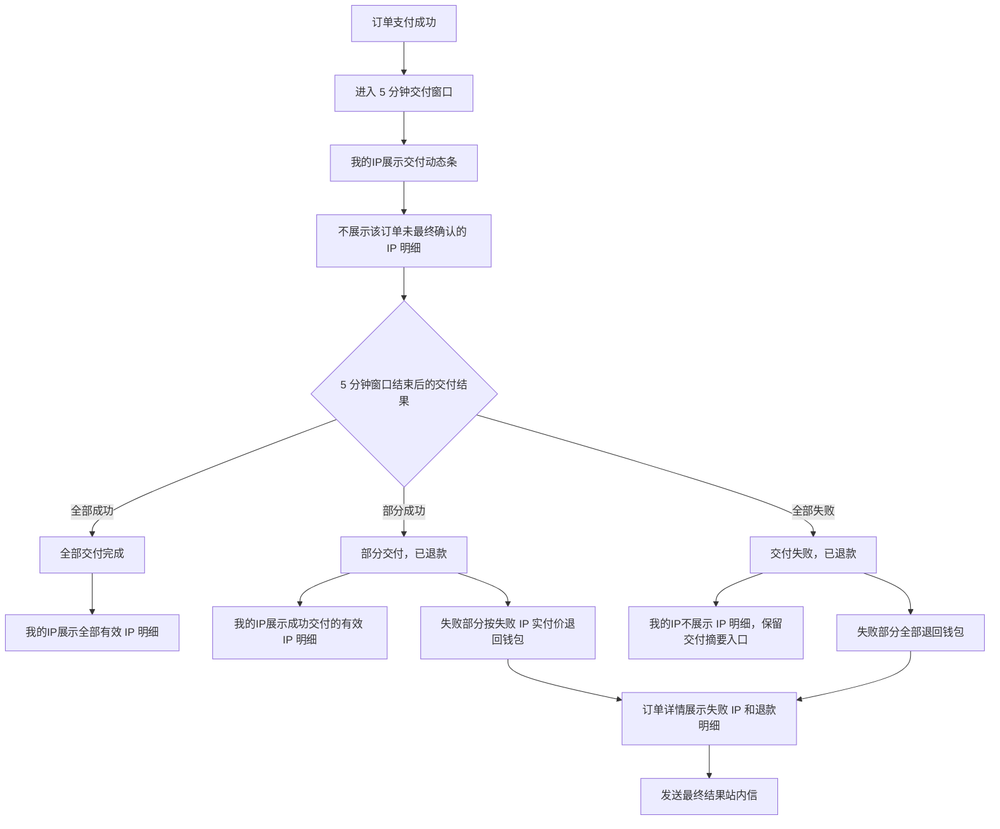
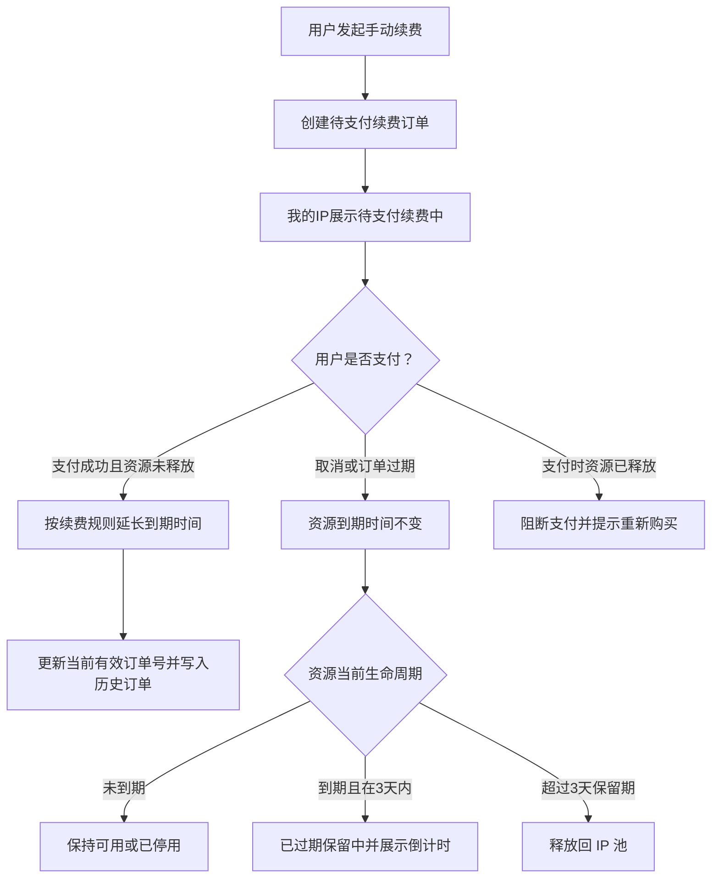
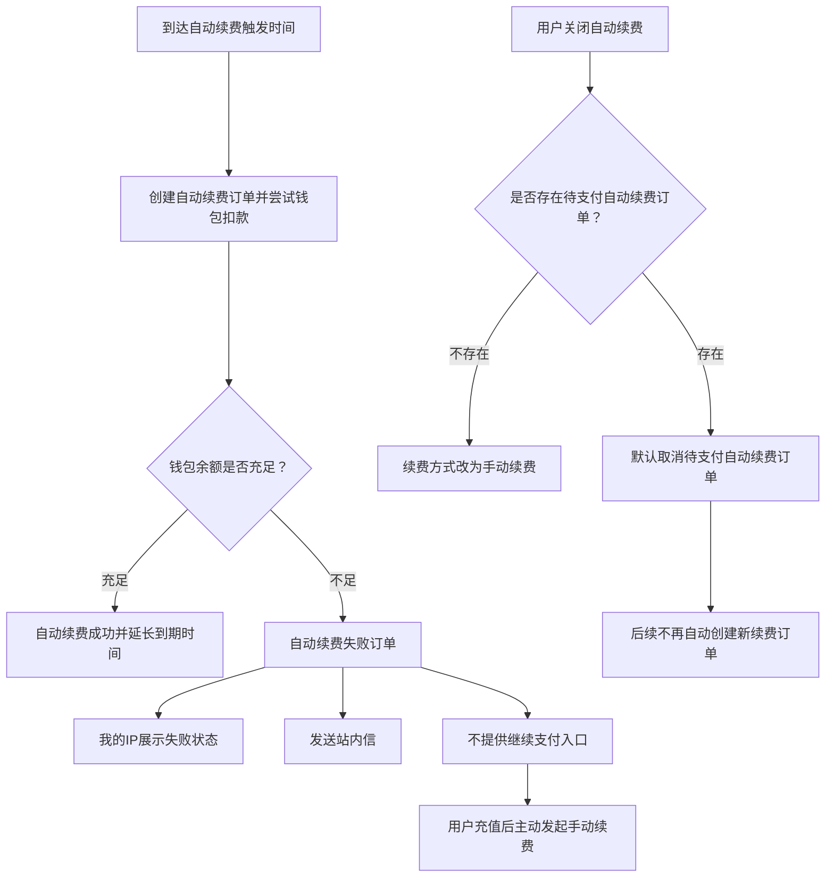

# 我的IP(资源管理/账号/续费)

> Triage Label: `ready-for-agent`  
> Scope: 静态代理支付成功后的资源管理模块，覆盖 `我的IP` 列表、支付后交付状态、交付失败自动退钱包、停用/启用、导出账号、修改密码、手动续费、自动续费。  
> Related Requirement Nodes: `静态代理-我的IP`、`静态代理-我的IP-停用/启用`、`静态代理-我的IP-导出账号`、`静态代理-我的IP-修改密码`、`静态代理-我的IP-续费`

## Problem Statement

当前静态代理购买和订单闭环已经明确：

1. 用户在购买配置页完成静态代理规格。
2. 点击 `Continue` 后创建待支付订单。
3. Checkout 只处理支付。
4. 订单模块负责待支付、已支付、已取消、已过期等交易状态。

但支付成功后的资源管理还没有被定义。用户完成支付后，需要知道：

- 已购买的静态代理 IP 在哪里查看。
- 如何查看或导出代理账号。
- 如何临时停用资源以阻断访问。
- 如何重新启用已停用资源。
- 如何修改代理账号密码。
- 支付后资源交付中时在哪里查看进度。
- 交付失败时如何知道哪些 IP 未交付，以及退款退到哪里。
- 如何在到期前续费，避免 IP 被释放。
- 如何开启自动续费，降低忘记续费导致业务中断的风险。

如果 `我的IP` 模块不清晰，会带来几个问题：

- 订单详情会被迫承载资源管理职责，导致交易状态和资源状态混在一起。
- 用户无法快速获取账号，支付完成后的交付感弱。
- 支付成功但资源未立即交付时，如果没有明确状态，会让用户误以为订单或资源丢失。
- 交付失败如果需要用户主动申请补偿或退款，会增加等待成本和客服压力。
- 资源停用、密码修改、续费等高风险操作缺少状态边界，容易造成业务中断或客服争议。
- 自动续费如果没有独立规则，容易出现重复扣费、续费失败无感知、已停用资源是否继续续费不明确等问题。

## Solution

本期将 `我的IP` 定义为静态代理资源的统一管理模块：

1. 订单模块只管理交易，`我的IP` 管理已交付资源。
2. 订单支付成功后，系统根据订单规格快照生成一条或多条用户静态 IP 记录。
3. 支付成功后进入最长 5 分钟交付窗口；交付中订单在 `我的IP` 中以低干扰交付动态条展示。
4. 交付中时，`我的IP` 不展示该订单未最终确认的 IP 明细行。
5. 交付窗口结束后，`我的IP` 明细列表只展示成功交付的有效 IP。
6. 交付失败不补交、不替换；失败部分按失败 IP 的实付价格自动退回钱包。
7. `我的IP` 默认以用户静态 IP 记录为主列表；同一订单交付的 IP 通过订单号筛选定位，不单独设置订单批次页签或独立列表。
8. 用户可对单条 IP、勾选的多条 IP 或当前筛选结果执行批量操作。
9. 停用/启用只改变用户静态 IP 的可连接状态，不暂停租期，不释放库存。
10. 导出账号用于交付凭证下载，固定导出 TXT 文本，并支持选择代理行格式。
11. 修改密码只改变代理认证密码，不改变 IP、端口、用户名、订单和租期。
12. 续费方式是用户静态 IP 的配置项，默认值为 `手动续费`。
13. 手动续费复用订单/Checkout 闭环，生成续费订单，支付成功后延长选中用户静态 IP 的到期时间。
14. 自动续费以用户静态 IP 为最小设置对象，用户需要设置 `到期前 A 天`，系统按该配置自动创建并尝试支付续费订单。
15. 手动续费模式下，用户如果没有在到期前完成续费支付，该条 IP 到期后进入 3 天保留期，保留期内不可用但仍为用户保留。
16. 保留期内用户可充值并手动续费恢复该 IP；超过 3 天仍未续费，则该 IP 释放回 IP 池。

## Module Boundary

### 订单模块负责

- 待支付订单创建、取消、过期、支付。
- 已支付订单留痕。
- 订单规格快照和金额快照。
- 交易状态展示。
- 订单详情中的交付结果、失败 IP 和退款明细展示。

### 我的IP模块负责

- 支付成功后的静态代理资源展示。
- 支付后 5 分钟交付窗口内的交付动态提示。
- 交付失败后的退款摘要展示。
- IP 账号交付信息展示和导出。
- 资源可连接状态管理。
- 代理密码管理。
- 续费方式配置、手动续费入口和自动续费触发提示。
- 资源到期、续费失败、续费方式提示。

### 不在本模块承载

- 未支付订单的支付动作。
- 原购买订单取消。
- 用户主动退款申请、原路退款、财务对账和收据处理。
- 发票、收据、财务对账。
- 支付网关实现。
- 后台库存调度算法。

## Core Concepts

### 用户静态 IP

支付成功后交付给用户的一条静态代理 IP 记录，是 `我的IP` 列表的最小管理对象。

用户侧需要展示和管理的信息包括：

- 出口 IP / Host。
- 代理端口。
- 代理认证账号。
- 代理认证密码。
- 当前有效订单号。
- 带宽。
- 售卖模式：独享 / 共享。
- UDP。
- 到期时间。
- 续费方式：手动续费 / 自动续费。
- 自动续费提前天数。
- 国家 / 州省 / 城市。
- 使用状态。

说明：用户静态 IP 对客支持通用协议，`我的IP` 不展示 HTTP、SOCKS 等协议字段，也不以协议作为筛选、聚合或续费维度。

### 订单批次

同一订单交付的一组用户静态 IP。订单批次不是新的库存对象，也不是 `我的IP` 的独立页面或页签；它只作为按当前有效订单号筛选和理解资源来源的业务口径。

订单号筛选摘要建议包括：

- 当前有效订单号。
- 产品名称：`Static Proxy`。
- 购买 IP 数量。
- 已交付 IP 数量。
- 交付中 IP 数量。
- 交付失败 IP 数量。
- 交付状态。
- 退款总金额。
- 国家/地区摘要。
- UDP 摘要。
- 最早到期时间。
- 最晚到期时间。
- 可用、停用、过期等状态数量。

### 交付状态

交付状态是支付成功后资源交付进度的用户侧状态，不改变订单交易状态。

交付状态包括：

- `交付中`：订单已支付，资源仍在 5 分钟交付窗口内。
- `全部交付完成`：订单购买数量全部生成有效用户静态 IP。
- `部分交付，已退款`：部分 IP 成功交付，失败部分已自动退回钱包。
- `交付失败，已退款`：整单没有任何 IP 成功交付，失败部分已全部退回钱包。

### 交付动态条

交付动态条是 `我的IP` 页面中用于提示近期交付进度和退款结果的低干扰区域。它不是订单列表，也不是 IP 明细列表。

交付动态条规则：

- 只在存在需要用户关注的交付订单时展示。
- 默认收起，只占一行，避免抢占 IP 明细列表视觉。
- 展开后以紧凑小表格展示订单级交付摘要。
- 不展示全部交付成功的历史订单。
- 不展示待支付、已取消、已过期订单。

### 交付失败自动退款

交付失败自动退款指支付成功后，5 分钟交付窗口结束仍未成功交付的 IP，按该失败 IP 的实付价格自动退回用户钱包。

退款口径：

- 用户不需要主动申请。
- 失败 IP 不补交、不替换。
- 退款去向固定为钱包。
- 订单详情展示失败 IP 和每个失败 IP 的退款金额。
- `我的IP` 只展示退款摘要和订单详情入口。

### IP 账号

用户连接某条用户静态 IP 时使用的代理认证账号与密码组合。

IP 账号字段建议包括：

- IP 或 Host。
- Port。
- Username。
- Password。
- 国家、城市、ISP。
- IP 质量。
- UDP 支持。
- 状态：跟随所属用户静态 IP 状态。
- 当前有效订单号。
- 到期时间。
- 最近密码修改时间。

## User Stories

1. 作为购买用户，我希望支付成功后能在 `我的IP` 看到已交付资源，这样我可以立即开始配置业务。
2. 作为购买用户，我希望按订单号、国家、状态、到期时间筛选资源，这样我能快速找到目标 IP。
3. 作为批量采购用户，我希望能按订单号快速筛选并批量处理该订单下的 IP，这样我不需要在几百条账号中逐条定位。
4. 作为技术用户，我希望在列表中看到 Host、端口、用户名和密码，这样我能直接接入系统。
5. 作为技术用户，我希望导出账号，这样我可以批量导入到自己的代理客户端或脚本。
6. 作为技术用户，我希望可以查看代理密码，这样我能完成客户端配置和排障。
7. 作为安全敏感用户，我希望能修改密码，这样账号疑似泄露时可以快速处置。
8. 作为运营用户，我希望能停用某些 IP，这样遇到异常流量或业务暂停时可以阻断连接。
9. 作为运营用户，我希望停用后仍能重新启用，这样业务恢复时不需要重新购买。
10. 作为采购用户，我希望看到资源到期倒计时，这样我能提前续费。
11. 作为采购用户，我希望可以手动续费选中的 IP，这样关键业务不会因到期中断。
12. 作为采购用户，我希望续费前看到续费金额和续费周期，这样我能确认预算。
13. 作为采购用户，我希望手动续费创建独立续费订单，这样财务对账仍然有订单号。
14. 作为长期用户，我希望开启自动续费，这样不用人工记住每条 IP 的到期时间。
15. 作为长期用户，我希望自动续费失败时收到明确提示，这样我可以及时手动处理。
16. 作为购买用户，我希望查看某条 IP 的历史订单，这样我能自助追踪它从首次购买到历次续费的权益变化。
17. 作为购买用户，我希望订单状态和资源状态分离展示，这样我能清楚区分交易进度和 IP 可用性。
18. 作为购买用户，我希望通过 IP、账号或订单号定位具体 IP 账号，这样我能快速找到要配置或处理的资源。
19. 作为购买用户，我希望停用 IP 时不会释放库存或暂停租期，这样我能临时阻断连接但保留已购买权益。
20. 作为安全敏感用户，我希望导出账号、修改密码、停用/启用都有操作记录，这样我能确认敏感操作是否由自己发起。
21. 作为购买用户，我希望看到清晰的资源生命周期提示，这样我能理解交付、停用、续费、过期保留和释放的状态变化。
22. 作为购买用户，我希望支付成功后看到资源交付进度，这样我知道是否需要等待。
23. 作为购买用户，我希望交付中订单不会在 `我的IP` 里生成虚假的 IP 明细，这样我不会误拿未完成资源去配置业务。
24. 作为购买用户，我希望交付失败后系统自动退款到钱包，这样我不需要提交工单申请补偿。
25. 作为购买用户，我希望在订单详情看到失败 IP 和退款金额，这样我能核对退款是否正确。
26. 作为购买用户，我希望 `我的IP` 只展示交付摘要和有效 IP 明细，这样资源管理页面不会被订单信息占据。
27. 作为购买用户，我希望能查看单条 IP 的详情，这样我能同时确认购买时规格、当前状态和历史追踪信息。
28. 作为技术用户，我希望按指定代理格式导出 TXT 文本，这样我可以直接导入代理工具。
29. 作为批量采购用户，我希望在 `我的IP` 中按 IP、端口、账号或订单号进行模糊搜索，这样我只记得部分信息时也能快速定位资源。
30. 作为批量采购用户，我希望按状态、地区、带宽、到期时间和续费方式组合筛选 IP，这样我能快速缩小批量操作范围。
31. 作为批量采购用户，我希望筛选后看到当前结果数量和已选数量，这样我能确认批量操作会影响多少条 IP。
32. 作为批量采购用户，我希望筛选后可以选择当前结果并执行导出、改密、停用、启用、续费和续费方式设置，这样我能高效管理同一类资源。

## Information Architecture

### 入口

建议在用户端主导航中增加 `My IPs / 我的IP`，位于 `Orders / 订单` 附近。

订单详情中的已支付订单可提供入口：

- `查看我的IP`：跳转到 `我的IP`，并按来源订单号过滤。
- `历史订单 / 资源追踪`：用于追踪已释放 IP 的购买订单和续费订单历史。

### 列表页结构

顶部区域：

- 页面标题：`我的IP`。
- 状态概览：全部、可用、已停用、即将到期、已过期（保留中）。
- 主操作：导出账号、修改密码、停用、启用、续费。
- 交付动态条：仅当存在交付中、部分交付已退款或交付失败已退款订单时展示，默认收起。

筛选区：

- 搜索：支持按 IP、Host、代理端口、Username、订单号进行模糊搜索。
- 状态筛选：全部未释放、可用、已停用、即将到期、已过期保留、续费失败、待支付续费中、已释放。
- 国家/地区筛选：默认按国家筛选；如数据量足够，可扩展城市二级筛选。
- 带宽筛选：全部、30M、50M、100M、200M。
- 到期时间筛选：7 天内到期、15 天内到期、30 天内到期、保留期内。
- 续费方式筛选：手动续费、自动续费、自动续费失败。
- 已释放 IP 不进入默认列表；如需要追踪，可通过订单详情中的历史订单入口，或 `我的IP` 状态筛选中的 `已释放` 查看。
- 筛选区建议采用两行布局：第一行放搜索、状态、地区、带宽；第二行放到期时间、续费方式、清空筛选和已应用筛选标签。
- 筛选结果区展示 `当前筛选结果 N 条，已选 M 条`。
- 已应用筛选以标签展示，例如 `状态：可用`、`地区：US`、`带宽：100M`；支持单独移除和清空全部。

用户静态 IP 列表字段：

- 出口 IP / Host / 端口。
- 地区：国家 / 州省 / 城市。
- 带宽。
- 代理认证账号。
- 代理认证密码。
- 当前有效订单号。
- 售卖模式。
- UDP。
- 使用状态。
- 到期时间 / 续费方式 / 自动续费提前天数。
- 操作：详情、续费、更多。

列表操作规则：

- 每条用户静态 IP 提供 `详情` 入口，打开右侧抽屉查看该 IP 信息。
- 列表不提供 `复制` 操作。
- 列表不单独提供 `历史订单` 操作；历史订单收敛到 `详情` 抽屉。
- `更多` 承载修改密码、停用/启用、续费方式设置等低频或状态相关操作。

### 筛选功能

筛选目标是帮助用户在大量已交付静态 IP 中快速定位资源，并在筛选结果上执行批量操作。MVP 采用基础筛选增强，不做独立扩展筛选面板，也不做保存筛选视图。

搜索框规则：

- 搜索支持模糊搜索。
- 搜索字段包括：出口 IP / Host、代理端口、代理认证账号、当前有效订单号。
- 搜索采用包含匹配，不要求用户输入完整字段。
- 示例：输入 `44.100` 可匹配 `44.100.28.64`。
- 示例：输入 `8000` 可匹配 `proxy_port 8000`。
- 示例：输入 `440028` 可匹配 `u_static_440028`。
- 示例：输入 `0602` 或 `SP-20260602` 可匹配对应当前有效订单号。
- 城市、ISP、带宽不进入搜索框模糊搜索范围，避免搜索语义过宽；这些字段通过独立筛选项定位。

组合筛选规则：

- 搜索、状态、地区、带宽、到期时间和续费方式之间是 `AND` 关系。
- 用户修改任一筛选条件后，列表、当前筛选结果数量、全选当前结果范围和已应用筛选标签同步更新。
- 默认列表展示全部未释放资源。
- 用户选择 `已释放` 状态时，列表只展示已释放资源；已释放资源只用于追踪，不可导出、不可启用、不可续费。
- 如果当前筛选结果为空，展示空态文案和可用操作：`清空筛选`、必要时展示 `查看订单详情`。

筛选后批量操作规则：

- 批量操作默认作用于已勾选 IP。
- 用户可通过 `选择当前结果` 将当前筛选结果纳入批量操作范围。
- 筛选后导出账号仍只导出 `可用` 和 `已停用` 账号；不可导出的账号跳过并展示数量。
- 筛选后修改密码只处理可用和已停用账号。
- 筛选后停用只处理可用 IP。
- 筛选后启用只处理已停用 IP。
- 筛选后手动续费仍要求选中 IP 属于同一当前有效订单号；跨当前有效订单号时阻断创建续费订单并提示用户拆分。
- 筛选后续费方式设置支持跨当前有效订单号批量设置，但只处理未过期且未释放 IP。

交付动态条收起态建议展示：

- 需要关注的交付订单数。
- 总交付中 IP 数量。
- 总交付失败 IP 数量。
- 总退款金额。
- 最近一条交付订单摘要。
- 展开入口。

交付动态条展开态建议展示：

- 订单号。
- 交付状态。
- 购买 IP 数量。
- 已交付 IP 数量。
- 交付中 IP 数量。
- 失败 IP 数量。
- 退款总金额。
- 操作：查看订单详情。

交付动态条排序规则：

- `交付中` 优先。
- `部分交付，已退款` 其次。
- `交付失败，已退款` 其次。
- 同状态内按更新时间倒序。

交付动态条保留规则：

- `交付中`：只要未到最终状态就展示。
- `部分交付，已退款` / `交付失败，已退款`：展示 7 天，或用户手动关闭后不再展示。
- `全部交付完成`：不进入交付动态条，直接在 IP 明细列表体现。

### 我的IP低保真线框

低保真线框用于明确页面信息优先级和交付批次摘要的占位方式，不作为最终视觉样式。

线框原则：

- `我的IP` 页面主体始终是该用户所有已交付静态 IP 明细列表。
- 交付动态条只承载近期交付中和已退款订单的摘要，不替代订单列表。
- 多个购买订单同时交付中或已退款时，收起态合并成一条动态条，展开态按订单行展示。
- `交付中` 订单不在 IP 明细列表生成 IP 行。
- `全部交付完成` 后，动态条不再展示该订单，成功交付的 IP 进入明细列表。
- `部分交付，已退款` 时，明细列表只展示成功交付的 IP，失败数量和退款总金额留在动态条摘要。
- `交付失败，已退款` 时，明细列表不展示该订单 IP，动态条保留失败摘要和订单详情入口。
- 失败 IP 明细和单 IP 退款金额进入 `我的订单 -> 订单详情`，`我的IP` 只展示摘要。

#### 默认收起态

```text
静态代理 / 我的IP

[全部 128] [可用 112] [已停用 8] [即将到期 6] [已过期 2]

[模糊搜索 IP / 端口 / 账号 / 订单号____________] [状态 v] [地区 v] [带宽 v]
[到期时间 v] [续费方式 v] [清空筛选]

筛选标签： [状态：可用 x] [地区：US x] [带宽：100M x]
当前筛选结果 28 条，已选 6 条      [导出账号] [修改密码] [停用] [启用] [续费]

┌──────────────────────────────────────────────────────────────────────────────┐
│ 交付动态  3 个订单需关注     交付中 10 条 · 失败 8 条 · 已退 $9.22           │
│ 最近：SP-0001 · 10 条 IP · 交付中，预计 5 分钟内完成                 [展开] │
└──────────────────────────────────────────────────────────────────────────────┘

IP 明细列表
┌────┬────────────────┬────────────┬────────┬────────────┬────────┬────────────────┬──────────────────┐
│ 选 │ IP / 端口      │ 地区       │ 带宽   │ 账号/密码  │ 状态   │ 到期 / 续费    │ 操作             │
├────┼────────────────┼────────────┼────────┼────────────┼────────┼────────────────┼──────────────────┤
│ □  │ 44.100.28.64   │ US / CA    │ 100M   │ user_xxx   │ 可用   │ 2026-07-03     │ 详情 / 续费 / 更多 │
│    │ proxy_port 8000│ Ashburn    │        │ pass_xxx   │        │ 自动 · 3天前   │                  │
│ □  │ 61.199.55.127  │ JP / Tokyo │ 100M   │ user_yyy   │ 已停用 │ 2026-07-03     │ 详情 / 启用 / 更多 │
│    │ proxy_port 8000│ Tokyo      │        │ pass_yyy   │        │ 手动续费       │                  │
└────┴────────────────┴────────────┴────────┴────────────┴────────┴────────────────┴──────────────────┘
```

筛选区展示规则：

- 桌面端采用两行筛选：第一行用于资源定位，第二行用于生命周期和续费定位。
- 移动端优先展示搜索框，其他筛选条件折叠到 `筛选条件` 入口中，已应用筛选标签仍在列表上方展示。
- 批量操作按钮靠近 `当前筛选结果 / 已选数量`，使用户明确操作范围。
- `选择当前结果` 用于把当前筛选结果快速纳入批量操作。

收起态展示规则：

- 只占用 IP 明细列表上方一条低高度区域。
- 文案优先展示需要用户关注的总量：关注订单数、交付中数量、失败数量、退款总金额。
- 最近订单摘要用于解释为什么出现动态条。
- 用户点击 `展开` 后查看多订单摘要；不在收起态堆叠多张订单卡片。

#### 展开态

```text
┌──────────────────────────────────────────────────────────────────────────────┐
│ 交付动态                                                               [收起] │
├──────────────┬────────────────┬──────┬────────┬────────┬──────┬────────────┬──────────────┤
│ 订单号       │ 交付状态       │ 购买 │ 已交付 │ 交付中 │ 失败 │ 退款总金额 │ 操作         │
├──────────────┼────────────────┼──────┼────────┼────────┼──────┼────────────┼──────────────┤
│ SP-0001      │ 交付中         │ 10   │ 0      │ 10     │ 0    │ -          │ 查看订单详情 │
│ SP-0002      │ 部分交付已退款 │ 20   │ 17     │ 0      │ 3    │ $3.42      │ 查看订单详情 │
│ SP-0003      │ 交付失败已退款 │ 5    │ 0      │ 0      │ 5    │ $5.80      │ 查看订单详情 │
└──────────────┴────────────────┴──────┴────────┴────────┴──────┴────────────┴──────────────┘
```

展开态展示规则：

- 仍然是紧凑表格，不使用大卡片，避免压过 IP 明细列表。
- 每行代表一个购买订单的交付批次摘要。
- `查看订单详情` 用于查看失败 IP、单 IP 退款金额、退款时间和钱包入账记录。
- 展开态不提供导出、改密、停用、启用、续费等 IP 级操作；这些操作仍在 IP 明细列表或按订单号筛选后的当前结果中执行。

#### 交付结果态

```text
场景 A：订单 SP-0001，购买 10 条 IP，仍在交付中

交付动态条：展示 SP-0001 · 10 条 IP · 交付中
IP 明细列表：不展示 SP-0001 的 10 条 IP

场景 B：订单 SP-0001，10 条全部交付成功

交付动态条：不再展示 SP-0001
IP 明细列表：展示 SP-0001 成功交付的 10 条 IP

场景 C：订单 SP-0002，购买 20 条，成功 17 条，失败 3 条，已退款 $3.42

交付动态条：展示 SP-0002 · 部分交付已退款 · 失败 3 条 · 已退 $3.42
IP 明细列表：只展示 SP-0002 成功交付的 17 条 IP

场景 D：订单 SP-0003，购买 5 条，全部交付失败，已退款 $5.80

交付动态条：展示 SP-0003 · 交付失败已退款 · 失败 5 条 · 已退 $5.80
IP 明细列表：不展示 SP-0003 的 IP；如按该订单号筛选，展示空态和订单详情入口
```

按订单号筛选的空态建议：

```text
未找到该订单可用 IP

订单 SP-0003 已交付失败，5 条 IP 均未成功交付，退款 $5.80 已退回钱包。

[查看订单详情]
```

### 详情抽屉

MVP 不做独立详情页，优先使用右侧抽屉。每条用户静态 IP 的 `详情` 入口打开该抽屉。

购买时信息：

- 来源订单号。
- 产品名称。
- 购买地区：国家 / 州省 / 城市。
- 出口 IP / Host。
- `proxy_port`。
- 带宽。
- 售卖模式。
- UDP。
- 购买周期。
- 交付时间。
- 购买时规格快照。

当前状态信息：

- 当前有效订单号。
- 当前代理认证账号。
- 当前代理认证密码。
- 启用状态。
- 当前到期时间。
- 续费方式。
- 自动续费提前天数。
- 保留期状态。
- 当前是否可续费、可启用、可修改密码。

追踪信息：

- 历史订单列表。
- 操作记录摘要。

详情抽屉边界：

- 详情抽屉只做查看和跳转，不承载批量操作。
- 详情抽屉不提供复制按钮。
- 历史订单在详情抽屉中展示，不作为列表行独立操作。

### 历史订单

每条用户静态 IP 的 `详情` 抽屉展示历史订单，用于查看该 IP 曾经关联过的购买订单和续费订单。

历史订单列表建议展示：

- 订单号。
- 订单类型：首次购买 / 手动续费 / 自动续费。
- 订单状态。
- 支付金额。
- 支付时间。
- 本次权益开始时间。
- 本次权益结束时间。
- 操作：查看订单详情。

## Resource State Model

```text
Paid Order
  -> N User Static IP Records Created
  -> Available
  -> Disabled
  -> Available
  -> Expired Retained
  -> Released

Available
  -> Manual Renewal Pending
  -> Renewal Paid
  -> Available with Extended Expiry

Manual Renewal Pending
  -> Renewal Pending Cancelled or Expired
  -> Original Resource Lifecycle

Available
  -> Auto Renewal Enabled
  -> Auto Renewal Attempting
  -> Auto Renewal Paid
  -> Available with Extended Expiry

Auto Renewal Attempting
  -> Auto Renewal Failed
  -> Available until Expiry
  -> Expired Retained if not manually renewed
  -> Released after Retention Period
```

## P1 关键流程图

### 支付后交付结果



### 手动续费待支付与释放



### 自动续费失败与关闭自动续费



### 用户静态 IP 状态

- `可用`：未过期且使用状态为允许。
- `已停用`：用户主动禁用连接，租期继续倒计时。
- `已过期（保留中）`：到期后不可继续连接，但 3 天内仍为原用户保留，可充值后手动续费；页面需要展示保留期剩余时间。
- `已释放`：超过 3 天保留期仍未续费，IP 回到 IP 池，不再为原用户保留，默认不在 `我的IP` 列表展示。

`我的IP` 只按用户可理解的使用状态展示和筛选，不向用户暴露内部资源状态。

### IP 账号状态

- IP 账号跟随所属用户静态 IP 的可连接状态。
- 修改密码只影响认证凭证，不产生独立账号生命周期。

## Feature Rules

### 0. 支付后交付结果

交付窗口：

- 订单支付成功后进入最长 5 分钟交付窗口。
- 交付窗口可以关闭；关闭窗口不影响后台交付。
- 交付窗口内，订单交易状态保持 `已支付`。
- 交付窗口内，用户侧交付状态展示为 `交付中`。
- 交付窗口内，`我的IP` 不展示该订单未最终确认的 IP 明细行。
- 交付窗口内，`我的IP` 可通过交付动态条展示该订单的交付摘要。

全部交付完成：

- 5 分钟窗口结束前或结束时，订单购买数量对应的用户静态 IP 全部生成。
- `我的IP` 明细列表展示全部成功交付的有效 IP。
- 交付动态条不再展示该订单。
- 系统在 5 分钟窗口结束后发送一条最终结果站内信。

部分交付，已退款：

- 5 分钟窗口结束后，至少 1 条 IP 成功交付，且至少 1 条 IP 未成功交付。
- `我的IP` 明细列表只展示成功交付的有效 IP。
- 未成功交付资源不生成虚假的 IP 明细行。
- 失败部分不补交、不替换。
- 失败部分按失败 IP 的实付价格自动退回钱包。
- `我的IP` 交付动态条展示购买数量、已交付数量、失败数量和退款总金额。
- 订单详情展示具体失败 IP、每个失败 IP 的退款金额、退款时间、退款去向和退款总金额。
- 系统在 5 分钟窗口结束后发送一条最终结果站内信。

交付失败，已退款：

- 5 分钟窗口结束后，订单没有任何 IP 成功交付。
- `我的IP` 不展示该订单的 IP 明细行。
- `我的IP` 保留该订单的交付摘要入口，展示 `交付失败，已退款`、购买数量、失败数量和退款总金额。
- 失败部分不补交、不替换。
- 失败部分按失败 IP 的实付价格自动退回钱包。
- 订单详情展示具体失败 IP、每个失败 IP 的退款金额、退款时间、退款去向和退款总金额。
- 系统在 5 分钟窗口结束后发送一条最终结果站内信。

交付失败退款计算：

- 每条 IP 需要能定位到该 IP 的价格快照和实付价格。
- 随机 IP、指定 IP 段、指定 IP 均按失败的具体 IP 实付价格计算退款。
- 如果订单存在整单折扣，先将折扣分摊到 IP 维度，再按失败 IP 的实付价格退款。
- 退款总金额 = 所有失败 IP 实付退款金额之和。
- 退款去向固定为用户钱包。

交付动态条数据展示：

- 只展示需要用户关注的交付订单：`交付中`、最近 7 天内的 `部分交付，已退款`、最近 7 天内的 `交付失败，已退款`。
- 多个订单汇总为一条收起态动态，不堆叠多个大卡片。
- 收起态展示需要关注订单数、总交付中数量、总失败数量、总退款金额和最近一条订单摘要。
- 展开态以紧凑小表格展示订单号、交付状态、购买数量、已交付数量、交付中数量、失败数量、退款总金额和查看订单详情入口。
- 全部交付成功订单不进入交付动态条。
- 用户手动关闭已退款交付摘要后，该订单不再出现在交付动态条。

已交付 IP 操作：

- 已交付 IP 可正常导出、停用、启用、修改密码和续费。
- 交付中和交付失败的数量只作为订单级提示，不参与 IP 明细批量操作。

### 1. 停用 / 启用

停用定义：

- 停用是用户主动关闭某条用户静态 IP 的连接权限。
- 停用后页面展示为 `已停用`。
- 停用不释放 IP 库存。
- 停用不暂停租期。
- 停用不退款。
- 停用不改变订单状态。
- 停用不改变续费方式，但操作时需要提示用户当前续费方式。

允许停用：

- 未过期且当前为 `可用` 的用户静态 IP。
- 当前筛选结果中未过期且当前为 `可用` 的用户静态 IP。
- 按订单号筛选后的当前结果中未过期且当前为 `可用` 的用户静态 IP。

不允许停用：

- 已过期 IP。
- 已停用 IP。

启用定义：

- 启用是恢复已停用账号的连接权限。
- 启用后页面展示为 `可用`。
- 启用不改变到期时间。
- 启用不重新生成账号，除非用户同时修改密码。

允许启用：

- 未过期的已停用用户静态 IP。

不允许启用：

- 已过期（保留中）IP。此时提示用户手动续费恢复。
- 已释放 IP。此时提示用户重新购买。
- 已启用 IP。

批量规则：

- 批量操作需要跳过不符合条件的条目，并在结果中展示成功数、失败数和失败原因。
- 批量操作部分失败时，页面需要展示失败明细列表，至少包含失败 IP 和失败原因。
- MVP 不提供批量失败明细下载。
- 用户按订单号筛选后执行停用时，默认只作用于当前筛选结果内全部可停用 IP。
- 用户按订单号筛选后执行启用时，默认只作用于当前筛选结果内全部可启用 IP。

### 2. 导出账号

导出范围：

- 当前筛选结果。
- 用户勾选的用户静态 IP。
- 按订单号筛选后的当前结果。

导出格式：

- 固定导出 TXT 文本。
- 界面不展示文件格式选择。
- 文件内容为多行代理串，一行一条。
- 文件内容不提供表头。

代理格式：

- 用户通过 `代理格式` 下拉框选择代理串格式。
- 支持 `IP:PORT:USERNAME:PASSWORD`。
- 支持 `username:password@host:port`。

```text
44.100.28.64:8000:u_static_440028:Kp9#s2Lm
u_static_440028:Kp9#s2Lm@44.100.28.64:8000
```

说明：以上为两种格式示例，实际导出时同一文件只使用用户选择的一种格式。

导出限制：

- 默认只导出 `可用` 和 `已停用` 账号。
- 已过期和已释放账号不导出。
- 如当前导出范围包含不可导出的账号，确认弹窗展示跳过数量。
- 导出前需要展示确认弹窗，提示导出范围、账号数量和敏感信息风险。
- 确认弹窗只展示代理格式选择，不展示文件格式选择。
- 用户必须输入当前登录密码并校验通过后，才允许导出。
- 登录密码只用于导出校验，不写入导出文件，也不记录明文到审计日志。
- 导出操作需要记录审计日志，至少记录导出范围、导出数量、代理格式、操作者和操作时间。

### 3. 修改密码

修改对象：

- 单条用户静态 IP。
- 多条用户静态 IP。
- 支持跨订单号批量修改；订单号筛选只是快捷定位入口。

密码规则：

- 长度建议 8-32 位。
- 支持字母、数字和常见符号。
- 不允许空密码。
- 不允许与当前密码相同。

修改模式：

- `统一新密码`：用户输入一个新密码，所有选中账号使用同一个新密码。
- `随机生成`：系统为每条选中 IP 生成不同的新密码，修改结果支持导出。

生效规则：

- 修改成功后，新连接必须使用新密码。
- 旧密码立即失效。
- MVP 不强制断开已建立连接。
- 页面需要提示用户重新配置客户端；后续新建连接必须使用新密码。
- 修改密码不改变 Username、IP、Port、到期时间和订单。

限制：

- 可用和已停用账号可以修改密码。
- 已过期保留中的账号不可修改密码。
- 已释放账号不可修改密码。

### 4. 续费方式

续费方式定义：

- 续费方式是用户静态 IP 的配置项。
- 默认续费方式为 `手动续费`。
- 用户可将一条或多条未过期 IP 的续费方式设置为 `手动续费` 或 `自动续费`。
- 自动续费必须配置 `到期前 A 天`，默认 `3 天`。
- `到期前 A 天` 可选值为 `1 天 / 3 天 / 7 天 / 15 天`。
- 购买周期小于等于 `7 天` 的 IP，只允许选择 `1 天 / 3 天`。
- 续费方式设置是配置操作，不会立即创建续费订单。
- 续费方式设置弹窗保持极简流程：只展示 `手动续费` 与 `自动续费` 两个选项；选择自动续费时展示 `到期前 A 天续费`。
- 续费方式设置支持批量选择多条 `我的IP`。
- 批量设置自动续费时，`到期前 A 天` 使用所有选中 IP 可选值的交集。
- 批量设置自动续费时，允许选中到期时间不同的 IP；每条 IP 按各自到期时间和统一的自动续费提前天数独立触发自动续费。
- 批量设置自动续费时，续费周期默认各自沿用原购买周期；用户只统一设置续费方式和自动续费提前天数。
- 批量设置成功后，每条选中 IP 保存相同的续费方式和相同的自动续费提前天数。
- 订单号筛选只能作为快捷定位 IP 的口径；续费方式配置保存到每条选中 IP，不保存到订单批次。
- 已过期 IP 不允许开启自动续费。

#### 手动续费

手动续费定义：

- 手动续费是默认续费方式。
- 手动续费不会自动创建续费订单。
- 用户需要在到期前主动发起续费并完成支付。
- 如果用户没有在到期前成功续费，该条 IP 到期后进入 `已过期（保留中）`。
- 保留期为 3 天，期间 IP 不可用但仍为用户保留。
- 保留期内，`我的IP` 需要展示保留期倒计时，例如 `保留剩余 2 天 13 小时`。
- 保留期内，`我的IP` 固定提供充值入口和手动续费入口。
- 保留期内用户可充值后手动续费恢复该 IP。
- 超过 3 天仍未续费，该 IP 释放回 IP 池。

续费对象：

- 用户静态 IP 是续费的最小对象。
- 手动发起续费订单支持单条 IP。
- 手动发起续费订单支持同一当前有效订单号下多条 IP 批量续费。
- 手动发起续费订单不支持跨当前有效订单号批量续费。
- 用户可按订单号筛选后，对当前结果中的可续费 IP 发起续费。

续费入口：

- 用户静态 IP 列表行操作。
- 批量操作栏。
- 按订单号筛选后的批量操作栏。
- 即将到期提示条。
- 已支付订单详情中的 `查看我的IP` 后再续费。

续费周期：

- 沿用购买时长周期：7 天 / 15 天 / 30 天 / 60 天 / 90 天 / 1 年。
- 默认推荐沿用原购买周期。
- 续费暂不支持优惠券。

手动续费流程：

1. 用户选择一条或多条用户静态 IP 并点击 `续费`。
2. 系统打开续费面板，展示选中 IP 数量、当前有效订单号、到期时间范围和可选续费周期。
3. 用户选择续费周期。
4. 系统生成续费 Quote。
5. 用户确认后创建新的手动续费待支付订单；若入口来自自动续费失败订单，也不复用失败订单继续支付。
6. 用户进入 Checkout 支付该手动续费订单。
7. 待支付期间，`我的IP` 对被覆盖的 IP 展示 `待支付续费中`。
8. 支付成功后，选中用户静态 IP 的到期时间延长。
9. 用户回到 `我的IP` 看到新的到期时间。

续费订单规则：

- 续费订单需要独立订单号。
- 续费订单类型为 `Renewal`。
- 续费订单不支持优惠券。
- 续费订单关联被续费的用户静态 IP 清单和原当前有效订单号。
- 待支付续费订单不立即延长到期时间。
- 待支付续费订单存在期间，`我的IP` 提供继续支付入口。
- 用户可取消待支付续费订单，取消后资源到期时间不变。
- 待支付续费订单过期后，资源到期时间不变。
- 待支付续费订单存在期间，资源仍按原到期时间进入保留期或释放。
- 如果用户继续支付时资源已释放，该待支付续费订单不可继续支付，页面提示重新购买。
- 支付成功后才延长资源到期时间。
- 支付成功后，被续费 IP 的当前有效订单号更新为本次续费订单号。
- 原当前有效订单号进入该 IP 的历史订单列表，用于权益来源追踪。

到期时间计算：

- 未过期资源：新到期时间 = 当前到期时间 + 续费周期。
- 已过期但仍在 3 天保留期内资源：新到期时间 = 支付成功时间 + 续费周期。
- 超过 3 天保留期资源：释放回 IP 池，不可续费，提示重新购买。

重复续费保护：

- 同一用户静态 IP 存在待支付续费订单时，再次点击续费应提示继续支付或取消旧续费订单。
- 不静默创建多个覆盖同一 IP 的待支付续费订单。
- 待支付续费订单取消或过期后，用户可重新发起续费。
- 如果待支付续费订单取消或过期时资源已到期，则按原到期时间进入 `已过期（保留中）` 或 `已释放`。
- 如果待支付续费订单尚未取消或过期，但对应资源已经释放，则该订单不可继续支付。

#### 自动续费

自动续费定义：

- 自动续费以用户静态 IP 为最小对象开启。
- 订单号筛选只能作为快捷定位 IP 的口径；自动续费开启或关闭仍保存到每条用户静态 IP。
- 自动续费必须设置 `到期前 A 天`。
- 自动续费开启后，系统在 `expire_time - A 天` 创建自动续费订单并尝试支付。

开启条件：

- 用户静态 IP 未过期。
- 用户设置自动续费提前天数。
- 用户账户支持钱包余额扣款。
- 用户确认自动续费协议。

自动续费设置项：

- 是否开启。
- 续费周期：默认各自沿用原购买周期，不作为批量统一设置项。
- 到期前 A 天：默认 `3 天`，可选 `1 天 / 3 天 / 7 天 / 15 天`。
- 扣款来源：钱包余额。

推荐默认策略：

- 在用户配置的 `到期前 A 天` 创建自动续费订单并尝试支付。
- 当购买周期小于等于 `7 天` 时，`到期前 A 天` 只允许 `1 天 / 3 天`。
- 到期前未成功续费，则到期后进入 3 天保留期；保留期内仍未续费则释放回 IP 池。

自动续费订单规则：

- 自动续费成功或失败都需要生成续费订单记录。
- 自动续费订单类型为 `Auto Renewal`。
- 自动续费订单不支持优惠券。
- 自动续费只从钱包余额扣款，不支持银行卡、USDT 或第三方支付自动代扣。
- 钱包余额充足时，自动续费订单自动支付成功。
- 钱包余额不足时，自动续费失败，资源保持原到期时间。
- 自动续费失败订单只作为失败记录展示，不提供继续支付入口。
- 自动续费成功后延长对应用户静态 IP 到期时间。
- 自动续费失败后资源保持原到期时间，不提前停用。
- 自动续费失败时，`我的IP` 需要显示失败状态，并提供充值和手动续费入口。
- 自动续费失败时，系统发送站内信提醒。
- 自动续费失败后 MVP 不做自动重试。
- 用户充值后，系统不静默重新扣款；用户需要主动发起手动续费，并创建新的手动续费订单。
- MVP 不发送邮件或短信提醒。

关闭自动续费：

- 用户可随时将续费方式从 `自动续费` 改回 `手动续费`。
- 关闭自动续费不影响当前资源的可用状态。
- 关闭自动续费不取消已经支付成功的续费。
- 如果已经存在待支付自动续费订单，MVP 不在续费方式设置弹窗展开二次选择；系统默认取消该待支付自动续费订单，并在保存结果中提示。
- 待支付自动续费订单与自动续费失败订单不同；失败订单不能被保留继续支付。

停用资源与自动续费关系：

- 已停用用户静态 IP 如果开启自动续费，到期前仍会自动续费。
- 用户停用 IP 时，如果自动续费已开启，需要展示提醒：停用不会关闭自动续费。

## 业务决策

- `我的IP` 首版以用户静态 IP 为主列表，不设置独立订单批次页签或聚合列表。
- `我的IP` 默认只展示未释放资源；已释放资源不进入默认列表。
- `我的IP` 主体是该用户所有已交付静态 IP 明细列表，交付动态条只是低干扰辅助提示。
- 交付中订单不在 `我的IP` 明细列表生成 IP 行；交付窗口结束后才展示成功交付的有效 IP。
- 订单交易状态与交付状态分离；订单交易状态保持 `已支付`，交付状态展示资源交付结果。
- 交付失败不补交、不替换，失败部分自动退回钱包。
- 交付失败退款按失败 IP 的实付价格计算，退款去向固定为钱包。
- `我的IP` 只展示交付和退款摘要；失败 IP 明细和单 IP 退款金额进入订单详情。
- 用户静态 IP 对客支持通用协议，`我的IP` 不展示 HTTP、SOCKS 等协议字段。
- 代理端口是展示和导出的显式信息，用户不需要通过其他信息推断端口。
- 支付成功后的资源交付与订单交易状态分离；订单负责交易，`我的IP` 负责资源。
- 已支付订单只是资源来源凭证，不承载账号操作。
- 续费成功后，被续费 IP 的当前有效订单号展示为续费订单号。
- 原购买订单和历史续费订单通过 `历史订单` 保留追踪。
- 停用/启用属于资源使用操作，不属于订单操作。
- 修改密码属于账号安全操作，允许跨当前有效订单号批量修改，需要操作确认和审计日志。
- 修改密码后旧密码立即失效，但 MVP 不强制断开已建立连接。
- 导出账号属于高敏操作，需要确认弹窗、登录密码校验并记录操作日志。
- 手动续费复用现有支付闭环，但续费时不允许修改资源规格。
- 续费不支持优惠券。
- 续费只延长租期，不改变 IP 质量、国家、来源模式、带宽、连接数和 IP 数量。
- 续费方式配置落在用户静态 IP 维度，支持批量设置多条 IP；订单号筛选只是快捷定位口径，不承载续费配置。
- 手动发起续费订单只允许覆盖同一当前有效订单号下的 IP，跨当前有效订单号需要拆成多笔续费订单。
- 同一用户静态 IP 同时只能被一个待支付续费订单覆盖。
- 续费成功后进入历史订单，用于用户自助查看该 IP 的权益来源变化。
- IP 释放后从 `我的IP` 默认列表移除，不可导出、不可启用、不可续费，但用户仍可通过订单详情历史订单入口或 `我的IP` 状态筛选中的 `已释放` 追踪。

## Edge Cases

- 同一订单下部分 IP 已停用、已过期或已释放：用户可按订单号筛选后，只操作当前结果中符合条件的 IP。
- 支付成功后进入 5 分钟交付窗口：`我的IP` 展示交付动态条，不展示该订单未最终确认的 IP 明细。
- 用户关闭交付窗口：不影响后台交付，交付动态条仍可在 `我的IP` 查看。
- 5 分钟内全部交付成功：`我的IP` 明细列表展示全部有效 IP，交付动态条不再展示该订单。
- 5 分钟后部分交付成功：`我的IP` 明细列表只展示成功交付 IP，交付动态条展示失败数量和退款总金额。
- 5 分钟后全部交付失败：`我的IP` 不展示 IP 明细，但保留交付失败摘要和订单详情入口。
- 部分交付订单按订单号筛选后执行批量操作：只作用于已成功交付且符合条件的 IP。
- 交付失败退款：失败 IP 按实付价格退回钱包，订单详情展示失败 IP 和每个失败 IP 的退款金额。
- 多个订单同时交付中或已退款：交付动态条收起态汇总展示，展开态按订单行展示。
- 已退款交付摘要超过 7 天或用户手动关闭：不再占用 `我的IP` 交付动态条。
- 用户批量停用时包含已过期账号：跳过已过期账号并展示失败原因。
- 用户批量启用时包含可用账号：跳过可用账号并展示无需处理。
- 批量操作部分失败：展示成功数、失败数和失败明细列表，不提供失败明细下载。
- 用户跨当前有效订单号批量修改密码：允许操作，只处理可用和已停用账号。
- 用户修改密码时包含已过期保留中或已释放账号：跳过不可修改账号并展示失败原因。
- 用户修改密码时部分账号失败：展示成功数和失败数，不回滚已成功账号。
- 用户批量设置续费方式时选择了多个当前有效订单号下的 IP：允许设置，只要选中 IP 均未过期且满足自动续费提前天数交集规则。
- 用户批量设置自动续费时选中了购买周期小于等于 `7 天` 的 IP：提前天数可选值收窄为 `1 天 / 3 天`。
- 用户手动发起续费订单时选择了多个当前有效订单号下的 IP：阻断创建续费订单，并提示按订单号拆成多笔续费订单。
- 用户存在待支付续费订单时再次发起续费：提示继续支付或取消旧续费订单。
- 用户取消待支付续费订单：资源到期时间不变，`待支付续费中` 提示消失。
- 待支付续费订单过期：资源到期时间不变，`待支付续费中` 提示消失。
- 待支付续费订单取消或过期时资源已经到期：资源按原到期时间进入保留期或释放。
- 用户继续支付待支付续费订单时资源已经释放：阻断支付并提示重新购买。
- 用户续费时资源已过期但仍在 3 天保留期内：展示保留期倒计时，允许续费，但从支付成功时间重新计算周期。
- 用户续费时资源超过 3 天保留期：禁止续费，IP 已释放回 IP 池，引导重新购买。
- IP 释放后：从 `我的IP` 默认列表移除，用户可从订单详情历史订单入口或 `我的IP` 状态筛选中的 `已释放` 追踪。
- 用户开启自动续费后钱包余额不足：自动续费失败，提示充值后手动续费。
- 自动续费扣款失败但资源尚未到期：资源保持可用，展示充值和手动续费入口，并发送站内信。
- 自动续费失败订单：只作为失败记录展示，不提供继续支付入口。
- 自动续费失败后用户充值：系统不自动重试扣款，用户需要主动手动续费。
- 用户关闭自动续费时存在待支付自动续费订单：默认取消该待支付自动续费订单，并在保存结果中提示。
- 用户关闭自动续费时存在自动续费失败订单：不提供保留继续支付，只展示失败记录和手动续费入口。
- 自动续费成功后用户手动又发起续费：基于最新到期时间继续计算，不覆盖前一次续费结果。
- 用户静态 IP 已停用但自动续费开启：继续自动续费，并在停用操作时提醒。

## 验收场景

验收原则：

- 优先验证用户可见行为和状态转换。
- 批量操作需要验证部分成功、部分失败的结果展示。
- 批量操作部分失败时，需要验证失败 IP 和失败原因可见，且 MVP 不提供失败明细下载。
- 续费需要验证待支付、支付成功、取消、过期、保留期和释放的完整链路。

用户侧场景：

- 支付成功订单生成多条用户静态 IP，并可在 `我的IP` 通过订单号过滤看到。
- 用户输入 IP、端口、账号或订单号的部分字符时，`我的IP` 可通过模糊搜索匹配对应 IP。
- 用户组合选择状态、地区、带宽、到期时间和续费方式后，列表只展示同时满足条件的 IP。
- 用户应用筛选后，可看到当前筛选结果数量、已选数量和已应用筛选标签。
- 用户可单独移除某个筛选标签，也可一键清空全部筛选。
- 用户筛选后点击 `选择当前结果`，批量操作范围变为当前筛选结果。
- 用户筛选结果为空时，可清空筛选；如果来自订单号定位且该订单无已交付 IP，则可进入订单详情查看交付结果。
- 支付成功后交付窗口内，`我的IP` 不展示该订单 IP 明细，仅通过交付动态条展示订单级交付摘要。
- 用户关闭交付窗口后，后台交付继续进行，`我的IP` 仍可通过交付动态条查看交付中订单。
- 支付成功后全部交付成功时，`我的IP` 明细列表展示全部有效 IP。
- 支付成功后部分交付并退款时，`我的IP` 明细列表只展示成功交付 IP，交付动态条展示退款摘要。
- 支付成功后全部交付失败并退款时，`我的IP` 不展示 IP 明细，但保留交付失败摘要和订单详情入口。
- 交付失败退款进入钱包，订单详情展示失败 IP、单 IP 退款金额、退款时间、退款去向和退款总金额。
- 5 分钟交付窗口结束后，用户收到一条最终交付结果站内信。
- 用户静态 IP 列表可查看 IP 账号和代理认证密码。
- 导出账号生成正确文件内容。
- 导出账号前必须完成确认弹窗和登录密码校验。
- 登录密码校验失败时不可导出。
- 批量操作部分失败时，用户可看到成功数、失败数、失败 IP 和失败原因。
- 修改密码后旧密码不可继续作为展示密码。
- 修改密码后不强制断开已建立连接，新建连接必须使用新密码。
- 跨当前有效订单号批量修改密码允许执行。
- 批量随机生成密码时，每条选中 IP 拿到不同新密码，结果可导出。
- 已过期保留中和已释放 IP 不可修改密码。
- 停用后页面展示为已停用。
- 启用后页面展示为可用。
- 手动续费创建待支付续费订单，支付成功后选中 IP 到期时间延长。
- 待支付续费订单取消或过期后，IP 到期时间不变，并可重新发起续费。
- 待支付续费订单尚未支付但资源已释放时，用户不可继续支付该订单，需要重新购买。
- 同一当前有效订单号下多条 IP 可创建一笔手动续费订单。
- 跨当前有效订单号多条 IP 不可创建同一笔手动续费订单。
- 续费支付成功后，选中 IP 的当前有效订单号更新为续费订单号。
- 用户可以查看某条 IP 的历史订单列表，并从列表进入订单详情。
- 自动续费开启后，在触发时间创建自动续费订单并尝试支付。
- 自动续费失败后资源未提前失效，并展示充值和手动续费入口。
- 自动续费失败订单只作为失败记录展示，不提供继续支付入口。
- 自动续费失败后发送站内信，不发送邮件或短信，不自动重试扣款。
- 关闭自动续费时如果存在待支付自动续费订单，MVP 默认取消该待支付自动续费订单。
- IP 到期后进入 3 天保留期，保留期内不可用但可手动续费恢复，并展示保留期倒计时。
- IP 超过 3 天保留期仍未续费时释放回 IP 池。
- 已释放 IP 不在 `我的IP` 默认列表展示，但可通过订单详情历史订单入口或 `我的IP` 状态筛选中的 `已释放` 追踪。

## Acceptance Criteria

- `我的IP` 页面展示支付成功后生成的用户静态 IP 记录。
- 每条用户静态 IP 展示出口 IP、代理端口、当前有效订单号、账号、密码、地区、带宽、使用状态、到期时间、续费方式和自动续费提前天数。
- `我的IP` 搜索框支持按出口 IP / Host、代理端口、代理认证账号和当前有效订单号进行模糊搜索。
- 搜索、状态、地区、带宽、到期时间和续费方式之间按 `AND` 关系组合筛选。
- 筛选区支持状态、地区、带宽、到期时间和续费方式筛选，其中带宽筛选至少支持 `30M / 50M / 100M / 200M`。
- 默认列表展示全部未释放资源；用户选择 `已释放` 状态时，才展示已释放资源。
- 筛选后页面展示当前筛选结果数量和已选数量。
- 已应用筛选以标签展示，并支持单个移除和清空全部。
- 用户可通过 `选择当前结果` 将当前筛选结果纳入批量操作范围。
- 筛选结果为空时，页面提供清空筛选入口；按订单号定位但无已交付 IP 时，提供订单详情入口。
- 每条用户静态 IP 提供 `详情` 入口，详情抽屉展示购买时信息、当前状态信息、历史订单和操作记录摘要。
- `历史订单` 不作为列表行独立操作，用户从详情抽屉进入历史订单追踪。
- `我的IP` 支持按订单号筛选同一订单下的已交付 IP，并在交付动态条中展示订单级购买数量、已交付数量、交付中数量、交付失败数量和退款总金额。
- 支付成功后 5 分钟交付窗口内，`我的IP` 不展示该订单未最终确认的 IP 明细。
- `我的IP` 在存在需要关注的交付订单时展示低干扰交付动态条，默认收起。
- 交付动态条收起态展示关注订单数、总交付中数量、总失败数量、总退款金额和最近订单摘要。
- 交付动态条展开态以订单行为单位展示订单号、交付状态、购买数量、已交付数量、交付中数量、失败数量、退款总金额和订单详情入口。
- 支付成功后全部交付成功时，`我的IP` 展示全部有效 IP。
- 支付成功后部分交付并退款时，`我的IP` 只展示成功交付 IP，失败数量和退款总金额在交付动态条展示。
- 支付成功后全部交付失败并退款时，`我的IP` 不展示 IP 明细，但展示交付失败摘要和订单详情入口。
- 交付失败退款不需要用户申请，系统自动退回钱包。
- 交付失败退款金额按失败 IP 的实付价格计算。
- 订单详情展示失败 IP、每个失败 IP 的退款金额、退款时间、退款去向和退款总金额。
- 5 分钟交付窗口结束后，系统发送一条最终交付结果站内信。
- 用户可查看或导出代理认证密码；列表和详情抽屉不提供复制操作。
- 用户可导出选中账号，固定导出 TXT 文本，支持 `IP:PORT:USERNAME:PASSWORD` 和 `username:password@host:port` 两种代理格式。
- 导出内容为一行一条代理串，不包含表头和表格式明细字段。
- 用户导出账号前必须在确认弹窗中输入登录密码，校验通过后才允许导出。
- 用户可修改可用或已停用账号的密码。
- 用户可停用未过期且已启用的 IP，停用后不释放库存、不暂停租期、不改变订单状态。
- 用户可启用未过期且已停用的 IP。
- 批量操作部分失败时，页面展示成功数、失败数和失败明细列表；MVP 不提供失败明细下载。
- 已过期资源不可启用。
- 已过期资源在 3 天保留期内不可用但可手动续费恢复，并展示保留期剩余时间、充值入口和手动续费入口。
- 已过期资源超过 3 天保留期仍未续费时释放回 IP 池，不可续费，提示重新购买。
- 释放后的用户静态 IP 默认列表不展示。
- 已释放 IP 不在 `我的IP` 默认列表展示，不可导出、不可启用、不可续费；用户可通过订单详情历史订单入口或 `我的IP` 状态筛选中的 `已释放` 追踪。
- 用户可对选中的 IP 手动续费，续费会创建独立待支付续费订单；订单号筛选只作为快捷定位 IP 的口径。
- 手动续费订单只能覆盖同一当前有效订单号下的 IP。
- 手动续费和自动续费均不支持优惠券。
- 待支付续费订单存在期间，`我的IP` 展示 `待支付续费中` 并提供继续支付入口。
- 用户取消待支付续费订单或待支付续费订单过期后，资源到期时间不变，且可重新发起续费。
- 待支付续费订单尚未支付但资源已释放时，用户不可继续支付该订单，需要重新购买。
- 待支付续费订单支付成功后，选中 IP 到期时间延长。
- 同一 IP 存在待支付续费订单时，不重复创建新的续费订单。
- 续费支付成功后，被续费 IP 的当前有效订单号更新为续费订单号。
- 用户可查看单条 IP 的历史订单列表，列表包含首次购买订单和历次续费订单。
- 用户可批量修改选中 IP 的密码，且不要求属于同一当前有效订单号。
- 用户可对可用和已停用 IP 修改密码，已过期保留中和已释放 IP 不可修改密码。
- 批量随机生成密码时，每条 IP 使用不同密码，修改结果支持导出。
- 用户可将选中 IP 的续费方式设置为手动续费或自动续费；续费方式不保存到订单批次。
- 续费方式设置支持批量选择多条 IP，不要求属于同一当前有效订单号。
- 用户选择自动续费时必须设置到期前 A 天。
- 自动续费提前天数默认 `3 天`，可选 `1 天 / 3 天 / 7 天 / 15 天`。
- 购买周期小于等于 `7 天` 的 IP，只允许选择 `1 天 / 3 天`。
- 批量设置自动续费时，提前天数选项取所有选中 IP 可选值的交集。
- 批量设置自动续费允许选中到期时间不同的 IP；每条 IP 按各自到期时间独立触发。
- 批量设置自动续费时，续费周期默认各自沿用原购买周期。
- 批量设置成功后，每条选中 IP 保存相同的续费方式和相同的自动续费提前天数。
- 自动续费只从钱包余额扣款。
- 钱包余额不足时，自动续费失败，IP 保持原到期时间并展示充值和手动续费入口。
- 自动续费失败时，`我的IP` 展示失败状态并提供充值和手动续费入口，同时发送站内信。
- 自动续费失败订单不提供继续支付入口；用户充值后需要主动发起手动续费。
- 自动续费失败后不自动重试；用户充值后需要主动手动续费。
- 用户关闭自动续费时，如存在待支付自动续费订单，MVP 不在续费方式设置弹窗展开二次选择；默认取消待支付自动续费订单并在结果提示中说明。
- 导出账号、修改密码、停用、启用、续费方式变更均需要记录操作日志。

## Out of Scope

- 后端 API endpoint 设计。
- 数据库表结构。
- 真实支付网关集成。
- 支付失败细分错误码。
- 用户主动退款申请、原路退款、发票、收据。
- 升级、降级、换国家、换质量、换带宽、换连接数。
- IP 替换或 Replacements 消耗流程。
- 交付失败后的补交或自动替换 IP。
- 资源使用量统计和流量分析。
- 管理后台资源调度、库存补偿和人工交付。
- 通知模板、邮件、站内信、短信、Webhook 详细设计。
- 导出账号的邮箱验证码或 2FA 二次验证。
- 自动续费失败的邮件和短信提醒。

## Open Questions

- 暂无。

## Further Notes

- 本 PRD 承接已有购买和订单闭环：`Continue -> Pending Order -> Checkout -> Paid Order`。
- `我的IP` 的起点是 `Paid Order -> N 条用户静态 IP 记录`，不是待支付订单。
- 订单详情可展示规格快照，但不承载账号操作。
- 用户续费时可以复用现有 Checkout 的支付聚焦原则，避免在支付页重新编辑规格。
- 本文已补充 `我的IP` 低保真线框，后续如果进入原型阶段，建议继续补充续费抽屉和续费方式设置抽屉。
