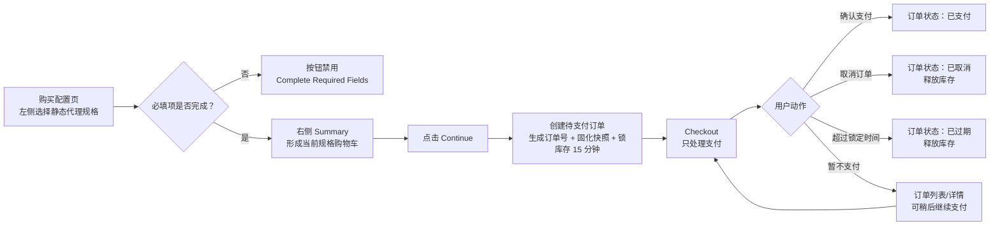
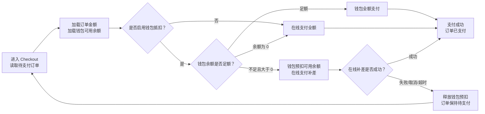
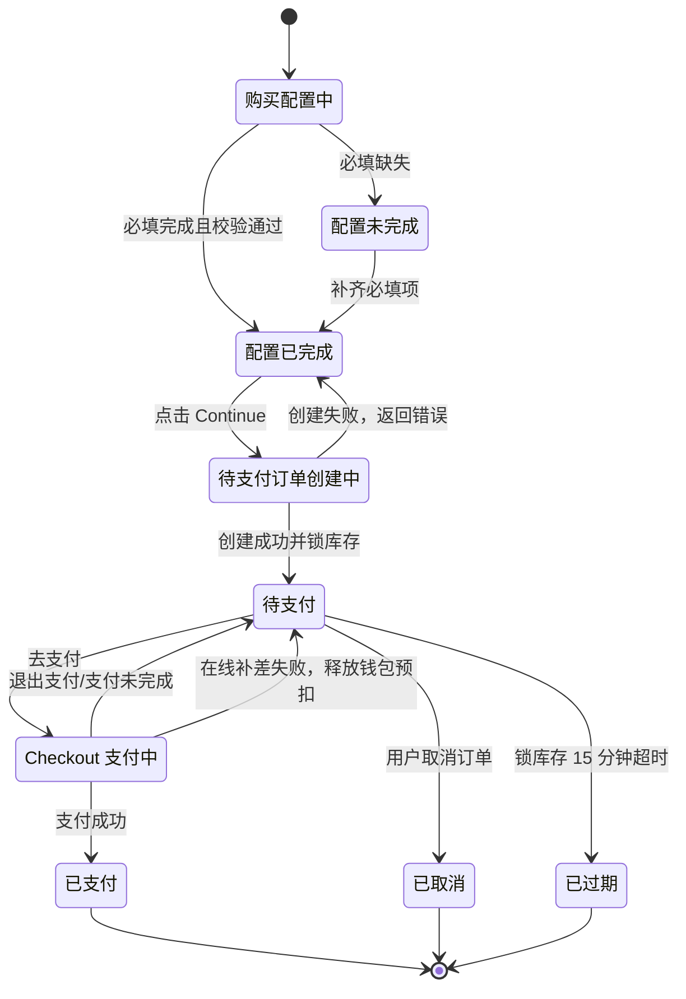
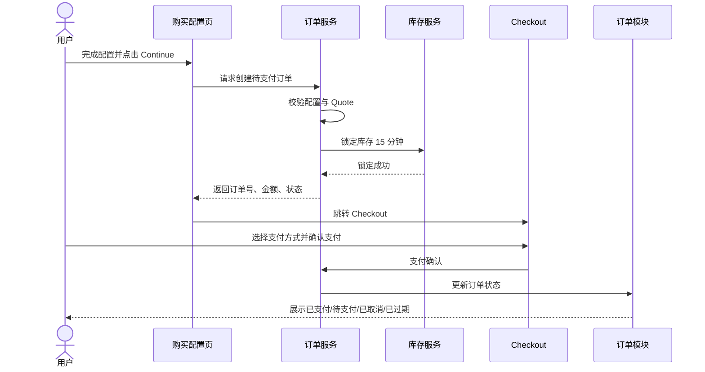

# 订单

> 状态：`ready-for-agent`  
> 语言：中文  
> 范围：产品需求 + 低保真交互 + 状态流转 + 页面字段说明  
> 关联需求节点：`静态代理-购买-提交订单`、`静态代理-购买-购物车`、`静态代理-订单`  
> 原型参考：`IP代理/prototypes/static-residential-post-continue-flow.html`
> 最近更新：`2026-06-04`，同步自动续费失败订单详情提示与手动续费入口边界

## 1. 执行摘要

本需求用于补齐静态代理购买链路中“从购买配置到订单支付”的闭环。用户在购买配置页完成单个静态代理规格后，右侧 Summary 作为当前规格的“购物车/Cart”承载配置确认；当配置通过校验后，用户点击 `Continue`，系统创建待支付订单、生成订单号、固化订单快照并锁定库存 15 分钟，然后进入独立 Checkout 页面。

Checkout 页面只处理支付相关配置，订单规格不可编辑。Checkout 支持钱包余额支付，也支持“钱包余额 + 在线支付补差”的组合支付。订单模块提供轻量表格列表与订单详情：列表用于快速扫读和操作，详情用于查看完整规格快照、支付拆分与状态记录。

## 2. 背景与问题

静态代理购买配置页已经覆盖主要规格字段，包括独享级别、IP 质量、业务用途、UDP、IP 来源、IP 数量、带宽、连接数、购买时长、Replacements、Add-ons、Coupon 等，并能通过右侧 Summary 形成 Quote。

当前缺口集中在购买后半段：

- `Continue` 点击后到底是进入支付页、生成待支付订单，还是仅展开一个支付模块，产品语义不清晰。
- Checkout 页面如果继续展示或编辑套餐规格，会与购买配置页职责重叠。
- 待支付订单的订单号、锁库存、过期、取消、继续支付等生命周期缺少统一规则。
- Checkout 需要支持平台钱包支付；当钱包余额不足时，用户仍希望先抵扣钱包余额，再用在线支付补齐差价。
- 订单列表如果只展示订单号、状态和金额会过于单调；如果展示完整规格、状态记录和支付摘要又会过重，需要明确列表与详情的信息边界。
- 用户返回购买配置后再次点击 `Continue`，旧订单是否覆盖、新订单是否生成，需要明确。
- 需求结构中提到“购物车”，但当前阶段不适合直接扩展为多规格购物车，否则会拖大范围并影响购买闭环落地。

## 3. 目标与非目标

### 3.1 目标

- 明确 `Complete Required Fields -> Continue -> Checkout` 的产品语义。
- 将购买配置页 Summary 定义为本阶段的单规格购物车。
- 点击 `Continue` 后创建待支付订单，并进入 Checkout。
- Checkout 只处理支付相关内容。
- Checkout Summary 只读，只展示订单号、产品名称、待支付价格。
- Checkout 支持钱包余额支付、钱包余额不足时在线补差、关闭钱包抵扣后全额在线支付。
- 订单模块支持轻量表格列表、详情、去支付、取消、过期、已支付状态展示。
- 订单列表展示单行规格摘要、金额 tooltip、状态筛选和搜索，完整解释进入订单详情。
- 订单详情展示完整规格快照、支付拆分和状态记录。
- 用状态流转图明确订单生命周期。
- 用低保真线框明确页面布局与字段。
- 用字段说明表明确页面字段含义、来源、可编辑性与规则。

### 3.2 非目标

- 不设计接口 API。
- 不做真实支付网关、卡组织校验、3DS、银行转账结算。
- 不做完整钱包充值页、钱包交易明细、真实资金清结算；本 PRD 仅定义 Checkout 使用钱包抵扣、在线补差、失败释放和展示口径。
- 不做支付后资源交付；支付成功后的 5 分钟交付窗口、交付状态、交付失败自动退钱包和 `我的IP` 展示口径由 `我的IP` PRD 承载。
- 不做多产品统一收银台。
- 不做多规格购物车。
- 不做批量购买多个静态代理规格。
- 不做后台库存管理、价格配置后台、优惠券规则引擎重构。
- 不做订单列表内优惠券展示、优惠来源展示或折扣拆分展示。

## 4. 用户与场景

### 4.1 主要用户

- **静态代理采购用户**：完成规格选择、确认价格、创建待支付订单并付款。
- **企业财务/采购执行人**：需要订单号、待支付金额和状态用于内部审批或付款。
- **客服/运营人员**：通过订单号查询订单状态、解释锁库存与过期原因。
- **产品/研发/测试人员**：需要明确的状态机、字段规则和验收口径。

### 4.2 关键场景

- 用户完成购买配置后点击 `Continue`，系统创建待支付订单并进入 Checkout。
- 用户在 Checkout 完成支付，订单状态变为已支付。
- 用户钱包余额足够时，在 Checkout 直接使用钱包全额支付。
- 用户钱包余额不足但大于 0 时，在 Checkout 使用钱包余额抵扣，并选择在线支付补齐差价。
- 用户关闭钱包抵扣后，在 Checkout 使用在线支付承担整单金额。
- 在线补差失败或取消时，订单保持待支付，钱包预扣释放，用户可重试或换支付方式。
- 用户暂时不支付，稍后从订单列表进入 Checkout 继续支付。
- 用户在订单列表中按状态筛选、搜索订单，并通过单行规格摘要快速判断订单内容。
- 用户在订单列表金额旁查看钱包抵扣与在线补差的简要 tooltip。
- 用户在订单详情中查看完整规格快照、支付拆分、状态记录。
- 用户取消待支付订单，释放库存锁。
- 用户超过锁定时间未支付，订单过期并释放库存锁。
- 用户返回购买配置后再次点击 `Continue`，创建新订单，旧订单保留。

## 5. 产品决策

| 决策项 | 结论 | 说明 |
|---|---|---|
| 本阶段购物车形态 | 单规格购物车 | 购买配置页右侧 Summary 即当前规格购物车，不新增多规格购物车页。 |
| 一个订单包含几个规格 | 1 个固定规格 | 当前闭环先保障单规格下单、支付、订单查看。 |
| `IP 来源与数量`模式 | 三选一互斥 | `随机`、`指定 IP 段（C 段）`、`指定 IP`互斥。 |
| `Continue` 行为 | 创建待支付订单并跳 Checkout | 不是展开内联支付模块。 |
| 订单号生成时机 | 点击 `Continue` 且创建待支付订单成功后生成 | Checkout 展示的订单号来自待支付订单。 |
| 锁库存时机 | 待支付订单创建成功后 | 锁定 15 分钟。 |
| Checkout 职责 | 只处理支付 | 不展示完整套餐配置，不允许改规格。 |
| Checkout Summary | 只读、极简 | 仅订单号、产品名称、待支付价格。 |
| 旧订单处理 | 不静默覆盖 | 再次 Continue 创建新订单，旧订单仍在订单列表。 |
| 钱包支付 | Checkout 支持 | 钱包余额可用于支付静态代理订单。 |
| 钱包默认策略 | 有余额时默认开启抵扣 | 降低在线支付金额并消耗钱包沉淀余额。 |
| 钱包余额足额 | 钱包全额支付 | 在线支付金额为 0，隐藏在线支付必填表单。 |
| 钱包余额不足 | 钱包抵扣 + 在线补差 | 钱包抵扣可用余额，剩余差价由在线支付补齐。 |
| 关闭钱包抵扣 | 在线支付全额 | 用户可主动关闭钱包抵扣。 |
| 在线补差失败 | 订单回到待支付，钱包预扣释放 | 支付失败不作为订单终态，支付尝试记录进入订单详情。 |
| Checkout 钱包 UI | 极简 Check 组件 | 只展示是否使用钱包余额、钱包余额、动态提示。 |
| 订单列表形态 | 轻量表格视图 | 列表用于扫读与操作，完整解释进入订单详情。 |
| 订单列表规格展示 | 单行摘要 | 仅展示 Top 5 核心规格，超长省略，不展示 `+N 项`。 |
| 订单列表优惠券 | 首版不展示 | 暂不支持优惠券相关逻辑或优惠拆分展示。金额展示订单最终待支付价。 |
| 订单列表支付拆分 | 价格 tooltip | 钱包抵扣、在线补差可通过金额旁提示查看，完整支付拆分进入订单详情。 |
| 订单详情职责 | 完整解释 | 展示完整规格快照、完整支付拆分、状态记录。 |
| 支付后交付结果 | 相邻模块承载 | 订单交易状态保持已支付；交付状态、失败 IP 和自动退钱包明细进入 `我的IP` / 订单详情补充口径。 |

## 6. 总体流程



### 6.1 Checkout 钱包组合支付流程



## 7. 订单状态流转



## 8. 订单与库存锁时序



## 9. 信息架构与模块拆分

| 模块 | 名称 | 主要职责 | 页面/位置 |
|---|---|---|---|
| M1 | 购买配置校验模块 | 判断必填项、来源模式规则、数量规则，决定按钮状态。 | 购买配置页 |
| M2 | Summary / 单规格购物车模块 | 展示当前固定规格、Quote、优惠、可提交状态。 | 购买配置页右侧 |
| M3 | 提交订单模块 | 点击 Continue 后创建待支付订单、固化快照、锁库存。 | 购买配置页到 Checkout |
| M4 | Checkout 支付模块 | 展示支付方式与支付表单，确认支付。 | Checkout 页面 |
| M5 | Checkout Summary 模块 | 只读展示订单号、产品名称、待支付价格。 | Checkout 右侧 |
| M6 | Checkout 钱包模块 | 展示钱包 Check 组件、钱包余额、动态提示。 | Checkout 左侧 |
| M7 | 组合支付计算模块 | 计算钱包抵扣金额、在线补差金额、按钮文案。 | Checkout |
| M8 | 钱包预扣与回退模块 | 管理组合支付中的钱包预扣、正式扣款、失败释放。 | Checkout/支付域 |
| M9 | 订单列表模块 | 展示轻量表格、状态筛选、搜索、金额 tooltip、操作入口。 | 订单页 |
| M10 | 订单详情模块 | 展示完整订单快照、支付拆分、状态记录、状态操作。 | 订单详情页 |
| M11 | 订单生命周期模块 | 管理待支付、已支付、已取消、已过期状态流转。 | 订单域 |
| M12 | 库存锁策略模块 | 管理锁定时长、释放时机、过期口径。 | 订单域/库存域 |

## 10. 低保真线框

### 10.1 购买配置页：Summary 作为单规格购物车

```text
┌──────────────────────────────────────────────────────────────────────────────┐
│ 静态住宅代理购买配置                                                         │
├────────────────────────────────────────────────────────────┬─────────────────┤
│ 左侧：购买配置                                             │ 右侧：Summary   │
│                                                            │                 │
│ 1. 代理基础属性                                            │ 独享级别   共享 │
│ [共享] [独享] [尊享]                                      │ IP质量     标准 │
│ 带宽：[250GB] [1000GB] [5000GB] [Unlimited]               │ 业务用途   数据 │
│ 连接数：[50] [100] [200] [500] [自定义]                   │ UDP        关闭 │
│ IP质量：[基础] [标准] [高端]                              │ IP来源     C段  │
│ UDP：[关闭] [开启]                                        │ IP数量     100  │
│ 业务用途：[下拉选择]                                      │ 带宽       1000 │
│                                                            │ 连接数     200  │
│ 2. IP 来源与数量                                           │ 购买时长   30天 │
│ [随机] [指定 IP 段（C 段）] [指定 IP]                     │ Repl.      无/10│
│ 国家/地区配额或指定 IP 选择区                              │ Add-ons    None│
│                                                            │ Coupon     None│
│ 3. 购买时长 / Replacements / Add-ons / Coupon              │                 │
│                                                            │ Pay Today  $x.xx│
│                                                            │ [Continue]     │
└────────────────────────────────────────────────────────────┴─────────────────┘
```

交互说明：

- 未完成必填时，按钮显示 `Complete Required Fields`，禁用。
- 完成必填且校验通过后，按钮显示 `Continue`。
- Summary 是当前单规格购物车，不承载多规格列表。
- 点击 `Continue` 后不在本页展开支付区，而是创建待支付订单并进入 Checkout。

### 10.2 Checkout 页面

```text
┌──────────────────────────────────────────────────────────────────────────────┐
│ Checkout                                                                     │
│ Checkout 页面只处理支付；套餐配置已固定，不可修改。                          │
├────────────────────────────────────────────────────────────┬─────────────────┤
│ Payment Method                                             │ Summary         │
│                                                            │                 │
│ ┌────────────────────────────────────────────────────────┐ │ 订单号           │
│ │ [✓] 使用钱包余额                          钱包余额 $3 │ │ SP-20260601-0001│
│ │     余额不足，将抵扣 $3，在线支付 $7。                 │ │                 │
│ └────────────────────────────────────────────────────────┘ │ 产品名称         │
│                                                            │ Static Proxy    │
│ 在线支付                                          [$7.00]  │                 │
│ 钱包余额不足，请选择在线支付补齐差价。                      │ 待支付价格       │
│ 支付方式：[Credit Card v]                                  │ $10.00          │
│ 账单国家/地区：[美国 v]                                    │                 │
│ 卡号：[1234 1234 1234 1234]                                │ 锁定提示：       │
│ 有效期：[12/30]                                            │ 库存锁定15分钟   │
│ 安全码：[123]                                              │                 │
│ 持卡人：[IPWeb Demo]                                       │                 │
│ [支付 $7.00 并使用钱包抵扣 $3.00] [取消订单并释放库存]       │                 │
└────────────────────────────────────────────────────────────┴─────────────────┘
```

交互说明：

- Checkout 左侧只允许支付相关字段，包括钱包抵扣、在线支付方式、账单与卡信息。
- Checkout Summary 只读。
- Checkout Summary 不展示 IP 来源、IP 数量、带宽、连接数、Add-ons、Coupon 等配置字段。
- Checkout Summary 的待支付价格展示订单原始待支付金额，不因钱包抵扣而改成在线补差金额。
- 钱包模块采用极简 Check 组件，只展示是否使用钱包、钱包余额和一句动态提示。
- 钱包足额时隐藏在线支付必填表单。
- 钱包不足或关闭钱包抵扣时展示在线支付区域，并用金额 badge 表达补差或全额在线支付金额。
- 点击 `Confirm Payment` 后订单变为已支付。
- 点击取消后订单变为已取消，库存释放。

### 10.3 订单列表

```text
┌──────────────────────────────────────────────────────────────────────────────┐
│ 静态代理订单                                                                 │
│ 展示 Continue 后生成的订单，可按状态筛选、查看详情、继续支付或取消。         │
├──────────────────────────────────────────────────────────────────────────────┤
│ [全部] [待支付] [已支付] [已取消/失效] [失败/异常]     搜索订单号 / 产品名称 │
├──────────────────────────────────────────────────────────────────────────────┤
│ 订单              状态      规格摘要              金额       库存锁定  操作 │
│ SP-20260601-0002  待支付    C 段 · 100 IPs · ...  $0.80 ⓘ   12:34    详情 │
│ Static Proxy      06/01     1,000 GB · 30 天                          去支付│
│                                                                          取消│
│ SP-20260601-0001  已支付    指定 IP · 4 IPs · ... $3.32      -        详情 │
└──────────────────────────────────────────────────────────────────────────────┘
```

交互说明：

- 订单列表采用轻量表格视图，不采用卡片或状态看板作为首版形态。
- 默认展示列为：订单、状态、规格摘要、金额、库存锁定、操作。
- 规格摘要最多展示一行，字段优先级为 `IP 来源 / IP 数量 / 带宽 / 购买时长 / 业务用途`。
- 规格摘要超出列宽时使用省略号截断，不撑高列表行，不展示 `+N 项`。
- 列表不展示优惠券、优惠来源、Coupon 字段或折扣拆分。
- 金额展示订单最终待支付价；如存在钱包抵扣与在线补差，可在金额旁展示 tooltip 说明拆分。
- 列表不展示状态记录、完整支付摘要或完整配置快照；这些信息进入订单详情。
- 待支付订单显示 `详情`、`去支付`、`取消`。
- 已支付、已取消、已过期订单只保留查看详情。
- 再次 Continue 创建的新订单出现在列表顶部，旧订单保留。

### 10.4 订单详情

```text
┌──────────────────────────────────────────────────────────────────────────────┐
│ 订单详情：SP-20260601-0002                                      状态：待支付 │
├──────────────────────────────────────────────────────────────────────────────┤
│ 基础信息                                                                     │
│ 订单号          SP-20260601-0002       产品名称        Static Proxy          │
│ 待支付价格      $0.80                  状态            待支付                │
│                                                                              │
│ 支付信息                                                                     │
│ 钱包支付        $0.30                 在线支付        $0.50                 │
│ 在线支付方式    Credit Card           支付状态        待支付（预计）        │
│                                                                              │
│ 规格快照                                                                     │
│ 独享级别        共享                  IP质量          标准                  │
│ 业务用途        SEO / SERP 分析       UDP             关闭                  │
│ IP来源          指定 C 段             IP数量          100 IPs               │
│ 带宽            1,000 GB              连接数          200 / IP              │
│ 购买时长        30 天                 Random          N/A                   │
│ Replacements    无 / 10 手动          Add-ons         None                  │
│ Coupon          IPWEB10 -10%                                                │
│                                                                              │
│ 状态记录                                                                     │
│ 06/01 16:35  创建待支付订单                                                  │
│ 06/01 16:35  锁定库存 15 分钟                                                │
│ 06/01 16:40  在线补差失败，钱包预扣已释放（如发生）                          │
├──────────────────────────────────────────────────────────────────────────────┤
│ [去支付] [取消订单并释放库存] [模拟 15 分钟锁定过期]                         │
└──────────────────────────────────────────────────────────────────────────────┘
```

交互说明：

- 订单详情展示完整冻结快照。
- 订单详情展示完整支付拆分，包括钱包支付金额、在线支付金额、在线支付方式、支付状态、支付时间。
- 订单详情展示状态记录，包括订单创建、库存锁定、支付尝试、失败释放、取消、过期、支付成功等。
- 待支付订单可去支付、取消、过期。
- 已支付、已取消、已过期订单不展示不可用动作。
- 自动续费失败订单不展示 `去支付`；详情页在基础信息之后展示专属提示，说明钱包余额不足、充值后不会自动重试，并提供 `去充值` 与 `去我的IP手动续费` 入口。

自动续费失败订单详情提示：

```text
┌──────────────────────────────────────────────────────────────────────────────┐
│ 订单详情：SP-20260603-0103                                  状态：自动续费失败 │
├──────────────────────────────────────────────────────────────────────────────┤
│ 基础信息                                                                     │
│ 订单号          SP-20260603-0103       订单类型        自动续费              │
│ 产品名称        Static Proxy           状态            自动续费失败          │
│                                                                              │
│ ┌──────────────────────────────────────────────────────────────────────────┐ │
│ │ 自动续费失败                                                            │ │
│ │ 钱包余额不足，本次自动续费未完成。资源保持原到期时间。                    │ │
│ │ 充值后不会自动重试扣款，请前往我的IP对受影响资源发起手动续费。            │ │
│ │ [去充值] [去我的IP手动续费]                                               │ │
│ └──────────────────────────────────────────────────────────────────────────┘ │
│                                                                              │
│ 续费信息                                                                     │
│ 原当前有效订单号  SP-20260516-0061     触发规则        到期前 3 天          │
│ 续费 IP 数量      4 IPs                 续费周期        30 天                │
│ 被续费 IP         188.4.189.59 / 92.67.138.190 / +2 IPs                     │
└──────────────────────────────────────────────────────────────────────────────┘
```

## 11. 模块需求明细

### M1：购买配置校验模块

目标：确保只有完整、合法的配置可以进入待支付订单创建。

功能要求：

- 必填项缺失时，主按钮禁用并显示 `Complete Required Fields`。
- 必填项完成且规则校验通过时，主按钮显示 `Continue`。
- `IP 来源`三种模式互斥。
- `指定 IP`模式下，IP 数量由已选 IP 条数反推。
- `指定 IP`模式下，至少选择 1 个 IP 才可继续。
- `指定 IP 段（C 段）`模式下，国家可选范围与上限由已选 C 段反推。
- 配置变更会刷新 Summary，但不影响已创建订单快照。

验收标准：

- 未选业务用途时不能 Continue。
- 未完成 IP 来源与数量规则时不能 Continue。
- 选择任一来源模式会取消另外两种来源模式。
- 配置通过后，按钮从 `Complete Required Fields` 变为 `Continue`。

### M2：Summary / 单规格购物车模块

目标：将当前购买配置以购物车形态展示，帮助用户在创建订单前确认规格和价格。

功能要求：

- Summary 展示当前规格，而不是历史订单。
- Summary 随左侧配置实时更新。
- Summary 展示 Quote 的当前待支付金额。
- Summary 显示优惠券、年付、Add-ons 等当前配置结果。
- Summary 不支持多规格列表。

验收标准：

- 左侧修改任一规格字段后，Summary 对应字段同步变化。
- Summary 中 `IP 来源`与当前互斥模式一致。
- Summary 中 `Pay Today`与当前 Quote 一致。
- 点击 `Continue`后不在 Summary 内展开支付模块。

### M3：提交订单模块

目标：在配置完成后创建待支付订单，并把用户带到 Checkout。

功能要求：

- 点击 `Continue`后触发订单创建。
- 创建订单前进行最终校验。
- 创建成功后生成唯一订单号。
- 创建成功后冻结订单规格快照。
- 创建成功后冻结待支付金额。
- 创建成功后锁定库存 15 分钟。
- 创建成功后跳转 Checkout。
- 创建失败时停留在购买配置页，并展示失败原因。
- 返回购买配置后再次点击 `Continue`会创建新订单，不覆盖旧订单。

验收标准：

- 每次成功 Continue 都生成一张新待支付订单。
- 新订单拥有独立订单号。
- 订单列表能看到新旧订单。
- 订单详情展示的是创建时快照，不受之后配置变更影响。

### M4：Checkout 支付模块

目标：让用户针对待支付订单完成支付，不再修改规格。

功能要求：

- Checkout 仅展示支付方式与支付相关表单。
- Checkout 可从 Continue 后进入，也可从订单列表/详情的 `去支付`进入。
- 仅待支付订单可进入有效支付动作。
- 支付成功后，订单状态变为已支付。
- 取消订单后，订单状态变为已取消。

验收标准：

- Checkout 页面看不到套餐编辑控件。
- 已支付、已取消、已过期订单不能再次支付。
- 支付成功后，订单列表与详情状态同步为已支付。

### M5：Checkout Summary 模块

目标：在支付页提供最小且可信的付款摘要。

功能要求：

- Checkout Summary 只读。
- Checkout Summary 只展示订单号、产品名称、待支付价格。
- 产品名称固定展示为 `Static Proxy`。
- 待支付价格来自待支付订单金额，不从当前购买配置重新计算。
- 展示库存锁定提示。

验收标准：

- Checkout Summary 不展示完整规格。
- Checkout Summary 不展示 Details 折叠项。
- Checkout Summary 不提供 Coupon、Add-ons、数量、带宽、连接数编辑。

### M6：Checkout 钱包模块

目标：用最轻的支付控件支持钱包抵扣，降低用户理解成本。

功能要求：

- 钱包模块只展示 Check 组件、钱包余额和一句动态提示。
- 钱包余额大于 0 时默认勾选 `使用钱包余额`。
- 钱包余额为 0 时不可勾选，并提示需使用在线支付。
- 钱包余额足额时，提示“将使用钱包全额支付”，并隐藏在线支付必填表单。
- 钱包余额不足时，提示“余额不足，将抵扣 X，在线支付 Y”。
- 用户取消勾选钱包时，订单改为全额在线支付。
- 钱包模块不展示多张金额卡片，不展示钱包交易明细，不提供充值入口。

验收标准：

- Checkout 钱包区域仅保留 Check、余额、提示三类信息。
- 钱包足额时，在线支付表单隐藏，确认按钮表达钱包支付。
- 钱包不足时，在线支付区域展示补差金额。
- 取消钱包抵扣后，在线支付金额等于订单待支付价格。

### M7：组合支付计算模块

目标：统一计算钱包抵扣金额、在线补差金额与按钮文案。

计算规则：

| 场景 | 钱包抵扣金额 | 在线支付金额 | 展示/动作 |
|---|---:|---:|---|
| 钱包余额足额且启用钱包 | 订单待支付价格 | 0 | 钱包全额支付 |
| 钱包余额不足且启用钱包 | 钱包可用余额 | 差额 | 钱包 + 在线补差 |
| 钱包余额为 0 | 0 | 订单待支付价格 | 在线支付全额 |
| 用户关闭钱包抵扣 | 0 | 订单待支付价格 | 在线支付全额 |

功能要求：

- 组合支付计算以待支付订单金额快照为准。
- 钱包抵扣金额不得超过钱包可用余额。
- 钱包抵扣金额不得超过订单待支付价格。
- 在线支付金额等于订单待支付价格减去钱包抵扣金额。
- 确认按钮文案需明确当前支付动作，例如 `支付 $0.50 并使用钱包抵扣 $0.30`。
- Checkout Summary 的待支付价格不随钱包抵扣变化，仍展示订单总待支付金额。

验收标准：

- 订单 $0.80、钱包 $0.30 时，钱包抵扣 $0.30，在线支付 $0.50。
- 订单 $0.80、钱包 $1.00 时，钱包抵扣 $0.80，在线支付 $0.00。
- 用户关闭钱包时，钱包抵扣 $0.00，在线支付 $0.80。

### M8：钱包预扣与回退模块

目标：保障组合支付中钱包扣款与在线支付状态一致，避免用户资金被错误占用。

功能要求：

- 组合支付场景下，确认支付时先对钱包抵扣金额做预扣。
- 在线补差成功后，钱包预扣转为正式扣款，订单变为已支付。
- 在线补差失败、取消或超时时，释放钱包预扣，订单保持待支付。
- 用户取消待支付订单或订单锁定过期时，释放未完成支付相关的钱包预扣。
- 同一订单重复支付尝试不得重复占用同一笔钱包金额。
- 支付尝试、预扣释放、正式扣款等记录进入订单详情状态记录。

验收标准：

- 在线补差失败后，订单仍为待支付。
- 在线补差失败后，钱包余额恢复为可用。
- 订单详情可看到“在线补差失败，钱包预扣已释放”的记录。
- 订单取消或过期后，不保留钱包预扣。

### M9：订单列表模块

目标：让用户查看所有由 Continue 创建的订单，并对待支付订单继续操作。

功能要求：

- 列表采用轻量表格视图。
- 默认展示列为订单、状态、规格摘要、金额、库存锁定、操作。
- `订单`列展示订单号、产品名称、创建时间。
- `规格摘要`列仅展示一行核心摘要，字段优先级为 `IP 来源 / IP 数量 / 带宽 / 购买时长 / 业务用途`。
- 规格摘要超出列宽时使用省略号截断，不撑高列表行，不展示 `+N 项`。
- 列表不展示完整配置快照、状态记录、完整支付摘要。
- 列表首版不展示优惠券、优惠来源、Coupon 字段或优惠拆分。
- 金额展示订单最终待支付价。
- 若订单存在钱包抵扣与在线补差，金额旁可展示 tooltip，用于说明钱包抵扣金额、在线补差金额与订单应付金额。
- 待支付订单展示 `详情`、`去支付`、`取消`。
- 已支付、已取消、已过期订单展示 `详情`。
- 默认按创建时间倒序排列。
- 多次 Continue 生成的订单都应保留。
- 支持按状态筛选：全部、待支付、已支付、已取消/失效、失败/异常。
- 支持按订单号或产品名称搜索。

验收标准：

- 新订单出现在列表顶部。
- 已支付订单不展示取消。
- 已取消订单不展示去支付。
- 已过期订单不展示去支付。
- 规格摘要过长时不换行、不撑高行高。
- 列表中不出现 Coupon 或 `+N 项`。
- 状态记录仅在订单详情查看。

### M10：订单详情模块

目标：提供订单完整快照与状态操作。

功能要求：

- 展示订单号、状态、产品名称、待支付价格。
- 展示购买配置形成的完整规格快照。
- 展示完整支付拆分，包括钱包支付金额、在线支付金额、支付方式、支付状态、支付时间。
- 展示状态记录，包括订单创建、库存锁定、支付尝试、钱包预扣释放、取消、过期、支付成功。
- 待支付订单展示 `去支付`、`取消订单并释放库存`。
- 待支付订单在锁定时间到达后变为已过期。
- 已支付、已取消、已过期订单隐藏不可用动作。
- 自动续费失败订单在基础信息之后展示专属提示，不提供继续支付入口；用户充值后需要点击 `去我的IP手动续费`，定位被续费资源并创建新的手动续费待支付订单，然后进入 Checkout 完成支付。
- 续费订单展示 `被续费 IP`，该字段由单条 IP 资源组成；详情内最多展示前 2 条，超过后以 `+N IPs` 收起，完整资源列表进入 `我的IP` 查看。

验收标准：

- 订单详情中的规格字段与创建订单时一致。
- 取消后状态变为已取消。
- 过期后状态变为已过期。
- 支付后状态变为已支付。
- 在线补差失败后，详情展示失败记录与钱包预扣释放记录。
- 自动续费失败订单详情展示失败原因、充值提示和手动续费入口。
- `去我的IP手动续费` 不复用失败订单继续支付，而是跳转到 `我的IP` 并以原当前有效订单号定位资源；用户点击 `创建续费订单` 后生成新的手动续费待支付订单。

### M11：订单生命周期模块

目标：统一订单状态与可执行动作。

状态定义：

| 状态 | 含义 | 可执行动作 | 终态 |
|---|---|---|---|
| 待支付 | 已创建订单并锁库存，尚未支付 | 去支付、取消、等待过期 | 否 |
| 已支付 | 支付成功 | 查看详情 | 是 |
| 已取消 | 用户主动取消，库存释放 | 查看详情 | 是 |
| 已过期 | 锁定时间超时，库存释放 | 查看详情 | 是 |
| 自动续费失败 | 自动续费订单因钱包余额不足等原因扣款失败 | 查看详情、去我的IP手动续费 | 是 |

状态规则：

- 只有待支付订单可以支付。
- 只有待支付订单可以取消。
- 只有待支付订单可以过期。
- 已支付、已取消、已过期、自动续费失败均为终态。

### M12：库存锁策略模块

目标：明确待支付订单与库存锁的关系。

功能要求：

- 待支付订单创建成功后立即锁库存。
- 锁定时长为 15 分钟。
- 支付成功后，库存锁转为正式占用。
- 用户取消订单后，库存释放。
- 订单过期后，库存释放。
- 订单创建失败不得锁库存。

验收标准：

- 订单创建成功才出现锁库存提示。
- 取消/过期后不允许继续支付。
- 取消/过期后订单仍可查看。

## 12. 页面字段含义与解释

### 12.1 购买配置页 Summary 字段

| 字段 | 含义 | 来源 | 是否可编辑 | 规则 |
|---|---|---|---|---|
| 独享级别 | 资源共享/独享档位 | 购买配置页基础属性 | 否，仅摘要 | `共享`、`独享`、`尊享` |
| IP 质量 | IP 资源质量档位 | 购买配置页基础属性 | 否，仅摘要 | `基础`、`标准`、`高端` |
| 业务用途 | 用户购买代理的业务场景 | 购买配置页业务用途 | 否，仅摘要 | 必填 |
| UDP | 是否开启 UDP 支持 | 购买配置页 UDP 选项 | 否，仅摘要 | 关闭/开启 |
| IP 来源 | IP 获取方式 | IP 来源与数量模块 | 否，仅摘要 | 随机/指定 C 段/指定 IP 三选一 |
| IP 数量 | 本订单购买 IP 个数 | 数量档位、C 段分配或已选 IP | 否，仅摘要 | 指定 IP 模式由已选 IP 条数反推 |
| 带宽 | 本订单带宽规格 | 基础属性 | 否，仅摘要 | 例如 250 GB、1,000 GB、5,000 GB |
| 连接数 | 每 IP 并发连接数 | 基础属性 | 否，仅摘要 | 展示为 `N / IP` |
| 购买时长 | 资源购买周期 | 购买时长模块 | 否，仅摘要 | 例如 7 天、30 天、1 年 |
| Random | 随机分配余量 | 地区配额计算 | 否，仅摘要 | 非随机模式可展示 N/A |
| Replacements | 自动/手动更换策略 | Replacements 配置 | 否，仅摘要 | 展示自动更换频率与手动额度 |
| Add-ons | 增值项 | Add-ons 配置 | 否，仅摘要 | 无则展示 None |
| Coupon | 优惠券结果 | Coupon 输入与校验 | 否，仅摘要 | 无则展示 None |
| Pay Today | 当前 Quote 待支付金额 | Quote 结果 | 否，仅摘要 | Continue 前的预估金额 |
| 主按钮 | 下一步动作 | 校验状态 | 是，点击动作 | 未完成显示 `Complete Required Fields`；完成显示 `Continue` |

### 12.2 Checkout 页面字段

| 字段 | 含义 | 来源 | 是否可编辑 | 规则 |
|---|---|---|---|---|
| 使用钱包余额 | 是否使用平台钱包抵扣本订单 | 钱包模块 | 是 | 钱包余额大于 0 时默认勾选；余额为 0 时不可用 |
| 钱包余额 | 用户当前可用于支付的余额 | 钱包账户 | 否 | 仅展示可用余额，不展示交易明细 |
| 钱包提示 | 当前钱包支付结果说明 | 组合支付计算模块 | 否 | 足额、余额不足、未启用、余额为 0 分别展示不同提示 |
| 在线支付金额 | 钱包抵扣后仍需在线支付的金额 | 组合支付计算模块 | 否 | 余额不足或关闭钱包抵扣时展示；足额钱包支付时为 0 并隐藏在线支付表单 |
| 支付方式 | 用户选择在线支付渠道 | Checkout 表单 | 是 | 例如 Credit Card；仅在线支付金额大于 0 时需要 |
| 账单国家/地区 | 支付账单信息 | Checkout 表单 | 是 | 支付相关，不影响订单规格 |
| 卡号 | 在线支付信息 | Checkout 表单 | 是 | 原型中不做真实校验；仅在线支付金额大于 0 时需要 |
| 有效期 | 在线支付信息 | Checkout 表单 | 是 | 原型中不做真实校验；仅在线支付金额大于 0 时需要 |
| 安全码 | 在线支付信息 | Checkout 表单 | 是 | 原型中不做真实校验；仅在线支付金额大于 0 时需要 |
| 持卡人 | 在线支付信息 | Checkout 表单 | 是 | 原型中不做真实校验；仅在线支付金额大于 0 时需要 |
| Confirm Payment | 确认支付动作 | Checkout 操作 | 是 | 仅待支付订单可用；文案需表达钱包抵扣与在线补差 |
| 取消订单并释放库存 | 取消待支付订单 | Checkout 操作 | 是 | 仅待支付订单可用 |

### 12.3 Checkout Summary 字段

| 字段 | 含义 | 来源 | 是否可编辑 | 规则 |
|---|---|---|---|---|
| 订单号 | 待支付订单唯一编号 | 提交订单模块 | 否 | 点击 Continue 创建订单后生成 |
| 产品名称 | 本订单产品类型 | 待支付订单 | 否 | 固定展示 `Static Proxy` |
| 待支付价格 | 本订单需要支付的金额 | 待支付订单金额快照 | 否 | 不从当前购买配置重新计算 |
| 锁定提示 | 库存锁状态提示 | 库存锁策略 | 否 | 待支付时展示锁定 15 分钟 |

### 12.4 订单列表字段

| 字段 | 含义 | 来源 | 是否可编辑 | 规则 |
|---|---|---|---|---|
| 订单 | 订单识别信息 | 订单记录 | 否 | 包含订单号、产品名称、创建时间 |
| 状态 | 订单生命周期状态 | 订单生命周期模块 | 否 | 待支付/已支付/已取消/已过期/自动续费失败 |
| 规格摘要 | 订单核心配置摘要 | 订单规格快照 | 否 | 单行展示，优先展示 IP 来源、IP 数量、带宽、购买时长、业务用途；超长省略 |
| 金额 | 订单最终待支付价或实付价 | 订单金额快照 | 否 | 创建订单时冻结；首版不展示优惠券或优惠拆分 |
| 金额 tooltip | 解释支付拆分 | 支付记录或预计支付拆分 | 否 | 仅在存在钱包抵扣/在线补差时展示，说明钱包抵扣、在线补差、应付金额 |
| 库存锁定 | 待支付订单库存锁剩余时间 | 库存锁策略 | 否 | 待支付展示倒计时或过期提示；终态展示 `-` |
| 详情 | 查看订单详情 | 操作 | 是 | 所有状态可用 |
| 去支付 | 进入 Checkout | 操作 | 是 | 仅待支付可用 |
| 取消 | 取消订单 | 操作 | 是 | 仅待支付可用 |
| 状态筛选 | 按订单状态过滤列表 | 用户操作 | 是 | 支持全部、待支付、已支付、已取消/失效、失败/异常 |
| 搜索 | 按关键词定位订单 | 用户操作 | 是 | 支持订单号、产品名称 |

### 12.5 订单详情字段

| 字段 | 含义 | 来源 | 是否可编辑 | 规则 |
|---|---|---|---|---|
| 订单号 | 订单唯一编号 | 订单记录 | 否 | 创建后不可变 |
| 状态 | 当前订单状态 | 订单生命周期 | 否 | 终态不可逆 |
| 产品名称 | 产品类型 | 订单记录 | 否 | Static Proxy |
| 待支付价格 | 订单金额 | 订单金额快照 | 否 | 创建后冻结 |
| 钱包支付金额 | 钱包抵扣或正式支付金额 | 支付拆分记录 | 否 | 钱包未使用时为 0；组合支付时展示抵扣金额 |
| 在线支付金额 | 在线渠道需支付或已支付金额 | 支付拆分记录 | 否 | 钱包足额时为 0；余额不足时为补差金额 |
| 在线支付方式 | 在线补差使用的支付渠道 | 支付记录 | 否 | 例如 Credit Card；无在线支付时展示 `-` |
| 支付状态 | 支付尝试或最终支付状态 | 支付记录 | 否 | 待支付、支付中、已支付、失败/已释放 |
| 支付时间 | 支付成功时间 | 支付记录 | 否 | 未支付时展示 `-` |
| 原当前有效订单号 | 被续费 IP 当前有效订单号 | 续费订单记录 | 否 | 仅续费订单展示，用于回溯资源权益 |
| 触发规则 | 自动续费触发时间规则 | 自动续费配置 | 否 | 仅自动续费订单展示，例如 `到期前 3 天` |
| 续费 IP 数量 | 本次续费覆盖的 IP 数量 | 续费订单记录 | 否 | 仅续费订单展示 |
| 续费周期 | 本次续费周期 | 续费订单记录 | 否 | 仅续费订单展示 |
| 被续费 IP | 本次续费覆盖的单条 IP 资源 | 续费订单记录 | 否 | 详情最多展示前 2 条，超过展示 `+N IPs`；完整列表进入 `我的IP` |
| 独享级别 | 订单规格快照 | 购买配置 | 否 | 创建后冻结 |
| IP 质量 | 订单规格快照 | 购买配置 | 否 | 创建后冻结 |
| 业务用途 | 订单规格快照 | 购买配置 | 否 | 创建后冻结 |
| UDP | 订单规格快照 | 购买配置 | 否 | 创建后冻结 |
| IP 来源 | 订单规格快照 | 购买配置 | 否 | 创建后冻结 |
| IP 数量 | 订单规格快照 | 购买配置 | 否 | 创建后冻结 |
| 带宽 | 订单规格快照 | 购买配置 | 否 | 创建后冻结 |
| 连接数 | 订单规格快照 | 购买配置 | 否 | 创建后冻结 |
| 购买时长 | 订单规格快照 | 购买配置 | 否 | 创建后冻结 |
| Random | 订单规格快照 | 购买配置 | 否 | 创建后冻结 |
| Replacements | 订单规格快照 | 购买配置 | 否 | 创建后冻结 |
| Add-ons | 订单规格快照 | 购买配置 | 否 | 创建后冻结 |
| Coupon | 订单规格快照 | 购买配置 | 否 | 创建后冻结 |
| 状态记录 | 订单生命周期与支付尝试日志 | 订单/支付/库存域 | 否 | 展示创建、锁库存、支付尝试、钱包预扣释放、取消、过期、支付成功 |

## 13. 用户故事与验收标准

### Story 1：购买配置未完成时不能提交

作为静态代理采购用户，我希望必填项未完成时不能点击 Continue，以避免创建无效订单。

验收标准：

- 未选择业务用途时，按钮显示 `Complete Required Fields`。
- 未满足 IP 来源与数量规则时，按钮禁用。
- 错误提示说明缺失字段或不合法原因。

### Story 2：购买配置完成后可以创建待支付订单

作为静态代理采购用户，我希望配置完成后点击 `Continue` 能创建待支付订单，以便进入支付。

验收标准：

- 点击 `Continue` 后生成订单号。
- 订单状态为待支付。
- 订单锁库存 15 分钟。
- 页面跳转到 Checkout。

### Story 3：Checkout 只处理支付

作为静态代理采购用户，我希望 Checkout 只展示支付信息，以避免误改套餐规格。

验收标准：

- Checkout 左侧只显示支付方式、账单、卡信息等支付字段。
- Checkout Summary 只显示订单号、产品名称、待支付价格。
- Checkout 不出现规格编辑控件。

### Story 4：用户可以从订单列表继续支付

作为静态代理采购用户，我希望待支付订单可以从订单列表继续支付，以便稍后完成付款。

验收标准：

- 待支付订单展示 `去支付`按钮。
- 点击 `去支付`进入 Checkout。
- Checkout 展示该订单的订单号与金额。

### Story 5：用户可以取消待支付订单

作为静态代理采购用户，我希望可以取消待支付订单，以释放不再需要的库存。

验收标准：

- 待支付订单展示取消入口。
- 取消后状态变为已取消。
- 已取消订单不再展示去支付入口。
- 已取消订单仍可查看详情。

### Story 6：订单锁定超时后自动过期

作为静态代理采购用户，我希望超过锁定时间后订单过期，以避免支付失效库存。

验收标准：

- 待支付订单超过 15 分钟后状态变为已过期。
- 已过期订单不再展示去支付入口。
- 已过期订单仍可查看详情。

### Story 7：再次 Continue 创建新订单

作为静态代理采购用户，我希望返回购买配置后再次 Continue 能创建新订单，以保留历史订单记录。

验收标准：

- 再次 Continue 生成新的订单号。
- 新订单出现在订单列表顶部。
- 旧订单不被覆盖。

### Story 8：钱包余额足够时可全额钱包支付

作为静态代理采购用户，我希望钱包余额足够时直接用钱包完成支付，以减少在线支付步骤。

验收标准：

- Checkout 默认勾选使用钱包余额。
- 钱包提示说明将使用钱包全额支付。
- 在线支付表单隐藏。
- 确认支付后订单变为已支付。

### Story 9：钱包余额不足时可在线补差

作为静态代理采购用户，我希望钱包余额不足时仍能先抵扣余额，再用在线支付补齐差价，以充分使用钱包余额。

验收标准：

- Checkout 展示钱包余额与补差提示。
- 在线支付区域展示补差金额。
- 确认按钮文案同时包含在线支付金额与钱包抵扣金额。
- 支付成功后订单变为已支付，订单详情展示支付拆分。

### Story 10：用户可关闭钱包抵扣

作为静态代理采购用户，我希望可以关闭钱包抵扣，以便选择全额在线支付。

验收标准：

- 取消勾选钱包后，钱包抵扣金额为 0。
- 在线支付金额等于订单待支付价格。
- 确认按钮文案不再包含钱包抵扣金额。

### Story 11：在线补差失败后释放钱包预扣

作为静态代理采购用户，我希望在线补差失败时钱包余额不会被占用，以便重新选择支付方式。

验收标准：

- 在线补差失败后订单保持待支付。
- 钱包预扣被释放。
- 用户可以重新进入 Checkout 支付。
- 订单详情状态记录展示失败与释放结果。

### Story 12：用户可在订单列表快速扫读订单

作为静态代理采购用户，我希望订单列表简洁展示核心信息，以便快速找到需要处理的订单。

验收标准：

- 列表展示订单、状态、规格摘要、金额、库存锁定、操作。
- 规格摘要只展示一行，过长使用省略号。
- 列表不展示 `+N 项`、状态记录、完整配置快照。
- 列表支持状态筛选与订单号/产品名称搜索。

### Story 13：用户可在订单列表查看金额拆分提示

作为静态代理采购用户，我希望在金额旁快速查看钱包抵扣与在线补差，以便理解本次付款金额。

验收标准：

- 存在组合支付时，金额旁展示 tooltip 入口。
- Tooltip 仅展示钱包抵扣、在线补差、应付金额。
- 完整支付记录仍进入订单详情。

### Story 14：用户可在订单详情查看完整解释

作为静态代理采购用户或客服人员，我希望订单详情展示完整规格、支付拆分和状态记录，以便核对订单与解释问题。

验收标准：

- 订单详情展示完整规格快照。
- 订单详情展示钱包支付金额、在线支付金额、在线支付方式、支付状态、支付时间。
- 订单详情展示订单创建、库存锁定、支付尝试、失败释放、取消、过期、支付成功等记录。

## 14. 成功指标

| 指标 | 类型 | 目标 |
|---|---|---|
| 配置完成率 | 主指标 | 用户从购买配置进入 Continue 的比例提升 |
| Continue 成功率 | 主指标 | 点击 Continue 后成功创建待支付订单的比例提升 |
| Checkout 支付转化率 | 主指标 | 待支付订单进入已支付的比例提升 |
| 钱包支付使用率 | 主指标 | 使用钱包全额或组合支付的订单占比可观测 |
| 组合支付成功率 | 主指标 | 钱包余额不足场景下，在线补差成功的比例可观测 |
| 支付前回退率 | 次级指标 | 从 Checkout 返回购买配置的比例下降 |
| 订单找回率 | 次级指标 | 从订单列表继续支付的订单占比可观测 |
| 订单列表定位效率 | 次级指标 | 通过筛选/搜索/去支付完成订单处理的路径可观测 |
| 取消/过期占比 | 诊断指标 | 用于判断价格、库存锁、支付摩擦问题 |
| 钱包预扣释放异常率 | 护栏指标 | 在线补差失败、取消、过期后钱包预扣未释放应接近 0 |
| 客服咨询量 | 护栏指标 | “订单号/锁库存/待支付”相关咨询下降 |

## 15. 测试决策

测试原则：

- 测外部行为，不测实现细节。
- 优先覆盖状态流转、字段可见性、订单快照不可变性。
- Checkout Summary 必须作为独立测试重点，防止规格字段回流到支付页。
- 订单列表必须保持轻量，防止详情信息回流到列表页。

测试参考：

- 当前低保真原型参考 `IP代理/prototypes/static-residential-post-continue-flow.html`。
- 当前原型测试参考 `IP代理/prototypes/static-residential-post-continue-flow.test.mjs`。

建议测试模块：

- 购买配置校验模块。
- Summary / 单规格购物车模块。
- 提交订单模块。
- Checkout Summary 模块。
- Checkout 钱包模块。
- 组合支付计算模块。
- 钱包预扣与回退模块。
- 订单生命周期模块。
- 订单列表与订单详情展示模块。

关键测试用例：

- 必填缺失时按钮禁用。
- 配置完成后按钮显示 `Continue`。
- 点击 `Continue`创建待支付订单。
- Checkout Summary 只包含订单号、产品名称、待支付价格。
- Checkout 钱包模块只展示 Check、余额、提示。
- 钱包足额时隐藏在线支付表单，并可钱包全额支付。
- 钱包不足时展示在线补差金额与组合支付按钮文案。
- 用户关闭钱包抵扣后，在线支付金额等于订单待支付价格。
- 在线补差失败后订单保持待支付，钱包预扣释放。
- 订单列表规格摘要过长时单行省略，不换行、不展示 `+N 项`。
- 订单列表不展示 Coupon、优惠来源或优惠拆分。
- 订单列表不展示状态记录，状态记录在订单详情查看。
- 订单列表金额 tooltip 仅解释钱包抵扣和在线补差。
- 订单详情展示完整支付拆分与状态记录。
- 支付成功后状态为已支付。
- 取消待支付订单后状态为已取消。
- 锁定超时后状态为已过期。
- 再次 Continue 会创建第二张订单。
- 修改购买配置不影响已创建订单详情快照。

## 16. 依赖与风险

### 16.1 依赖

- 购买配置页已有字段与 Summary 展示能力。
- Quote 结果可用于创建订单金额快照。
- 库存服务支持锁定、释放、过期。
- 订单模块支持列表与详情。
- 支付模块支持针对订单号发起支付。
- 钱包账户支持读取可用余额、预扣、释放预扣、正式扣款。
- 支付记录支持保存钱包抵扣、在线补差与支付尝试结果。

### 16.2 风险与缓解

| 风险 | 影响 | 缓解 |
|---|---|---|
| 用户误以为 Summary 是多规格购物车 | 预期偏差 | 文案与交互明确“当前配置/当前订单”。 |
| Checkout Summary 信息过少导致用户想复核规格 | 可能回退 | 在订单详情提供完整快照，Checkout 保持支付聚焦。 |
| 用户误以为 Checkout 待支付价格会被钱包抵扣改小 | 金额理解偏差 | Summary 固定展示订单待支付总价，钱包提示与按钮展示抵扣/补差。 |
| 在线补差失败后钱包预扣未释放 | 资金占用风险 | 钱包预扣与回退作为独立模块验收，失败/取消/过期必须释放。 |
| 订单列表金额 tooltip 被当作完整支付凭证 | 信息误解 | Tooltip 只做快速解释，完整支付拆分进入订单详情。 |
| 订单列表展示字段过多导致扫读困难 | 操作效率下降 | 列表只保留核心列，规格摘要单行省略，完整内容进入详情。 |
| 多次 Continue 产生多个待支付订单 | 订单列表变多 | 明确旧订单不覆盖，并提供取消/过期机制。 |
| 库存锁定与支付状态不同步 | 库存风险 | 订单生命周期与库存锁策略统一管理。 |
| 过期后用户仍尝试支付 | 支付失败 | 已过期订单隐藏去支付入口，并提示重新下单。 |

## 17. 范围外

- 多规格购物车。
- 多产品混合下单。
- 批量订单。
- 支付网关接入。
- 复杂支付失败重试策略，例如失败原因分层、自动重试、支付路由切换。
- 钱包充值页。
- 钱包交易明细页。
- 钱包自动充值。
- 发票、退款、续费、自动续费。
- 订单列表内优惠券展示、优惠来源展示、折扣拆分展示。
- 代理商下单与代理商价格体系。
- 我的 IP 管理、导出账号、修改密码、停用/启用。
- 后台库存管理。
- 价格计算器后台能力。

## 18. 后续增强

- 多规格购物车：一个订单中包含多个不同规格的静态代理。
- 订单支付倒计时组件：在 Checkout 与订单详情中展示剩余锁定时间。
- 支付失败处理：失败原因、重试、换支付方式。
- 钱包充值入口：余额不足时引导充值后再支付。
- 钱包交易明细：展示充值、消费、预扣释放与退款记录。
- 订单通知：订单创建、即将过期、支付成功、取消通知。
- 订单筛选：按状态、时间、产品筛选。
- 发票与付款凭证。

## 19. 附：术语说明

| 术语 | 说明 |
|---|---|
| 静态代理 | 本需求中的商品类型，Checkout 产品名展示为 `Static Proxy`。 |
| Summary | 购买配置页右侧摘要，本阶段承担单规格购物车角色。 |
| Quote | 当前配置下的价格结果，不等同于最终支付成功记录。 |
| 待支付订单 | 点击 Continue 后创建、已锁库存、尚未支付的订单。 |
| 订单快照 | 创建订单时冻结的规格、金额、优惠和库存锁信息。 |
| 锁库存 | 待支付订单保留所选资源，锁定期为 15 分钟。 |
| 释放库存 | 订单取消或过期后释放被锁定资源。 |
| 钱包 | 平台余额产品，支持用户充值后在平台消费；本 PRD 仅涉及支付时使用余额。 |
| 钱包抵扣 | 使用钱包余额抵扣订单待支付金额。 |
| 在线补差 | 钱包余额不足时，用在线支付补齐剩余差额。 |
| 组合支付 | 同一订单使用钱包抵扣与在线支付补差共同完成付款。 |
| 钱包预扣 | 组合支付过程中先临时占用钱包金额，待在线补差成功后转正式扣款。 |
| 支付拆分 | 订单支付金额在钱包与在线支付之间的分摊结果。 |
| 金额 tooltip | 订单列表金额旁的轻量解释入口，只说明钱包抵扣、在线补差和应付金额。 |
| 规格摘要 | 订单列表中用于快速扫读的单行核心规格，完整规格以订单详情为准。 |
| 终态 | 订单不再允许支付或取消的状态，包括已支付、已取消、已过期。 |
