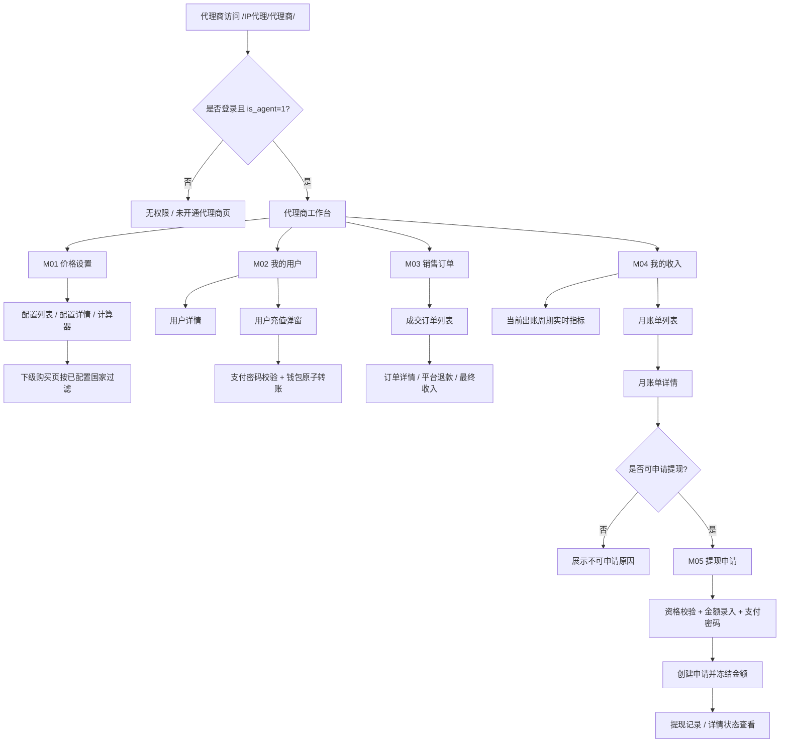
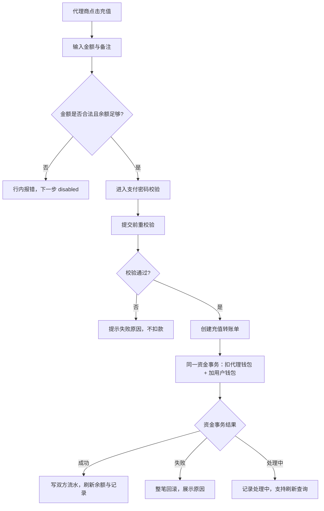
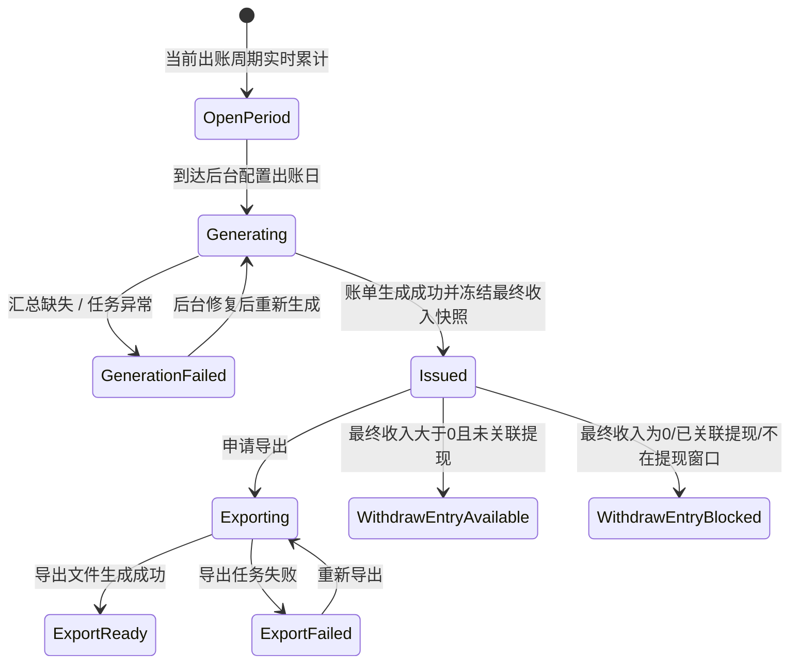
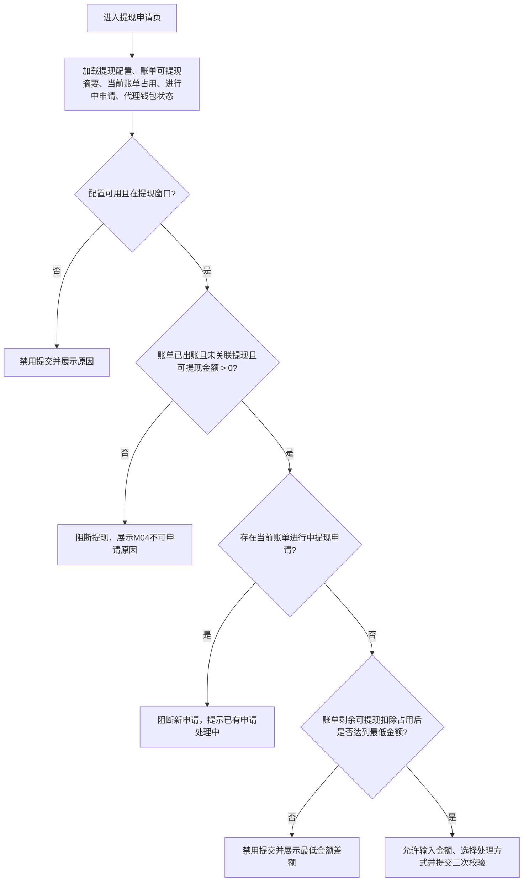

# 代理商需求信息

## 文档信息

| 字段 | 内容 |
|---|---|
| 文档标题 | 静态代理-代理商需求文档 |
| 文档编号 | PRD-2026-Agent-Static-Proxy |
| 产品版本 | v0.1 |
| 创建日期 | 2026-06-09 |
| 最后更新 | 2026-06-10 |
| 状态 | 草稿 |
| 目标路径 | `/IP代理/代理商/` |
| PRD 粒度 | 交付级 |
| 关联全局决策 | `decisions/00-global.md` |
| 关联编排文件 | `PRD-orchestration.md` |
| 关联模块 PRD | `PRD-M01-代理商首页-价格设置.md`、`PRD-M02-我的用户与用户充值.md`、`PRD-M03-销售订单.md`、`PRD-M04-我的收入与月度账单.md`、`PRD-M05-提现申请.md` |

## 修订历史

| 版本 | 日期 | 变更说明 |
|---|---|---|
| v0.1 | 2026-06-09 | 基于 M01-M05 decisions、原型与 Mermaid 图集生成完整交付级 PRD |
| v0.2 | 2026-06-10 | 同步 M03 → M04 → M05 最终收入口径更新，并关闭 Q-01 / Q-04 / Q-07 / Q-10 / Q-14 结论 |

## 一、问题陈述

静态代理业务需要补齐代理商自助工作台。代理商需要能配置自己面向下级用户的可售国家与价差，管理已绑定用户，为下级用户充值，查看成交订单、平台退款和最终收入，按后台出账日查看月账单，并基于已出账可提现金额发起提现申请。

当前代理商相关能力分散在价格、订单、钱包、账单与提现口径中，若不统一定义，容易出现以下问题：

- 未配置国家被代理商下级用户误售。
- 代理价格、平台成本、平台退款和最终收入口径前后不一致。
- 代理给用户充值缺少归属校验、资金原子性和二次校验规则。
- 月账单与实时销售订单混用，导致出账后重算、导出和提现口径不稳定。
- 提现入口、账单可提现占用、处理方式和提现记录状态缺少闭环。

本 PRD 将「代理商」定义为代理端自助工作台，而不是后台运营管理模块。

## 二、目标

| 编号 | 目标描述 | 衡量指标 | 目标值 | 当前值 | 衡量时间 |
|---|---|---|---|---|---|
| G-01 | 让代理商能独立完成静态代理可售国家与价差配置 | 价格配置保存成功率 | ≥ 99%【待确认】 | 【待确认】 | 上线后 14 天 |
| G-02 | 确保代理商下级用户只能购买代理商已配置且平台仍可售国家 | 未配置国家购买拦截成功率 | 100% | 【待确认】 | 持续监控 |
| G-03 | 让代理商能安全地给下级用户充值 | 用户充值成功资金一致率 | 100% | 【待确认】 | 持续监控 |
| G-04 | 让代理商能按成交订单理解销售额、平台退款和最终收入 | 销售订单详情查看成功率 | ≥ 99%【待确认】 | 【待确认】 | 上线后 14 天 |
| G-05 | 让代理商能按后台出账日完成月度对账和导出 | 已出账账单导出成功率 | ≥ 98%【待确认】 | 【待确认】 | 上线后 30 天 |
| G-06 | 让代理商能基于已出账可提现金额发起提现并查看状态 | 提现申请提交成功率 | ≥ 95%【待确认】 | 【待确认】 | 上线后 30 天 |

## 三、非目标

| 非目标 | 排除原因 |
|---|---|
| 后台代理商开户、审核、禁用、等级体系 | 本期只做代理端自助工作台，后台运营管理另行规划 |
| 主动邀请、创建、绑定、解绑下级用户 | 本期只查看与管理已绑定 `agency_id` 的用户 |
| 重写用户购买配置页、Checkout、我的 IP | 下级用户仍复用既有用户端购买、订单、支付与交付链路 |
| 后台提现审核、打款、入账失败后台处理 | 本期只定义代理端申请入口和状态展示，后台能力作为依赖 |
| 多级代理、推广素材、邀请码裂变 | 超出当前代理商闭环 |
| 多币种、汇率换算、税务发票、手续费计算 | 本期金额统一 USD；手续费如需支持需资金侧另行确认 |
| 当前未出账周期导出为正式账单 | 未出账周期只做实时预估，不作为正式账单或提现依据 |

## 四、用户角色与用户故事

### 4.1 用户角色

| 角色 | 说明 | 权限边界 |
|---|---|---|
| 代理商 | `t_user.is_agent = 1` 的用户 | 可访问代理商工作台，只能管理自己名下配置、用户、订单、账单、提现 |
| 代理商下级用户 | `t_user.agency_id = 代理商用户 id` 的普通用户 | 购买国家受代理商已新增国家配置约束 |
| 非代理商用户 | 未登录或 `is_agent != 1` 的用户 | 访问代理商工作台展示无权限 / 未开通代理商页 |
| 平台运营 / 财务 / 后台 | 后台能力提供方 | 不在本期代理端页面展开 |

### 4.2 用户故事

| 编号 | 用户故事 | 优先级 | 验收标准 |
|---|---|---|---|
| US-01 | 作为代理商，我想配置已开通国家的代理加价，以便控制下级用户静态代理最终售价和我的价差收入。 | P0 | 配置合法加价后保存成功；保存后购买页按该配置展示代理售卖价。 |
| US-02 | 作为代理商，我想新增可售国家配置，以便把该国家开放给下级用户购买。 | P0 | 只能新增平台可配置且未新增国家；新增后默认加价为 0。 |
| US-03 | 作为代理商下级用户，我只能购买代理商已配置且平台仍可售国家，以便购买范围符合代理商售卖规则。 | P0 | 购买页不展示未配置国家；无可售国家时展示空态。 |
| US-04 | 作为代理商，我想查看自己的下级用户，以便找到需要服务或充值的用户。 | P0 | 只展示 `agency_id = 当前代理商用户 id` 的用户。 |
| US-05 | 作为代理商，我想给下级用户充值，以便用户继续购买或续费静态代理。 | P0 | 通过支付密码校验后，代理钱包扣减、用户钱包增加同成同败。 |
| US-06 | 作为代理商，我想查看代理下用户成交订单，以便对账销售额、平台退款和最终收入。 | P0 | 只展示成交订单；详情展示订单快照、支付拆分、交付退款和收入明细。 |
| US-07 | 作为代理商，我想理解退款、交付失败对最终收入的影响，以便知道为什么收入变化。 | P0 | 订单详情能展示平台退款、退款影响、最终收入和关联订单。 |
| US-08 | 作为代理商，我想查看按后台出账日生成的月账单，以便做正式对账。 | P0 | 月账单只展示后台已生成账单；生成后不重算。 |
| US-09 | 作为代理商，我想导出已出账账单，以便线下对账和归档。 | P0 | 已出账账单可导出冻结快照；导出失败可重试。 |
| US-10 | 作为代理商，我想从可提现账单发起提现申请，以便提取已结算收入。 | P0 | 满足提现条件时可提交；提交成功占用账单剩余可提现金额并生成提现记录。 |
| US-11 | 作为代理商，我想查看提现记录和状态，以便知道审核、驳回、入账、线下处理或失败进展。 | P0 | 提现记录展示状态、金额、处理方式 / 收款对象、冻结 / 处理结果和状态时间线。 |

## 五、全局业务规则

| 编号 | 规则 | 说明 |
|---|---|---|
| BR-01 | 代理商访问权限 | 所有代理端页面均需登录且 `is_agent=1`；否则展示无权限 / 未开通代理商页。 |
| BR-02 | 代理商数据隔离 | 所有配置、用户、订单、账单、提现均以后端当前登录代理商身份过滤，不接受前端传入任意 `agency_id` 覆盖。 |
| BR-03 | 下级用户范围 | 只展示 `platform_id` 相同且 `t_user.agency_id = 当前代理商用户 id`、未删除的用户。 |
| BR-04 | 收入口径 | 支付成功后先生成预计收入；平台完成交付或退款后，最终收入 = 平台最终销售额 - 平台最终成本。 |
| BR-05 | 价格编辑模型 | 代理商不直接编辑最终售卖价，只编辑“代理加价 / 差额”；默认 0，即按平台价格售卖。 |
| BR-06 | 国家销售权限 | 代理商下级用户可购买国家必须来自该代理商已新增配置，且平台仍可售。未新增国家无权限销售。 |
| BR-07 | 平台下架国家 | 若平台下架某国家，代理商配置列表保留并标记「平台已下架」，详情只读，下级用户不可购买。 |
| BR-08 | 订单快照 | 已成交订单以创建 / 成交时快照结算，后续价格、国家、代理归属变化不影响历史订单。 |
| BR-09 | 续费重新校验 | 续费作为新订单，需重新校验当前 `agency_id`、代理可售国家、平台上架状态和当前代理价差。 |
| BR-10 | 充值资金原子性 | 代理钱包扣减与用户钱包增加必须同成同败；任一失败整笔回滚。 |
| BR-11 | 月账单出账 | 月账单按后台配置出账日 / 时间生成，不按自然月自动冻结。 |
| BR-12 | 账单不可重算 | 账单生成成功并进入已出账后，主表金额、明细快照、导出数据源均不允许重算或覆盖。 |
| BR-13 | 跨期最终收入确认 | 原订单所在账单已出账后才完成交付 / 退款确认的，不修改历史账单，进入确认发生时所在后续账期并引用原订单 / 原账单。 |
| BR-14 | 账单提现占用 | 一张账单同一时间最多关联一笔提现申请；提现申请创建后占用该账单剩余可提现金额，驳回 / 关闭后释放。 |
| BR-15 | 提现处理方式 | 提现支持代理商钱包和线下转账；代理商钱包不可用时仅禁用钱包方式，不阻断线下转账申请。 |

## 六、非功能性需求

| 类型 | 需求描述 | 衡量标准 |
|---|---|---|
| 安全 | 资金操作必须要求支付密码 / 二次校验 | 用户充值、提现申请提交前必须校验；失败不得发起资金变动 |
| 数据一致性 | 价格配置、订单快照、收入明细、账单快照需形成可追溯链路 | 任一订单能追溯到代理归因、价格快照、收入计算明细、账单明细 |
| 可用性 | 列表、指标、详情支持局部失败和重试 | 指标失败不阻塞列表；明细失败不影响摘要展示 |
| 幂等性 | 资金提交防重复 | 用户充值、提现申请需后端幂等键 / 单号防重复扣款或冻结 |
| 性能 | 列表页分页加载，默认每页 20 条 | 用户、订单、账单、提现记录列表均支持分页 |
| 隐私 | 代理端展示下级用户联系方式需脱敏 | 邮箱、手机号脱敏；M03 不展示邮箱 / 手机 |
| 审计 | 关键资金与收入变化留记录 | 充值、平台收款、平台退款、收入确认、提现冻结、释放、入账均需可追溯 |

## 七、功能需求

### 7.1 产品结构

```text
静态代理-代理商
├── M01 代理商首页-价格设置
│   ├── 配置列表
│   ├── 新增配置
│   ├── 配置详情
│   ├── 价格计算器
│   └── 下级购买页国家过滤
├── M02 我的用户与用户充值
│   ├── 下级用户列表
│   ├── 用户详情
│   └── 用户充值弹窗
├── M03 销售订单
│   ├── 成交订单列表
│   ├── 订单详情
│   ├── 续费校验快照
│   └── 平台退款 / 最终收入解释
├── M04 我的收入与月度账单
│   ├── 当前出账周期实时指标
│   ├── 月账单列表
│   ├── 月账单详情
│   ├── 账单导出
│   └── 申请提现入口
└── M05 提现申请
    ├── 提现申请页
    ├── 提现记录列表
    └── 提现详情 / 状态时间线
```

### 7.2 功能需求清单

| 需求ID | 需求描述 | 所属用户故事 | 优先级 | 验收标准 | 对应界面 |
|---|---|---|---|---|---|
| FR-M01-01 | 代理商权限校验与无权限页 | US-01 | P0 | 非代理商访问时展示无权限，不返回代理商数据 | P-M01-6 |
| FR-M01-02 | 配置列表展示已新增国家配置 | US-01 | P0 | 只展示当前代理商已新增国家，排序为最近更新时间倒序 → 国家代码 A-Z | P-M01-1 |
| FR-M01-03 | 新增国家配置 | US-02 | P0 | 只能选择平台可配置且未新增国家；新增后默认加价 0 | P-M01-3 |
| FR-M01-04 | 配置详情加价编辑与保存 | US-01 | P0 | 加价不得小于 0；保存成功刷新更新时间和策略摘要 | P-M01-2 |
| FR-M01-05 | 价格计算器试算 | US-01 | P0 | 计算器只读，读取当前草稿，不反写配置 | P-M01-2 |
| FR-M01-06 | 下级购买国家过滤 | US-03 | P0 | 绑定代理商用户只可购买代理商已配置且平台可售国家 | 联动购买页 |
| FR-M02-01 | 下级用户列表与归属过滤 | US-04 | P0 | 后端强制按当前代理商过滤 `agency_id` | P-M02-1 |
| FR-M02-02 | 下级用户搜索、筛选、分页 | US-04 | P0 | 支持账号 / 昵称 / 邮箱 / 手机搜索和状态、注册时间筛选 | P-M02-1 |
| FR-M02-03 | 下级用户详情 | US-04 | P0 | 展示基础信息、状态、用户钱包余额、最近充值记录 | P-M02-2 |
| FR-M02-04 | 充值金额录入与余额预校验 | US-05 | P0 | 金额 > 0、最多 2 位小数，不超过代理钱包可用余额和风控限额 | P-M02-3 |
| FR-M02-05 | 支付密码 / 二次校验 | US-05 | P0 | 未通过二次校验不得发起资金转账 | P-M02-4 |
| FR-M02-06 | 原子转账与失败回滚 | US-05 | P0 | 代理扣款与用户入账同成同败；失败不产生单边资金变动 | P-M02-4 |
| FR-M03-01 | 销售订单列表 | US-06 | P0 | 只展示当前代理下用户成交订单，不展示待支付、取消、过期订单 | P-M03-1 |
| FR-M03-02 | 销售订单筛选与搜索 | US-06 | P0 | 支持支付成功时间、订单类型、国家、交付状态、收入状态筛选 | P-M03-1 |
| FR-M03-03 | 销售订单详情 | US-06 | P0 | 展示订单快照、价格快照、支付拆分、交付退款和收入明细 | P-M03-2 |
| FR-M03-04 | 续费重新校验快照 | US-06 | P0 | 续费订单详情展示关联原订单、校验结果和新价格快照 | P-M03-2 |
| FR-M03-05 | 退款与最终收入解释 | US-07 | P0 | 退款 / 交付失败展示平台退款金额、退款影响、最终收入和收入明细 | P-M03-2 |
| FR-M04-01 | 当前出账周期实时指标 | US-08 | P0 | 展示销售额、平台退款、最终收入、待确认收入，并说明不是正式账单 | P-M04-1 |
| FR-M04-02 | 月账单列表 | US-08 | P0 | 只展示后台已创建账单，支持账期、状态、提现入口、导出状态筛选 | P-M04-1 |
| FR-M04-03 | 月账单详情 | US-08 | P0 | 展示冻结快照、金额汇总、最终收入明细、退款影响明细 | P-M04-2 |
| FR-M04-04 | 账单导出 | US-09 | P0 | 已出账账单可导出冻结快照；生成中 / 失败不可导出 | P-M04-3 |
| FR-M04-05 | 申请提现入口 | US-10 | P0 | 可申请时跳转 M05；不可申请时展示原因 | P-M04-4 |
| FR-M05-01 | 提现资格校验 | US-10 | P0 | 校验提现配置、窗口、账单剩余可提现金额、当前账单冻结 / 处理中占用、进行中申请和处理方式 | P-M05-1 |
| FR-M05-02 | 提现金额录入 | US-10 | P0 | 金额 > 0、最多 2 位小数，不低于最低金额、不超过当前可申请金额 | P-M05-1 |
| FR-M05-03 | 提现支付密码 / 二次校验 | US-10 | P0 | 未通过校验不得创建提现申请 | P-M05-1 |
| FR-M05-04 | 提现申请创建与冻结 | US-10 | P0 | 创建成功后冻结金额、占用账单剩余可提现金额并刷新记录 | P-M05-1 |
| FR-M05-05 | 提现记录列表 | US-11 | P0 | 展示申请单号、金额、处理方式 / 收款对象、状态、申请时间、冻结 / 处理结果 | P-M05-2 |
| FR-M05-06 | 提现详情 / 状态时间线 | US-11 | P0 | 展示申请快照、冻结信息、状态流转、驳回 / 失败原因 | P-M05-3 |

## 八、界面功能详细说明

### 8.0 页面总览与全局流转

#### 页面清单

| 页面编号 | 页面名称 | 类型 | 入口 | 出口 |
|---|---|---|---|---|
| P-M01-1 | 配置列表页 | 页面 | `/IP代理/代理商/` 默认入口 | 配置详情、新增配置、我的用户、销售订单、我的收入 |
| P-M01-2 | 配置详情页 | 页面 | 配置列表编辑 / 新增成功 | 返回列表、保存、清空、计算器试算 |
| P-M01-3 | 新增配置弹窗 | 弹窗 | 配置列表 → 新增配置 | 取消 / 新增并进入详情 |
| P-M01-4 | 清空当前国家加价确认 | 弹窗 | 配置详情 → 清空 | 取消 / 确认清空 |
| P-M01-5 | 未保存变更确认 | 弹窗 | 详情存在未保存变更时离开 | 留在当前页 / 放弃离开 |
| P-M01-6 | 无权限 / 未开通页 | 页面 | 非代理商访问代理商页 | 联系客户经理 |
| P-M02-1 | 我的用户列表 | 页面 | 导航 → 我的用户 | 用户详情、充值弹窗、销售订单按用户筛选 |
| P-M02-2 | 下级用户详情 | 抽屉 / 移动详情页 | 用户列表 → 详情 | 关闭、给用户充值、查看销售订单 |
| P-M02-3 | 充值金额录入 | 弹窗 | 用户列表 / 详情 → 充值 | 取消、下一步 |
| P-M02-4 | 支付密码 / 二次校验 | 弹窗 | 金额录入通过 | 返回修改、确认充值 |
| P-M03-1 | 销售订单列表 | 页面 | 导航 → 销售订单 | 销售订单详情 |
| P-M03-2 | 销售订单详情 | 抽屉 / 移动详情页 | 销售订单列表 → 详情 | 返回列表 |
| P-M04-1 | 我的收入 / 月账单列表 | 页面 | 导航 → 我的收入 | 账单详情、导出、申请提现 |
| P-M04-2 | 月账单详情 | 抽屉 / 移动详情页 | 月账单列表 → 详情 | 返回列表、导出、申请提现 |
| P-M04-3 | 导出任务状态 | 行内状态 / 弹层 | 列表或详情 → 导出 | 下载、重试 |
| P-M04-4 | 申请提现入口 | 跳转入口 | 列表或详情 → 申请提现 | M05 提现申请 |
| P-M05-1 | 提现申请页 | 页面 | M04 可提现账单 → 申请提现 | 提交申请、查看记录、去安全中心 |
| P-M05-2 | 提现记录列表 | 同页列表区 | 提现申请页 | 提现详情 |
| P-M05-3 | 提现详情 | 侧栏 / 移动详情页 | 提现记录 → 详情 | 返回记录 |

#### 全局流转图



完整 Mermaid 图集见：

- `diagrams/01-代理商首页-价格设置-mermaid.md`
- `diagrams/02-我的用户与用户充值-mermaid.md`
- `diagrams/03-销售订单-mermaid.md`
- `diagrams/04-我的收入与月度账单-mermaid.md`
- `diagrams/05-提现申请-mermaid.md`

### 8.1 M01 代理商首页-价格设置

#### 原型与图集

| 类型 | 文件 |
|---|---|
| HTML 原型 | `../prototypes/agent-price-config-list-detail-prototype.html` |
| 桌面截图 | `../prototypes/agent-price-config-list-detail-prototype-desktop.png` |
| 移动截图 | `../prototypes/agent-price-config-list-detail-prototype-mobile.png` |
| Mermaid 图集 | `diagrams/01-代理商首页-价格设置-mermaid.md` |
| 模块 PRD | `PRD-M01-代理商首页-价格设置.md` |

#### 关键界面元素

| 界面 | 核心元素 | 业务规则 |
|---|---|---|
| 配置列表 | 指标卡、搜索、策略筛选、国家配置表、新增配置 | 只展示已新增国家；新增国家来自平台可配置且未新增集合；策略摘要分为按平台价售卖、已加价 n/m、全量加价 m/m。 |
| 新增配置弹窗 | 国家选择、确认新增 | 确认后立即创建配置，默认共享 / 独享所有加价为 0，并进入详情。 |
| 配置详情 | 共享 / 独享价格表、代理加价输入、保存、清空、计算器 | 只编辑代理加价 / 差额；加价不得小于 0；保存粒度为单国家共享 + 独享全量配置；计算器只读不反写。 |
| 平台下架态 | 下架标识、详情只读 | 列表保留历史配置并标记「平台已下架」；详情禁用编辑、清空、保存；下级用户不可购买。 |
| 未保存变更确认 | 留在当前页、放弃并离开 | 详情存在未保存变更时，返回列表、切换导航、离开页面均触发确认。 |

#### 页面级四态

| 页面 | 空态 | 加载态 | 错误态 | 成功态 |
|---|---|---|---|---|
| 配置列表 | 无配置展示引导新增；筛选无结果展示重置 | 指标和列表骨架 | 列表失败可重试；权限失败进入无权限页 | 展示配置列表与策略摘要 |
| 配置详情 | 配置不存在提示返回列表 | 详情、价格表、计算器骨架 | 保存失败保留草稿；下架只读提示 | 保存成功刷新更新时间与策略 |
| 新增弹窗 | 无可新增国家提示已全部配置 | 国家下拉加载中 | 新增失败保留弹窗并提示 | 创建配置并进入详情 |

### 8.2 M02 我的用户与用户充值

#### 原型与图集

| 类型 | 文件 |
|---|---|
| HTML 原型 | `../prototypes/agent-users-recharge-prototype.html` |
| 桌面截图 | `../prototypes/agent-users-recharge-prototype-desktop.png` |
| 移动截图 | `../prototypes/agent-users-recharge-prototype-mobile.png` |
| Mermaid 图集 | `diagrams/02-我的用户与用户充值-mermaid.md` |
| 模块 PRD | `PRD-M02-我的用户与用户充值.md` |

#### 关键界面元素

| 界面 | 核心元素 | 业务规则 |
|---|---|---|
| 我的用户列表 | 指标卡、搜索、状态筛选、注册时间筛选、用户表、充值按钮 | 后端强制按当前代理商过滤；邮箱 / 手机脱敏；不可用 / 未激活用户禁用充值。 |
| 用户详情 | 基础信息、代理归属、用户钱包余额、最近 5 条充值记录 | 详情接口必须校验用户仍属于当前代理；不提供改绑、解绑、转移归属。 |
| 充值金额录入 | 目标用户摘要、代理钱包余额、充值金额、备注、下一步 | 金额必须 > 0、最多 2 位小数；不得超过代理钱包可用余额；风控上下限由后端配置返回。 |
| 支付密码校验 | 充值摘要、支付密码、设置密码入口、确认充值 | 未设置支付密码禁用确认；提交时重校验代理身份、用户归属、余额、风控和支付密码。 |

#### 资金流程



#### 页面级四态

| 页面 | 空态 | 加载态 | 错误态 | 成功态 |
|---|---|---|---|---|
| 我的用户列表 | 暂无下级用户；筛选无结果可重置 | 指标和列表骨架 | 列表失败可重试；钱包失败禁用充值 | 展示用户列表；充值成功刷新目标行和钱包余额 |
| 用户详情 | 无最近充值记录 | 信息、余额、记录分区 loading | 无权查看、详情失败、余额失败可局部提示 | 展示详情并可发起充值 |
| 充值弹窗 | 金额 / 支付密码为空按钮 disabled | 提交时按钮 loading，防重复 | 金额非法、余额不足、用户不可充值、密码错误、转账失败均保留弹窗 | 成功关闭并 Toast，刷新列表 / 详情 |

### 8.3 M03 销售订单

#### 原型与图集

| 类型 | 文件 |
|---|---|
| HTML 原型 | `../prototypes/agent-sales-orders-prototype.html` |
| 桌面截图 | `../prototypes/agent-sales-orders-prototype-desktop.png` |
| 移动截图 | `../prototypes/agent-sales-orders-prototype-mobile.png` |
| Mermaid 图集 | `diagrams/03-销售订单-mermaid.md` |
| 模块 PRD | `PRD-M03-销售订单.md` |

#### 关键界面元素

| 界面 | 核心元素 | 业务规则 |
|---|---|---|
| 销售订单列表 | 当前统计周期指标、支付成功时间、订单类型、国家、交付状态、收入状态、搜索、订单表 | 只展示成交订单；默认近 30 天；顶部指标不随筛选变化；搜索只支持订单号和用户账号。 |
| 销售订单详情 | 订单标题、下单用户快照、订单类型、续费信息、规格快照、价格快照、支付拆分、交付退款、收入明细 | 历史订单按创建时快照展示；续费订单展示关联原订单号和续费校验结果；收入明细异常展示原因。 |

#### 收入状态

| 收入状态 | 展示含义 | 对收入影响 |
|---|---|---|
| 待确认 | 已支付但交付 / 退款结果尚未确认 | 展示预计收入，不作为最终收入 |
| 已确认 | 无退款且最终收入已确认 | 最终收入等于预计收入 |
| 部分退款后确认 | 平台已完成部分退款并确认最终收入 | 展示退款金额、退款影响和最终收入 |
| 全额退款 | 平台已完成全额退款 | 最终收入为 `$0.00` |
| 收入异常 | 交付、退款或收入计算数据异常 | 详情展示异常原因，需系统 / 人工修复 |

#### 页面级四态

| 页面 | 空态 | 加载态 | 错误态 | 成功态 |
|---|---|---|---|---|
| 销售订单列表 | 暂无销售订单；筛选无结果可重置 | 指标和表格骨架 | 列表失败可重试；指标失败不阻塞列表 | 展示指标、筛选区和订单表 |
| 销售订单详情 | 订单不存在或无权查看 | 详情骨架，返回可用 | 详情失败可重试；收入明细失败局部提示 | 展示订单快照、续费校验、支付拆分、交付退款和收入明细 |

### 8.4 M04 我的收入与月度账单

#### 原型与图集

| 类型 | 文件 |
|---|---|
| HTML 原型 | `../prototypes/agent-income-billing-prototype.html` |
| 桌面截图 | `../prototypes/agent-income-billing-prototype-desktop.png` |
| 移动截图 | `../prototypes/agent-income-billing-prototype-mobile.png` |
| Mermaid 图集 | `diagrams/04-我的收入与月度账单-mermaid.md` |
| 模块 PRD | `PRD-M04-我的收入与月度账单.md` |

#### 关键界面元素

| 界面 | 核心元素 | 业务规则 |
|---|---|---|
| 我的收入 / 月账单列表 | 当前周期指标、出账配置提示、账期筛选、账单状态、提现入口状态、导出状态、月账单表 | 当前周期指标为实时预估，不是正式账单；月账单列表只展示后台已创建账单。 |
| 月账单详情 | 账单标题、账单快照、金额汇总、最终收入明细、退款影响明细、导出、申请提现 | 详情读取冻结快照，不重新读取实时订单；只纳入最终收入已确认的订单。 |
| 导出任务 | 导出、下载、重试 | 只导出已出账账单的冻结快照；P0 推荐 XLSX，含账单汇总、最终收入明细、退款影响明细。 |
| 申请提现入口 | 可申请 / 不可申请原因 | 可申请时带入 `bill_no`、账期、可提现金额进入 M05；不可申请时展示原因。 |

#### 账单状态机



#### 页面级四态

| 页面 | 空态 | 加载态 | 错误态 | 成功态 |
|---|---|---|---|---|
| 月账单列表 | 暂无月账单；筛选无结果可重置 | 实时指标和列表骨架 | 列表失败可重试；实时指标失败不阻塞列表 | 展示实时指标、出账配置、账单列表 |
| 月账单详情 | 账单不存在或无权查看 | 详情骨架 | 详情失败可重试；明细失败局部提示 | 展示账单快照、金额汇总、明细、导出 / 提现入口 |

### 8.5 M05 提现申请

#### 原型与图集

| 类型 | 文件 |
|---|---|
| HTML 原型 | `../prototypes/agent-withdrawal-prototype.html` |
| 桌面截图 | `../prototypes/agent-withdrawal-prototype-desktop.png` |
| 移动截图 | `../prototypes/agent-withdrawal-prototype-mobile.png` |
| Mermaid 图集 | `diagrams/05-提现申请-mermaid.md` |
| 模块 PRD | `PRD-M05-提现申请.md` |

#### 关键界面元素

| 界面 | 核心元素 | 业务规则 |
|---|---|---|
| 提现申请页 | 账单剩余可提现金额、提现冻结 / 处理中占用金额、当前可申请提现、提现配置、提现金额、提现处理方式、收款对象、支付密码、提交 | 当前可申请金额 = `账单剩余可提现金额 - 当前账单已冻结 / 处理中占用金额`；代理钱包可用余额不参与额度计算。 |
| 提现记录列表 | 申请时间筛选、状态筛选、记录表、详情入口 | 仅展示当前代理商申请；默认按申请时间倒序。 |
| 提现详情 | 申请快照、冻结信息、状态时间线、驳回 / 失败原因 | 代理端只读；不提供撤销、催审、审核、打款或重试入账操作。 |

#### 提现资格校验



#### 提现状态

| 状态 | 展示含义 | 对提现 / 余额影响 |
|---|---|---|
| 待审核 / 审核中 | 已创建申请单，等待后台审核 | 金额已冻结并占用账单可提现金额 |
| 已驳回 | 审核未通过 | 冻结金额释放 |
| 入账处理中 | 审核通过，等待钱包入账 | 金额保持冻结 |
| 已入钱包 | 钱包入账成功 | 冻结转为钱包入账记录 |
| 入账失败待处理 | 钱包入账失败，等待后台处理 | 金额保持冻结，代理端不可操作 |
| 财务处理中 | 线下转账路径审核通过，等待财务处理 | 金额保持冻结 |
| 已完成 | 线下转账处理完成 | 冻结转为线下完成记录 |
| 处理失败待处理 | 线下转账处理失败，等待后台处理 | 金额保持冻结，代理端不可操作 |

#### 页面级四态

| 页面 | 空态 | 加载态 | 错误态 | 成功态 |
|---|---|---|---|---|
| 提现申请页 | 账单不可提现、不在窗口、金额低于最低金额、已有进行中申请均展示阻断原因 | 摘要、配置、记录骨架；配置加载期间按钮 disabled | 权限失败、配置失败、记录失败分区提示 | 资格满足时可提交；成功后刷新冻结 / 占用金额、可提现金额和记录 |
| 提现记录 / 详情 | 无记录 / 筛选无结果 | 列表或详情骨架 | 记录失败可重试；详情无权提示不存在或无权查看 | 展示申请状态、冻结流水、状态时间线和原因 |

## 九、数据需求与能力依赖

> 本 PRD 不定义具体接口路径、请求体和响应体，只定义交付所需的数据对象、能力和约束。

| 数据 / 能力 | 涉及模块 | 用途 | 关键约束 / 字段 | 状态 |
|---|---|---|---|---|
| 代理商权限 | 全部 | 判断是否可访问代理商工作台 | `t_user.is_agent`、当前登录用户 | 已有字段，需接入 |
| 代理关系 | M02 / M03 | 限制下级用户和订单范围 | `t_user.agency_id`、`platform_id`、`deleted` | 已有字段，需后端强制过滤 |
| 平台国家与价格配置 | M01 | 新增配置、价格表、计算器、下架判断 | 国家、平台价格、平台状态、规格枚举 | 需与购买配置页对齐 |
| 代理商国家配置 | M01 | 保存已新增国家与代理加价 | `agency_id + country_code` 建议唯一；页面按代理加价 / 差额编辑 | 产品不关注底层存储口径，研发按技术方案保存 |
| 下级购买页国家过滤 | M01 | 限制代理下用户可购国家 | 只展示已新增且平台可售国家 | 需购买页接入 |
| 代理钱包余额 | M02 / M05 | M02 充值预校验；M05 代理商钱包处理方式可用性判断 | availableBalance、frozenAmount、currency=USD、walletStatus | 复用现有钱包域 |
| 用户钱包余额 | M02 | 用户充值入账与展示 | targetUserId、availableBalance | 钱包域确认 |
| 充值转账单与流水 | M02 | 代理扣款、用户入账、结果追溯 | transferId、agentDebitFlowId、userCreditFlowId、status | 需幂等 |
| 订单归因与价格快照 | M03 | 历史收入解释 | agency_id、用户快照、规格、代理售价、平台成本、预计收入 | 研发会保存快照 |
| 续费校验快照 | M03 | 解释续费订单价格和国家可售判断 | sourceOrderNo、checkPassed、countryStatus、markupSnapshot | 需订单域返回 |
| 销售订单收入计算结果 | M03 | 预计收入、退款影响和最终收入 | expectedIncome、refundImpactAmount、finalIncome、incomeStatus、orderNo | 需订单 / 收入域确认 |
| 后台出账配置 | M04 | 生成月账单和页面提示 | bill_day、bill_time、timezone=平台时区、config_version | 时区已确认；字段与越界规则待研发 / 财务确认 |
| 月账单主表 / 明细表 | M04 | 保存账单冻结快照 | billNo、period、amount fields、details | 需新增 / 确认 |
| 导出任务 | M04 | 生成 XLSX 导出文件 | exportTaskId、status、fileUrl、errorCode | 【待确认】 |
| 提现配置 | M05 | 最低金额、提现窗口、限额、次数 | minAmount、window、limits | 【待确认】 |
| 提现申请与冻结流水 | M05 | 申请、冻结、驳回释放、钱包入账 / 线下处理状态 | applicationNo、billNo、amount、processMethod、receiverSnapshot、freezeFlowNo、walletInFlowNo、status | 同一账单同一时间最多关联一笔提现申请 |

## 十、上线计划

| 里程碑 | 计划日期 | 交付物 | 状态 |
|---|---|---|---|
| PRD 评审 | 【待确认】 | `代理商-prd/PRD.md` | 待排期 |
| 设计确认 | 【待确认】 | 五个模块 HTML 原型 / 截图 / 组件稿 | 待排期 |
| 技术方案评审 | 【待确认】 | 权限、价格配置、钱包、订单快照、账单、提现方案 | 待排期 |
| 开发完成 | 【待确认】 | 代理商工作台前后端能力 | 待排期 |
| 测试完成 | 【待确认】 | 权限、配置、充值、订单、账单、提现测试用例 | 待排期 |
| 灰度发布 | 【待确认】 | 代理商灰度账号验证 | 待排期 |
| 全量上线 | 【待确认】 | 全量发布与监控 | 待排期 |

### 上线验收重点

- 非代理商无法访问代理商工作台数据。
- 代理商可新增国家、编辑加价、保存配置；平台下架国家不可售且详情只读。
- 代理下用户购买页只展示代理商已配置且平台可售国家。
- 代理商只能查看和充值自己名下用户；充值资金同成同败。
- 销售订单只展示成交订单，并保存代理归因、价格和预计收入快照。
- 平台退款 / 交付失败后，销售订单按最终收入口径展示退款金额和最终收入。
- 月账单按后台出账日生成，已出账账单不重算。
- 已出账账单可导出冻结快照；不可提现原因可解释。
- 提现申请满足资格校验和二次校验；提交成功冻结金额并展示记录状态。

## 十一、成功指标

| 指标类型 | 指标名称 | 目标值 | 当前值 | 衡量周期 | 数据来源 |
|---|---|---|---|---|---|
| 领先指标 | 价格配置保存成功率 | ≥ 99%【待确认】 | 【待确认】 | 上线后 14 天 | `save_agent_country_price_result` |
| 领先指标 | 用户充值成功率 | ≥ 99%【待确认】 | 【待确认】 | 上线后 14 天 | `agent_user_recharge_result` |
| 领先指标 | 销售订单列表加载成功率 | ≥ 99%【待确认】 | 【待确认】 | 上线后 14 天 | `agent_sales_orders_load_result` |
| 领先指标 | 月账单导出成功率 | ≥ 98%【待确认】 | 【待确认】 | 上线后 30 天 | `export_agent_income_bill_result` |
| 领先指标 | 提现申请提交成功率 | ≥ 95%【待确认】 | 【待确认】 | 上线后 30 天 | `agent_withdrawal_submit_result` |
| 质量指标 | 未配置国家购买拦截成功率 | 100% | 【待确认】 | 持续监控 | 服务端日志 / `block_agent_sale_country` |
| 质量指标 | 资金单边变动事故数 | 0 | 【待确认】 | 持续监控 | 钱包 / 资金审计 |

## 十二、数据埋点

| 模块 | 关键事件 | 用途 |
|---|---|---|
| M01 | `view_agent_price_config_list`、`create_agent_price_config_result`、`save_agent_country_price_result`、`use_agent_price_calculator`、`filter_agent_sale_country`、`block_agent_sale_country` | 价格配置、国家过滤和保存成功率 |
| M02 | `view_agent_users`、`search_agent_users`、`click_agent_user_recharge`、`agent_user_recharge_verify_result`、`agent_user_recharge_result` | 下级用户查找、充值转化和失败定位 |
| M03 | `view_agent_sales_orders`、`filter_agent_sales_orders`、`view_agent_sales_order_detail`、`view_agent_refund_income_impact`、`view_agent_final_income_detail` | 销售订单查看、退款与最终收入解释压力 |
| M04 | `view_agent_income_billing`、`filter_agent_income_bills`、`view_agent_income_bill_detail`、`export_agent_income_bill_result`、`click_agent_bill_withdraw_entry` | 月账单查看、导出、提现入口转化 |
| M05 | `view_agent_withdrawal_page`、`click_agent_withdrawal_submit`、`agent_withdrawal_submit_result`、`view_agent_withdrawal_block_reason`、`view_agent_withdrawal_detail` | 提现申请、阻断原因和状态查看 |

关键漏斗：

```text
代理商进入工作台
→ 完成国家配置
→ 下级用户购买成交
→ 销售订单确认最终收入
→ 月账单出账
→ 账单可申请提现
→ 提交提现申请
→ 审核 / 入账状态查看
```

## 十三、开放问题

| 编号 | 问题 | 领域 | 建议默认值 / 备注 | 影响 | 结论 |
|---|---|---|---|---|---|
| Q-01 | `t_static_config_agent_price` 当前字段命名更像最终代理价，页面已确认编辑“代理加价 / 差额”，是否需要产品约束存储口径 | 研发 / 产品 | 产品不关注底层存储口径，研发按技术方案保存；产品只要求页面编辑差额、计算和历史快照正确 | 价格和收入计算 | 不关注 |
| Q-02 | 界面展示“平台价格”还是“结算成本” | 产品 / 财务 | 当前统一使用“平台价格 / 平台系数” | 代理商理解和财务口径 | |
| Q-03 | 品质、UDP、带宽、连接数、天数、数量枚举需与购买配置页和后端最终对齐 | 产品 / 研发 | 复用购买配置页枚举 | 价格表和购买页一致性 |复用购买配置页枚举 |
| Q-04 | 钱包账户、可用余额、冻结余额、充值流水表结构 | 钱包 / 研发 | 复用现有钱包域，必要时新增代理转账记录 | M02 / M05 资金 | 复用现有 |
| Q-05 | 充值风控配置字段、默认值和错误码 | 风控 / 研发 | 后端配置返回最小额、单笔上限、每日上限、次数 | M02 充值提交 | 后端配置返回最小额、单笔上限、每日上限、次数 |
| Q-06 | 支付密码格式、锁定策略、是否叠加 2FA / 邮箱验证码 | 安全 | P0 只要求支付密码，安全策略由安全侧返回 | M02 / M05 二次校验 | P0 只要求支付密码 |
| Q-07 | 订单创建时快照字段落在订单表、订单扩展表还是收入快照表 | 订单 / 研发 | 必须保存归因与价格快照，不可用当前价格反推历史 | M03 / M04 | 研发会保存快照 |
| Q-08 | 部分退款按 IP 数量分摊时的小数精度和尾差归属 | 财务 / 订单 | 优先使用交付明细；无明细按 IP 数量分摊 | M03 最终收入 | |
| Q-09 | 收入计算异常时的系统重试、人工修复和代理端刷新机制 | 订单 / 研发 | 代理端展示收入异常，不提供修复操作 | M03 | |
| Q-10 | 后台出账配置的时区来源 | 结算 / 财务 | 平台级配置；账期边界按平台时区计算 | M04 | 平台时区为准 |
| Q-11 | 导出文件格式、保留时长和下载鉴权规则 | 结算 / 安全 | P0 推荐 XLSX；下载按当前代理鉴权 | M04 | |
| Q-12 | 月账单主表 / 明细表是否已有 | 结算 / 研发 | 若无则新增账单快照表 | M04 排期 | |
| Q-13 | 提现配置接口包含哪些字段：最低金额、窗口、单笔 / 单日限额、次数限制 | 资金 / 后台配置 | 后台配置返回，前端只展示和校验 | M05 | |
| Q-14 | 提现申请单与账单占用 / 关联字段、同账单重复提现防重机制 | 结算 / 研发 | 一张账单同一时间最多关联一笔提现申请 | M04 / M05 | 一张账单同一时间最多关联一笔提现申请 |
| Q-15 | 驳回 / 入账失败原因哪些可展示给代理商 | 运营 / 风控 | 代理端只展示可见原因，不暴露内部风控细节 | M05 | |
| Q-16 | PRD 评审、设计确认、开发、测试、灰度、全量上线日期 | 产品 / 项目 | 待项目排期 | 上线计划 | |

## 十四、依赖与风险

### 14.1 依赖项

| 依赖方 | 依赖内容 | 当前状态 | 风险等级 |
|---|---|---|---|
| 用户 / 权限域 | `is_agent`、`agency_id`、登录态、无权限态 | 已有字段，需统一接入 | 中 |
| 静态代理平台价格配置 | 可配置国家、平台价格、国家下架状态、规格枚举 | 需与购买配置页对齐 | 高 |
| 购买页 | 代理下级用户国家过滤、无可售国家空态、续费重新校验 | 需联动改造 | 高 |
| 钱包 / 资金 | 代理钱包、用户钱包、充值转账、提现冻结 / 释放 / 入账流水 | 表结构和接口需确认 | 高 |
| 订单域 | 归因快照、价格快照、续费校验快照、交付退款明细 | 需新增或确认字段 | 高 |
| 收入 / 结算 | 最终收入确认、月账单生成、账单快照、导出、账单提现占用 | 需新增或确认月账单快照与账单占用能力 | 高 |
| 安全中心 | 支付密码 / 二次校验、未设置支付密码入口 | 需提供安全策略和路由 | 中 |
| 数据平台 | 关键事件埋点、成功指标看板 | 待接入 | 中 |

### 14.2 风险识别

| 风险 | 影响 | 概率 | 等级 | 应对 |
|---|---|---|---|---|
| 代理加价字段与现有代理价格字段语义不一致 | 收入计算错误，历史订单难解释 | 中 | 高 | 产品不关注底层存储口径；研发需保证页面差额编辑、售价计算和订单快照一致 |
| 购买页未服务端强制过滤代理可售国家 | 未配置国家被误售 | 低 | 高 | 服务端按代理配置过滤；上线前做购买 / 续费回归 |
| 订单未保存价格和归因快照 | 后续价格变化影响历史收入解释 | 中 | 高 | 订单创建时冻结快照；M03/M04 只读快照 |
| 资金转账或提现缺少幂等 | 重复扣款、重复冻结 | 低 | 高 | 用户充值和提现申请必须使用幂等键 / 单号 |
| 账单出账后被重算或覆盖 | 对账、提现、审计失败 | 低 | 高 | 已出账账单快照不可重算；跨期最终收入确认进入后续账期 |
| 同一账单重复关联提现申请 | 重复占用或重复提现 | 中 | 高 | 后端按账单维度做进行中申请防重；同一账单同一时间最多关联一笔提现申请 |
| 导出文件下载鉴权不足 | 账单数据泄露 | 中 | 高 | 下载按当前代理身份鉴权，短期有效 |
| 后台审核 / 钱包入账 / 线下处理状态与代理端枚举不一致 | 代理商无法理解提现进展 | 中 | 中 | 状态枚举由资金 / 运营 / 财务确认，代理端只展示可见状态 |

## 十五、附录

### 15.1 附件清单

| 编号 | 附件名称 | 类型 | 位置 | 关联模块 |
|---|---|---|---|---|
| A-00 | 全局决策 | Markdown | `decisions/00-global.md` | 全局 |
| A-01 | M01 决策 | Markdown | `decisions/01-代理商首页-价格设置.md` | M01 |
| A-02 | M01 模块 PRD | Markdown | `PRD-M01-代理商首页-价格设置.md` | M01 |
| A-03 | M01 原型 | HTML / PNG | `../prototypes/agent-price-config-list-detail-prototype.html` | M01 |
| A-04 | M01 Mermaid 图集 | Markdown | `diagrams/01-代理商首页-价格设置-mermaid.md` | M01 |
| A-05 | M02 决策 | Markdown | `decisions/02-我的用户与用户充值.md` | M02 |
| A-06 | M02 模块 PRD | Markdown | `PRD-M02-我的用户与用户充值.md` | M02 |
| A-07 | M02 原型 | HTML / PNG | `../prototypes/agent-users-recharge-prototype.html` | M02 |
| A-08 | M02 Mermaid 图集 | Markdown | `diagrams/02-我的用户与用户充值-mermaid.md` | M02 |
| A-09 | M03 决策 | Markdown | `decisions/03-销售订单.md` | M03 |
| A-10 | M03 模块 PRD | Markdown | `PRD-M03-销售订单.md` | M03 |
| A-11 | M03 原型 | HTML / PNG | `../prototypes/agent-sales-orders-prototype.html` | M03 |
| A-12 | M03 Mermaid 图集 | Markdown | `diagrams/03-销售订单-mermaid.md` | M03 |
| A-13 | M04 决策 | Markdown | `decisions/04-我的收入与月度账单.md` | M04 |
| A-14 | M04 模块 PRD | Markdown | `PRD-M04-我的收入与月度账单.md` | M04 |
| A-15 | M04 原型 | HTML / PNG | `../prototypes/agent-income-billing-prototype.html` | M04 |
| A-16 | M04 Mermaid 图集 | Markdown | `diagrams/04-我的收入与月度账单-mermaid.md` | M04 |
| A-17 | M05 决策 | Markdown | `decisions/05-提现申请.md` | M05 |
| A-18 | M05 模块 PRD | Markdown | `PRD-M05-提现申请.md` | M05 |
| A-19 | M05 原型 | HTML / PNG | `../prototypes/agent-withdrawal-prototype.html` | M05 |
| A-20 | M05 Mermaid 图集 | Markdown | `diagrams/05-提现申请-mermaid.md` | M05 |
| A-21 | 代理商逻辑结构 | 图片 | `../assets/代理商逻辑结构.png` | 全局 |
| A-22 | SQL 资料 | Markdown / SQL | `../assets/Sqls.md`、`../assets/static_config.sql` | 数据依赖 |


- [M01](/SamPD/static-agency/agent-price-config-list-detail-prototype.html)
- [M01-废弃](/SamPD/static-agency/agent-price-workspace-prototype.html)
- [M02](/SamPD/static-agency/agent-users-recharge-prototype.html)
- [M03](/SamPD/static-agency/agent-sales-orders-prototype.html)
- [M04](/SamPD/static-agency/agent-income-billing-prototype.html)
- [M05](/SamPD/static-agency/agent-withdrawal-prototype.html)


### 15.2 PRD 自检

| 检查项 | 结果 |
|---|---|
| 所有模块 DoR 通过 | 通过：M01-M05 均有 decisions、模块 PRD、原型、Mermaid、字段 / 四态 |
| 页面清单与全局流转 | 通过：已覆盖 P-M01-1 至 P-M05-3 |
| US → FR → 界面追溯 | 通过：FR 表已映射到模块界面 |
| 字段表 / 核心元素 | 通过：正文保留关键元素，完整字段表见各模块 decisions |
| 页面级四态 | 通过：五个模块均覆盖空 / 加载 / 错误 / 成功 |
| 开放问题汇总 | 通过：Q-01 至 Q-16 已集中列出；Q-01 / Q-04 / Q-07 / Q-10 / Q-14 已回写结论 |
| 接口路径 | 不展开：本 PRD 只定义能力依赖，不定义具体 API 路径 |

### 15.3 TODO

- 一键加价比例：支持按国家或分组批量设置 `+x%` 或 `+$x`，不进入本期 P0。
- 销售订单导出：当前收敛到 M04 月账单导出，M03 不单独导出。
- 多币种、手续费、税务表单：本期不做，后续如涉及资金配置另行评审。

**文档结束**
