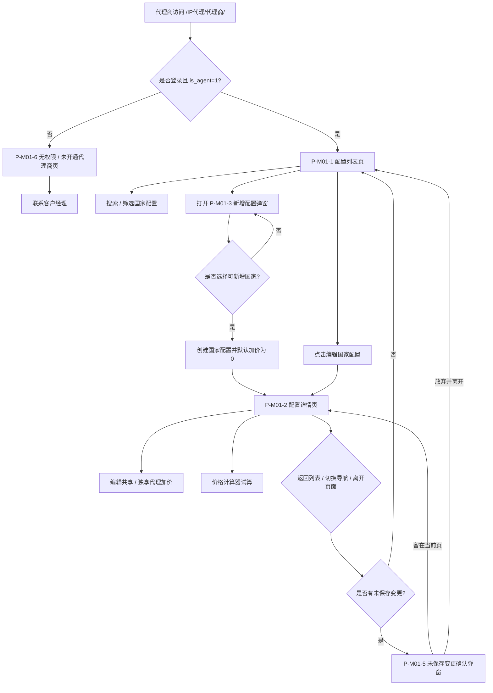
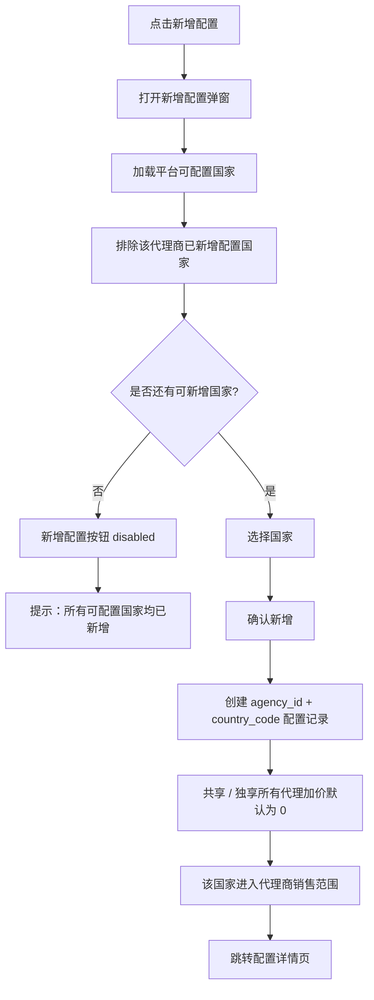
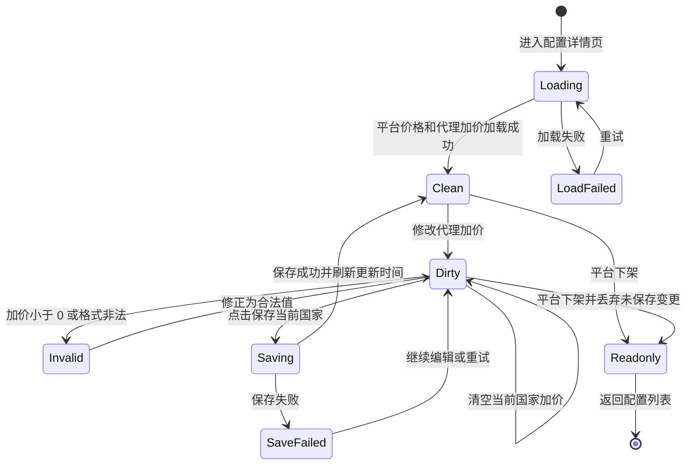
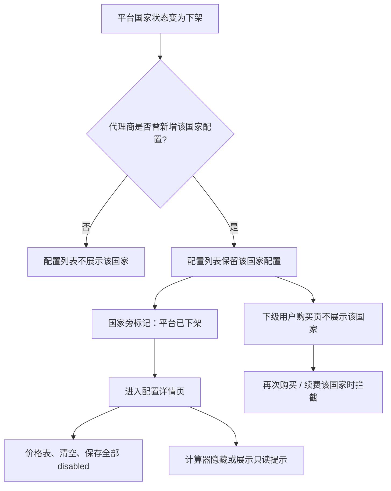
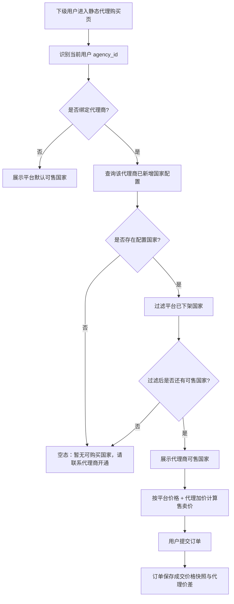
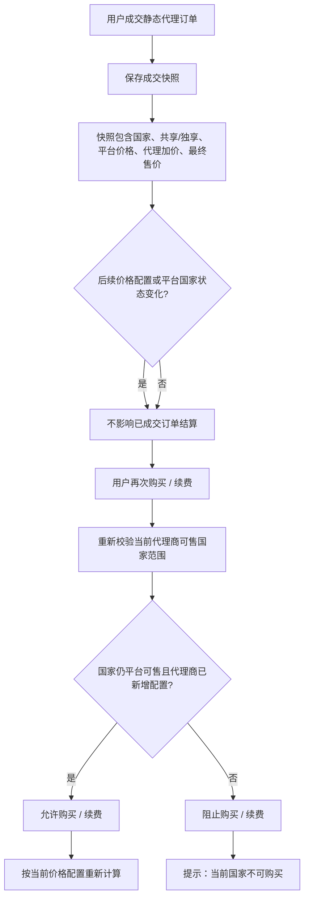

# M01 代理商首页-价格设置

## 1. 页面流转图

```mermaid
flowchart TD
    A["代理商访问 /IP代理/代理商/"] --> B{"是否登录且 is_agent=1?"}
    B -->|"否"| C["P-M01-6 无权限 / 未开通代理商页"]
    C --> D["联系客户经理"]
    B -->|"是"| E["P-M01-1 配置列表页"]
    E --> F["搜索 / 筛选国家配置"]
    E --> G["打开 P-M01-3 新增配置弹窗"]
    E --> H["点击编辑国家配置"]
    G --> I{"是否选择可新增国家?"}
    I -->|"否"| G
    I -->|"是"| J["创建国家配置并默认加价为 0"]
    J --> K["P-M01-2 配置详情页"]
    H --> K
    K --> L["编辑共享 / 独享代理加价"]
    K --> M["价格计算器试算"]
    K --> N{"返回列表 / 切换导航 / 离开页面"}
    N --> O{"是否有未保存变更?"}
    O -->|"否"| E
    O -->|"是"| P["P-M01-5 未保存变更确认弹窗"]
    P -->|"留在当前页"| K
    P -->|"放弃并离开"| E
```

## 2. 新增配置流程图

```mermaid
flowchart TD
    A["点击新增配置"] --> B["打开新增配置弹窗"]
    B --> C["加载平台可配置国家"]
    C --> D["排除该代理商已新增配置国家"]
    D --> E{"是否还有可新增国家?"}
    E -->|"否"| F["新增配置按钮 disabled"]
    F --> G["提示：所有可配置国家均已新增"]
    E -->|"是"| H["选择国家"]
    H --> I["确认新增"]
    I --> J["创建 agency_id + country_code 配置记录"]
    J --> K["共享 / 独享所有代理加价默认为 0"]
    K --> L["该国家进入代理商销售范围"]
    L --> M["跳转配置详情页"]
```

## 3. 配置详情编辑状态机

```mermaid
stateDiagram-v2
    [*] --> Loading: 进入配置详情页
    Loading --> Clean: 平台价格和代理加价加载成功
    Loading --> LoadFailed: 加载失败
    LoadFailed --> Loading: 重试
    Clean --> Dirty: 修改代理加价
    Dirty --> Invalid: 加价小于 0 或格式非法
    Invalid --> Dirty: 修正为合法值
    Dirty --> Saving: 点击保存当前国家
    Saving --> Clean: 保存成功并刷新更新时间
    Saving --> SaveFailed: 保存失败
    SaveFailed --> Dirty: 继续编辑或重试
    Dirty --> Dirty: 清空当前国家加价
    Clean --> Readonly: 平台下架
    Dirty --> Readonly: 平台下架并丢弃未保存变更
    Readonly --> [*]: 返回配置列表
```

## 4. 平台下架只读状态图

```mermaid
flowchart TD
    A["平台国家状态变为下架"] --> B{"代理商是否曾新增该国家配置?"}
    B -->|"否"| C["配置列表不展示该国家"]
    B -->|"是"| D["配置列表保留该国家配置"]
    D --> E["国家旁标记：平台已下架"]
    E --> F["进入配置详情页"]
    F --> G["价格表、清空、保存全部 disabled"]
    F --> H["计算器隐藏或展示只读提示"]
    D --> I["下级用户购买页不展示该国家"]
    I --> J["再次购买 / 续费该国家时拦截"]
```

## 5. 下级用户购买国家过滤流程图

```mermaid
flowchart TD
    A["下级用户进入静态代理购买页"] --> B["识别当前用户 agency_id"]
    B --> C{"是否绑定代理商?"}
    C -->|"否"| D["展示平台默认可售国家"]
    C -->|"是"| E["查询该代理商已新增国家配置"]
    E --> F{"是否存在配置国家?"}
    F -->|"否"| G["空态：暂无可购买国家，请联系代理商开通"]
    F -->|"是"| H["过滤平台已下架国家"]
    H --> I{"过滤后是否还有可售国家?"}
    I -->|"否"| G
    I -->|"是"| J["展示代理商可售国家"]
    J --> K["按平台价格 + 代理加价计算售卖价"]
    K --> L["用户提交订单"]
    L --> M["订单保存成交价格快照与代理价差"]
```

## 6. 订单与续费校验流程图

```mermaid
flowchart TD
    A["用户成交静态代理订单"] --> B["保存成交快照"]
    B --> C["快照包含国家、共享/独享、平台价格、代理加价、最终售价"]
    C --> D{"后续价格配置或平台国家状态变化?"}
    D -->|"是"| E["不影响已成交订单结算"]
    D -->|"否"| E
    E --> F["用户再次购买 / 续费"]
    F --> G["重新校验当前代理商可售国家范围"]
    G --> H{"国家仍平台可售且代理商已新增配置?"}
    H -->|"是"| I["允许购买 / 续费"]
    I --> J["按当前价格配置重新计算"]
    H -->|"否"| K["阻止购买 / 续费"]
    K --> L["提示：当前国家不可购买"]
```
