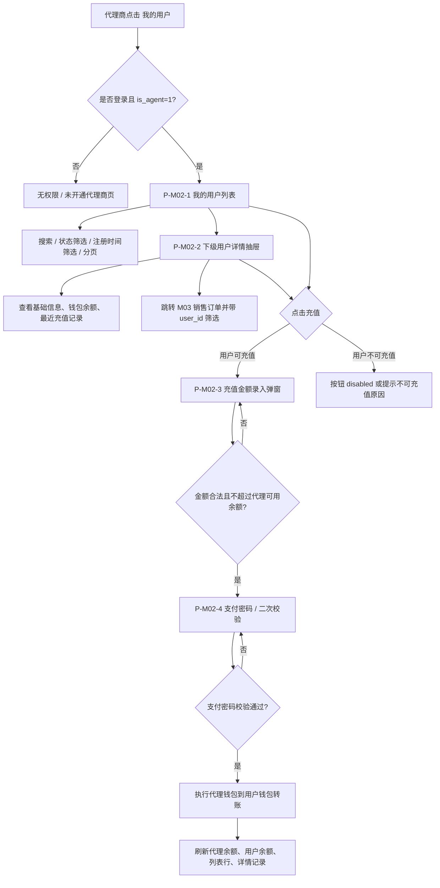
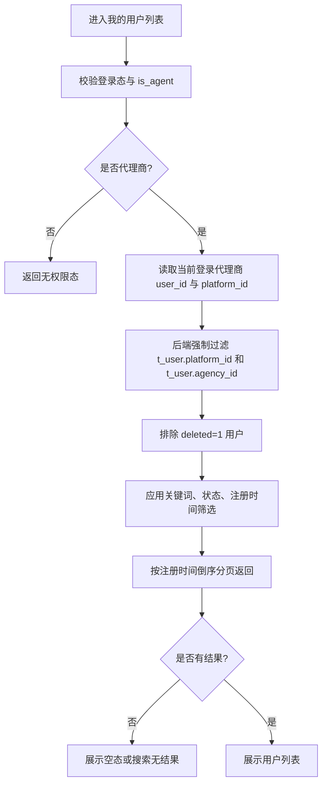
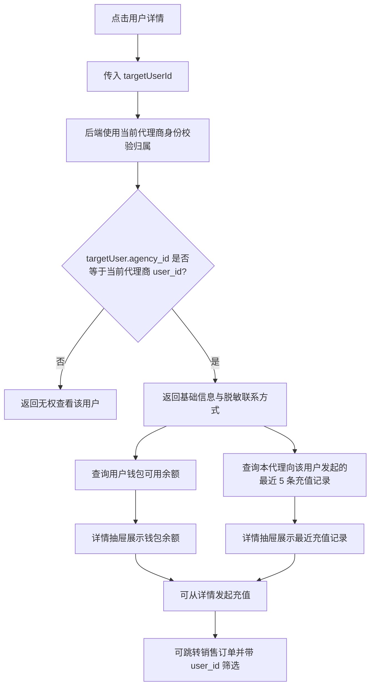
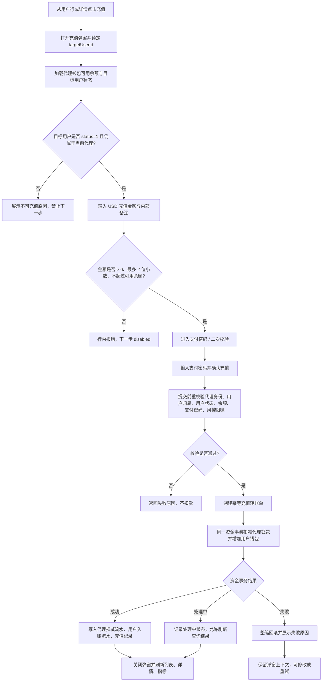
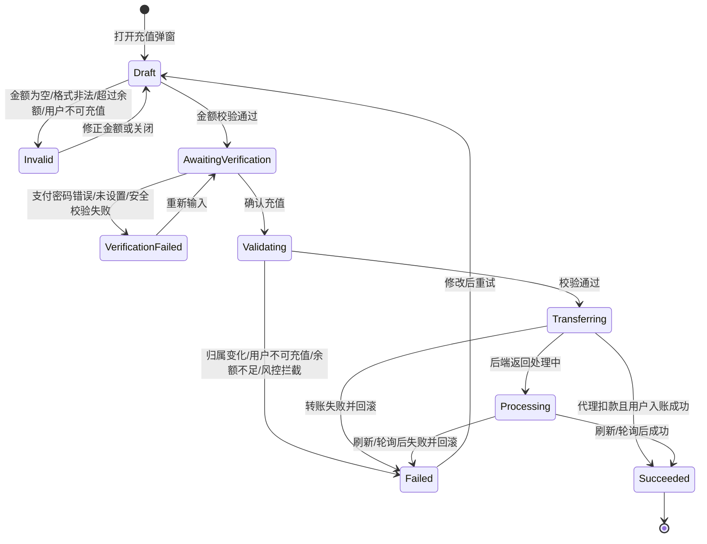
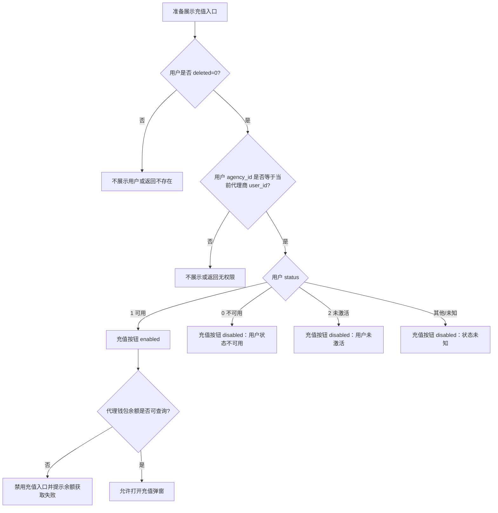
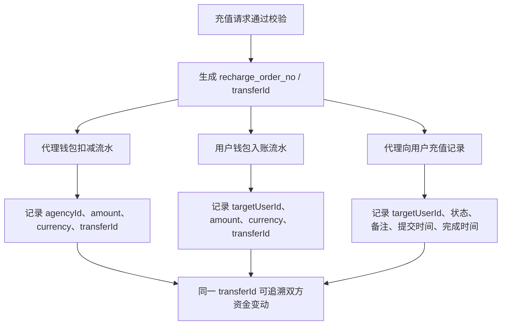

# M02 我的用户与用户充值

## 1. 页面流转图

```mermaid
flowchart TD
    A["代理商点击 我的用户"] --> B{"是否登录且 is_agent=1?"}
    B -->|"否"| C["无权限 / 未开通代理商页"]
    B -->|"是"| D["P-M02-1 我的用户列表"]
    D --> E["搜索 / 状态筛选 / 注册时间筛选 / 分页"]
    D --> F["P-M02-2 下级用户详情抽屉"]
    F --> G["查看基础信息、钱包余额、最近充值记录"]
    F --> H["跳转 M03 销售订单并带 user_id 筛选"]
    D --> I{"点击充值"}
    F --> I
    I -->|"用户可充值"| J["P-M02-3 充值金额录入弹窗"]
    I -->|"用户不可充值"| K["按钮 disabled 或提示不可充值原因"]
    J --> L{"金额合法且不超过代理可用余额?"}
    L -->|"否"| J
    L -->|"是"| M["P-M02-4 支付密码 / 二次校验"]
    M --> N{"支付密码校验通过?"}
    N -->|"否"| M
    N -->|"是"| O["执行代理钱包到用户钱包转账"]
    O --> P["刷新代理余额、用户余额、列表行、详情记录"]
```

## 2. 下级用户列表查询流程图

```mermaid
flowchart TD
    A["进入我的用户列表"] --> B["校验登录态与 is_agent"]
    B --> C{"是否代理商?"}
    C -->|"否"| D["返回无权限态"]
    C -->|"是"| E["读取当前登录代理商 user_id 与 platform_id"]
    E --> F["后端强制过滤 t_user.platform_id 和 t_user.agency_id"]
    F --> G["排除 deleted=1 用户"]
    G --> H["应用关键词、状态、注册时间筛选"]
    H --> I["按注册时间倒序分页返回"]
    I --> J{"是否有结果?"}
    J -->|"否"| K["展示空态或搜索无结果"]
    J -->|"是"| L["展示用户列表"]
```

## 3. 用户详情与归属校验流程图

```mermaid
flowchart TD
    A["点击用户详情"] --> B["传入 targetUserId"]
    B --> C["后端使用当前代理商身份校验归属"]
    C --> D{"targetUser.agency_id 是否等于当前代理商 user_id?"}
    D -->|"否"| E["返回无权查看该用户"]
    D -->|"是"| F["返回基础信息与脱敏联系方式"]
    F --> G["查询用户钱包可用余额"]
    F --> H["查询本代理向该用户发起的最近 5 条充值记录"]
    G --> I["详情抽屉展示钱包余额"]
    H --> J["详情抽屉展示最近充值记录"]
    I --> K["可从详情发起充值"]
    J --> K
    K --> L["可跳转销售订单并带 user_id 筛选"]
```

## 4. 用户充值主流程图

```mermaid
flowchart TD
    A["从用户行或详情点击充值"] --> B["打开充值弹窗并锁定 targetUserId"]
    B --> C["加载代理钱包可用余额与目标用户状态"]
    C --> D{"目标用户是否 status=1 且仍属于当前代理?"}
    D -->|"否"| E["展示不可充值原因，禁止下一步"]
    D -->|"是"| F["输入 USD 充值金额与内部备注"]
    F --> G{"金额是否 > 0、最多 2 位小数、不超过可用余额?"}
    G -->|"否"| H["行内报错，下一步 disabled"]
    G -->|"是"| I["进入支付密码 / 二次校验"]
    I --> J["输入支付密码并确认充值"]
    J --> K["提交前重校验代理身份、用户归属、用户状态、余额、支付密码、风控限额"]
    K --> L{"校验是否通过?"}
    L -->|"否"| M["返回失败原因，不扣款"]
    L -->|"是"| N["创建幂等充值转账单"]
    N --> O["同一资金事务扣减代理钱包并增加用户钱包"]
    O --> P{"资金事务结果"}
    P -->|"成功"| Q["写入代理扣减流水、用户入账流水、充值记录"]
    P -->|"失败"| R["整笔回滚并展示失败原因"]
    P -->|"处理中"| S["记录处理中状态，允许刷新查询结果"]
    Q --> T["关闭弹窗并刷新列表、详情、指标"]
    R --> U["保留弹窗上下文，可修改或重试"]
    S --> T
```

## 5. 用户充值状态机

```mermaid
stateDiagram-v2
    [*] --> Draft: 打开充值弹窗
    Draft --> Invalid: 金额为空/格式非法/超过余额/用户不可充值
    Invalid --> Draft: 修正金额或关闭
    Draft --> AwaitingVerification: 金额校验通过
    AwaitingVerification --> VerificationFailed: 支付密码错误/未设置/安全校验失败
    VerificationFailed --> AwaitingVerification: 重新输入
    AwaitingVerification --> Validating: 确认充值
    Validating --> Failed: 归属变化/用户不可充值/余额不足/风控拦截
    Validating --> Transferring: 校验通过
    Transferring --> Succeeded: 代理扣款且用户入账成功
    Transferring --> Processing: 后端返回处理中
    Transferring --> Failed: 转账失败并回滚
    Processing --> Succeeded: 刷新/轮询后成功
    Processing --> Failed: 刷新/轮询后失败并回滚
    Failed --> Draft: 修改后重试
    Succeeded --> [*]
```

## 6. 用户可充值规则图

```mermaid
flowchart TD
    A["准备展示充值入口"] --> B{"用户是否 deleted=0?"}
    B -->|"否"| C["不展示用户或返回不存在"]
    B -->|"是"| D{"用户 agency_id 是否等于当前代理商 user_id?"}
    D -->|"否"| E["不展示或返回无权限"]
    D -->|"是"| F{"用户 status"}
    F -->|"1 可用"| G["充值按钮 enabled"]
    F -->|"0 不可用"| H["充值按钮 disabled：用户状态不可用"]
    F -->|"2 未激活"| I["充值按钮 disabled：用户未激活"]
    F -->|"其他/未知"| J["充值按钮 disabled：状态未知"]
    G --> K{"代理钱包余额是否可查询?"}
    K -->|"否"| L["禁用充值入口并提示余额获取失败"]
    K -->|"是"| M["允许打开充值弹窗"]
```

## 7. 充值记录与钱包流水追溯图

```mermaid
flowchart TD
    A["充值请求通过校验"] --> B["生成 recharge_order_no / transferId"]
    B --> C["代理钱包扣减流水"]
    B --> D["用户钱包入账流水"]
    B --> E["代理向用户充值记录"]
    C --> F["记录 agencyId、amount、currency、transferId"]
    D --> G["记录 targetUserId、amount、currency、transferId"]
    E --> H["记录 targetUserId、状态、备注、提交时间、完成时间"]
    F --> I["同一 transferId 可追溯双方资金变动"]
    G --> I
    H --> I
```
