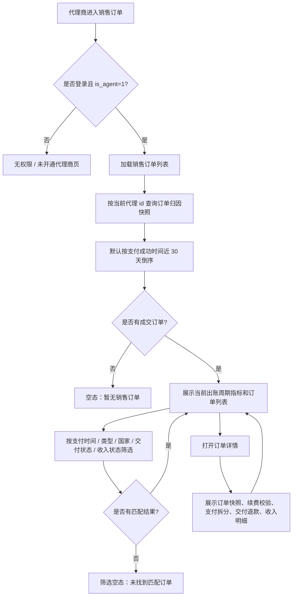
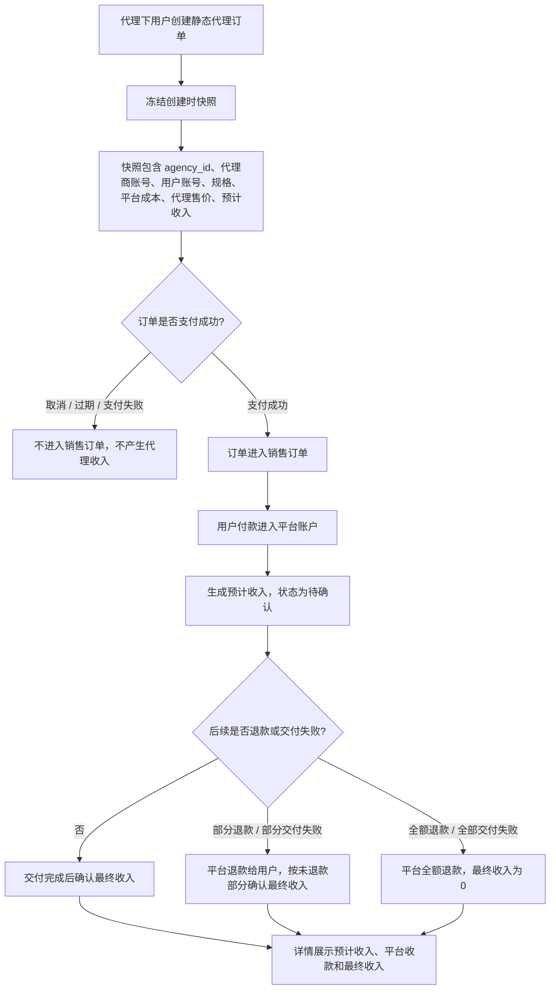
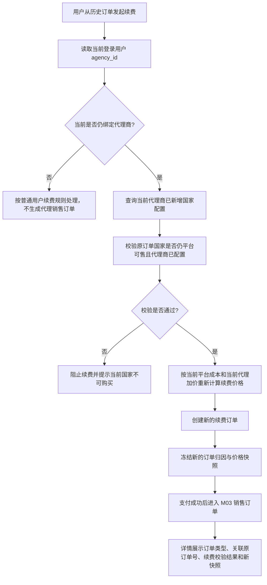
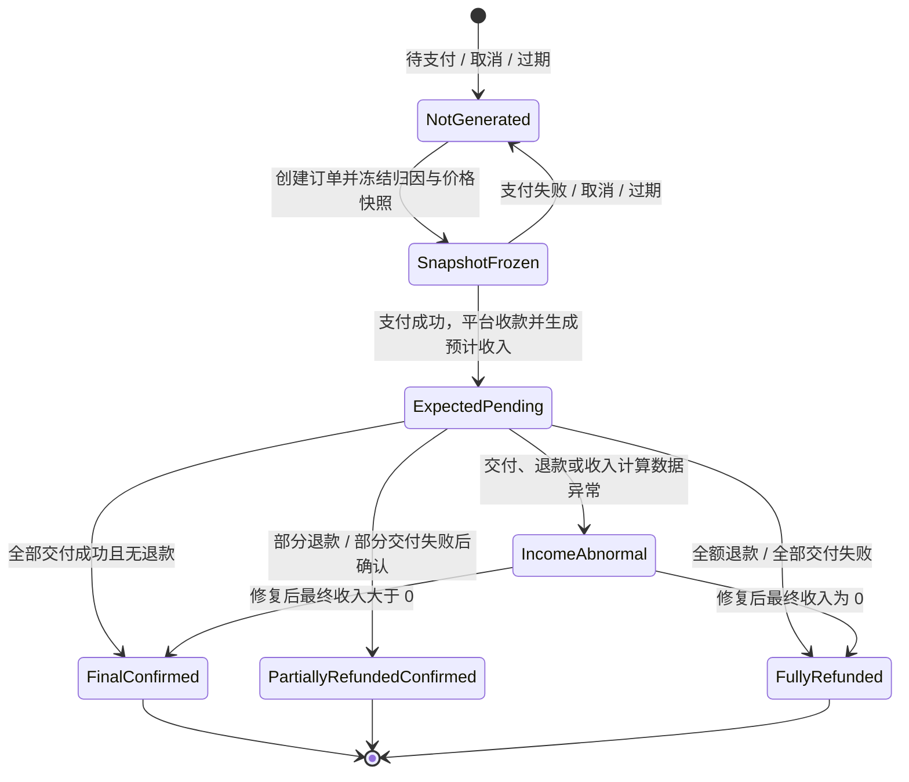

# M03 销售订单

## 1. 销售订单查看流程

```mermaid
flowchart TD
    A["代理商进入销售订单"] --> B{"是否登录且 is_agent=1?"}
    B -->|"否"| C["无权限 / 未开通代理商页"]
    B -->|"是"| D["加载销售订单列表"]
    D --> E["按当前代理 id 查询订单归因快照"]
    E --> F["默认按支付成功时间近 30 天倒序"]
    F --> G{"是否有成交订单?"}
    G -->|"否"| H["空态：暂无销售订单"]
    G -->|"是"| I["展示当前出账周期指标和订单列表"]
    I --> J["按支付时间 / 类型 / 国家 / 交付状态 / 收入状态筛选"]
    J --> K{"是否有匹配结果?"}
    K -->|"否"| L["筛选空态：未找到匹配订单"]
    K -->|"是"| I
    I --> M["打开订单详情"]
    M --> N["展示订单快照、续费校验、支付拆分、交付退款、收入明细"]
    N --> I
```

## 2. 用户订单到代理收入流程

```mermaid
flowchart TD
    A["代理下用户创建静态代理订单"] --> B["冻结创建时快照"]
    B --> C["快照包含 agency_id、代理商账号、用户账号、规格、平台成本、代理售价、预计收入"]
    C --> D{"订单是否支付成功?"}
    D -->|"取消 / 过期 / 支付失败"| E["不进入销售订单，不产生代理收入"]
    D -->|"支付成功"| F["订单进入销售订单"]
    F --> G["用户付款进入平台账户"]
    G --> H["生成预计收入，状态为待确认"]
    H --> I{"后续是否退款或交付失败?"}
    I -->|"否"| J["交付完成后确认最终收入"]
    I -->|"部分退款 / 部分交付失败"| K["平台退款给用户，按未退款部分确认最终收入"]
    I -->|"全额退款 / 全部交付失败"| L["平台全额退款，最终收入为 0"]
    J --> M["详情展示预计收入、平台收款和最终收入"]
    K --> M
    L --> M
```

## 3. 续费重新校验流程

```mermaid
flowchart TD
    A["用户从历史订单发起续费"] --> B["读取当前登录用户 agency_id"]
    B --> C{"当前是否仍绑定代理商?"}
    C -->|"否"| D["按普通用户续费规则处理，不生成代理销售订单"]
    C -->|"是"| E["查询当前代理商已新增国家配置"]
    E --> F["校验原订单国家是否仍平台可售且代理商已配置"]
    F --> G{"校验是否通过?"}
    G -->|"否"| H["阻止续费并提示当前国家不可购买"]
    G -->|"是"| I["按当前平台成本和当前代理加价重新计算续费价格"]
    I --> J["创建新的续费订单"]
    J --> K["冻结新的订单归因与价格快照"]
    K --> L["支付成功后进入 M03 销售订单"]
    L --> M["详情展示订单类型、关联原订单号、续费校验结果和新快照"]
```

## 4. 代理收入状态机

```mermaid
stateDiagram-v2
    [*] --> NotGenerated: 待支付 / 取消 / 过期
    NotGenerated --> SnapshotFrozen: 创建订单并冻结归因与价格快照
    SnapshotFrozen --> NotGenerated: 支付失败 / 取消 / 过期
    SnapshotFrozen --> ExpectedPending: 支付成功，平台收款并生成预计收入
    ExpectedPending --> FinalConfirmed: 全部交付成功且无退款
    ExpectedPending --> PartiallyRefundedConfirmed: 部分退款 / 部分交付失败后确认
    ExpectedPending --> FullyRefunded: 全额退款 / 全部交付失败
    ExpectedPending --> IncomeAbnormal: 交付、退款或收入计算数据异常
    IncomeAbnormal --> FinalConfirmed: 修复后最终收入大于 0
    IncomeAbnormal --> FullyRefunded: 修复后最终收入为 0
    FinalConfirmed --> [*]
    PartiallyRefundedConfirmed --> [*]
    FullyRefunded --> [*]
```
