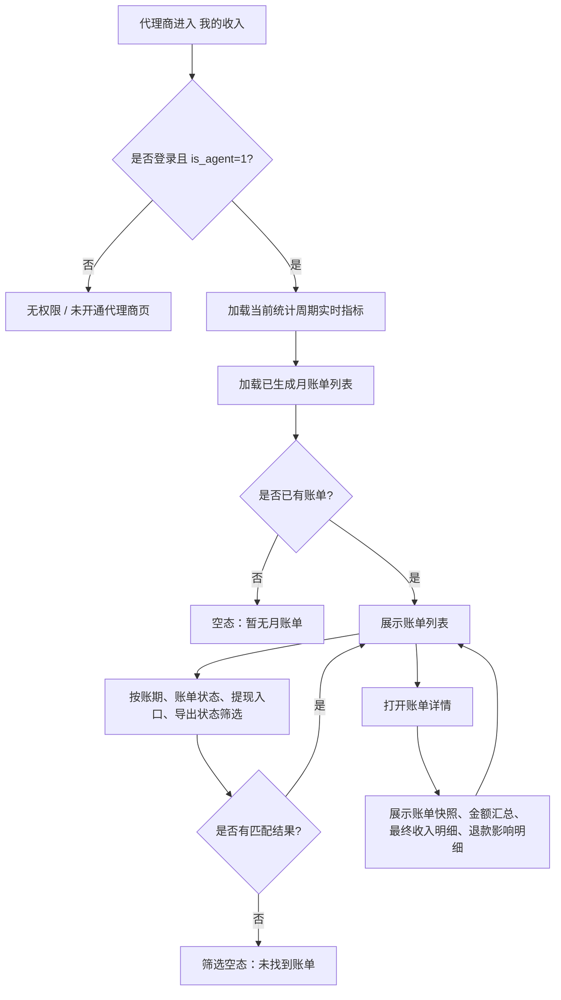
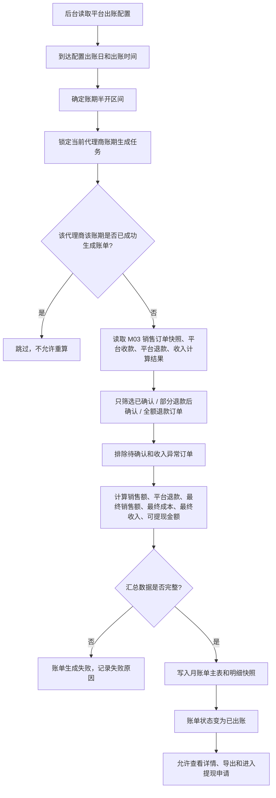
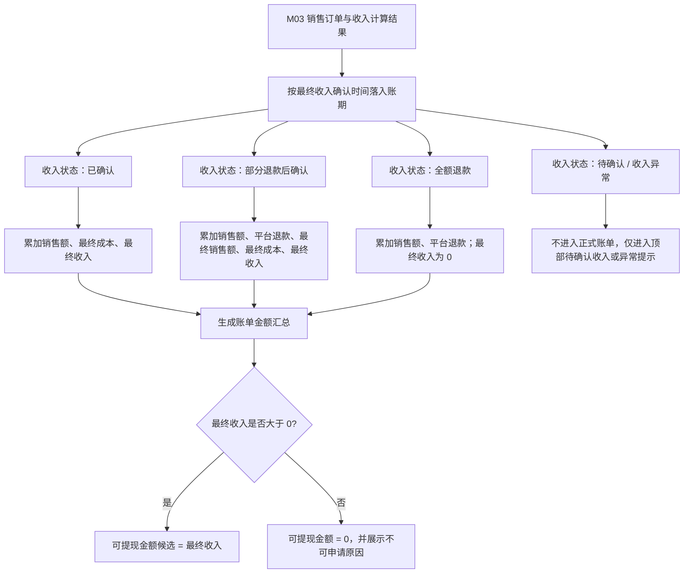
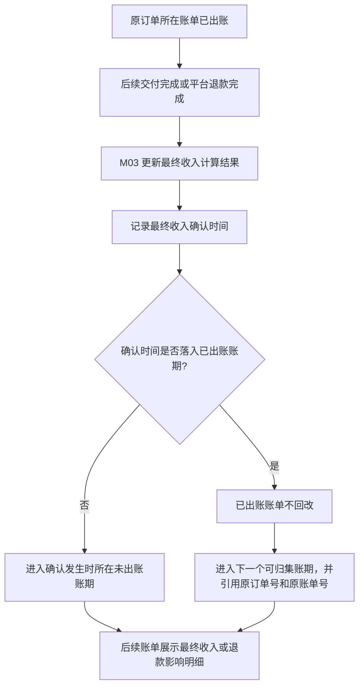
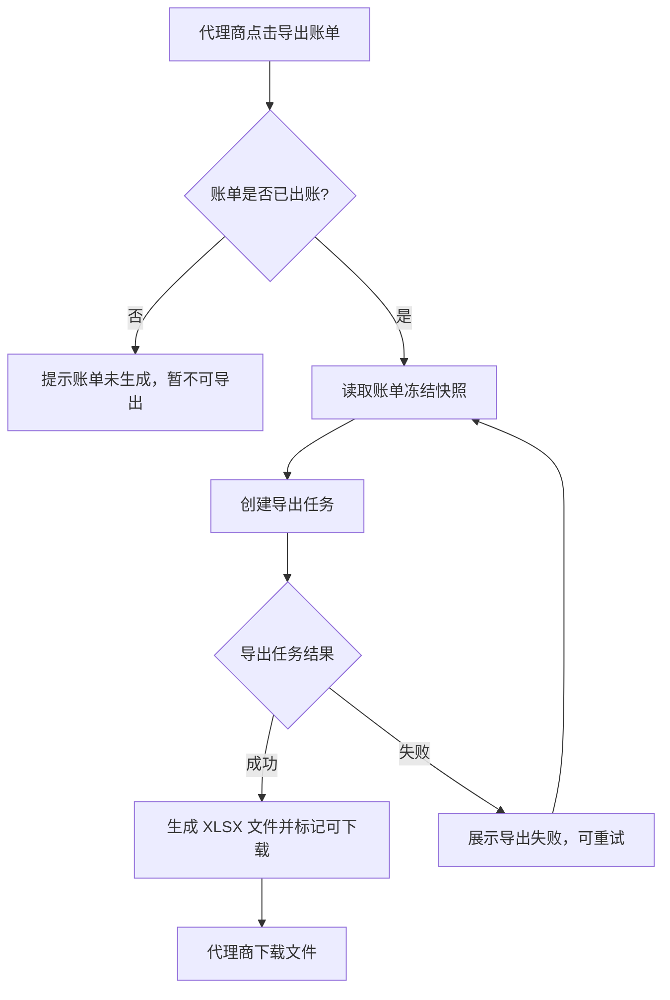
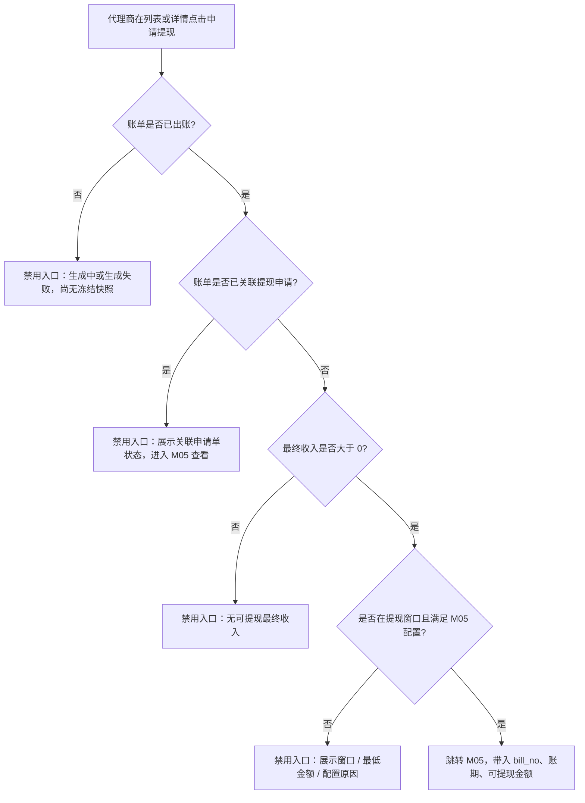
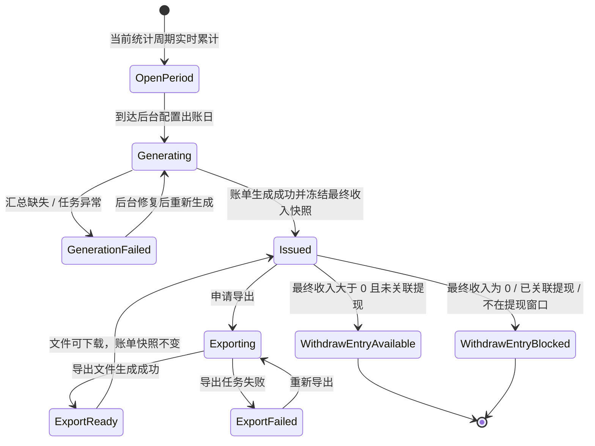

# M04 我的收入与月度账单

## 1. 我的收入入口与月账单查看流程

```mermaid
flowchart TD
    A["代理商进入 我的收入"] --> B{"是否登录且 is_agent=1?"}
    B -->|"否"| C["无权限 / 未开通代理商页"]
    B -->|"是"| D["加载当前统计周期实时指标"]
    D --> E["加载已生成月账单列表"]
    E --> F{"是否已有账单?"}
    F -->|"否"| G["空态：暂无月账单"]
    F -->|"是"| H["展示账单列表"]
    H --> I["按账期、账单状态、提现入口、导出状态筛选"]
    I --> J{"是否有匹配结果?"}
    J -->|"否"| K["筛选空态：未找到账单"]
    J -->|"是"| H
    H --> L["打开账单详情"]
    L --> M["展示账单快照、金额汇总、最终收入明细、退款影响明细"]
    M --> H
```

## 2. 后台出账生成流程

```mermaid
flowchart TD
    A["后台读取平台出账配置"] --> B["到达配置出账日和出账时间"]
    B --> C["确定账期半开区间"]
    C --> D["锁定当前代理商账期生成任务"]
    D --> E{"该代理商该账期是否已成功生成账单?"}
    E -->|"是"| F["跳过，不允许重算"]
    E -->|"否"| G["读取 M03 销售订单快照、平台收款、平台退款、收入计算结果"]
    G --> H["只筛选已确认 / 部分退款后确认 / 全额退款订单"]
    H --> I["排除待确认和收入异常订单"]
    I --> J["计算销售额、平台退款、最终销售额、最终成本、最终收入、可提现金额"]
    J --> K{"汇总数据是否完整?"}
    K -->|"否"| L["账单生成失败，记录失败原因"]
    K -->|"是"| M["写入月账单主表和明细快照"]
    M --> N["账单状态变为已出账"]
    N --> O["允许查看详情、导出和进入提现申请"]
```

## 3. 月账单最终收入归集流程

```mermaid
flowchart TD
    A["M03 销售订单与收入计算结果"] --> B["按最终收入确认时间落入账期"]
    B --> C["收入状态：已确认"]
    B --> D["收入状态：部分退款后确认"]
    B --> E["收入状态：全额退款"]
    B --> F["收入状态：待确认 / 收入异常"]
    C --> G["累加销售额、最终成本、最终收入"]
    D --> H["累加销售额、平台退款、最终销售额、最终成本、最终收入"]
    E --> I["累加销售额、平台退款；最终收入为 0"]
    F --> J["不进入正式账单，仅进入顶部待确认收入或异常提示"]
    G --> K["生成账单金额汇总"]
    H --> K
    I --> K
    K --> L{"最终收入是否大于 0?"}
    L -->|"是"| M["可提现金额候选 = 最终收入"]
    L -->|"否"| N["可提现金额 = 0，并展示不可申请原因"]
```

## 4. 跨期最终收入确认流程

```mermaid
flowchart TD
    A["原订单所在账单已出账"] --> B["后续交付完成或平台退款完成"]
    B --> C["M03 更新最终收入计算结果"]
    C --> D["记录最终收入确认时间"]
    D --> E{"确认时间是否落入已出账账期?"}
    E -->|"否"| F["进入确认发生时所在未出账账期"]
    E -->|"是"| G["已出账账单不回改"]
    G --> H["进入下一个可归集账期，并引用原订单号和原账单号"]
    F --> I["后续账单展示最终收入或退款影响明细"]
    H --> I
```

## 5. 月账单导出流程

```mermaid
flowchart TD
    A["代理商点击导出账单"] --> B{"账单是否已出账?"}
    B -->|"否"| C["提示账单未生成，暂不可导出"]
    B -->|"是"| D["读取账单冻结快照"]
    D --> E["创建导出任务"]
    E --> F{"导出任务结果"}
    F -->|"成功"| G["生成 XLSX 文件并标记可下载"]
    F -->|"失败"| H["展示导出失败，可重试"]
    G --> I["代理商下载文件"]
    H --> D
```

## 6. 申请提现入口判定流程

```mermaid
flowchart TD
    A["代理商在列表或详情点击申请提现"] --> B{"账单是否已出账?"}
    B -->|"否"| C["禁用入口：生成中或生成失败，尚无冻结快照"]
    B -->|"是"| D{"账单是否已关联提现申请?"}
    D -->|"是"| E["禁用入口：展示关联申请单状态，进入 M05 查看"]
    D -->|"否"| F{"最终收入是否大于 0?"}
    F -->|"否"| G["禁用入口：无可提现最终收入"]
    F -->|"是"| H{"是否在提现窗口且满足 M05 配置?"}
    H -->|"否"| I["禁用入口：展示窗口 / 最低金额 / 配置原因"]
    H -->|"是"| J["跳转 M05，带入 bill_no、账期、可提现金额"]
```

## 7. 月账单状态机

```mermaid
stateDiagram-v2
    [*] --> OpenPeriod: 当前统计周期实时累计
    OpenPeriod --> Generating: 到达后台配置出账日
    Generating --> GenerationFailed: 汇总缺失 / 任务异常
    GenerationFailed --> Generating: 后台修复后重新生成
    Generating --> Issued: 账单生成成功并冻结最终收入快照
    Issued --> Exporting: 申请导出
    Exporting --> ExportReady: 导出文件生成成功
    Exporting --> ExportFailed: 导出任务失败
    ExportFailed --> Exporting: 重新导出
    ExportReady --> Issued: 文件可下载，账单快照不变
    Issued --> WithdrawEntryAvailable: 最终收入大于 0 且未关联提现
    Issued --> WithdrawEntryBlocked: 最终收入为 0 / 已关联提现 / 不在提现窗口
    WithdrawEntryAvailable --> [*]
    WithdrawEntryBlocked --> [*]
```
