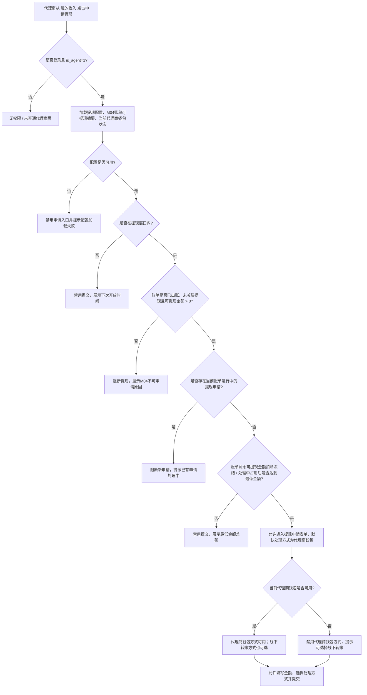
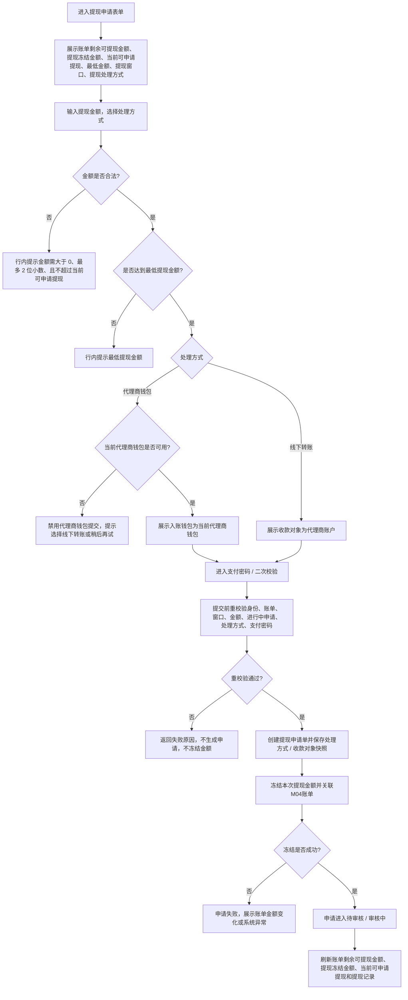
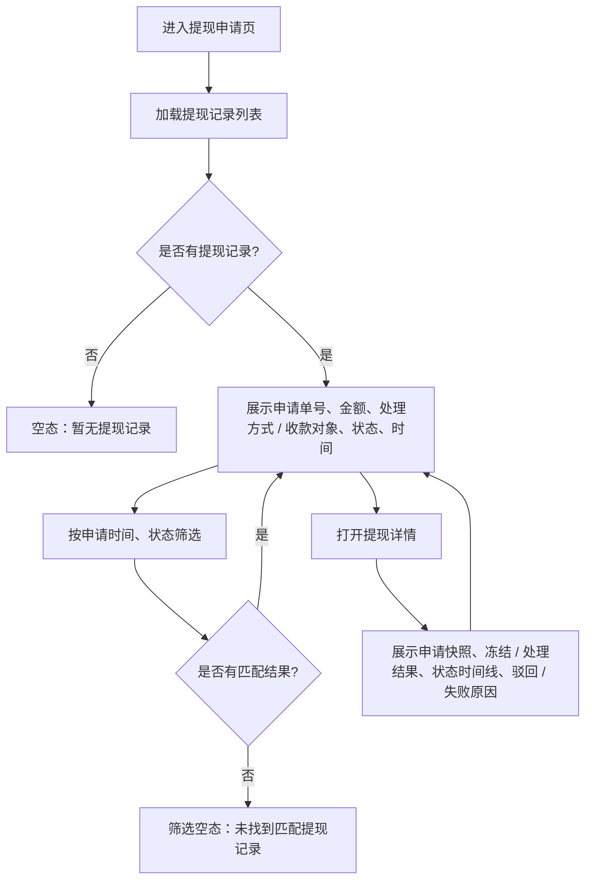
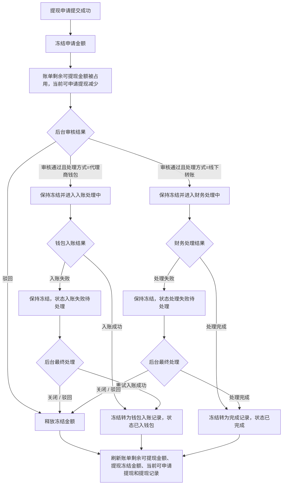
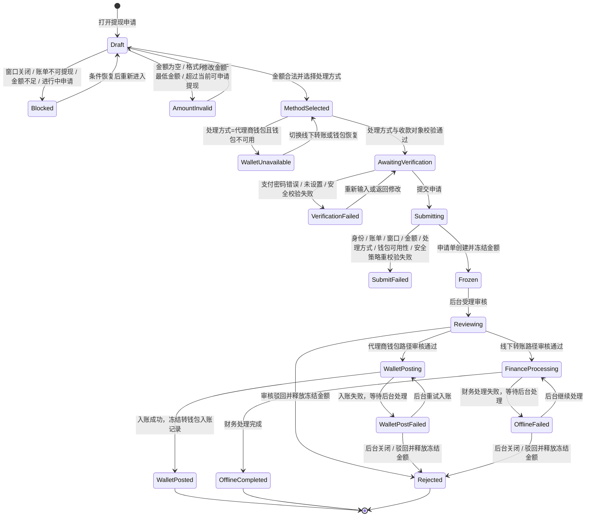

# M05 提现申请

## 1. 提现入口与资格校验流程

```mermaid
flowchart TD
    A["代理商从 我的收入 点击申请提现"] --> B{"是否登录且 is_agent=1?"}
    B -->|"否"| C["无权限 / 未开通代理商页"]
    B -->|"是"| D["加载提现配置、M04账单可提现摘要、当前代理商钱包状态"]
    D --> E{"配置是否可用?"}
    E -->|"否"| F["禁用申请入口并提示配置加载失败"]
    E -->|"是"| G{"是否在提现窗口内?"}
    G -->|"否"| H["禁用提交，展示下次开放时间"]
    G -->|"是"| I{"账单是否已出账、未关联提现且可提现金额 > 0?"}
    I -->|"否"| J["阻断提现，展示M04不可申请原因"]
    I -->|"是"| K{"是否存在当前账单进行中的提现申请?"}
    K -->|"是"| L["阻断新申请，提示已有申请处理中"]
    K -->|"否"| M{"账单剩余可提现金额扣除冻结 / 处理中占用后是否达到最低金额?"}
    M -->|"否"| N["禁用提交，展示最低金额差额"]
    M -->|"是"| O["允许进入提现申请表单，默认处理方式为代理商钱包"]
    O --> P{"当前代理商钱包是否可用?"}
    P -->|"是"| Q["代理商钱包方式可用；线下转账方式也可选"]
    P -->|"否"| R["禁用代理商钱包方式，提示可选择线下转账"]
    Q --> S["允许填写金额、选择处理方式并提交"]
    R --> S
```

## 2. 提现申请提交流程

```mermaid
flowchart TD
    A["进入提现申请表单"] --> B["展示账单剩余可提现金额、提现冻结金额、当前可申请提现、最低金额、提现窗口、提现处理方式"]
    B --> C["输入提现金额，选择处理方式"]
    C --> D{"金额是否合法?"}
    D -->|"否"| E["行内提示金额需大于 0、最多 2 位小数、且不超过当前可申请提现"]
    D -->|"是"| F{"是否达到最低提现金额?"}
    F -->|"否"| G["行内提示最低提现金额"]
    F -->|"是"| H{"处理方式"}
    H -->|"代理商钱包"| I{"当前代理商钱包是否可用?"}
    I -->|"否"| J["禁用代理商钱包提交，提示选择线下转账或稍后再试"]
    I -->|"是"| K["展示入账钱包为当前代理商钱包"]
    H -->|"线下转账"| L["展示收款对象为代理商账户"]
    K --> M["进入支付密码 / 二次校验"]
    L --> M
    M --> N["提交前重校验身份、账单、窗口、金额、进行中申请、处理方式、支付密码"]
    N --> O{"重校验通过?"}
    O -->|"否"| P["返回失败原因，不生成申请，不冻结金额"]
    O -->|"是"| Q["创建提现申请单并保存处理方式 / 收款对象快照"]
    Q --> R["冻结本次提现金额并关联M04账单"]
    R --> S{"冻结是否成功?"}
    S -->|"否"| T["申请失败，展示账单金额变化或系统异常"]
    S -->|"是"| U["申请进入待审核 / 审核中"]
    U --> V["刷新账单剩余可提现金额、提现冻结金额、当前可申请提现和提现记录"]
```

## 3. 提现记录与状态查看流程

```mermaid
flowchart TD
    A["进入提现申请页"] --> B["加载提现记录列表"]
    B --> C{"是否有提现记录?"}
    C -->|"否"| D["空态：暂无提现记录"]
    C -->|"是"| E["展示申请单号、金额、处理方式 / 收款对象、状态、时间"]
    E --> F["按申请时间、状态筛选"]
    F --> G{"是否有匹配结果?"}
    G -->|"否"| H["筛选空态：未找到匹配提现记录"]
    G -->|"是"| E
    E --> I["打开提现详情"]
    I --> J["展示申请快照、冻结 / 处理结果、状态时间线、驳回 / 失败原因"]
    J --> E
```

## 4. 提现金额冻结与释放流程

```mermaid
flowchart TD
    A["提现申请提交成功"] --> B["冻结申请金额"]
    B --> C["账单剩余可提现金额被占用，当前可申请提现减少"]
    C --> D{"后台审核结果"}
    D -->|"驳回"| E["释放冻结金额"]
    D -->|"审核通过且处理方式=代理商钱包"| F["保持冻结并进入入账处理中"]
    D -->|"审核通过且处理方式=线下转账"| G["保持冻结并进入财务处理中"]
    F --> H{"钱包入账结果"}
    H -->|"入账成功"| I["冻结转为钱包入账记录，状态已入钱包"]
    H -->|"入账失败"| J["保持冻结，状态入账失败待处理"]
    J --> K{"后台最终处理"}
    K -->|"重试入账成功"| I
    K -->|"关闭 / 驳回"| E
    G --> L{"财务处理结果"}
    L -->|"处理完成"| M["冻结转为完成记录，状态已完成"]
    L -->|"处理失败"| N["保持冻结，状态处理失败待处理"]
    N --> O{"后台最终处理"}
    O -->|"处理完成"| M
    O -->|"关闭 / 驳回"| E
    E --> P["刷新账单剩余可提现金额、提现冻结金额、当前可申请提现和提现记录"]
    I --> P
    M --> P
```

## 5. 提现申请状态机

```mermaid
stateDiagram-v2
    [*] --> Draft: 打开提现申请
    Draft --> Blocked: 窗口关闭 / 账单不可提现 / 金额不足 / 进行中申请
    Blocked --> Draft: 条件恢复后重新进入
    Draft --> AmountInvalid: 金额为空 / 格式非法 / 低于最低金额 / 超过当前可申请提现
    AmountInvalid --> Draft: 修改金额
    Draft --> MethodSelected: 金额合法并选择处理方式
    MethodSelected --> WalletUnavailable: 处理方式=代理商钱包且钱包不可用
    WalletUnavailable --> MethodSelected: 切换线下转账或钱包恢复
    MethodSelected --> AwaitingVerification: 处理方式与收款对象校验通过
    AwaitingVerification --> VerificationFailed: 支付密码错误 / 未设置 / 安全校验失败
    VerificationFailed --> AwaitingVerification: 重新输入或返回修改
    AwaitingVerification --> Submitting: 提交申请
    Submitting --> SubmitFailed: 身份 / 账单 / 窗口 / 金额 / 处理方式 / 钱包可用性 / 安全策略重校验失败
    Submitting --> Frozen: 申请单创建并冻结金额
    Frozen --> Reviewing: 后台受理审核
    Reviewing --> Rejected: 审核驳回并释放冻结金额
    Reviewing --> WalletPosting: 代理商钱包路径审核通过
    Reviewing --> FinanceProcessing: 线下转账路径审核通过
    WalletPosting --> WalletPosted: 入账成功，冻结转钱包入账记录
    WalletPosting --> WalletPostFailed: 入账失败，等待后台处理
    WalletPostFailed --> WalletPosting: 后台重试入账
    WalletPostFailed --> Rejected: 后台关闭 / 驳回并释放冻结金额
    FinanceProcessing --> OfflineCompleted: 财务处理完成
    FinanceProcessing --> OfflineFailed: 财务处理失败，等待后台处理
    OfflineFailed --> FinanceProcessing: 后台继续处理
    OfflineFailed --> Rejected: 后台关闭 / 驳回并释放冻结金额
    WalletPosted --> [*]
    OfflineCompleted --> [*]
    Rejected --> [*]
```
