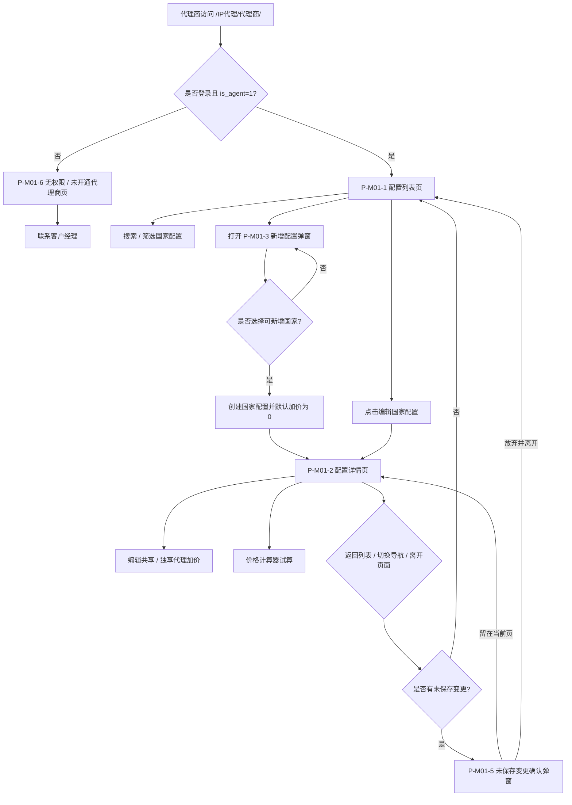
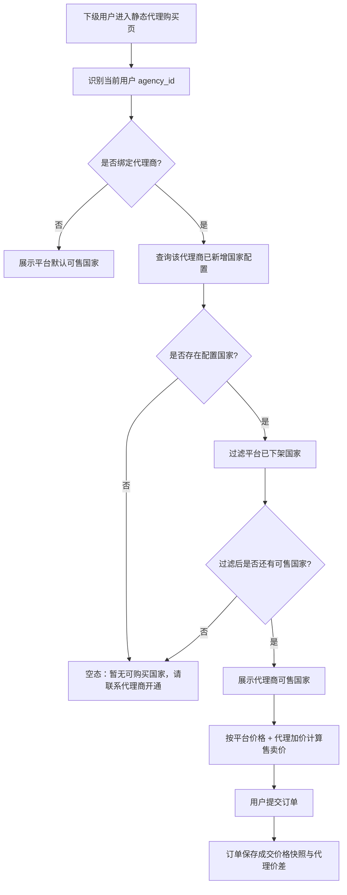
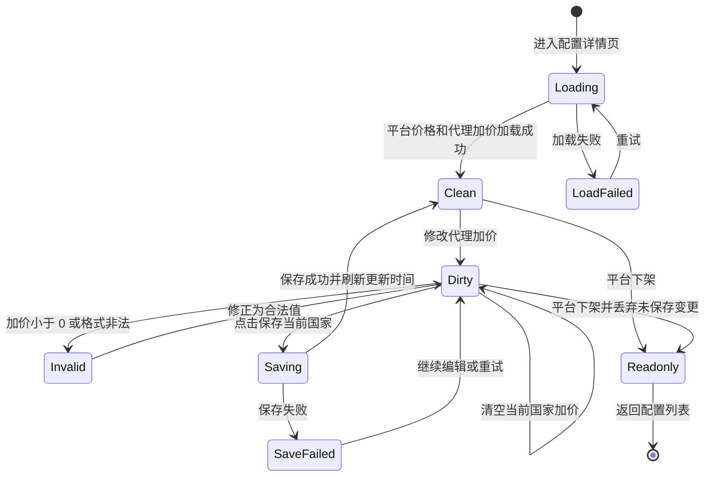

# M01 代理商首页-价格设置

## 文档信息

| 字段 | 内容 |
|---|---|
| 文档标题 | 静态代理-代理商首页-价格设置需求文档 |
| 文档编号 | PRD-2026-M01-Agent-Price-Config |
| 产品版本 | v0.1 |
| 创建日期 | 2026-06-08 |
| 最后更新 | 2026-06-08 |
| 状态 | 草稿 |
| 关联模块 | M01 代理商首页-价格设置 |
| 关联全局决策 | `代理商-prd/decisions/00-global.md` |
| 关联模块决策 | `代理商-prd/decisions/01-代理商首页-价格设置.md` |
| 关联原型 | `prototypes/agent-price-config-list-detail-prototype.html` |
| 关联图集 | `代理商-prd/diagrams/01-代理商首页-价格设置-mermaid.md` |

## 修订历史

| 版本 | 日期 | 变更说明 |
|---|---|---|
| v0.1 | 2026-06-08 | 基于 M01 decisions / prototype / Mermaid 图集生成模块级交付 PRD |

## 一、问题陈述

代理商需要在代理端自助配置静态代理商品的国家级售卖价差，并确保其下级用户只能购买代理商已开通配置的国家。当前代理商价格、可售国家、下级购买权限、订单收益快照之间缺少统一的产品规则描述，容易导致国家很多时配置难管理、未配置国家误售、后续订单收益解释困难。

本模块解决 M01 价格设置闭环：代理商通过配置列表管理已新增国家配置，通过配置详情维护共享 / 独享代理加价，并通过计算器试算最终售价；下级用户购买页按代理商已新增配置国家过滤。

## 二、目标

| 编号 | 目标描述 | 衡量指标 | 目标值 | 当前值 | 衡量时间 |
|---|---|---|---|---|---|
| G-M01-01 | 让代理商能按国家维护静态代理价差 | 国家配置保存成功率 | ≥ 99%【待确认】 | 【待确认】 | 上线后 14 天 |
| G-M01-02 | 降低国家较多时的配置查找成本 | 配置列表搜索 / 筛选后进入详情成功率 | ≥ 95%【待确认】 | 【待确认】 | 上线后 14 天 |
| G-M01-03 | 避免未新增配置国家对代理商下级用户误售 | 未配置国家购买拦截成功率 | 100% | 【待确认】 | 上线后持续监控 |
| G-M01-04 | 提高代理商对售价与价差的理解 | 价格计算器使用率 | ≥ 30%【待确认】 | 【待确认】 | 上线后 30 天 |

## 三、非目标

| 非目标 | 排除原因 |
|---|---|
| 后台代理商开户、审核、禁用、等级体系 | 本期只做代理端自助工作台，后台运营管理另行规划 |
| 邀请 / 创建 / 绑定 / 解绑下级用户 | 归属 M02 后续模块，本模块只影响代理商下级用户购买范围 |
| 用户购买配置页、Checkout、我的 IP 重写 | 下级用户仍复用既有购买、订单、Checkout、钱包支付链路 |
| 删除国家配置 | P0 不允许删除国家配置，只允许清空加价为 0，避免误删导致可售范围突变 |
| 一键加价比例 | 已记录为 TODO，不进入本期 P0 |
| 多级代理、推广素材、邀请码裂变 | 超出当前代理商价格设置范围 |

## 四、用户故事

### 用户角色：代理商

**P0 - 必须**

- US-M01-01：作为代理商，我想查看自己已新增过的国家价格配置，以便快速管理可售国家范围。
  - 验收标准：代理商进入 `/IP代理/代理商/` 后，系统展示配置列表页；列表只包含该代理商已新增配置的国家。

- US-M01-02：作为代理商，我想新增一个可配置国家，以便该国家进入我的下级用户销售范围。
  - 验收标准：点击「新增配置」后，只能选择平台可配置且尚未新增的国家；确认新增后创建配置并进入详情页，默认共享 / 独享所有代理加价为 0。

- US-M01-03：作为代理商，我想按国家维护共享 / 独享代理加价，以便控制下级用户最终售价和我的价差收益。
  - 验收标准：在配置详情页修改合法加价并保存成功后，刷新该国家最近更新时间与价差策略摘要。

- US-M01-04：作为代理商，我想使用价格计算器试算规格售价，以便保存前理解平台价格、代理加价、最终售价和预计价差。
  - 验收标准：计算器读取当前页面草稿，不反写价格配置；未保存加价参与试算并提示含未保存加价。

- US-M01-05：作为代理商，我想避免误操作丢失加价草稿，以便配置过程安全可靠。
  - 验收标准：详情页存在未保存变更时，返回列表、切换导航或离开页面均触发未保存变更确认。

### 用户角色：代理商下级用户

**P0 - 必须**

- US-M01-06：作为代理商下级用户，我只能购买代理商已开通配置的国家，以便购买范围符合代理商售卖规则。
  - 验收标准：绑定代理商的用户进入静态代理购买页时，只展示代理商已新增且平台仍可售的国家；未新增国家不展示、不允许购买。

## 五、非功能性需求

| 类型 | 需求描述 | 衡量标准 |
|---|---|---|
| 权限 | 仅 `is_agent=1` 的代理商可访问价格设置；非代理商进入无权限页 | 权限校验覆盖列表、详情、新增、保存、清空等入口 |
| 安全 | 代理商不得通过前端参数访问或修改其他代理商国家配置 | 后端必须以当前登录代理商身份约束配置范围 |
| 数据一致性 | 国家配置、价差策略、下级购买国家过滤需使用同一配置来源 | 同一代理商的购买页国家集合与已新增配置保持一致 |
| 可用性 | 指标加载失败不阻塞配置列表；保存失败保留草稿 | 局部失败可重试，草稿不丢失 |
| 可追溯 | 订单按成交快照结算，后续配置变化不影响历史订单 | 订单保存成交价格快照与代理价差 |

## 六、功能需求（FR）

### 6.1 产品结构 / 功能模块

```text
M01 代理商首页-价格设置
├── 配置列表页
│   ├── 指标卡
│   ├── 搜索 / 策略筛选
│   ├── 国家配置表格
│   └── 新增配置入口
├── 新增配置弹窗
├── 配置详情页
│   ├── 详情信息条
│   ├── 共享 / 独享价格表
│   ├── 清空 / 保存
│   └── 价格计算器
├── 未保存变更确认弹窗
├── 清空当前国家加价确认弹窗
└── 下级用户购买页国家过滤联动
```

### 6.2 功能需求清单（US → FR 追溯）

| 需求ID | 需求描述 | 所属用户故事 | 优先级 | 验收标准（条件-操作-结果） | 对应界面 |
|---|---|---|---|---|---|
| FR-M01-01 | 代理商权限校验与无权限页 | US-M01-01 | P0 | 未登录或 `is_agent!=1` 访问代理商页时，展示无权限 / 未开通代理商页，不展示任何代理商数据 | P-M01-6 |
| FR-M01-02 | 配置列表展示已新增国家配置 | US-M01-01 | P0 | 代理商进入价格设置时，列表仅展示该代理商已新增配置国家，并按最近更新时间倒序 → 国家代码 A-Z 排序 | P-M01-1 |
| FR-M01-03 | 配置列表搜索与策略筛选 | US-M01-01 | P0 | 输入国家名 / 国家代码或切换策略筛选时，仅过滤当前代理商已新增配置列表 | P-M01-1 |
| FR-M01-04 | 新增国家配置 | US-M01-02 | P0 | 代理商选择平台可配置且未新增国家并确认后，创建国家配置，默认加价 0，并进入详情页 | P-M01-3 |
| FR-M01-05 | 配置详情共享 / 独享加价编辑 | US-M01-03 | P0 | 代理商可编辑共享 / 独享代理加价；加价不得小于 0；保存成功后刷新更新时间 | P-M01-2 |
| FR-M01-06 | 清空当前国家加价 | US-M01-03 | P0 | 点击清空并确认后，该国家共享 / 独享全部加价归 0，需保存后生效 | P-M01-4 |
| FR-M01-07 | 未保存变更保护 | US-M01-05 | P0 | 详情页存在未保存变更时，返回列表 / 切换导航 / 离开页面触发二次确认 | P-M01-5 |
| FR-M01-08 | 价格计算器试算 | US-M01-04 | P0 | 计算器展示平台价格、代理加价、最终售价、预计价差；只读，不反写价格配置 | P-M01-2 |
| FR-M01-09 | 平台下架国家只读 | US-M01-03, US-M01-06 | P0 | 平台下架国家在列表保留并标记「平台已下架」；详情只读；下级用户不可购买 | P-M01-1 / P-M01-2 |
| FR-M01-10 | 下级用户购买国家过滤 | US-M01-06 | P0 | 绑定代理商的用户购买页只展示代理商已新增且平台仍可售国家；无可售国家时展示空态 | 联动购买页 |
| FR-M01-11 | 订单快照不受后续配置影响 | US-M01-06 | P0 | 已成交订单按成交快照结算；再次购买 / 续费重新校验当前国家可售范围 | 联动订单 / 续费 |

## 七、界面功能详细说明

### 7.0 页面总览与全局流转

#### 页面清单

| 编号 | 页面名称 | 类型 | 入口 | 主要去向 |
|---|---|---|---|---|
| P-M01-1 | 配置列表页 | 代理端页面 | `/IP代理/代理商/` 或 `/IP代理/代理商/price-configs` 且 `is_agent=1` | 新增配置、配置详情、我的用户、销售订单、我的收入 |
| P-M01-2 | 配置详情页 | 代理端页面 | 配置列表页 → 编辑；新增配置成功后自动进入 | 返回列表、保存、清空、计算器试算 |
| P-M01-3 | 新增配置弹窗 | 弹窗 | 配置列表页 → 新增配置 | 取消、确认新增并进入详情 |
| P-M01-4 | 清空当前国家加价确认弹窗 | 弹窗 | 配置详情页 → 清空当前国家加价 | 取消、确认清空 |
| P-M01-5 | 未保存变更确认弹窗 | 弹窗 | 配置详情页存在未保存变更时离开 | 留在当前页、放弃并离开 |
| P-M01-6 | 无权限 / 未开通代理商页 | 代理端页面 | 未登录或 `is_agent!=1` 访问代理商页 | 联系客户经理 |

#### 原型与图集

- 原型：`prototypes/agent-price-config-list-detail-prototype.html`
- 桌面截图：`prototypes/agent-price-config-list-detail-prototype-desktop.png`
- 移动截图：`prototypes/agent-price-config-list-detail-prototype-mobile.png`
- Mermaid 图集：`代理商-prd/diagrams/01-代理商首页-价格设置-mermaid.md`

#### 全局页面流转图



#### 下级用户购买国家过滤流程



### 7.1 P-M01-1 配置列表页

**界面基本信息**

| 项目 | 内容 |
|---|---|
| 功能描述 | 展示代理商已新增国家配置，提供搜索、策略筛选、新增配置和进入详情能力 |
| 用户场景 | 代理商需要快速查找国家配置、查看价差策略摘要、进入详情维护价格 |
| 优先级 | P0 |
| 前置条件 | 用户已登录且 `is_agent=1` |
| 入口 | `/IP代理/代理商/` 或 `/IP代理/代理商/price-configs` |
| 所属用户故事 / FR | US-M01-01 / FR-M01-02, FR-M01-03, FR-M01-09 |

**界面元素清单表**

| 序号 | 名称 | 类型 | 必填项 | 默认值 | 数据来源 | 前置条件 | 业务规则 |
|---|---|---|---|---|---|---|---|
| 1 | 页面导航 | Tabs / Nav | - | 价格设置 active | 常量 | `is_agent=1` | 1. 导航项：价格设置、我的用户、销售订单、我的收入。<br />2. 默认停留价格设置列表。 |
| 2 | 指标卡区 | Metric Cards | - | 加载中 | 聚合数据 | `is_agent=1` | 1. 展示代理钱包余额、本月销售额、本月价差收益、已配置国家 / 可配置国家。<br />2. `已配置国家` 指该代理商已新增配置的国家数。<br />3. `可配置国家` 指平台允许代理商配置且有平台价格的国家数。<br />4. 指标加载失败不阻塞配置列表，指标卡显示可重试小提示。 |
| 3 | 国家搜索 | Input(search) | 否 | 空 | 用户输入 | 配置列表加载成功 | 1. 支持按国家名、国家代码搜索。<br />2. 搜索只过滤已新增配置列表，不改变任何配置。<br />3. 搜索无结果显示空态「未找到匹配配置」。 |
| 4 | 策略筛选 | Segmented Control | 否 | 全部 | 用户选择 | 配置列表加载成功 | 1. 选项：全部、按平台价售卖、已有加价。<br />2. `按平台价售卖`：共享与独享全部加价均为 0。<br />3. `已有加价`：共享或独享中任一变量加价 > 0。 |
| 5 | 新增配置 | Button | - | enabled | 可配置国家 + 已新增配置 | `is_agent=1` | 1. 点击打开新增配置弹窗。<br />2. 若所有可配置国家均已新增，则按钮 disabled，提示「所有可配置国家均已新增」。<br />3. 不支持删除已新增国家配置；如需按平台价售卖，进入详情页清空加价为 0。 |
| 6 | 配置列表 | Table | - | 最近更新时间倒序 | 代理商国家配置 | `is_agent=1` | 1. 只展示代理商已新增过配置的国家，不展示未新增国家。<br />2. 排序：最近更新时间倒序 → 国家代码 A-Z。<br />3. 每行代表一个国家级价格配置。 |
| 7 | 国家 | Text + Status Tag | - | - | 国家配置 + 平台国家状态 | 配置行存在 | 1. 展示国家名与国家代码，例如 `United States US`。<br />2. 若该国家已被平台下架，在国家旁标记 `平台已下架`，但不新增独立「配置状态」列。 |
| 8 | 共享价差策略 | Text / Tag | - | 按平台价售卖 | 共享代理加价配置 | 配置行存在 | 1. 全部变量加价 = 0：显示 `按平台价售卖`。<br />2. 部分变量加价 > 0：显示 `已加价 n / m 项`。<br />3. 全部变量加价 > 0：显示 `全量加价 m / m 项`。 |
| 9 | 独享价差策略 | Text / Tag | - | 按平台价售卖 | 独享代理加价配置 | 配置行存在 | 规则同共享价差策略。 |
| 10 | 最近更新时间 | Datetime | - | 新增时间 | 国家配置记录 | 配置行存在 | 1. 新增配置后记录创建时间。<br />2. 保存详情页后刷新为保存成功时间。 |
| 11 | 编辑 | Button / Link | - | enabled | - | 配置行存在 | 1. 点击进入该国家配置详情页。<br />2. 平台已下架国家仍可进入详情，但详情页只读。 |

**页面级状态**

- 空态：该代理商尚未新增任何国家配置时，展示「暂无国家配置」，保留「新增配置」入口。
- 加载态：进入页面时顶部指标卡和配置列表分别显示骨架。
- 错误态：配置列表加载失败时展示可重试错误条；指标卡失败不阻塞列表。
- 成功态：列表按最近更新时间倒序展示已新增配置国家。
- 平台下架态：已新增配置国家被平台下架时，列表保留该行并标记「平台已下架」，不允许下级用户购买。

### 7.2 P-M01-2 配置详情页

**界面基本信息**

| 项目 | 内容 |
|---|---|
| 功能描述 | 维护单国家共享 / 独享代理加价，并提供只读价格计算器 |
| 用户场景 | 代理商进入某国家配置详情，调整代理加价并保存 |
| 优先级 | P0 |
| 前置条件 | 国家配置已新增，且用户 `is_agent=1` |
| 入口 | 配置列表页 → 编辑；新增配置成功后自动进入 |
| 所属用户故事 / FR | US-M01-03, US-M01-04, US-M01-05 / FR-M01-05, FR-M01-07, FR-M01-08, FR-M01-09 |

**界面元素清单表**

| 序号 | 名称 | 类型 | 必填项 | 默认值 | 数据来源 | 前置条件 | 业务规则 |
|---|---|---|---|---|---|---|---|
| 1 | 返回配置列表 | Button / Link | - | enabled | - | 详情页打开 | 1. 无未保存变更时直接返回列表。<br />2. 有未保存变更时触发未保存变更确认弹窗。 |
| 2 | 详情信息条 | Summary Bar | - | 当前国家 | 国家配置 + 平台国家状态 | 配置存在 | 1. 展示国家、最近更新时间、共享价差策略、独享价差策略。<br />2. 若平台已下架，展示 `平台已下架` 标识和说明「该国家当前不可销售」。 |
| 3 | 共享 / 独享切换 | Tabs | 是 | 共享 | 枚举 | 配置存在 | 1. 共享与独享共用同一套变量结构。<br />2. 切 Tab 不保存、不丢失当前国家草稿。<br />3. 保存当前国家时同时保存共享与独享全部配置。 |
| 4 | 价格变量分组 | Section | - | 全部展开 | 平台价格 + 代理加价 | 配置存在 | 1. 分组：品质、UDP、带宽、连接数、购买天数倍率、购买数量系数。<br />2. 各分组下展示变量行；变量来自平台价格配置及现有枚举。<br />3. 分组可折叠，但默认展开。 |
| 5 | 变量名 | Text | - | - | 平台价格配置 / 枚举常量 | 变量行存在 | 展示变量业务名，例如 `标准`、`UDP 开启`、`1000GB`、`30 天`、`100+`。 |
| 6 | 平台价格 / 平台系数 | Text | - | - | 平台价格配置 | 变量行存在 | 1. 金额类展示美元金额，如 `$10.00`。<br />2. 系数类展示系数，如 `1.00`。<br />3. 代理商可见该值，作为结算成本 / 平台价格口径。 |
| 7 | 代理加价 / 加价系数 | Stepper + Input(number) | 是 | 0 | 代理价格配置；新增配置默认 0 | 变量行存在 | 1. 页面只编辑加价差额，不直接编辑最终售价。<br />2. 金额类格式为 `+$0.00`，步长 `$0.01`。<br />3. 系数类格式为 `+0.00`，步长 `0.01`。<br />4. 允许键盘输入，min=0。<br />5. 加价小于 0、非数字或超过后端允许精度时行内报错，保存按钮 disabled。<br />6. 默认 0，表示按平台价格售卖。<br />7. 若国家平台已下架，输入框与步进器只读 / disabled。 |
| 8 | 最终售价 / 最终系数 | Text | - | 平台值 | 前端计算 | 变量行存在 | 1. 金额类：`最终售价 = 平台价格 + 代理加价`。<br />2. 系数类：`最终系数 = 平台系数 + 加价系数`。<br />3. 随代理加价即时刷新。 |
| 9 | 预计价差 | Text | - | 0 | 前端计算 | 变量行存在 | 1. 金额类展示代理加价金额。<br />2. 系数类展示加价系数差。<br />3. 最终收益以订单成交快照为准。 |
| 10 | 清空当前国家加价 | Button | - | enabled | - | 配置存在 | 1. 点击弹二次确认。<br />2. 确认后该国家共享 + 独享所有代理加价归 0。<br />3. 清空后进入未保存状态，需点击保存当前国家后持久化。<br />4. 若国家平台已下架，按钮 disabled。 |
| 11 | 保存当前国家 | Button | - | disabled | - | 配置存在 | 1. enabled 条件：当前国家存在未保存变更，且所有变量行校验通过。<br />2. 点击保存当前国家共享 + 独享全部加价配置。<br />3. loading 期间禁用防重复提交。<br />4. 成功：Toast「保存成功」，刷新最近更新时间和价差策略，清除未保存状态。<br />5. 失败：保持草稿，提示失败原因，可重试。<br />6. 若国家平台已下架，按钮 disabled。 |
| 12 | 未保存变更提示 | Alert / Inline Bar | - | 隐藏 | 当前草稿状态 | 当前国家有未保存变更 | 展示「当前国家有未保存加价，请保存后生效」。保存成功或丢弃变更后隐藏。 |
| 13 | 价格计算器 | Form + Result Panel | - | 当前国家 + 共享 | 当前价格草稿 + 用户选择 | 配置存在 | 1. 桌面端右侧常驻，移动端折叠到价格表下方。<br />2. 字段：国家、共享/独享、品质、UDP、带宽、连接数、购买天数、购买数量。<br />3. 输出：平台价格、代理加价、最终售价、预计价差。<br />4. 只读校验工具，不反写价格配置。<br />5. 计算器读取当前页面草稿；未保存加价也参与试算，并在结果区标记「含未保存加价」。 |

**配置详情编辑状态机**



**页面级状态**

- 空态：不适用；配置详情必须基于一个已新增国家配置打开。
- 加载态：进入详情页时信息条、价格表、计算器显示骨架。
- 错误态：平台价格或代理加价加载失败时，价格表区域展示重试；计算器不可用。
- 成功态：保存成功 Toast「保存成功」，刷新最近更新时间和列表策略摘要。
- 未保存态：存在草稿变更时展示未保存提示；返回列表、切换导航、离开页面需二次确认。
- 平台下架态：详情页进入只读状态，所有编辑、清空、保存入口 disabled，计算器可隐藏或展示只读提示。

### 7.3 P-M01-3 新增配置弹窗

**界面基本信息**

| 项目 | 内容 |
|---|---|
| 功能描述 | 为代理商新增一个国家级价格配置 |
| 用户场景 | 代理商需要开通新国家进入下级用户销售范围 |
| 优先级 | P0 |
| 前置条件 | 存在平台可配置且该代理商尚未新增的国家 |
| 入口 | 配置列表页 → 新增配置 |
| 所属用户故事 / FR | US-M01-02 / FR-M01-04 |

**界面元素清单表**

| 序号 | 名称 | 类型 | 必填项 | 默认值 | 数据来源 | 前置条件 | 业务规则 |
|---|---|---|---|---|---|---|---|
| 1 | 弹窗标题 | Text | - | 新增国家配置 | 常量 | 点击新增配置 | 明确新增后该国家会进入代理商销售范围。 |
| 2 | 国家选择 | Select / Search Select | 是 | 空 | 可配置国家 + 已新增配置 | 存在可新增国家 | 1. 只展示平台可配置且该代理商尚未新增过的国家。<br />2. 支持按国家名、国家代码搜索。<br />3. 不展示城市。 |
| 3 | 提示说明 | Text | - | 新增后默认按平台价售卖 | 常量 | 弹窗打开 | 说明新增后共享 / 独享所有代理加价默认 0，未修改前按平台价格售卖。 |
| 4 | 取消 | Button | - | enabled | - | 弹窗打开 | 关闭弹窗，不新增配置。 |
| 5 | 确认新增 | Button | - | disabled | - | 已选择国家 | 1. 点击后创建该国家配置记录。<br />2. 默认共享 / 独享所有代理加价为 0。<br />3. 成功后进入该国家配置详情页。<br />4. 失败时停留弹窗并提示失败原因。 |

**页面级状态**

- 空态：无可新增国家时，列表页新增按钮 disabled，提示「所有可配置国家均已新增」。
- 加载态：打开弹窗时国家选择器显示 loading。
- 错误态：可新增国家加载失败时，弹窗展示重试入口；新增提交失败时停留弹窗并提示失败原因。
- 成功态：新增成功后 Toast「新增配置成功」，进入配置详情页。

### 7.4 P-M01-4 清空当前国家加价确认弹窗

**界面基本信息**

| 项目 | 内容 |
|---|---|
| 功能描述 | 二次确认清空当前国家共享 / 独享全部代理加价 |
| 用户场景 | 代理商希望将某国家恢复为按平台价售卖 |
| 优先级 | P0 |
| 前置条件 | 配置详情页打开，国家未被平台下架 |
| 入口 | 配置详情页 → 清空当前国家加价 |
| 所属用户故事 / FR | US-M01-03 / FR-M01-06 |

**界面元素清单表**

| 序号 | 名称 | 类型 | 必填项 | 默认值 | 数据来源 | 前置条件 | 业务规则 |
|---|---|---|---|---|---|---|---|
| 1 | 弹窗标题 | Text | - | 清空当前国家加价 | 常量 | 点击清空当前国家加价 | 明确只影响当前国家。 |
| 2 | 确认说明 | Text | - | 清空后，共享与独享下所有代理加价将归 0。保存后按平台价格售卖。 | 当前国家 | 点击清空当前国家加价 | 需展示国家名与国家代码，避免误操作。 |
| 3 | 取消 | Button | - | enabled | - | 弹窗打开 | 关闭弹窗，不修改草稿。 |
| 4 | 确认清空 | Button | - | enabled | - | 弹窗打开 | 点击后将当前国家所有加价置 0，关闭弹窗，进入未保存状态；不直接提交后端。 |

### 7.5 P-M01-5 未保存变更确认弹窗

**界面基本信息**

| 项目 | 内容 |
|---|---|
| 功能描述 | 防止代理商离开详情页时丢失未保存加价草稿 |
| 用户场景 | 代理商修改加价后尝试返回列表、切换导航或离开页面 |
| 优先级 | P0 |
| 前置条件 | 配置详情页存在未保存变更 |
| 入口 | 返回列表 / 切换导航 / 离开页面 |
| 所属用户故事 / FR | US-M01-05 / FR-M01-07 |

**界面元素清单表**

| 序号 | 名称 | 类型 | 必填项 | 默认值 | 数据来源 | 前置条件 | 业务规则 |
|---|---|---|---|---|---|---|---|
| 1 | 弹窗标题 | Text | - | 当前国家有未保存加价 | 常量 | 返回列表 / 切换导航 / 离开页面前存在未保存变更 | 提醒离开后未保存变更会丢失。 |
| 2 | 留在当前页 | Button | - | enabled | - | 弹窗打开 | 关闭弹窗，保持当前详情页与草稿。 |
| 3 | 放弃并离开 | Button | - | enabled | - | 弹窗打开 | 丢弃当前国家未保存变更，继续返回列表、切换模块或离开页面。 |

### 7.6 P-M01-6 无权限 / 未开通代理商页

**界面基本信息**

| 项目 | 内容 |
|---|---|
| 功能描述 | 对未登录或非代理商用户阻断代理商价格设置访问 |
| 用户场景 | 普通用户或未登录用户访问 `/IP代理/代理商/` |
| 优先级 | P0 |
| 前置条件 | 未登录或 `is_agent!=1` |
| 入口 | `/IP代理/代理商/` |
| 所属用户故事 / FR | US-M01-01 / FR-M01-01 |

**界面元素清单表**

| 序号 | 名称 | 类型 | 必填项 | 默认值 | 数据来源 | 前置条件 | 业务规则 |
|---|---|---|---|---|---|---|---|
| 1 | 无权限标题 | Text | - | 当前账号未开通代理商权限 | 常量 | 未登录或 `is_agent!=1` | 不展示价格、国家、指标等任何代理商数据。 |
| 2 | 说明文案 | Text | - | 如需开通代理商，请联系客户经理。 | 常量 | 未登录或 `is_agent!=1` | 文案不暴露内部权限字段。 |
| 3 | 联系客户经理 | Button / Link | - | enabled | 客服入口配置 | 未登录或 `is_agent!=1` | 点击打开客服联系入口或提交联系表单；具体客服渠道待全局统一。 |

## 八、数据需求

> 本 PRD 不定义具体接口路径与请求响应，只定义 M01 必须具备的数据能力和业务约束。

| 数据对象 | 用途 | 关键约束 |
|---|---|---|
| 代理商用户 | 判断是否可访问代理商价格设置 | 当前用户必须登录且 `is_agent=1` |
| 代理商国家配置 | 存储代理商已新增国家配置 | 建议以 `agency_id + country_code` 唯一约束；产品不关注底层存储为加价字段还是最终价字段，研发需保证页面差额编辑、售价计算和订单快照一致 |
| 平台可配置国家 | 新增配置下拉来源、购买页可售判断 | 只允许选择平台可配置且仍可售国家；平台下架时详情只读 |
| 平台价格 / 平台系数 | 价格表和计算器的成本基准 | 展示名称暂定为“平台价格 / 平台系数”【待确认：平台价格命名】 |
| 代理加价 / 加价系数 | 代理商编辑对象 | 不允许小于 0；默认 0；保存粒度为单国家共享 + 独享全量配置 |
| 下级用户购买页国家集合 | 过滤代理商下级用户可购买国家 | 只展示代理商已新增且平台仍可售国家 |
| 订单成交快照 | 保证历史订单不受配置变化影响 | 订单需保存国家、平台价格、代理加价、最终售价、代理价差快照 |

## 九、能力依赖

| 能力 | 用途 | 状态 |
|---|---|---|
| 代理商权限校验 | 判断 `is_agent=1`，非代理商进入无权限页 | 依赖现有用户字段 |
| 平台国家与平台价格配置 | 提供可配置国家、平台价格、平台国家状态 | 枚举与字段需和购买配置页对齐 |
| 代理商国家配置保存 | 新增配置、保存加价、清空加价 | 产品不关注底层存储口径；研发保证接口语义和计算结果一致 |
| 下级用户购买页过滤 | 根据代理商已新增配置过滤可售国家 | 需购买页链路接入本规则 |
| 订单快照 | 记录成交价格与代理价差 | 与订单 / 销售订单模块联动 |

## 十、上线计划

| 里程碑 | 计划日期 | 交付物 | 状态 |
|---|---|---|---|
| PRD 评审 | 【待确认】 | `PRD-M01-代理商首页-价格设置.md` | 待排期 |
| 设计确认 | 【待确认】 | 基于 HTML 原型的视觉稿 / 组件稿 | 待排期 |
| 开发完成 | 【待确认】 | 代理商价格设置前后端能力 | 待排期 |
| 测试完成 | 【待确认】 | 权限、配置、下架、购买页过滤测试用例 | 待排期 |
| 灰度发布 | 【待确认】 | 代理商灰度账号验证 | 待排期 |
| 全量上线 | 【待确认】 | 全量发布与监控 | 待排期 |

上线验收标准：

- 非代理商无法访问代理商价格设置数据。
- 代理商可新增国家配置，并进入配置详情。
- 代理商可保存合法代理加价；非法加价无法保存。
- 平台下架国家在详情只读，并从下级购买页移除。
- 绑定代理商的下级用户只看到代理商已新增且平台仍可售国家。

## 十一、成功指标

| 指标类型 | 指标名称 | 目标值 | 当前值 | 衡量周期 | 数据来源 |
|---|---|---|---|---|---|
| 领先指标 | 配置列表访问代理商数 | 【待确认】 | 【待确认】 | 上线后 14 天 | 埋点 `view_agent_price_config_list` |
| 领先指标 | 新增配置成功率 | ≥ 99%【待确认】 | 【待确认】 | 上线后 14 天 | 埋点 `create_agent_price_config_result` |
| 领先指标 | 保存配置成功率 | ≥ 99%【待确认】 | 【待确认】 | 上线后 14 天 | 埋点 `save_agent_country_price_result` |
| 领先指标 | 价格计算器使用率 | ≥ 30%【待确认】 | 【待确认】 | 上线后 30 天 | 埋点 `use_agent_price_calculator` |
| 领先指标 | 未配置国家拦截成功率 | 100% | 【待确认】 | 持续监控 | 埋点 / 服务端日志 |

## 十二、数据埋点

| 事件名 | 触发时机 | 事件属性 | 对应指标 / 漏斗环节 |
|---|---|---|---|
| view_agent_price_config_list | 代理商成功进入配置列表页 | agencyId、configuredCountryCount、configurableCountryCount | 价格设置入口访问 |
| search_agent_price_config | 搜索或筛选配置列表 | agencyId、keyword、filterType、resultCount | 国家配置查找效率 |
| click_add_agent_price_config | 点击新增配置 | agencyId、availableToAddCountryCount | 新增配置意图 |
| create_agent_price_config_result | 新增配置返回 | agencyId、countryCode、ok、errorCode | 新增配置成功率 |
| view_agent_price_config_detail | 进入配置详情页 | agencyId、countryCode、sharedMarkupCount、exclusiveMarkupCount | 详情页访问 |
| view_agent_no_permission | 非代理商访问代理商页 | userId、loginStatus | 未开通代理商访问量 |
| change_agent_markup | 修改代理加价 | agencyId、countryCode、shareMode、groupName、variableKey、markupValue、isValid | 加价编辑行为 |
| click_clear_country_markup | 点击清空当前国家加价 | agencyId、countryCode | 重置意图 |
| save_agent_country_price | 点击保存当前国家 | agencyId、countryCode、changedItemCount、hasInvalidItem | 保存转化 |
| save_agent_country_price_result | 保存返回 | agencyId、countryCode、ok、errorCode | 保存成功率 / 失败定位 |
| use_agent_price_calculator | 使用计算器并刷新结果 | agencyId、countryCode、shareMode、duration、quantity、finalPrice、estimatedDiff | 计算器使用与价格理解 |
| filter_agent_sale_country | 下级用户购买页过滤可售国家 | agencyId、userId、configuredCountryCount、hiddenCountryCount | 未新增配置国家不可售是否生效 |
| block_agent_sale_country | 下级用户选择不可售国家 / 续费不可售国家 | agencyId、userId、countryCode、reason | 不可售国家拦截 |
| view_agent_sale_country_empty | 下级用户购买页无代理商可售国家 | agencyId、userId | 无配置国家空态 |

关键漏斗：

```text
进入配置列表 → 新增配置 → 进入详情 → 修改加价 → 保存成功 → 下级用户购买页展示国家
```

## 十三、开放问题

| 编号 | 问题 | 领域 | 负责人 | 期望答复 | 状态 |
|---|---|---|---|---|---|
| Q-M01-01 | 当前 SQL 中 `t_static_config_agent_price` 字段命名更像最终代理价；页面已确认编辑“代理加价 / 差额”，是否需要产品约束存储口径 | 研发 / 产品 | 产品不关注底层存储口径；研发保证页面差额编辑、售价计算和订单快照一致 | PRD 评审前 | 已确认：不关注 |
| Q-M01-02 | 界面展示用“平台价格”还是“结算成本”；当前统一使用“平台价格 / 平台系数” | 产品 / 财务 | 【待确认】 | PRD 评审前 | 待回复 |
| Q-M01-03 | 品质、UDP、带宽、连接数、天数、数量的具体枚举需与购买配置页和后端枚举最终对齐 | 产品 / 研发 | 【待确认】 | 设计评审前 | 待回复 |
| Q-M01-04 | 顶部目标值、成功指标当前值、PRD 评审与上线日期需确认 | 产品 / 项目 | 【待确认】 | 排期前 | 待回复 |

## 十四、依赖与风险

### 依赖项

| 依赖方 | 依赖内容 | 预计交付 | 当前状态 | 风险等级 |
|---|---|---|---|---|
| 用户 / 权限域 | `is_agent`、当前登录代理商身份、无权限状态 | 【待确认】 | 已有字段，需接入 | 中 |
| 静态代理平台价格配置 | 可配置国家、平台价格、平台下架状态 | 【待确认】 | 需枚举对齐 | 高 |
| 代理价格配置存储 | 新增配置、保存加价、清空加价 | 已确认 | 产品不关注底层存储口径；研发保证接口语义和计算结果一致 | 中 |
| 用户端购买页 | 按代理商已新增配置过滤国家 | 【待确认】 | 需联动购买页 | 高 |
| 订单域 | 保存成交价格快照与代理价差 | 【待确认】 | 与 M03 联动 | 高 |
| 埋点 / 数据平台 | 采集配置、保存、购买过滤等事件 | 【待确认】 | 待接入 | 中 |

### 风险识别

| 风险描述 | 影响 | 概率 | 风险等级 | 应对措施 |
|---|---|---|---|---|
| 加价字段与现有代理价格字段语义不一致 | 研发可能误存最终价，导致收益计算错误 | 中 | 高 | PRD 评审前关闭 Q-M01-01；必要时新增明确加价字段 |
| 购买页未接入代理国家过滤 | 未配置国家可能被下级用户购买 | 低 | 高 | 服务端强制过滤；上线前做购买页回归测试 |
| 平台下架状态未同步到代理配置页 | 代理商可能继续编辑或售卖下架国家 | 中 | 高 | 配置列表和购买页均读取平台国家状态 |
| 订单未保存成交快照 | 后续价格变化会影响历史收益解释 | 中 | 高 | 与订单域约定快照字段；M03 继续细化 |
| 枚举未对齐购买配置页 | 价格表和用户购买规格不一致 | 中 | 高 | 设计 / 研发评审前关闭 Q-M01-03 |

## 十五、附录

### 附件清单

| 编号 | 附件名称 | 类型 | 用途 | 位置 | 关联界面或字段 | 版本 |
|---|---|---|---|---|---|---|
| A-M01-01 | 配置列表 / 详情交互原型 | HTML 原型 | 页面布局与核心交互验证 | `IP代理/代理商/prototypes/agent-price-config-list-detail-prototype.html` | P-M01-1 / P-M01-2 / P-M01-3 | v0.1 |
| A-M01-02 | 桌面截图 | PNG | 桌面端原型预览 | `IP代理/代理商/prototypes/agent-price-config-list-detail-prototype-desktop.png` | P-M01-1 / P-M01-2 | v0.1 |
| A-M01-03 | 移动截图 | PNG | 移动端原型预览 | `IP代理/代理商/prototypes/agent-price-config-list-detail-prototype-mobile.png` | P-M01-1 / P-M01-2 | v0.1 |
| A-M01-04 | Mermaid 图集 | Markdown | 页面流转、状态机、购买过滤、续费校验 | `IP代理/代理商/代理商-prd/diagrams/01-代理商首页-价格设置-mermaid.md` | 7.0 / 7.2 | v0.1 |
| A-M01-05 | M01 决策文件 | Markdown | 需求来源与决策追溯 | `IP代理/代理商/代理商-prd/decisions/01-代理商首页-价格设置.md` | 全文 | v0.1 |

### TODO

- 一键加价比例：支持按当前国家或当前分组批量设置 `+x%` 或 `+$x`，本期不进入 P0。

**文档结束**
