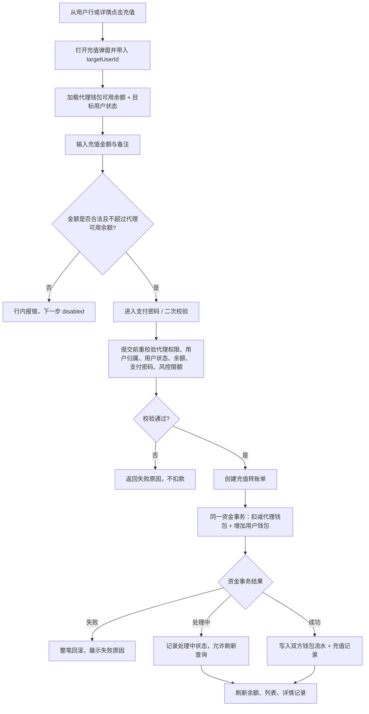
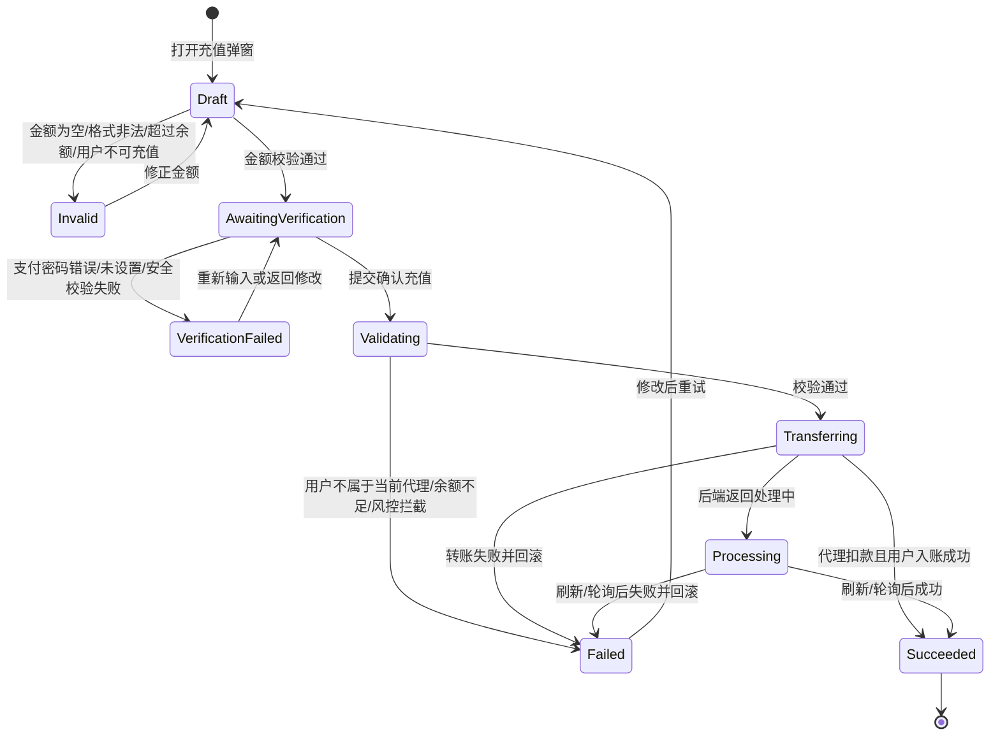

# M02 我的用户与用户充值

## 文档信息

| 字段 | 内容 |
|---|---|
| 文档标题 | 静态代理-我的用户与用户充值需求文档 |
| 文档编号 | PRD-2026-M02-Agent-Users-Recharge |
| 产品版本 | v0.1 |
| 创建日期 | 2026-06-10 |
| 最后更新 | 2026-06-10 |
| 状态 | 草稿 |
| 关联模块 | M02 我的用户与用户充值 |
| 关联全局决策 | `代理商-prd/decisions/00-global.md` |
| 关联模块决策 | `代理商-prd/decisions/02-我的用户与用户充值.md` |
| 关联原型 | `prototypes/agent-users-recharge-prototype.html` |
| 关联图集 | `代理商-prd/diagrams/02-我的用户与用户充值-mermaid.md` |

## 修订历史

| 版本 | 日期 | 变更说明 |
|---|---|---|
| v0.1 | 2026-06-10 | 基于 M02 decisions / prototype / Mermaid 图集生成模块级交付 PRD |

## 一、问题陈述

代理商需要在工作台中查看自己名下已绑定用户，并能从代理钱包向下级用户钱包发起内部充值。当前代理关系、用户状态、钱包扣减、用户入账、支付密码校验和充值流水追溯需要统一，否则容易出现跨代理查看用户、给错误用户充值、资金单边变动或充值结果不可追溯。

本模块解决 M02 用户管理与充值闭环：代理商只查看 `agency_id = 当前代理商用户 id` 的下级用户；充值不走 Checkout，本质是代理钱包扣减、用户钱包增加的内部转账；资金操作必须二次校验并保证原子性。

## 二、目标

| 编号 | 目标描述 | 衡量指标 | 目标值 | 当前值 | 衡量时间 |
|---|---|---|---|---|---|
| G-M02-01 | 让代理商能查看自己名下下级用户 | 下级用户列表加载成功率 | ≥ 99%【待确认】 | 【待确认】 | 上线后 14 天 |
| G-M02-02 | 让代理商能快速找到目标用户 | 搜索 / 筛选后进入详情成功率 | ≥ 95%【待确认】 | 【待确认】 | 上线后 14 天 |
| G-M02-03 | 让代理商能安全给下级用户充值 | 用户充值成功资金一致率 | 100% | 【待确认】 | 持续监控 |
| G-M02-04 | 降低充值失败不可解释率 | 充值失败原因可识别率 | ≥ 99%【待确认】 | 【待确认】 | 上线后 30 天 |

## 三、非目标

| 非目标 | 排除原因 |
|---|---|
| 主动邀请、创建、绑定、解绑下级用户 | 本期只管理已绑定 `agency_id` 的用户 |
| 重写用户钱包、完整钱包流水页 | M02 只展示充值所需余额和最近充值记录 |
| Checkout / 在线支付 | 给下级用户充值是内部钱包转账，不走 Checkout |
| 自动支付用户待支付订单或自动重试续费失败订单 | 充值只增加用户钱包余额，不触发订单扣款 |
| 多币种、汇率换算 | 本期固定 USD |
| 代理端暴露完整联系方式 | 邮箱、手机号脱敏展示 |

## 四、用户故事

| 编号 | 用户故事 | 优先级 | 验收标准 |
|---|---|---|---|
| US-M02-01 | 作为代理商，我想查看已绑定到我名下的用户，以便了解自己可服务的下级用户范围。 | P0 | 进入我的用户后，仅看到当前代理商名下未删除用户。 |
| US-M02-02 | 作为代理商，我想搜索和筛选下级用户，以便快速找到需要协助的用户。 | P0 | 支持账号 / 昵称 / 邮箱 / 手机搜索和状态、注册时间筛选。 |
| US-M02-03 | 作为代理商，我想查看某个下级用户详情，以便确认钱包余额、账户状态和最近充值记录。 | P0 | 详情展示基础信息、状态、用户钱包余额、代理归属和最近充值记录。 |
| US-M02-04 | 作为代理商，我想从自己的钱包给下级用户充值，以便用户可以继续购买或续费静态代理。 | P0 | 输入合法金额并通过支付密码校验后，代理钱包减少同等金额，用户钱包增加同等金额。 |
| US-M02-05 | 作为代理商，我想在充值失败时看到明确原因，以便知道是余额不足、用户不可充值、支付密码错误还是系统异常。 | P0 | 失败时保留上下文并提示原因，不产生单边资金变动。 |

## 五、非功能性需求

| 类型 | 需求描述 | 衡量标准 |
|---|---|---|
| 权限 | 仅 `is_agent=1` 可访问我的用户和充值 | 非代理商访问展示无权限，不返回下级用户数据 |
| 数据隔离 | 后端必须按当前登录代理商强制过滤 `agency_id` | 不接受前端传入任意 `agency_id` 覆盖 |
| 资金一致性 | 代理扣款与用户入账必须同成同败 | 任一失败整笔回滚 |
| 幂等性 | 充值提交必须防重复 | 使用幂等键 / 转账单号避免重复扣款 |
| 安全 | 充值提交前必须支付密码 / 二次校验 | 未通过安全校验不得发起转账 |
| 隐私 | 下级用户联系方式脱敏展示 | 邮箱、手机号不默认暴露完整值 |

## 六、功能需求

### 6.1 产品结构

```text
M02 我的用户与用户充值
├── 我的用户列表
│   ├── 指标卡
│   ├── 搜索 / 筛选 / 分页
│   └── 下级用户表格
├── 下级用户详情抽屉
│   ├── 基础信息
│   ├── 用户钱包余额
│   └── 最近充值记录
└── 用户充值弹窗
    ├── 金额录入
    ├── 支付密码 / 二次校验
    └── 充值结果刷新
```

### 6.2 功能需求清单

| 需求ID | 需求描述 | 所属用户故事 | 优先级 | 验收标准 | 对应界面 |
|---|---|---|---|---|---|
| FR-M02-01 | 代理商权限与下级用户归属过滤 | US-M02-01 | P0 | 列表和详情强制按当前代理商过滤 `agency_id` | P-M02-1 / P-M02-2 |
| FR-M02-02 | 下级用户列表、搜索、筛选、分页 | US-M02-01, US-M02-02 | P0 | 支持关键字、状态、注册时间筛选；分页加载 | P-M02-1 |
| FR-M02-03 | 下级用户详情 | US-M02-03 | P0 | 展示用户基础信息、代理归属、用户钱包余额、最近 5 条本代理充值记录 | P-M02-2 |
| FR-M02-04 | 充值金额录入与余额预校验 | US-M02-04, US-M02-05 | P0 | 金额 > 0、最多 2 位小数、不超过代理钱包可用余额和风控限额 | P-M02-3 |
| FR-M02-05 | 支付密码 / 二次校验 | US-M02-04, US-M02-05 | P0 | 未通过支付密码 / 安全校验不得转账 | P-M02-4 |
| FR-M02-06 | 原子转账与失败回滚 | US-M02-04, US-M02-05 | P0 | 代理扣款、用户入账同成同败，失败不产生单边流水 | P-M02-4 |
| FR-M02-07 | 充值结果刷新与记录追溯 | US-M02-03, US-M02-04 | P0 | 成功后刷新代理余额、用户余额、列表行、最近充值记录；流水可按转账单号关联 | P-M02-1 / P-M02-2 |
| FR-M02-08 | 充值埋点与异常定位 | US-M02-04, US-M02-05 | P1 | 记录打开弹窗、金额校验、二次校验、转账结果事件 | 全模块 |

## 七、界面功能详细说明

### 7.0 页面总览

| 页面编号 | 页面名称 | 类型 | 入口 | 主要去向 |
|---|---|---|---|---|
| P-M02-1 | 我的用户列表 | 代理端页面 | 工作台导航「我的用户」 | 用户详情、充值弹窗、销售订单按用户筛选 |
| P-M02-2 | 下级用户详情抽屉 | Drawer / 详情页 | 我的用户列表 → 查看详情 | 返回列表、打开充值弹窗、跳转销售订单 |
| P-M02-3 | 用户充值弹窗：金额录入 | Modal Step 1 | 列表或详情 → 充值 | 取消、下一步支付密码校验 |
| P-M02-4 | 用户充值弹窗：支付密码 / 二次校验 | Modal Step 2 | 金额录入校验通过 | 返回修改、确认充值 |

### 7.1 原型与图集

| 类型 | 文件 |
|---|---|
| HTML 原型 | `../prototypes/agent-users-recharge-prototype.html` |
| 桌面截图 | `../prototypes/agent-users-recharge-prototype-desktop.png` |
| 移动截图 | `../prototypes/agent-users-recharge-prototype-mobile.png` |
| Mermaid 图集 | `diagrams/02-我的用户与用户充值-mermaid.md` |

### 7.2 关键界面元素

| 界面 | 核心元素 | 业务规则 |
|---|---|---|
| 我的用户列表 | 导航、代理钱包可用余额、下级用户数、可用用户数、近 30 天充值成功数、搜索、筛选、用户表格、分页 | 只展示当前代理商名下用户；未激活 / 不可用用户禁用充值；联系方式脱敏。 |
| 下级用户详情 | 用户基础信息、代理归属、用户钱包余额、最近充值记录、查看销售订单、给用户充值 | 详情接口必须校验归属；最近充值记录只展示本代理发起记录。 |
| 金额录入弹窗 | 目标用户摘要、代理钱包余额、充值金额、备注、影响提示、下一步 | 充值金额不扣款；备注仅代理端内部可见。 |
| 二次校验弹窗 | 充值摘要、支付密码、设置支付密码入口、确认充值 | 最终提交前重校验身份、用户归属、余额、风控、支付密码。 |

### 7.3 用户可充值状态

| 用户状态来源 | 展示状态 | 是否可充值 | 规则 |
|---|---|---|---|
| `deleted = 1` | 不展示 | 否 | 已删除用户不进入列表；历史链接访问返回无权或不存在。 |
| `agency_id != 当前代理商用户 id` | 不展示 | 否 | 后端强制过滤；提交时归属变化返回「用户不属于当前代理」。 |
| `status = 1` | 可用 | 是 | 允许从列表或详情发起充值。 |
| `status = 0` | 不可用 | 否 | 充值按钮 disabled，提示用户状态不可用。 |
| `status = 2` | 未激活 | 否 | 充值按钮 disabled，提示用户未激活暂不可充值。 |

### 7.4 页面级四态

| 页面 | 空态 | 加载态 | 错误态 | 成功态 |
|---|---|---|---|---|
| 我的用户列表 | 暂无下级用户；筛选无结果可清空筛选 | 指标卡和表格骨架 | 列表失败可重试；代理钱包余额失败时禁用充值 | 展示用户列表；充值成功后刷新余额和目标用户行 |
| 下级用户详情 | 最近充值记录为空 | 基础信息、余额、记录分区加载 | 详情失败可重试；无权用户隐藏充值 | 展示用户详情；充值成功后刷新余额和记录 |
| 充值弹窗 | 金额 / 支付密码为空时按钮 disabled | 余额、用户状态、提交按钮 loading | 金额非法、余额不足、用户不可充值、密码错误、转账失败均留在弹窗提示 | Toast 成功，关闭弹窗并刷新列表 / 详情 / 指标 |

## 八、流程与状态

### 8.1 用户充值主流程



### 8.2 用户充值状态机



## 九、数据需求与能力依赖

| 能力 | 用途 | 关键字段 / 约束 | 状态 |
|---|---|---|---|
| 代理钱包余额 | 指标展示、充值预校验 | availableBalance、currency=USD、walletStatus | 复用现有钱包域 |
| 下级用户列表 | 展示我的用户 | `agency_id`、status、keyword、注册时间、分页 | 已有用户字段，需后端强制过滤 |
| 下级用户详情 | 展示基础信息、余额、归属 | targetUserId、用户快照、walletBalance | 需归属校验 |
| 最近充值记录 | 展示本代理对该用户的充值记录 | transferId、amount、status、createTime、finishTime | 复用现有钱包域，必要时补充转账记录 |
| 支付密码 / 二次校验 | 充值前安全校验 | 当前代理商、安全上下文、错误原因 | 安全侧提供 |
| 充值转账 | 原子资金操作 | agencyId、targetUserId、amount、currency、remark、idempotencyKey | 需幂等与回滚 |
| 充值结果查询 | 成功刷新与处理中追溯 | transferId、agentDebitFlowId、userCreditFlowId、status | 处理中规则待确认 |

## 十、埋点

| 事件名 | 触发时机 | 关键属性 | 用途 |
|---|---|---|---|
| `view_agent_users` | 进入我的用户列表成功 | agencyId、userCount、availableUserCount | 入口访问 |
| `search_agent_users` | 执行搜索或筛选 | keywordType、statusFilter、resultCount | 查找效率 |
| `view_agent_user_detail` | 打开用户详情 | targetUserId、targetUserStatus | 详情使用 |
| `click_agent_user_recharge` | 点击充值按钮 | source、targetUserStatus、walletBalanceRange | 充值意图 |
| `input_agent_user_recharge_amount` | 充值金额校验 | amountRange、isValid、invalidReason | 金额校验 |
| `agent_user_recharge_verify_result` | 支付密码校验返回 | ok、errorCode | 安全校验失败定位 |
| `agent_user_recharge_result` | 充值转账返回 | ok、errorCode、transferId | 充值成功率 / 失败定位 |

## 十一、开放问题

| 编号 | 问题 | 建议默认值 / 结论 | 影响 |
|---|---|---|---|
| M02-Q01 | 钱包账户与流水表结构 | 已确认复用现有钱包域；必要时补充代理向用户转账记录 | M02 / M05 资金一致性 |
| M02-Q02 | 充值风控配置接口字段、默认值和错误码 | 后端返回最小额、单笔上限、每日上限、次数 | 充值提交 |
| M02-Q03 | 支付密码安全配置 | P0 使用支付密码；锁定、2FA、邮箱验证码由安全侧配置 | M02 / M05 二次校验 |
| M02-Q04 | 支付密码设置入口 URL | 统一安全中心提供 | 未设置支付密码处理 |
| M02-Q05 | 处理中结果查询 | 需确认是否轮询、轮询间隔、查询接口 | 充值状态追溯 |

## 十二、验收重点

- 非代理商无法访问我的用户数据。
- 代理商只能查看和充值自己名下用户。
- 不可用、未激活、已删除、归属变化用户不可充值。
- 充值金额校验覆盖金额格式、余额不足、风控限额。
- 支付密码 / 二次校验失败不发起转账。
- 代理钱包扣减和用户钱包增加同成同败。
- 成功后刷新代理余额、用户余额、列表行、详情最近充值记录。
- 充值流水可通过同一转账单号追溯代理扣款和用户入账。

## 十三、模块完成标准自检

| 检查项 | 结果 |
|---|---|
| decisions 已确认 | 通过：`decisions/02-我的用户与用户充值.md` |
| 原型 / 截图 | 通过：已有关联 HTML 原型与桌面 / 移动截图 |
| Mermaid 图集 | 通过：已覆盖列表、详情、充值流程、状态机 |
| US → FR → 页面追溯 | 通过：FR-M02-01 至 FR-M02-08 已映射页面 |
| 页面级四态 | 通过：列表、详情、充值弹窗均覆盖 |
| 待确认项 | 通过：集中为钱包、风控、安全、处理中结果查询 |
