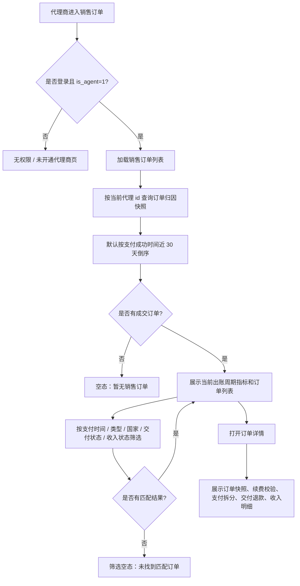
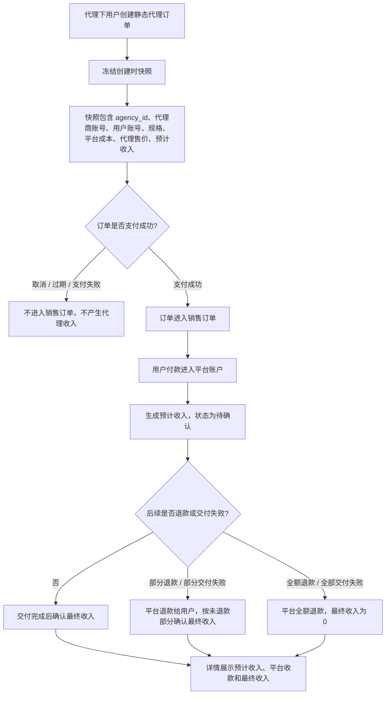
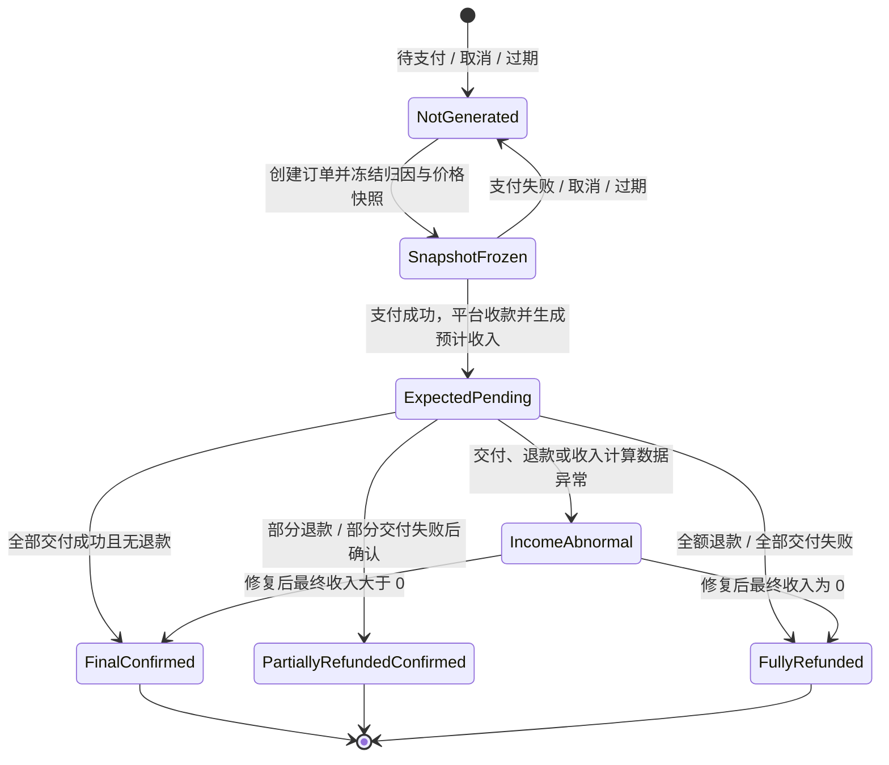

# M03 销售订单

## 文档信息

| 字段 | 内容 |
|---|---|
| 文档标题 | 静态代理-销售订单需求文档 |
| 文档编号 | PRD-2026-M03-Agent-Sales-Orders |
| 产品版本 | v0.1 |
| 创建日期 | 2026-06-10 |
| 最后更新 | 2026-06-10 |
| 状态 | 草稿 |
| 关联模块 | M03 销售订单 |
| 关联全局决策 | `代理商-prd/decisions/00-global.md` |
| 关联模块决策 | `代理商-prd/decisions/03-销售订单.md` |
| 关联原型 | `prototypes/agent-sales-orders-prototype.html` |
| 关联图集 | `代理商-prd/diagrams/03-销售订单-mermaid.md` |

## 修订历史

| 版本 | 日期 | 变更说明 |
|---|---|---|
| v0.1 | 2026-06-10 | 基于 M03 decisions / prototype / Mermaid 图集生成模块级交付 PRD |

## 一、问题陈述

代理商需要查看代理下用户产生的静态代理成交订单，并理解每笔订单的销售额、平台退款、预计收入和最终收入。若没有订单归因快照、价格快照和收入状态解释，后续 M04 月账单与 M05 提现都会缺少可追溯依据。

本模块是代理端只读对账入口，不重写用户购买、Checkout、钱包支付或交付退款链路。M03 只展示当前代理名下用户的成交订单，并按订单创建 / 成交时快照解释历史订单。

## 二、目标

| 编号 | 目标描述 | 衡量指标 | 目标值 | 当前值 | 衡量时间 |
|---|---|---|---|---|---|
| G-M03-01 | 让代理商能查看自己名下用户成交订单 | 销售订单列表加载成功率 | ≥ 99%【待确认】 | 【待确认】 | 上线后 14 天 |
| G-M03-02 | 让代理商理解退款和交付失败对收入的影响 | 退款影响明细查看成功率 | ≥ 99%【待确认】 | 【待确认】 | 上线后 14 天 |
| G-M03-03 | 为 M04 月账单提供可追溯订单快照 | 订单快照完整率 | 100% | 【待确认】 | 持续监控 |
| G-M03-04 | 降低收入异常不可解释率 | 收入异常原因可识别率 | ≥ 99%【待确认】 | 【待确认】 | 上线后 30 天 |

## 三、非目标

| 非目标 | 排除原因 |
|---|---|
| 待支付、取消、过期订单展示 | M03 只展示成交订单 |
| 去支付、取消订单、退款发起、补交付 | 属于用户购买 / 订单 / 交付后台能力 |
| 销售订单导出 | 本期导出收敛到 M04 月账单冻结快照 |
| 邮箱、手机号、IP 搜索 | 列表搜索只支持订单号和用户账号 |
| 代理侧资金扣回 | 平台退款独立处理，M03 不做代理侧资金扣回 |

## 四、用户故事

| 编号 | 用户故事 | 优先级 | 验收标准 |
|---|---|---|---|
| US-M03-01 | 作为代理商，我想查看代理下用户成交订单，以便对账销售额和收入。 | P0 | 只展示当前代理下用户的支付成功成交订单。 |
| US-M03-02 | 作为代理商，我想筛选订单类型、国家、交付状态和收入状态，以便快速定位订单。 | P0 | 支持支付成功时间、订单类型、国家、交付状态、收入状态和关键词筛选。 |
| US-M03-03 | 作为代理商，我想查看订单详情，以便理解订单快照、支付拆分、交付退款和收入明细。 | P0 | 详情展示创建时归因、规格、价格、成本和收入快照。 |
| US-M03-04 | 作为代理商，我想理解续费订单的重新校验结果，以便知道续费为什么按新价格成交。 | P0 | 续费订单详情展示关联原订单号和续费校验快照。 |
| US-M03-05 | 作为代理商，我想理解平台退款和交付失败对最终收入的影响，以便知道为什么收入变化。 | P0 | 详情展示平台退款金额、退款影响和最终收入。 |

## 五、非功能性需求

| 类型 | 需求描述 | 衡量标准 |
|---|---|---|
| 权限 | 仅代理商可访问销售订单 | 非代理商展示无权限，不返回订单数据 |
| 数据隔离 | 订单必须按当前代理商归因快照过滤 | 不接受前端传入任意 `agency_id` 覆盖 |
| 可追溯 | 历史订单必须使用创建时快照 | 后续价格、国家、归属变化不影响历史订单解释 |
| 一致性 | M03 收入结果必须可被 M04 月账单复用 | 订单收入状态和最终收入字段稳定 |
| 隐私 | 代理端只展示用户账号 / 用户 ID | 不展示邮箱、手机号 |

## 六、功能需求

### 6.1 产品结构

```text
M03 销售订单
├── 销售订单列表
│   ├── 当前统计周期指标
│   ├── 支付成功时间 / 类型 / 国家 / 状态筛选
│   └── 成交订单表格
└── 销售订单详情
    ├── 订单归因快照
    ├── 续费校验快照
    ├── 规格与价格快照
    ├── 支付拆分
    ├── 交付 / 退款明细
    └── 预计收入 / 最终收入明细
```

### 6.2 功能需求清单

| 需求ID | 需求描述 | 所属用户故事 | 优先级 | 验收标准 | 对应界面 |
|---|---|---|---|---|---|
| FR-M03-01 | 销售订单列表 | US-M03-01 | P0 | 只展示当前代理下用户成交订单，不展示待支付、取消、过期订单 | P-M03-1 |
| FR-M03-02 | 销售订单筛选与搜索 | US-M03-02 | P0 | 支持支付成功时间、订单类型、国家、交付状态、收入状态和订单号 / 用户账号搜索 | P-M03-1 |
| FR-M03-03 | 销售订单详情 | US-M03-03 | P0 | 展示订单快照、价格快照、支付拆分、交付退款和收入明细 | P-M03-2 |
| FR-M03-04 | 续费重新校验快照 | US-M03-04 | P0 | 续费订单展示关联原订单、校验结果和新价格快照 | P-M03-2 |
| FR-M03-05 | 退款与最终收入解释 | US-M03-05 | P0 | 展示平台退款金额、退款影响、最终销售额、最终成本、最终收入 | P-M03-2 |

## 七、界面功能详细说明

### 7.0 页面总览

| 页面编号 | 页面名称 | 类型 | 入口 | 主要去向 |
|---|---|---|---|---|
| P-M03-1 | 销售订单列表 | 代理端页面 | 工作台导航「销售订单」；M02 用户详情跳转 | 销售订单详情 |
| P-M03-2 | 销售订单详情 | 桌面抽屉 / 移动详情页 | 列表行 / 订单号点击 | 返回销售订单列表 |

### 7.1 原型与图集

| 类型 | 文件 |
|---|---|
| HTML 原型 | `../prototypes/agent-sales-orders-prototype.html` |
| 桌面截图 | `../prototypes/agent-sales-orders-prototype-desktop.png` |
| 移动截图 | `../prototypes/agent-sales-orders-prototype-mobile.png` |
| Mermaid 图集 | `diagrams/03-销售订单-mermaid.md` |

### 7.2 关键界面元素

| 界面 | 核心元素 | 业务规则 |
|---|---|---|
| 销售订单列表 | 当前统计周期指标、支付成功时间、订单类型、国家、交付状态、收入状态、搜索、订单表、分页 | 默认近 30 天；顶部指标不随列表筛选变化；搜索只支持订单号和用户账号。 |
| 销售订单详情 | 订单标题、下单用户快照、订单类型、续费信息、规格快照、价格快照、支付拆分、交付退款、收入明细 | 历史订单按创建时快照展示；续费订单展示重新校验结果；收入异常展示原因。 |

### 7.3 状态拆分

| 状态维度 | 状态 | 展示含义 | 对收入影响 |
|---|---|---|---|
| 订单交易状态 | 已支付 | 用户已完成支付，订单成交 | 平台收款，生成销售额、成本、预计收入 |
| 订单交易状态 | 已取消 / 已过期 / 支付失败 | 用户未完成成交 | 不进入 M03 |
| 订单类型 | 新购 | 用户新购买静态代理资源 | 支付成功后生成预计收入，交付 / 退款后确认最终收入 |
| 订单类型 | 续费 | 用户对历史订单续费形成的新成交订单 | 按续费重新校验后的新快照计算收入 |
| 交付状态 | 交付中 | 支付成功后仍在交付窗口内 | 展示预计收入，最终收入待确认 |
| 交付状态 | 全部交付成功 | 成功交付全部 IP | 最终收入等于预计收入 |
| 交付状态 | 部分交付已退款 | 部分 IP 失败并退款 | 最终收入按未退款部分确认 |
| 交付状态 | 交付失败已退款 | 全部 IP 失败并退款 | 最终收入归 0 |
| 收入状态 | 待确认 | 交付 / 退款结果尚未确认 | 展示预计收入，不作为最终收入 |
| 收入状态 | 已确认 | 无退款且最终收入已确认 | 最终收入等于预计收入 |
| 收入状态 | 部分退款后确认 | 已完成部分退款并确认最终收入 | 展示退款金额、退款影响和最终收入 |
| 收入状态 | 全额退款 | 已完成全额退款 | 最终收入为 `$0.00` |
| 收入状态 | 收入异常 | 交付、退款或收入计算异常 | 展示异常原因，需系统 / 人工修复 |

### 7.4 页面级四态

| 页面 | 空态 | 加载态 | 错误态 | 成功态 |
|---|---|---|---|---|
| 销售订单列表 | 暂无销售订单；筛选无结果可重置 | 指标卡和表格骨架 | 列表失败可重试；指标失败不阻塞列表 | 展示指标、筛选区、订单表 |
| 销售订单详情 | 订单不存在或无权查看 | 详情骨架，返回可用 | 详情失败可重试；收入明细失败局部提示 | 展示订单快照、续费校验、支付拆分、交付退款、收入明细 |

## 八、流程与状态

### 8.1 销售订单查看流程



### 8.2 用户订单到代理收入流程



### 8.3 收入状态机



## 九、数据需求与能力依赖

| 依赖 | 用途 | 关键字段 / 能力 | 状态 |
|---|---|---|---|
| 用户归属 | 限制订单可见范围 | `t_user.agency_id`、`t_user.is_agent` | 已有字段 |
| 订单归因快照 | 固化历史订单代理归属 | agency_id、代理商账号、用户账号、用户 ID | 研发会保存快照 |
| 价格快照 | 解释历史收入 | 代理售价、平台成本、代理加价 / 价差 | 研发会保存快照 |
| 续费校验快照 | 解释续费订单新价格 | 原订单号、校验时间、国家可售状态、代理价差快照 | 待确认 |
| 支付记录 | 展示支付拆分 | 钱包金额、在线金额、支付方式、支付时间 | 复用订单 / 钱包链路 |
| 交付 / 退款记录 | 展示平台退款与交付失败影响 | 失败数量、退款金额、退款去向、退款时间 | 需与交付退款口径对齐 |
| 收入计算结果 | 展示预计收入和最终收入 | expectedIncome、refundImpactAmount、finalIncome、incomeStatus | 待接口确认 |
| 统计周期配置 | 顶部指标周期 | periodId、periodStart、periodEnd | 与 M04 出账周期保持一致 |

## 十、埋点

| 事件名 | 触发时机 | 关键属性 | 用途 |
|---|---|---|---|
| `view_agent_sales_orders` | 进入销售订单列表 | agencyId、periodId、orderCount、finalIncomeAmount | 入口访问 |
| `filter_agent_sales_orders` | 查询或切换筛选 | dateRange、orderType、countryCode、deliveryStatus、incomeStatus | 筛选使用 |
| `search_agent_sales_orders` | 使用关键词搜索 | keywordType、resultCount | 定位能力 |
| `view_agent_sales_order_detail` | 打开订单详情 | orderNo、orderType、deliveryStatus、incomeStatus | 详情查看 |
| `view_agent_renewal_check_snapshot` | 查看续费订单详情 | orderNo、sourceOrderNo、checkPassed | 续费解释 |
| `view_agent_refund_income_impact` | 查看退款订单 | refundAmount、incomeImpactAmount、incomeStatus | 退款解释 |
| `agent_sales_orders_load_result` | 列表接口返回 | ok、errorCode、durationMs | 可用性监控 |

## 十一、开放问题

| 编号 | 问题 | 建议默认值 / 结论 | 影响 |
|---|---|---|---|
| M03-Q01 | 快照落库字段 | 已确认研发会保存订单归因、价格、平台成本、代理最终售价和预计收入快照 | M03 / M04 |
| M03-Q02 | 成本快照来源 | 已确认必须有快照来源，不可用当前价格反推 | 历史收入解释 |
| M03-Q03 | 续费校验记录 | 需保存原订单号、校验时间、国家可售状态、代理价差快照 | 续费解释 |
| M03-Q04 | 单 IP 分摊精度 | 优先交付明细；否则按 IP 数量分摊，尾差需财务确认 | 部分退款 |
| M03-Q05 | 收入确认时点 | 需对齐交付完成、退款完成和最终收入确认状态边界 | M04 跨期归属 |
| M03-Q06 | 收入异常恢复 | 需确认系统重试、人工修复和代理端刷新机制 | 异常处理 |

## 十二、验收重点

- 非代理商无法查看销售订单。
- 只展示当前代理名下用户成交订单。
- 待支付、取消、过期、支付失败订单不进入 M03。
- 订单详情展示创建时归因、规格、价格、平台成本、预计收入快照。
- 续费订单展示关联原订单和重新校验结果。
- 平台退款、交付失败能解释最终收入变化。
- 收入状态可覆盖待确认、已确认、部分退款后确认、全额退款、收入异常。
- M03 最终收入结果可被 M04 月账单引用。

## 十三、模块完成标准自检

| 检查项 | 结果 |
|---|---|
| decisions 已确认 | 通过：`decisions/03-销售订单.md` |
| 原型 / 截图 | 通过：已有关联 HTML 原型与桌面 / 移动截图 |
| Mermaid 图集 | 通过：已覆盖销售订单查看、收入流程、续费校验、收入状态机 |
| US → FR → 页面追溯 | 通过：FR-M03-01 至 FR-M03-05 已映射页面 |
| 页面级四态 | 通过：列表、详情均覆盖 |
| 待确认项 | 通过：集中为续费校验、分摊精度、确认时点、异常恢复 |
