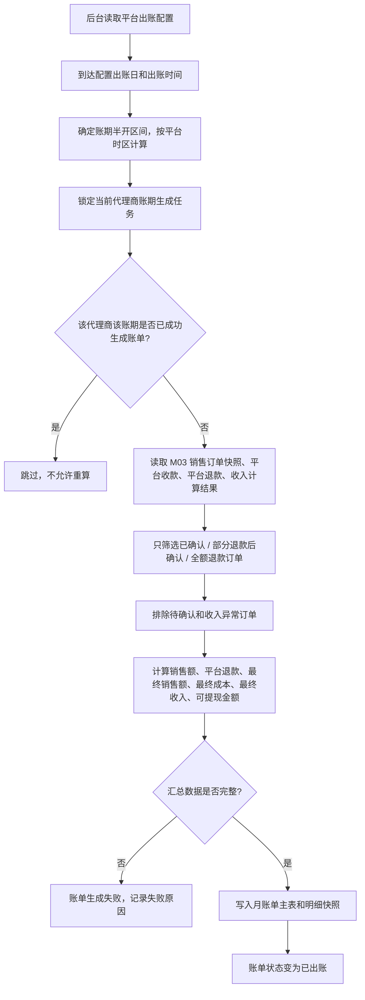
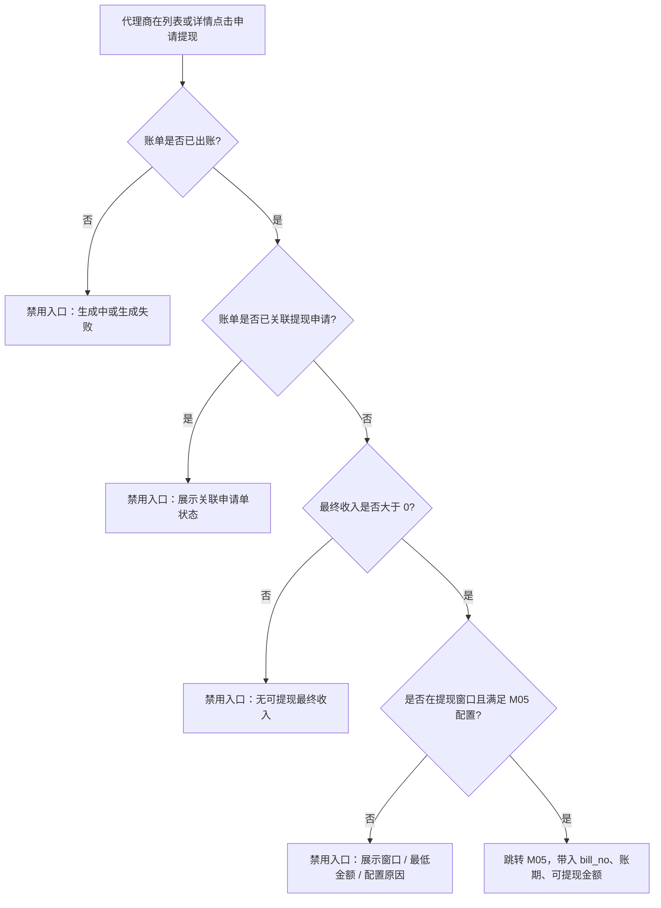
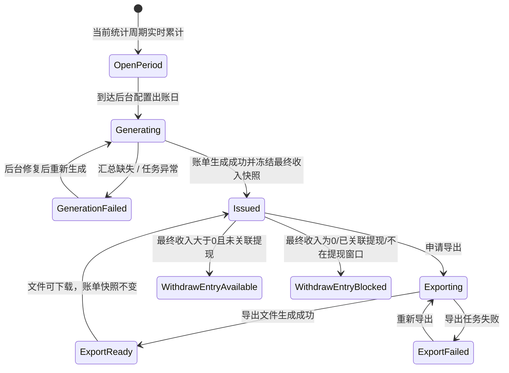

# M04 我的收入与月度账单

## 文档信息

| 字段 | 内容 |
|---|---|
| 文档标题 | 静态代理-我的收入与月度账单需求文档 |
| 文档编号 | PRD-2026-M04-Agent-Income-Billing |
| 产品版本 | v0.1 |
| 创建日期 | 2026-06-10 |
| 最后更新 | 2026-06-10 |
| 状态 | 草稿 |
| 关联模块 | M04 我的收入与月度账单 |
| 关联全局决策 | `代理商-prd/decisions/00-global.md` |
| 关联模块决策 | `代理商-prd/decisions/04-我的收入与月度账单.md` |
| 关联原型 | `prototypes/agent-income-billing-prototype.html` |
| 关联图集 | `代理商-prd/diagrams/04-我的收入与月度账单-mermaid.md` |

## 修订历史

| 版本 | 日期 | 变更说明 |
|---|---|---|
| v0.1 | 2026-06-10 | 基于 M04 decisions / prototype / Mermaid 图集生成模块级交付 PRD |

## 一、问题陈述

代理商需要按后台出账日查看正式月账单，并理解账单中的销售额、平台退款、最终成本、最终收入和可提现金额。若当前周期实时数据与正式账单混用，会导致出账后重算、导出不稳定、提现金额不可追溯。

本模块承接 M03 最终收入口径：用户付款进入平台账户，支付成功后生成预计收入，平台完成交付或退款后确认最终收入；M04 正式账单只纳入最终收入已确认的订单，并在后台出账任务成功后冻结快照。

## 二、目标

| 编号 | 目标描述 | 衡量指标 | 目标值 | 当前值 | 衡量时间 |
|---|---|---|---|---|---|
| G-M04-01 | 让代理商能查看当前统计周期实时收入预估 | 我的收入页加载成功率 | ≥ 99%【待确认】 | 【待确认】 | 上线后 14 天 |
| G-M04-02 | 让代理商能按账期查看正式月账单 | 月账单列表加载成功率 | ≥ 99%【待确认】 | 【待确认】 | 上线后 14 天 |
| G-M04-03 | 让代理商能导出已出账账单 | 账单导出成功率 | ≥ 98%【待确认】 | 【待确认】 | 上线后 30 天 |
| G-M04-04 | 为 M05 提供稳定提现入口和账单上下文 | 可提现入口错误率 | 0 | 【待确认】 | 持续监控 |

## 三、非目标

| 非目标 | 排除原因 |
|---|---|
| 代理商手动触发出账、重算账单、修改账单金额 | 出账由后台任务和结算域控制 |
| 当前未出账周期正式导出 | 当前周期只做实时预估，不作为正式账单 |
| 提现申请表单、收款账户、审核、打款 | 进入 M05 提现申请模块 |
| 销售订单列表导出 | 销售订单导出收敛为月账单导出 |
| 旧版收益流水、收益冲正、待抵扣、钱包扣回口径 | 已被 M03/M04 新最终收入口径替代 |
| 多币种、发票、税务、银行流水对接 | 超出本期代理端账单范围 |

## 四、用户故事

| 编号 | 用户故事 | 优先级 | 验收标准 |
|---|---|---|---|
| US-M04-01 | 作为代理商，我想查看当前统计周期的实时收入预估，以便知道本期销售额、平台退款、最终收入和待确认收入。 | P0 | 进入我的收入后展示实时指标，并明确其不是正式账单。 |
| US-M04-02 | 作为代理商，我想查看已生成的月账单列表，以便按账期对账。 | P0 | 列表展示已创建账单，支持账期、状态、提现入口、导出状态筛选。 |
| US-M04-03 | 作为代理商，我想查看某张账单详情，以便理解销售额、平台退款、最终成本和最终收入来源。 | P0 | 详情展示账单快照、金额汇总、最终收入明细、退款影响明细。 |
| US-M04-04 | 作为代理商，我想导出已出账账单，以便线下对账和归档。 | P0 | 已出账账单可导出冻结快照；未生成或生成失败账单不可导出。 |
| US-M04-05 | 作为代理商，我想从可提现账单进入提现申请，以便申请提取已出账最终收入。 | P0 | 满足条件时入口可用并带入账单号 / 可提现金额；不满足时展示原因。 |

## 五、非功能性需求

| 类型 | 需求描述 | 衡量标准 |
|---|---|---|
| 权限 | 仅代理商可访问收入与账单 | 非代理商展示无权限 |
| 数据隔离 | 账单查询、详情、导出必须按当前代理商过滤 | 不接受前端覆盖 `agency_id` |
| 一致性 | 已出账账单主表、明细、导出数据源不可重算或覆盖 | 出账后金额固定 |
| 可追溯 | 账单明细能追溯 M03 订单快照和最终收入确认结果 | 每条明细含订单号和收入状态 |
| 安全 | 导出文件需按代理商鉴权 | 不允许下载其他代理商账单 |

## 六、功能需求

### 6.1 产品结构

```text
M04 我的收入与月度账单
├── 我的收入 / 月账单列表
│   ├── 当前统计周期实时指标
│   ├── 出账配置提示
│   ├── 账单筛选
│   └── 月账单表
├── 月账单详情
│   ├── 账单快照
│   ├── 金额汇总
│   ├── 最终收入明细
│   └── 退款影响明细
├── 导出账单
└── 申请提现入口
```

### 6.2 功能需求清单

| 需求ID | 需求描述 | 所属用户故事 | 优先级 | 验收标准 | 对应界面 |
|---|---|---|---|---|---|
| FR-M04-01 | 代理商权限校验 | US-M04-01, US-M04-02 | P0 | 未登录或 `is_agent!=1` 展示无权限；接口按当前代理过滤账单 | P-M04-1 |
| FR-M04-02 | 当前统计周期实时指标 | US-M04-01 | P0 | 展示销售额、平台退款、最终收入、待确认收入；不是正式账单 | P-M04-1 |
| FR-M04-03 | 月账单列表 | US-M04-02 | P0 | 展示账单号、账期、状态、销售额、平台退款、最终收入、可提现金额 | P-M04-1 |
| FR-M04-04 | 月账单筛选与搜索 | US-M04-02 | P0 | 支持账期、账单状态、提现入口状态、导出状态、账单号 / 账期搜索 | P-M04-1 |
| FR-M04-05 | 月账单详情 | US-M04-03 | P0 | 展示冻结快照，不读取实时订单重新计算 | P-M04-2 |
| FR-M04-06 | 最终收入解释 | US-M04-03 | P0 | 展示已确认、部分退款后确认、全额退款订单的最终收入和退款影响 | P-M04-2 |
| FR-M04-07 | 账单导出 | US-M04-04 | P0 | 已出账账单可导出冻结快照；导出失败可重试 | P-M04-3 |
| FR-M04-08 | 申请提现入口 | US-M04-05 | P0 | 可申请时跳转 M05 并带入账单号 / 可提现金额；不可申请时展示原因 | P-M04-4 |
| FR-M04-09 | 账单生成状态 | US-M04-02, US-M04-04 | P0 | 生成中 / 生成失败可展示，但未成功出账前不可导出、不可提现 | P-M04-1 |

## 七、界面功能详细说明

### 7.0 页面总览

| 页面编号 | 页面名称 | 类型 | 入口 | 主要去向 |
|---|---|---|---|---|
| P-M04-1 | 我的收入 / 月账单列表 | 代理端页面 | 工作台导航「我的收入」 | 账单详情、导出账单、申请提现 |
| P-M04-2 | 月账单详情 | 桌面抽屉 / 移动详情页 | 月账单列表 → 查看详情 | 返回列表、导出当前账单、申请提现 |
| P-M04-3 | 导出账单任务状态 | 行内状态 / 弹层提示 | 列表或详情 → 导出 | 下载文件、重试导出 |
| P-M04-4 | 申请提现入口 | 跳转入口 | 列表或详情 → 申请提现 | M05 提现申请 |

### 7.1 原型与图集

| 类型 | 文件 |
|---|---|
| HTML 原型 | `../prototypes/agent-income-billing-prototype.html` |
| 桌面截图 | `../prototypes/agent-income-billing-prototype-desktop.png` |
| 移动截图 | `../prototypes/agent-income-billing-prototype-mobile.png` |
| Mermaid 图集 | `diagrams/04-我的收入与月度账单-mermaid.md` |

### 7.2 关键界面元素

| 界面 | 核心元素 | 业务规则 |
|---|---|---|
| 我的收入 / 月账单列表 | 当前周期指标、出账配置提示、账期筛选、账单状态、提现入口状态、导出状态、月账单表 | 当前周期指标是实时预估；月账单列表只展示后台已创建账单。 |
| 月账单详情 | 账单标题、账单快照、金额汇总、最终收入明细、退款影响明细、导出、申请提现 | 详情读取冻结快照；只纳入最终收入已确认订单。 |
| 导出任务 | 导出、下载、重试 | 只导出已出账账单的冻结快照；P0 推荐 XLSX。 |
| 申请提现入口 | 可申请 / 不可申请原因 | 可申请时带入 `bill_no`、账期、可提现金额进入 M05。 |

### 7.3 账单金额口径

| 字段 | 说明 |
|---|---|
| 销售额 | 账期内纳入账单订单的原始销售额 |
| 平台退款 | 账期内纳入账单订单已完成的平台退款金额 |
| 最终销售额 | 销售额 - 平台退款 |
| 最终成本 | 已交付 / 未退款部分确认的平台成本 |
| 最终收入 | 最终销售额 - 最终成本 |
| 可提现金额 | 已出账、最终收入 > 0、未关联提现申请且满足 M05 规则时等于最终收入，否则为 0 |

### 7.4 页面级四态

| 页面 | 空态 | 加载态 | 错误态 | 成功态 |
|---|---|---|---|---|
| 月账单列表 | 暂无月账单；筛选无结果可重置 | 实时指标和列表骨架 | 列表失败可重试；实时指标失败不阻塞列表 | 展示实时指标、出账配置、账单列表 |
| 月账单详情 | 账单不存在或无权查看 | 详情骨架 | 详情失败可重试；明细失败局部提示 | 展示账单快照、金额汇总、明细、导出 / 提现入口 |

## 八、流程与状态

### 8.1 后台出账生成流程



### 8.2 申请提现入口判定流程



### 8.3 账单状态机



## 九、数据需求与能力依赖

| 依赖 | 用途 | 关键字段 / 能力 | 状态 |
|---|---|---|---|
| 后台出账配置 | 确定出账日、出账时间、账期区间 | bill_day、bill_time、timezone=平台时区、config_version | 时区已确认；字段与越界规则待确认 |
| 销售订单快照 | 生成最终收入明细 | order_no、agency_id、user_account_snapshot、spec_snapshot、agent_sale_amount、platform_cost_amount | 承接 M03 |
| 平台收款 / 退款记录 | 生成销售额、平台退款、退款影响明细 | paid_amount、refund_amount、refund_reason、refund_completed_at | 承接 M03 |
| 收入计算结果 | 判断是否纳入账单并生成最终收入 | incomeStatus、finalIncome、finalSalesAmount、finalCostAmount、incomeConfirmedAt | 承接 M03 |
| 月账单主表 | 保存账单快照主信息 | bill_no、agency_id、period_start、period_end、status、amount fields、generated_at | 需新增 / 确认 |
| 月账单明细表 | 保存最终收入和退款影响快照 | bill_no、detail_type、source_order_no、amount fields、income_status、reason | 需新增 / 确认 |
| 导出任务服务 | 生成 XLSX 文件 | export_task_id、bill_no、status、file_url、error_code | 待确认 |
| M05 提现申请 | 接收账单提现入口上下文 | bill_no、period_id、withdrawable_amount、blocked_reason | M05 细化 |

## 十、埋点

| 事件名 | 触发时机 | 关键属性 | 用途 |
|---|---|---|---|
| `view_agent_income_billing` | 进入我的收入页 | agencyId、currentPeriodId、billCount、finalIncomeAmount | 入口访问 |
| `filter_agent_income_bills` | 查询或切换筛选 | periodFilter、billStatus、withdrawEntryStatus、exportStatus | 筛选使用 |
| `view_agent_income_bill_detail` | 打开账单详情 | billNo、billStatus、withdrawEntryStatus | 详情查看 |
| `export_agent_income_bill_result` | 导出任务结束 | billNo、ok、errorCode、durationMs | 导出稳定性 |
| `click_agent_bill_withdraw_entry` | 点击申请提现入口 | billNo、withdrawableAmount、blockedReason | 提现入口转化 |
| `view_agent_bill_refund_impact` | 查看退款影响账单 | billNo、refundAmount、incomeImpactAmount | 退款解释 |

## 十一、开放问题

| 编号 | 问题 | 建议默认值 / 结论 | 影响 |
|---|---|---|---|
| M04-Q01 | 后台出账配置字段有哪些 | 时区已确认按平台时区；字段由后台配置返回 | 账期边界与页面提示 |
| M04-Q02 | 出账日超过当月天数如何处理 | 顺延 / 折算为当月最后一天需后台统一 | 月账期生成 |
| M04-Q03 | 导出文件格式是否只做 XLSX | P0 只做 XLSX | 导出实现 |
| M04-Q04 | 导出文件保留时长和下载鉴权 | 文件短期有效，按当前代理鉴权下载 | 安全与存储 |
| M04-Q05 | 可提现窗口、最低提现金额、手续费是否在 M04 展示 | M04 只展示入口与原因，规则由 M05 返回 | 提现入口禁用原因 |
| M04-Q06 | 月账单主表 / 明细表是否已有 | 若无则新增账单快照表 | 研发排期 |
| M04-Q07 | 最终收入确认时间由哪个字段提供 | 使用 M03 收入计算结果的 `incomeConfirmedAt` | 跨期归属 |

## 十二、验收重点

- 当前统计周期指标和正式月账单有明确区分。
- 月账单按后台出账日和平台时区生成。
- 已出账账单不可重算、不可覆盖。
- 正式账单只纳入最终收入已确认订单。
- 账单详情金额来自冻结快照。
- 已出账账单可导出；生成中 / 生成失败不可导出。
- 可提现入口能解释不可申请原因。
- 一张账单同一时间最多关联一笔提现申请。

## 十三、模块完成标准自检

| 检查项 | 结果 |
|---|---|
| decisions 已确认 | 通过：`decisions/04-我的收入与月度账单.md` |
| 原型 / 截图 | 通过：已有关联 HTML 原型与桌面 / 移动截图 |
| Mermaid 图集 | 通过：已覆盖出账、归集、跨期、导出、提现入口、状态机 |
| US → FR → 页面追溯 | 通过：FR-M04-01 至 FR-M04-09 已映射页面 |
| 页面级四态 | 通过：列表、详情均覆盖 |
| 待确认项 | 通过：集中为后台配置、导出、账单表、提现规则联动 |
