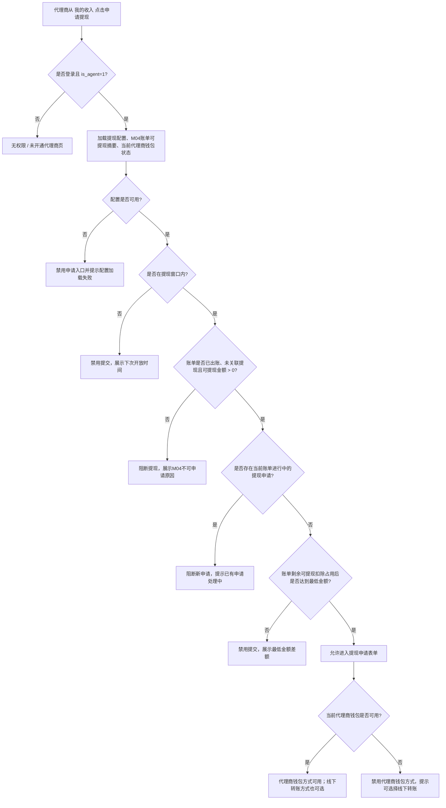
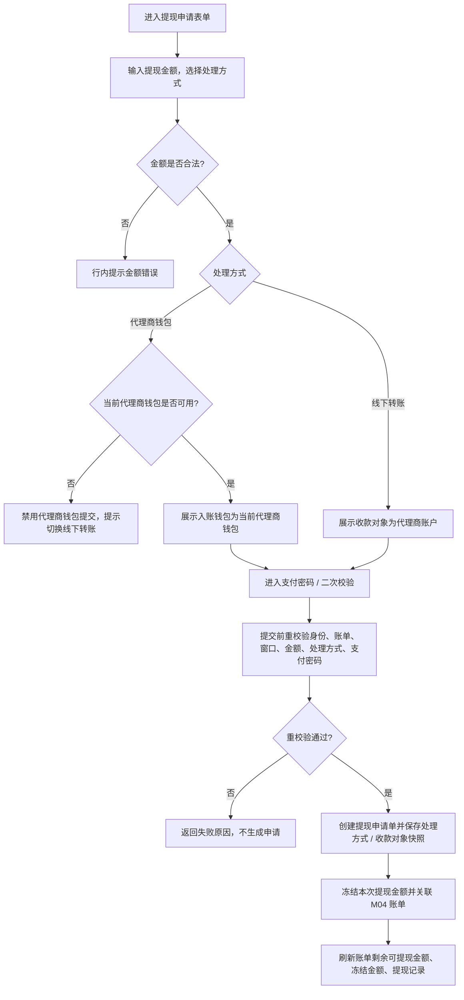
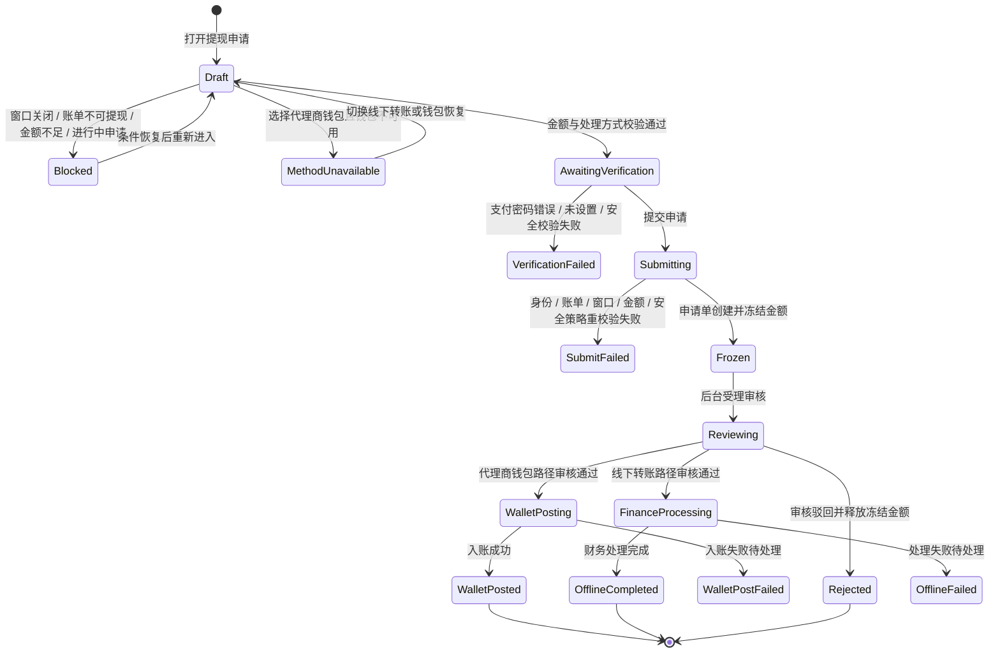

# M05 提现申请

## 文档信息

| 字段 | 内容 |
|---|---|
| 文档标题 | 静态代理-提现申请需求文档 |
| 文档编号 | PRD-2026-M05-Agent-Withdrawal |
| 产品版本 | v0.1 |
| 创建日期 | 2026-06-10 |
| 最后更新 | 2026-06-10 |
| 状态 | 草稿 |
| 关联模块 | M05 提现申请 |
| 关联全局决策 | `代理商-prd/decisions/00-global.md` |
| 关联模块决策 | `代理商-prd/decisions/05-提现申请.md` |
| 关联原型 | `prototypes/agent-withdrawal-prototype.html` |
| 关联图集 | `代理商-prd/diagrams/05-提现申请-mermaid.md` |

## 修订历史

| 版本 | 日期 | 变更说明 |
|---|---|---|
| v0.1 | 2026-06-10 | 基于 M05 decisions / prototype / Mermaid 图集生成模块级交付 PRD |

## 一、问题陈述

代理商需要从 M04 已出账且可提现的月账单发起提现申请，并查看审核、驳回、钱包入账、线下转账处理或失败待处理状态。若没有账单可提现占用、处理方式、收款对象和冻结规则，容易出现同一账单重复提现、可提现金额解释不清或代理商无法理解处理进展。

本模块只做代理端申请入口和状态查看；后台审核、钱包入账处理、财务线下处理和异常修复不在本期展开。

## 二、目标

| 编号 | 目标描述 | 衡量指标 | 目标值 | 当前值 | 衡量时间 |
|---|---|---|---|---|---|
| G-M05-01 | 让代理商能基于已出账账单提交提现申请 | 提现申请提交成功率 | ≥ 95%【待确认】 | 【待确认】 | 上线后 30 天 |
| G-M05-02 | 避免同一账单重复提现 | 同账单重复提现事故数 | 0 | 【待确认】 | 持续监控 |
| G-M05-03 | 让代理商能理解提现状态 | 提现详情查看成功率 | ≥ 99%【待确认】 | 【待确认】 | 上线后 30 天 |
| G-M05-04 | 降低提现阻断原因不可解释率 | 阻断原因可识别率 | ≥ 99%【待确认】 | 【待确认】 | 上线后 30 天 |

## 三、非目标

| 非目标 | 排除原因 |
|---|---|
| 后台提现审核、审核通过 / 驳回、钱包入账处理 | 本期只做代理端申请和状态展示 |
| 线下转账后台处理、财务打款操作、异常修复 | 属于后台 / 财务能力 |
| 银行卡、支付账户、USDT 等收款账户管理 | 本期处理方式仅代理商钱包 / 线下转账，收款对象固定 |
| 代理端撤销提现、催审、联系财务、重试入账 | 本期代理端只读状态，不提供后台操作 |
| 多币种、税务表单、手续费计算 | 本期固定 USD；手续费如需支持由资金配置另行确认 |

## 四、用户故事

| 编号 | 用户故事 | 优先级 | 验收标准 |
|---|---|---|---|
| US-M05-01 | 作为代理商，我想从 M04 可提现账单进入提现申请，以便提取已出账最终收入。 | P0 | M05 能接收账单号、账期、可提现金额并展示申请表单。 |
| US-M05-02 | 作为代理商，我想输入部分提现金额并选择处理方式，以便按实际需要提现到代理商钱包或线下处理。 | P0 | 支持代理商钱包 / 线下转账，金额符合配置与账单可提现限制。 |
| US-M05-03 | 作为代理商，我想提交提现前完成支付密码 / 二次校验，以便资金操作安全。 | P0 | 未通过校验不得创建申请或冻结金额。 |
| US-M05-04 | 作为代理商，我想查看提现记录和状态，以便知道审核、驳回、入账或财务处理进展。 | P0 | 记录列表和详情展示处理方式、收款对象、状态、冻结 / 处理结果。 |
| US-M05-05 | 作为代理商，我想在不可提现时看到明确原因，以便知道是窗口、金额、账单、进行中申请还是钱包方式不可用。 | P0 | 阻断原因可见，且不会误提交申请。 |

## 五、非功能性需求

| 类型 | 需求描述 | 衡量标准 |
|---|---|---|
| 权限 | 仅代理商可访问提现申请和记录 | 非代理商展示无权限 |
| 数据隔离 | 只展示当前代理商自己的申请 | 后端按当前代理商身份过滤 |
| 一致性 | 提交成功后立即冻结金额并占用 M04 账单剩余可提现金额 | 同一账单同一时间最多一笔提现申请 |
| 安全 | 提交前必须支付密码 / 二次校验 | 未通过校验不得创建申请 |
| 幂等性 | 提交申请必须防重复 | 后端使用申请单号 / 幂等键 |
| 可追溯 | 申请、冻结、释放、钱包入账 / 线下完成记录可追溯 | 详情展示状态时间线 |

## 六、功能需求

### 6.1 产品结构

```text
M05 提现申请
├── 提现申请页
│   ├── 账单提现摘要
│   ├── 提现金额
│   ├── 提现处理方式
│   ├── 收款对象
│   └── 支付密码 / 二次校验
├── 提现记录列表
└── 提现详情 / 状态时间线
```

### 6.2 功能需求清单

| 需求ID | 需求描述 | 所属用户故事 | 优先级 | 验收标准 | 对应界面 |
|---|---|---|---|---|---|
| FR-M05-01 | 提现资格校验 | US-M05-01, US-M05-05 | P0 | 校验提现配置、窗口、账单剩余可提现金额、冻结 / 处理中占用、进行中申请和处理方式 | P-M05-1 |
| FR-M05-02 | 提现金额录入 | US-M05-02 | P0 | 金额 > 0、最多 2 位小数、不低于最低金额、不超过当前可申请提现金额 | P-M05-1 |
| FR-M05-03 | 提现处理方式 | US-M05-02 | P0 | 可选代理商钱包 / 线下转账；默认代理商钱包；钱包不可用时可选线下转账 | P-M05-1 |
| FR-M05-04 | 支付密码 / 二次校验 | US-M05-03 | P0 | 未通过校验不得创建申请 | P-M05-1 |
| FR-M05-05 | 提现申请创建与冻结 | US-M05-01, US-M05-03 | P0 | 创建成功后冻结金额并占用账单剩余可提现金额 | P-M05-1 |
| FR-M05-06 | 提现记录列表 | US-M05-04 | P0 | 展示申请单号、金额、处理方式 / 收款对象、状态、时间、冻结 / 处理结果 | P-M05-2 |
| FR-M05-07 | 提现详情 / 状态时间线 | US-M05-04 | P0 | 展示申请快照、冻结信息、状态流转、驳回 / 失败原因 | P-M05-3 |

## 七、界面功能详细说明

### 7.0 页面总览

| 页面编号 | 页面名称 | 类型 | 入口 | 主要去向 |
|---|---|---|---|---|
| P-M05-1 | 提现申请页 | 代理端页面 | M04 我的收入 / 月账单详情 → 申请提现 | 提交申请、查看记录、去安全中心 |
| P-M05-2 | 提现记录列表 | 同页列表区域 | 提现申请页默认展示 | 提现详情 |
| P-M05-3 | 提现详情 | 详情侧栏 / 移动详情页 | 提现记录 → 详情 | 返回提现记录 |

### 7.1 原型与图集

| 类型 | 文件 |
|---|---|
| HTML 原型 | `../prototypes/agent-withdrawal-prototype.html` |
| 桌面截图 | `../prototypes/agent-withdrawal-prototype-desktop.png` |
| 移动截图 | `../prototypes/agent-withdrawal-prototype-mobile.png` |
| Mermaid 图集 | `diagrams/05-提现申请-mermaid.md` |

### 7.2 关键界面元素

| 界面 | 核心元素 | 业务规则 |
|---|---|---|
| 提现申请页 | 账单剩余可提现金额、提现冻结 / 处理中占用金额、当前可申请提现、提现配置、金额、处理方式、收款对象、支付密码、提交 | 当前可申请金额 = 账单剩余可提现金额 - 当前账单已冻结 / 处理中占用金额；代理钱包可用余额不参与额度计算。 |
| 提现记录列表 | 申请时间筛选、状态筛选、记录表、详情入口 | 仅展示当前代理商申请；默认按申请时间倒序。 |
| 提现详情 | 申请快照、冻结信息、状态时间线、驳回 / 失败原因 | 代理端只读，不提供撤销、催审、审核、打款或重试入账。 |

### 7.3 处理方式与状态

| 路径 | 状态 | 展示含义 | 对提现 / 余额影响 |
|---|---|---|---|
| 代理商钱包 | 待审核 / 审核中 | 已创建申请单，等待后台审核 | 金额已冻结并占用账单可提现金额 |
| 代理商钱包 | 已驳回 | 审核未通过 | 冻结金额释放 |
| 代理商钱包 | 入账处理中 | 审核通过，等待钱包入账处理 | 金额保持冻结 |
| 代理商钱包 | 已入钱包 | 钱包入账成功 | 冻结转为钱包入账记录 |
| 代理商钱包 | 入账失败待处理 | 钱包入账失败，等待后台处理 | 金额保持冻结，代理端不可操作 |
| 线下转账 | 待审核 / 审核中 | 已创建申请单，等待后台审核 | 金额已冻结并占用账单可提现金额 |
| 线下转账 | 已驳回 | 审核未通过 | 冻结金额释放 |
| 线下转账 | 财务处理中 | 审核通过，公司财务线下处理 | 金额保持冻结 |
| 线下转账 | 已完成 | 财务处理完成 | 冻结转为完成记录 |
| 线下转账 | 处理失败待处理 | 财务处理失败或需后台介入 | 金额保持冻结，代理端不可操作 |

### 7.4 页面级四态

| 页面 | 空态 | 加载态 | 错误态 | 成功态 |
|---|---|---|---|---|
| 提现申请页 | 账单不可提现、窗口关闭、金额低于最低金额、已有进行中申请时展示原因 | 摘要、配置、记录骨架 | 权限失败、配置失败、记录失败分区提示 | 资格满足时可填写金额、选择处理方式并提交 |
| 提现记录 / 详情 | 无记录；筛选无结果 | 列表或详情骨架 | 记录失败可重试；详情无权提示不存在或无权查看 | 展示申请状态、冻结流水、状态时间线和原因 |

## 八、流程与状态

### 8.1 提现入口与资格校验



### 8.2 提现申请提交流程



### 8.3 提现申请状态机



## 九、数据需求与能力依赖

| 依赖 | 用途 | 关键字段 / 能力 | 状态 |
|---|---|---|---|
| M04 月账单联动 | 传入账单上下文和可提现条件 | billNo、period、withdrawableAmount、blockedReason | 同一账单同一时间最多关联一笔提现申请 |
| 账单提现计算 | 计算当前可申请提现 | billRemainingWithdrawableAmount、frozenAmount、processingAmount、applicationStatus | 需结算 / 资金提供 |
| 提现配置接口 | 最低金额、提现窗口、限额、次数 | minAmount、window、limits | 待确认 |
| 代理钱包服务 | 判断代理商钱包方式可用性 | walletId、walletStatus、maskedWalletId、unavailableReason | 仅钱包方式强依赖 |
| 财务线下处理 | 回写线下转账状态 | financeProcessing、completed、failedReason | 财务 / 资金依赖 |
| 支付密码 / 二次校验 | 提交安全校验 | passwordStatus、verifyResult、securityErrorCode | 安全侧提供 |
| 冻结与流水 | 冻结、释放、入账、完成记录 | freezeFlowNo、releaseFlowNo、walletInFlowNo、offlineCompletedRecord | 需原子更新 |
| 状态可见原因 | 展示驳回 / 失败原因 | visibleReason、internalReason | 运营 / 风控确认 |

## 十、埋点

| 事件名 | 触发时机 | 关键属性 | 用途 |
|---|---|---|---|
| `view_agent_withdrawal_page` | 进入提现申请页 | billNo、isWindowOpen、withdrawableAmount、frozenAmount | 入口与阻断分析 |
| `click_agent_withdrawal_submit` | 点击提交提现申请 | amount、processingMethod、withdrawableAmount | 提现意图 |
| `agent_withdrawal_submit_result` | 提交结果返回 | amount、processingMethod、result、errorCode、applicationNo | 提交失败与冻结定位 |
| `view_agent_withdrawal_block_reason` | 展示阻断原因 | billNo、reason、minAmount、nextWindowTime | 阻断类型分析 |
| `view_agent_withdrawal_detail` | 查看提现详情 | applicationNo、processingMethod、status | 状态查看压力 |

## 十一、开放问题

| 编号 | 问题 | 建议默认值 / 结论 | 影响 |
|---|---|---|---|
| M05-Q01 | 申请单与账单占用 / 关联字段 | 同一账单同一时间最多关联一笔提现申请；字段由结算 / 研发落库确认 | 防重复提现 |
| M05-Q02 | 提现配置接口字段 | 后台返回最低金额、窗口、单笔 / 单日限额、次数 | 提交校验 |
| M05-Q03 | 代理钱包服务字段 | 需返回钱包标识、脱敏 ID、可用 / 冻结 / 异常状态 | 钱包方式可用性 |
| M05-Q04 | 线下转账状态回写 | 财务处理中、已完成、处理失败待处理 | 线下路径状态展示 |
| M05-Q05 | 支付密码 / 二次校验策略 | 复用安全中心策略 | 提交安全 |
| M05-Q06 | 驳回 / 失败原因可见范围 | 只展示代理可见原因，不暴露内部风控细节 | 状态解释 |

## 十二、验收重点

- M05 只能从 M04 可提现账单进入。
- 当前可申请提现金额按账单剩余可提现金额扣除冻结 / 处理中占用计算。
- 代理钱包可用余额不参与额度计算。
- 提现支持代理商钱包和线下转账两种处理方式。
- 当前代理商钱包不可用时，禁用钱包方式但允许线下转账。
- 提交前必须二次校验，失败不创建申请。
- 提交成功后冻结金额并占用账单剩余可提现金额。
- 同一账单同一时间最多关联一笔提现申请。
- 记录和详情展示处理方式、收款对象、状态时间线和驳回 / 失败原因。

## 十三、模块完成标准自检

| 检查项 | 结果 |
|---|---|
| decisions 已确认 | 通过：`decisions/05-提现申请.md` |
| 原型 / 截图 | 通过：已有关联 HTML 原型与桌面 / 移动截图 |
| Mermaid 图集 | 通过：已覆盖资格校验、提交、记录、冻结释放、状态机 |
| US → FR → 页面追溯 | 通过：FR-M05-01 至 FR-M05-07 已映射页面 |
| 页面级四态 | 通过：申请页、记录、详情均覆盖 |
| 待确认项 | 通过：集中为账单占用字段、提现配置、钱包服务、线下处理、安全和原因可见性 |
